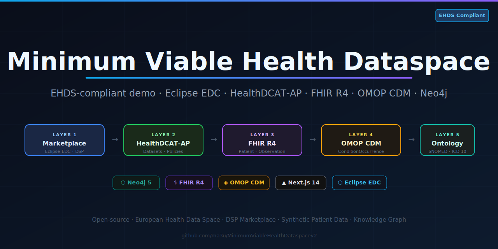
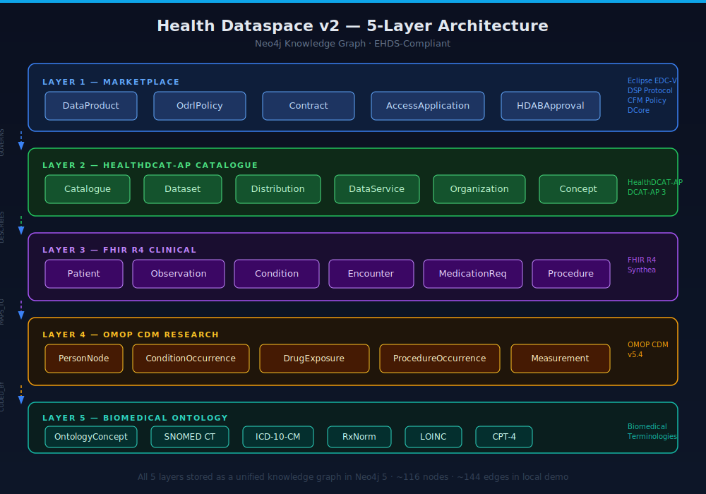
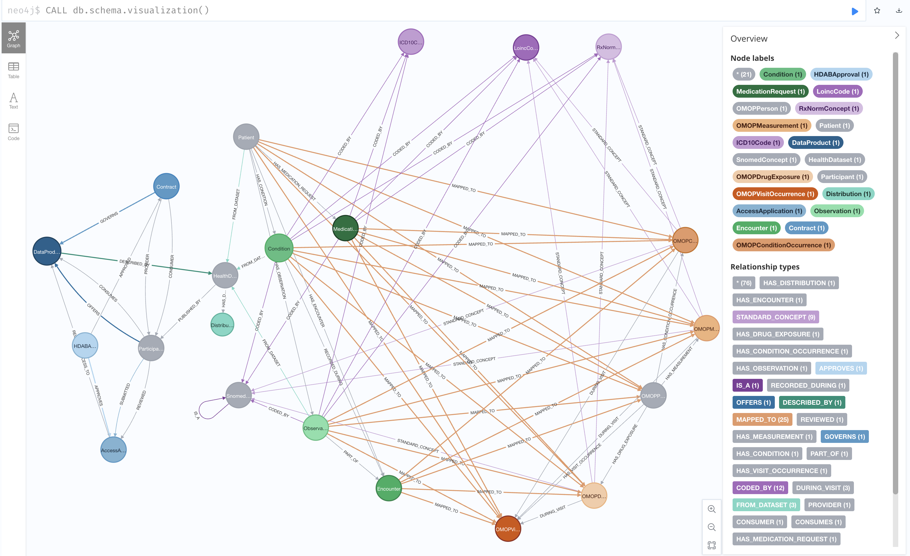
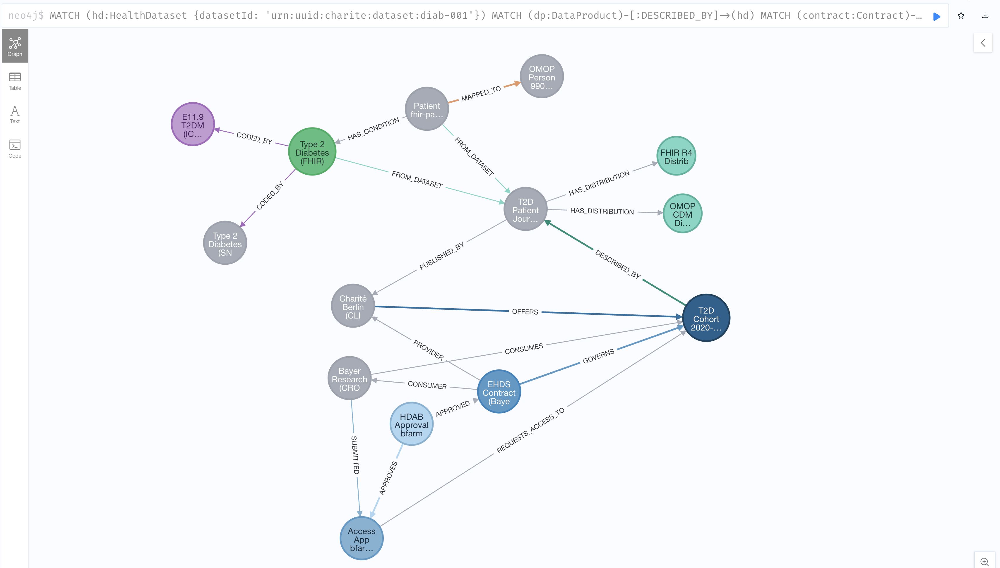
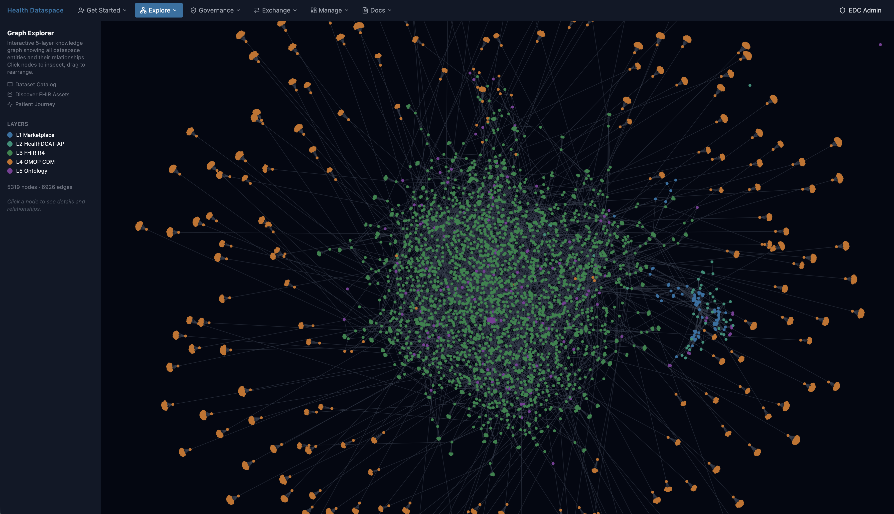
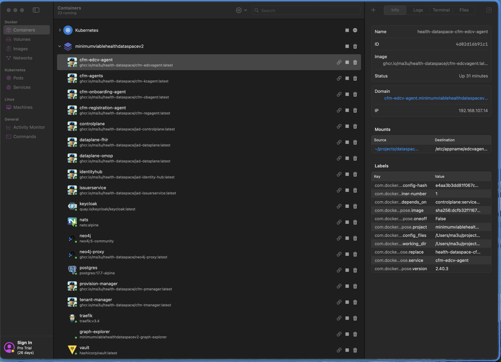

# Minimum Viable Health Dataspace v2

[](https://github.com/ma3u/MinimumViableHealthDataspacev2) [](https://github.com/ma3u/MinimumViableHealthDataspacev2/actions/workflows/test.yml) [](docs/test-coverage-report.md) [](docs/test-coverage-report.md) [](docs/test-coverage-report.md)

[](https://health.ec.europa.eu/ehealth-digital-health-and-care/european-health-data-space_en) [](https://hl7.org/fhir/R4/) [](https://ohdsi.github.io/CommonDataModel/) [](https://hl7.eu/fhir/) [](https://neo4j.com/) [](https://nextjs.org/) [](https://eclipse-edc.github.io/docs/) [](https://docs.internationaldataspaces.org/ids-knowledgebase/v/dataspace-protocol) [](https://projects.eclipse.org/projects/technology.dataspace-dcp/releases/1.0.0) [](https://projects.eclipse.org/proposals/eclipse-data-plane-core) [](https://simpl-programme.eu/) [](LICENSE)

## Table of Contents

- [Minimum Viable Health Dataspace v2](#minimum-viable-health-dataspace-v2)
  - [Table of Contents](#table-of-contents)
  - [Why This Project Exists](#why-this-project-exists)
  - [What It Does](#what-it-does)
  - [Architecture](#architecture)
  - [UI Views](#ui-views)
  - [Project Structure](#project-structure)
  - [Quick Start](#quick-start)
    - [Step 1 — Prerequisites](#step-1--prerequisites)
    - [Step 2 — Clone](#step-2--clone)
    - [Step 3 — Start Neo4j](#step-3--start-neo4j)
    - [Step 4 — Initialise Schema](#step-4--initialise-schema)
    - [Step 5 — Load Seed Data](#step-5--load-seed-data)
    - [Step 6 — Register DSP Marketplace Chain](#step-6--register-dsp-marketplace-chain)
    - [Step 7 — Register EEHRxF Profile Alignment](#step-7--register-eehrxf-profile-alignment)
    - [Step 8 — Install UI Dependencies](#step-8--install-ui-dependencies)
    - [Step 9 — Start the UI](#step-9--start-the-ui)
  - [Quick Start — Full Dataspace (JAD Stack)](#quick-start--full-dataspace-jad-stack)
    - [Prerequisites](#prerequisites)
    - [One-Command Start](#one-command-start)
    - [Verify Services](#verify-services)
    - [Start the UI](#start-the-ui)
    - [Run Seeding Separately](#run-seeding-separately)
    - [Tear Down](#tear-down)
  - [Testing](#testing)
  - [Development](#development)
    - [Run pre-commit checks](#run-pre-commit-checks)
    - [Neo4j driver note](#neo4j-driver-note)
    - [JAD Stack (EDC-V + CFM + DCore)](#jad-stack-edc-v--cfm--dcore)
    - [All Docker Service Endpoints](#all-docker-service-endpoints)
  - [Documentation](#documentation)
  - [Implementation Status](#implementation-status)
    - [Phase 1 — Infrastructure Migration](#phase-1--infrastructure-migration)
    - [Phase 2 — Identity \& Trust](#phase-2--identity--trust)
    - [Phase 3 — Health Knowledge Graph](#phase-3--health-knowledge-graph)
    - [Phase 4 — Dataspace Integration](#phase-4--dataspace-integration)
    - [Phase 5 — Federated Queries \& Natural Language Search](#phase-5--federated-queries--natural-language-search)
    - [Phase 6 — Web Application \& Participant Portal](#phase-6--web-application--participant-portal)
    - [Phase 7 — Protocol Compliance Testing](#phase-7--protocol-compliance-testing)
    - [Phase 8 — Automated Testing](#phase-8--automated-testing)
    - [Phase 9 — Documentation \& Navigation](#phase-9--documentation--navigation)
    - [Phase 10 — Tasks Dashboard](#phase-10--tasks-dashboard)
    - [Phase 11 — System Topology View](#phase-11--system-topology-view)
    - [Phase 12 — Data Query Fix \& Policy Seeding](#phase-12--data-query-fix--policy-seeding)
    - [Container Inventory](#container-inventory)
      - [Tier 0 — Infrastructure Foundations (no dependencies, start first)](#tier-0--infrastructure-foundations-no-dependencies-start-first)
      - [Tier 1 — Core Identity \& UI (depend on Tier 0)](#tier-1--core-identity--ui-depend-on-tier-0)
      - [Tier 2 — EDC-V Core + Identity Services (depend on Tier 0 + 1)](#tier-2--edc-v-core--identity-services-depend-on-tier-0--1)
      - [Tier 3 — Data Planes, Proxy, Provisioning \& CFM Agents (depend on Tier 2)](#tier-3--data-planes-proxy-provisioning--cfm-agents-depend-on-tier-2)
      - [Tier 4 — Seed Job (runs once after all services are ready)](#tier-4--seed-job-runs-once-after-all-services-are-ready)
      - [Dependency Graph](#dependency-graph)
  - [Contributing](#contributing)
  - [Background](#background)
  - [Security](#security)
  - [License](#license)

---

## Why This Project Exists

The [European Health Data Space (EHDS)](https://health.ec.europa.eu/ehealth-digital-health-and-care/european-health-data-space_en) regulation creates a legal framework for sharing health data across the EU, but turning that regulation into running software is an unsolved integration challenge. A hospital in Berlin that wants to share de-identified patient cohorts with a pharmaceutical researcher in Amsterdam needs to navigate five layers of technology: dataspace governance contracts, standardised metadata catalogues, clinical data formats, research-grade analytics schemas, and biomedical terminologies. Today, no single reference implementation shows how these layers connect end-to-end.

This project builds that missing reference. It takes the [Eclipse Dataspace Components](https://eclipse-edc.github.io/docs/) (open-source building blocks for sovereign data exchange) and wires them to a health-domain knowledge graph that speaks FHIR R4, OMOP CDM, and HealthDCAT-AP natively. The result is a **self-contained local demo** you can run on your laptop in under five minutes, without any cloud account or real patient data.

The motivation comes from a practical gap: the Eclipse [JAD (Joint Architecture Demo)](https://github.com/Metaform/jad) shows how EDC-V, DCore, and CFM work together for generic cloud-provider deployments, but it has no health-domain content. Conversely, FHIR servers and OMOP databases exist in isolation, disconnected from dataspace governance. This project bridges that gap it puts EHDS governance contracts, HealthDCAT-AP catalogue metadata, FHIR patient journeys, OMOP research analytics, and SNOMED/LOINC ontologies into a single queryable graph, all accessible through the Dataspace Protocol.



For the full background, see the companion article: [European Health Dataspaces, Digital Twins: A Journey from FHIR Basics to Intelligent Patient Models](https://www.linkedin.com/pulse/european-health-dataspaces-digital-twins-journey-fhir-buchhorn-roth-8t51c/).

**Live Demo:** The UI layout is deployed as a static page at [ma3u.github.io/MinimumViableHealthDataspacev2](https://ma3u.github.io/MinimumViableHealthDataspacev2/).

---

## What It Does

The demo models a concrete EHDS secondary-use scenario: a **clinical research organisation (CRO)** in Amsterdam wants to run a drug-repurposing study using synthetic patient data held by a **hospital (Clinic)** in Berlin, with access governed by a **Health Data Access Body (HDAB)** in Germany. All five layers of this scenario live in a single Neo4j knowledge graph:

- **Layer 1 — DSP Marketplace**: DataProduct / OdrlPolicy / Contract / HDABApproval nodes model the full EHDS Article 45–53 secondary-use access flow, enforced by the Dataspace Protocol (DSP 2025-1).
- **Layer 2 — HealthDCAT-AP Catalogue**: Dataset / Distribution / DataService / Organization nodes expose W3C HealthDCAT-AP 1.0 metadata — the mandatory standard for health dataset discovery across EU Health Data Access Bodies.
- **Layer 3 — FHIR R4 Clinical Data**: 127 synthetic patients generated by [Synthea](https://github.com/synthetichealth/synthea) with Encounters, Conditions, Observations, MedicationRequests, and Procedures — loaded as first-class graph nodes with full provenance chains.
- **Layer 4 — OMOP CDM Research Layer**: FHIR clinical events are transformed into OMOP v5.4 nodes (Person, ConditionOccurrence, DrugExposure, ProcedureOccurrence, Measurement), enabling cohort-level analytics without moving data out of the graph.
- **Layer 5 — Biomedical Ontology Backbone**: SNOMED CT, ICD-10-CM, RxNorm, LOINC, and CPT-4 concept nodes link clinical events to standardised terminologies via `CODED_BY` edges.



On top of these five layers, **EEHRxF Profile Alignment** nodes map the six EHDS priority categories (Patient Summary, ePrescription, Laboratory Results, Hospital Discharge, Medical Imaging, Rare Disease) to HL7 Europe FHIR Implementation Guides, with dynamic coverage scores computed against the loaded data.

A **Next.js 14 application** provides six purpose-built views to explore all of this: an interactive graph explorer, a HealthDCAT-AP dataset catalogue, a DSP compliance chain inspector, a patient journey timeline, an OMOP research analytics dashboard, and an EEHRxF profile gap analysis view.

---

## Architecture

All five layers are persisted as a single **Neo4j 5 knowledge graph**. Each layer is a distinct
set of labelled nodes; cross-layer `GOVERNS`, `DESCRIBES`, `MAPS_TO`, and `CODED_BY` relationships
form the connective tissue that makes the graph queryable end-to-end — from a governance contract
all the way down to a SNOMED code on a patient condition.

| Layer           | Nodes                                                                           | Technology                     |
| --------------- | ------------------------------------------------------------------------------- | ------------------------------ |
| 1 · Marketplace | DataProduct, OdrlPolicy, Contract, AccessApplication, HDABApproval              | Eclipse EDC-V, DSP, CFM, DCore |
| 2 · Catalogue   | Catalogue, Dataset, Distribution, DataService, Organization                     | HealthDCAT-AP / DCAT-AP 3      |
| 3 · Clinical    | Patient, Observation, Condition, Encounter, MedicationRequest, Procedure        | FHIR R4 / Synthea              |
| 4 · Research    | PersonNode, ConditionOccurrence, DrugExposure, ProcedureOccurrence, Measurement | OMOP CDM v5.4                  |
| 5 · Ontology    | OntologyConcept (SNOMED CT, ICD-10-CM, RxNorm, LOINC, CPT-4)                    | Biomedical Terminologies       |

The schema below shows the node labels and relationship types as rendered by Neo4j Browser's
`CALL db.schema.visualization()` after the seed data is loaded:



---

## UI Views

The Next.js 14 app is served at <http://localhost:3000> and provides six purpose-built views,
each backed by a dedicated API route that queries Neo4j directly over Bolt.

| View             | Route         | Description                                                                                                     |
| ---------------- | ------------- | --------------------------------------------------------------------------------------------------------------- |
| Graph Explorer   | `/graph`      | Force-directed graph of all 5 layers; click a node to highlight its neighbourhood and view details.             |
| Data Catalogue   | `/catalog`    | HealthDCAT-AP dataset cards with publisher, license, temporal coverage, and expandable detail panels.           |
| Compliance Chain | `/compliance` | Trace a DSP contract from DataProduct → OdrlPolicy → Contract → HDABApproval in one query.                      |
| Patient Journey  | `/patient`    | Time-ordered FHIR R4 timeline (encounters, conditions, medications, procedures) alongside the OMOP CDM mapping. |
| OMOP Analytics   | `/analytics`  | Cohort-level stat cards (patients, conditions, drugs, procedures), gender breakdown, and top-15 bar charts.     |
| EEHRxF Profiles  | `/eehrxf`     | EU FHIR profile alignment with EHDS priority category coverage, HL7 Europe IG inventory, and gap analysis.      |

---

## Demo Users & Roles

The JAD stack comes with **seven** pre-configured Keycloak demo users in the **EDCV realm**.
Sign in at `http://localhost:3003/auth/signin` — password equals username in local dev.

| Username     | Organisation           | EHDS Role         | Keycloak Role(s)                      | Graph persona |
| ------------ | ---------------------- | ----------------- | ------------------------------------- | ------------- |
| `edcadmin`   | Dataspace Operator     | Operator          | `EDC_ADMIN`                           | `edc-admin`   |
| `clinicuser` | AlphaKlinik Berlin     | Data Holder       | `EDC_USER_PARTICIPANT`, `DATA_HOLDER` | `hospital`    |
| `lmcuser`    | Limburg Medical Centre | Data Holder       | `EDC_USER_PARTICIPANT`, `DATA_HOLDER` | `hospital`    |
| `researcher` | PharmaCo Research AG   | Researcher        | `EDC_USER_PARTICIPANT`, `DATA_USER`   | `researcher`  |
| `regulator`  | MedReg DE              | HDAB Authority    | `HDAB_AUTHORITY`                      | `hdab`        |
| `patient1`   | AlphaKlinik Berlin     | Patient / Citizen | `PATIENT`                             | `patient`     |
| `patient2`   | Limburg Medical Centre | Patient / Citizen | `PATIENT`                             | `patient`     |

> **Returning users** (switching personas): the UserMenu **"Returning users"** section lets you
> switch between demo accounts. Each switch redirects to Keycloak — you must enter the target
> user's password. Trust Center operators use the `hdab` graph persona and
> `/compliance#trust-center`.

### Menu Items per Role

Navigation is filtered by role — users only see items relevant to their function.
Patients are **citizens**, not active dataspace participants (EHDS Chapter II Art. 3-12).
They cannot onboard, exchange data, or access participant settings — only their personal
health journey (My Health group), public pages, and documentation.

| Route                           | Public | Patient | Data Holder | Researcher | HDAB | EDC Admin |
| ------------------------------- | :----: | :-----: | :---------: | :--------: | :--: | :-------: |
| `/graph`                        |   ✅   |   ✅    |     ✅      |     ✅     |  ✅  |    ✅     |
| `/graph?persona=patient`        |   —    |   ✅    |      —      |     —      |  —   |     —     |
| `/catalog`                      |   ✅   |   ✅    |     ✅      |     ✅     |  ✅  |    ✅     |
| `/catalog/editor`               |   —    |    —    |     ✅      |     —      |  —   |    ✅     |
| `/patient`                      |   ✅   |   ✅    |     ✅      |     ✅     |  ✅  |    ✅     |
| `/patient/profile`              |   —    |   ✅    |      —      |     —      |  —   |     —     |
| `/patient/research`             |   —    |   ✅    |      —      |     —      |  —   |     —     |
| `/patient/insights`             |   —    |   ✅    |      —      |     —      |  —   |     —     |
| `/analytics`                    |   —    |    —    |      —      |     ✅     |  ✅  |    ✅     |
| `/query` (NLQ)                  |   —    |    —    |      —      |     ✅     |  ✅  |    ✅     |
| `/eehrxf`                       |   ✅   |   ✅    |     ✅      |     ✅     |  ✅  |    ✅     |
| `/compliance`                   |   —    |    —    |      —      |     —      |  ✅  |    ✅     |
| `/compliance/tck`               |   —    |    —    |      —      |     —      |  ✅  |    ✅     |
| `/credentials`                  |   —    |    —    |     ✅      |     ✅     |  ✅  |    ✅     |
| `/data/share`                   |   —    |    —    |     ✅      |     —      |  —   |    ✅     |
| `/data/discover`                |   —    |    —    |      —      |     ✅     |  ✅  |    ✅     |
| `/negotiate`                    |   —    |    —    |     ✅      |     ✅     |  —   |    ✅     |
| `/tasks`                        |   —    |    —    |     ✅      |     ✅     |  ✅  |    ✅     |
| `/data/transfer`                |   —    |    —    |     ✅      |     ✅     |  ✅  |    ✅     |
| `/admin` + components + tenants |   —    |    —    |      —      |     —      |  —   |    ✅     |
| `/admin/policies` + audit       |   —    |    —    |      —      |     —      |  ✅  |    ✅     |
| `/onboarding`, `/settings`      |   —    |    —    |     ✅      |     ✅     |  ✅  |    ✅     |
| `/docs`                         |   ✅   |   ✅    |     ✅      |     ✅     |  ✅  |    ✅     |

### Graph Explorer — Persona Views

After login, the **UserMenu → "My graph view"** deep-link and the in-graph
**"View as"** panel redirect each user to their tailored subgraph:

| Persona                | URL param               | Primary question                             | Focus nodes                                                      |
| ---------------------- | ----------------------- | -------------------------------------------- | ---------------------------------------------------------------- |
| Default                | `?persona=default`      | What does the full dataspace look like?      | All 5 layers                                                     |
| Hospital / Data Holder | `?persona=hospital`     | Who has approved access to my data?          | Participant · HealthDataset · Contract · HDABApproval            |
| Researcher / Data User | `?persona=researcher`   | What datasets match my study?                | HealthDataset · OMOPPerson · SnomedConcept · SPESession          |
| HDAB Authority         | `?persona=hdab`         | What approvals are pending?                  | HDABApproval · VerifiableCredential · TrustCenter                |
| Trust Center Operator  | `?persona=trust-center` | Which pseudonym flows am I running?          | TrustCenter · SPESession · ResearchPseudonym                     |
| EDC Admin              | `?persona=edc-admin`    | Who are my participants? What contracts?     | Participant · DataProduct · Contract · TransferEvent             |
| Patient / Citizen      | `?persona=patient`      | What health data do I have? Who is using it? | Patient · Condition · Participant · PatientConsent · DataProduct |

**Patient question filters** (sidebar when `?persona=patient`):

| Filter                           | Highlights                                                                                 |
| -------------------------------- | ------------------------------------------------------------------------------------------ |
| Who is using my data?            | PatientConsent · DataProduct · ResearchPseudonym · SPESession · Participant · HDABApproval |
| Which research programme for me? | DataProduct · HealthDataset · ResearchInsight · PatientConsent · EhdsPurpose · Participant |
| Show my data                     | Patient · Encounter · Condition · MedicationRequest · Observation · OMOPPerson             |
| Show health interests and risks  | Patient · Condition · ResearchInsight · SnomedConcept · ICD10Code · MedicationRequest      |

**Node role colours** (stable across all persona views):

| Node type         | Colour              | Role                                             |
| ----------------- | ------------------- | ------------------------------------------------ |
| `Participant`     | 🟠 Amber `#E67E22`  | Dataspace actors (data holders, researchers)     |
| `TrustCenter`     | 🟣 Violet `#8E44AD` | EHDS Art. 50 pseudonym authority                 |
| `HDABApproval`    | 🔴 Red `#C0392B`    | HDAB access decisions                            |
| `SPESession`      | 🟡 Gold `#D4AC0D`   | Active secure processing sessions                |
| `PatientConsent`  | 🩵 Teal `#0E9F9F`   | Patient consent for secondary use (EHDS Art. 10) |
| `ResearchInsight` | 🟢 Mint `#1ABC9C`   | Personalised insights from research studies      |

---

## Project Structure

The repository is intentionally minimal. Neo4j Cypher scripts in `neo4j/` build the graph in
layers; the `ui/` directory is a standalone Next.js app that only requires the Neo4j container to
be running. No build step is needed for the graph itself.

```text
MinimumViableHealthDataspacev2/
├── README.md
├── docker-compose.yml            # Neo4j 5 with APOC + n10s plugins
├── docker-compose.jad.yml        # JAD stack: 19 EDC-V/CFM/DCore services
├── docker-compose.live.yml       # Live-mode UI override (port 3003)
├── LICENSE
├── docs/
│   ├── planning-health-dataspace-v2.md   # 7-phase implementation roadmap
│   ├── health-dataspace-graph-schema.md  # 5-layer Neo4j schema reference
│   └── images/
│       ├── social-preview.svg            # GitHub social preview / OG image
│       ├── architecture.svg              # 5-layer architecture diagram
│       ├── graph-schema.png              # Knowledge graph schema screenshot
│       ├── synthetic-patient-journey.png # Full patient journey screenshot
│       └── ui-screenshot.png             # Graph Explorer UI screenshot
├── jad/                          # JAD stack configuration
│   ├── edcv-assets/              # Phase 4a: EDC-V asset + policy + contract JSON
│   ├── openapi/                  # OpenAPI specs for all JAD services
│   ├── keycloak-realm.json       # Keycloak realm import
│   ├── bootstrap-vault.sh        # Vault JWT auth + data plane keys
│   ├── init-postgres.sql         # 8-database PostgreSQL init
│   └── *.yaml / *.env            # Per-service configuration files
├── neo4j/
│   ├── init-schema.cypher                 # Neo4j constraints and indexes
│   ├── insert-synthetic-schema-data.cypher # L1–L5 seed data (Synthea-derived)
│   ├── register-dsp-marketplace.cypher    # Phase 3e: DSP marketplace chain
│   ├── register-eehrxf-profiles.cypher    # Phase 3h: EEHRxF profile alignment
│   ├── register-ehds-credentials.cypher   # Phase 4: EHDS verifiable credentials
│   ├── register-fhir-dataset-hdcatap.cypher # Phase 3: HealthDCAT-AP catalogue
│   ├── fhir-to-omop-transform.cypher      # FHIR → OMOP CDM mapping
│   └── seed-audit-provenance.cypher       # Audit trail seed data
├── services/
│   └── neo4j-proxy/              # DCore ↔ Neo4j bridge (TypeScript/Express)
│       ├── src/index.ts          # 6 endpoints: FHIR, OMOP, HealthDCAT-AP
│       ├── Dockerfile            # Multi-stage Node.js 20 build
│       └── package.json
├── scripts/                      # Utility and data-prep scripts
│   ├── bootstrap-jad.sh          # Start JAD stack with health checks
│   └── generate-synthea.sh       # Generate synthetic FHIR data
└── ui/                           # Next.js 14 application
    └── src/app/
        ├── graph/                # Graph Explorer
        ├── catalog/              # HealthDCAT-AP Catalogue
        ├── compliance/           # Compliance Chain Inspector
        ├── patient/              # Patient Journey
        ├── analytics/            # OMOP Analytics Dashboard
        └── eehrxf/               # EEHRxF Profile Alignment
```

---

## Quick Start

The full stack runs locally in under five minutes. You need Docker for Neo4j and Node.js for the
UI — no cloud account or external services required.

### Step 1 — Prerequisites

Make sure the following tools are installed and available on your `$PATH`:

- **OrbStack** (or Docker Desktop ≥ 24) — runs the Neo4j 5 container with APOC and n10s plugins.
- **Node.js ≥ 20 with npm** — required to run the Next.js UI.
- **Git** — to clone the repository.

### Step 2 — Clone

Fetch the repository and enter the project root:

```bash
git clone https://github.com/ma3u/MinimumViableHealthDataspacev2.git
cd MinimumViableHealthDataspacev2
```

### Step 3 — Start Neo4j

The `docker-compose.yml` at the root starts a Neo4j 5 Community container named
`health-dataspace-neo4j` and exposes Bolt on port **7687** and the browser UI on port **7474**.
APOC and n10s plugins are pre-configured via environment variables.

```bash
docker compose up -d
```

Verify the container is healthy, then open Neo4j Browser at <http://localhost:7474> and log in
with `neo4j` / `healthdataspace`.

### Step 4 — Initialise Schema

This step creates all uniqueness constraints and indexes for the five layers. Running it before
loading data ensures fast lookups and prevents duplicate nodes from being created on re-runs.

```bash
cat neo4j/init-schema.cypher | \
  docker exec -i health-dataspace-neo4j \
  cypher-shell -u neo4j -p healthdataspace
```

You can verify the schema was applied by running `CALL db.schema.visualization()` in Neo4j
Browser — the meta-graph should show all five layer labels.

### Step 5 — Load Seed Data

This script inserts a complete synthetic scenario: eight patients with FHIR clinical events (Layer 3) already transformed into OMOP CDM node equivalents (Layer 4) and linked to biomedical ontology
codes (Layer 5). The HealthDCAT-AP catalogue entry (Layer 2) referencing the dataset is also
created here.

```bash
cat neo4j/insert-synthetic-schema-data.cypher | \
  docker exec -i health-dataspace-neo4j \
  cypher-shell -u neo4j -p healthdataspace
```

After loading, the cross-layer patient journey is visible in Neo4j Browser:



### Step 6 — Register DSP Marketplace Chain

This script wires up the full EHDS data-access governance chain (Layer 1): a `DataProduct` is
linked to an `OdrlPolicy`, which is referenced by a `Contract`. An `AccessApplication` and
`HDABApproval` node complete the chain and are connected back to the seed dataset via a
`GRANTS_ACCESS_TO` relationship. This models Article 45–52 EHDS compliance in the graph.

```bash
cat neo4j/register-dsp-marketplace.cypher | \
  docker exec -i health-dataspace-neo4j \
  cypher-shell -u neo4j -p healthdataspace
```

### Step 7 — Register EEHRxF Profile Alignment

This script creates EEHRxFCategory and EEHRxFProfile nodes representing the six EHDS priority
categories and their corresponding HL7 Europe FHIR Implementation Guide profiles. Coverage
scores are computed dynamically against the loaded FHIR resources.

```bash
cat neo4j/register-eehrxf-profiles.cypher | \
  docker exec -i health-dataspace-neo4j \
  cypher-shell -u neo4j -p healthdataspace
```

### Step 8 — Install UI Dependencies

The UI is a standard Next.js 14 application in the `ui/` directory. It connects to Neo4j over
Bolt using the credentials from `.env.local` (matching the local container defaults). Install
npm packages once:

```bash
cd ui && npm install
```

`npm install` automatically creates `ui/.env.local` from `.env.example` on first run
(with a random `NEXTAUTH_SECRET`). No manual copy step is needed. To customise Neo4j
or Keycloak connection settings, edit `ui/.env.local` directly.

### Step 9 — Start the UI

Start the development server. Hot-reload is enabled, so any UI changes are reflected immediately without restarting Neo4j or reloading data.

```bash
npm run dev
```

Open <http://localhost:3000> in your browser. The home page links to all six views.

To access the protected **Portal** views (which simulate dataspace participation, policy management, and onboarding), use any of the following pre-configured Keycloak test accounts:

| Username     | Password     | Persona / Role                                    |
| ------------ | ------------ | ------------------------------------------------- |
| `edcadmin`   | `edcadmin`   | Dataspace Administrator (`EDC_ADMIN`)             |
| `clinicuser` | `clinicuser` | Hospital Participant (`EDC_USER_PARTICIPANT`)     |
| `regulator`  | `regulator`  | Health Data Access Body / HDAB (`HDAB_AUTHORITY`) |



---

## Quick Start — Full Dataspace (JAD Stack)

The full EHDS-compliant dataspace runs 19+ services locally using the
[JAD (Joint Architecture Demo)](https://github.com/Metaform/jad) container images.
This brings up EDC-V, DCore, CFM, IdentityHub, IssuerService, Keycloak, Vault, NATS,
and all supporting infrastructure.

### Prerequisites

- **OrbStack** (or Docker Desktop ≥ 24) with **≥ 8 GB RAM** allocated
- **Ports available:** 80, 4222, 5432, 7474, 7687, 8080, 8090, 8200, 8222, 9090,
  10013, 11002, 11003, 11005, 11006, 11007, 11012
- **Node.js ≥ 20** (for the UI)
- **Python 3** (for seed script parsing)

### One-Command Start

The bootstrap script handles image pulls, startup ordering, health checks, identity
provisioning, and full dataspace seeding:

```bash
git clone https://github.com/ma3u/MinimumViableHealthDataspacev2.git
cd MinimumViableHealthDataspacev2
./scripts/bootstrap-jad.sh
```

This takes approximately 5–10 minutes on first run (image pulls). Subsequent runs are
faster. When complete, all 20 services are healthy, the live UI is running on
<http://localhost:3003>, and the dataspace is seeded with:

- **5 participants** — AlphaKlinik Berlin, Limburg Medical Centre, PharmaCo Research AG,
  MedReg DE, Institut de Recherche Santé
- **10 Verifiable Credentials** (EHDSParticipantCredential, DataProcessingPurposeCredential)
- **9 data assets** (FHIR R4, OMOP CDM, HealthDCAT-AP)
- **Contract negotiations** — PharmaCo↔AlphaKlinik (FHIR data), MedReg↔LMC (catalog metadata)
- **Active data transfers** via DCore data planes

### Verify Services

```bash
./scripts/bootstrap-jad.sh --status
```

### Start the UI

**Option A — Development mode** (hot reload, ideal for code changes):

```bash
cd ui && npm install && npm run dev
```

Open <http://localhost:3000>. Log in with `edcadmin` / `edcadmin` (admin),
`clinicuser` / `clinicuser` (hospital), or `regulator` / `regulator` (HDAB).

**Option B — Live Docker container** (production build connected to JAD cluster):

The bootstrap script (`./scripts/bootstrap-jad.sh`) automatically builds and starts
the live UI on port 3003. To rebuild manually after code changes:

```bash
docker compose -f docker-compose.yml \
               -f docker-compose.jad.yml \
               -f docker-compose.live.yml \
               up -d --build graph-explorer
```

Open <http://localhost:3003>. This runs the production-built UI inside Docker,
connected to the live Neo4j, Keycloak, and EDC-V services in the cluster.

| Port | Mode   | Compose Files                                  | Description                 |
| ---- | ------ | ---------------------------------------------- | --------------------------- |
| 3000 | Static | `docker-compose.yml` only                      | Mock/static data, no JAD    |
| 3003 | Live   | `docker-compose.yml` + `jad` + `live` overlays | Full JAD cluster, live data |

> **Rebuild after UI code changes:** > `docker compose -f docker-compose.yml -f docker-compose.jad.yml -f docker-compose.live.yml up -d --build graph-explorer`

### Run Seeding Separately

If the stack is already running, you can re-seed without restarting:

```bash
# Re-run the full bootstrap seed pipeline (identity fixup + definitions + dataspace)
./scripts/bootstrap-jad.sh --seed

# Or run individual seed phases:

# 1. Seed IssuerService credential definitions (idempotent, runs from host)
./jad/seed-issuer-defs.sh

# 2. Full dataspace seed pipeline (tenants → credentials → policies → assets → …)
./jad/seed-all.sh

# Resume from a specific step (e.g. step 5 = negotiations)
./jad/seed-all.sh --from 5

# Run only one step
./jad/seed-all.sh --only 3
```

**Seed dependency order:** IssuerService definitions must exist _before_
running `seed-all.sh`, because the CFM onboarding agent needs credential
definitions to issue Verifiable Credentials during tenant onboarding.
The bootstrap script handles this automatically.

Seed-all steps: (1) health tenants, (2) EHDS credentials, (3) ODRL policies,
(4) data assets, (5) contract negotiations, (6) federated catalog, (7) data transfers.

### Bootstrap Phases

The bootstrap script (`./scripts/bootstrap-jad.sh`) orchestrates startup in the
correct dependency order with health checks at each phase:

| Phase | Services                                                                    | Health Check                           |
| ----- | --------------------------------------------------------------------------- | -------------------------------------- |
| 1     | PostgreSQL, Vault, Keycloak, NATS                                           | HTTP readiness / health endpoints      |
| 2     | vault-bootstrap (sidecar)                                                   | Log polling for success message        |
| 3     | Traefik reverse proxy                                                       | —                                      |
| 4     | Control Plane, Data Plane FHIR, Data Plane OMOP, IdentityHub, IssuerService | Management API readiness (accepts 401) |
| 4b    | Neo4j Query Proxy                                                           | `/health` endpoint                     |
| 5     | Tenant Manager, Provision Manager, 4× CFM agents                            | —                                      |
| 6     | Neo4j                                                                       | —                                      |
| 6b    | Graph Explorer Live UI (port 3003)                                          | Docker build + start                   |
| 7     | JAD seed (jad-seed container) — best-effort                                 | Exit code (non-fatal)                  |
| 8     | IssuerService identity fixup (SQL → restart → DID verification)             | DID document check                     |
| 8b    | IssuerService attestation + credential definitions (`seed-issuer-defs.sh`)  | HTTP 200/409 per definition            |
| 9     | Dataspace seeding (`seed-all.sh`: 7 phases)                                 | Exit code                              |

The script is **idempotent** — safe to re-run on an existing stack. It performs
`docker compose down --remove-orphans` at the start to clean up stale containers.

### Troubleshooting Seeding

If participants don't appear in the UI or EDC-V API after bootstrap:

1. **Check IssuerService credential definitions exist:**

   ```bash
   docker exec health-dataspace-postgres psql -U issuer -d issuerservice \
     -c "SELECT id, credential_type FROM credential_definitions;"
   ```

   If empty, run: `./jad/seed-issuer-defs.sh`

2. **Check participant contexts in EDC-V:**

   ```bash
   curl -s http://localhost:11003/api/mgmt/v5alpha/participants | python3 -m json.tool
   ```

   If empty, participants haven't been onboarded yet — re-run `./jad/seed-all.sh --only 1`.

3. **Re-run full seed pipeline:**

   ```bash
   ./scripts/bootstrap-jad.sh --seed
   ```

### Verify Deployment (E2E Tests)

After bootstrap completes, run the end-to-end test suite to verify all
infrastructure, dataspace state, and API routes:

```bash
./scripts/run-e2e-tests.sh
```

Expected result: **166 PASS**, 0 FAIL (Keycloak auth tests require SSO and are skipped in static mode).

### Tear Down

```bash
./scripts/bootstrap-jad.sh --down     # Stop all services
./scripts/bootstrap-jad.sh --reset    # Stop + remove volumes (full reset)
```

---

## Testing

The project has comprehensive test coverage across unit, API-route, and end-to-end tests.
See the full **[Test Coverage Report](docs/test-coverage-report.md)** for detailed metrics and inventory.

| Suite      | Framework    |     Tests |  Files | Status      |
| ---------- | ------------ | --------: | -----: | ----------- |
| Unit + API | Vitest + RTL |     1,490 |     78 | ✅ All pass |
| E2E        | Playwright   |       166 |     18 | ✅ All pass |
| **Total**  |              | **1,656** | **96** | ✅          |

**Code coverage** (v8): 93.78% statements · 81.65% branches · 89.57% functions · 94.73% lines

```bash
# Run unit tests
cd ui && npx vitest run

# Run with coverage report
npx vitest run --coverage

# Run Playwright E2E tests (requires dev server on :3000)
npx playwright test

# Regenerate the test report markdown
../scripts/generate-test-report.sh
```

CI runs on every push and PR via [`.github/workflows/test.yml`](.github/workflows/test.yml).
Coverage reports and Playwright HTML reports are uploaded as GitHub Actions artifacts.

**Published Reports (GitHub Pages):**

| Report                | URL                                                                                                                |
| --------------------- | ------------------------------------------------------------------------------------------------------------------ |
| Unit Test Coverage    | [test-reports/](https://ma3u.github.io/MinimumViableHealthDataspacev2/test-reports/)                               |
| Playwright E2E Report | [e2e-report/](https://ma3u.github.io/MinimumViableHealthDataspacev2/e2e-report/)                                   |
| EHDS Journey Report   | [e2e-report/ehds-journey.html](https://ma3u.github.io/MinimumViableHealthDataspacev2/e2e-report/ehds-journey.html) |
| CI E2E Report         | [ci-e2e-report/](https://ma3u.github.io/MinimumViableHealthDataspacev2/ci-e2e-report/)                             |
| EHDS User Journey     | [docs/FULL_USER_JOURNEY.md](docs/FULL_USER_JOURNEY.md)                                                             |

> **Note:** `test-reports/` and `ci-e2e-report/` are generated during CI only
> (by `pages.yml`). The committed `e2e-report/` in `ui/public/` is the source
> of truth for the live Playwright report — it includes results from both
> chromium and live (JAD stack) test projects.

**Generating the E2E Report Locally:**

The Playwright report (including the EHDS Journey Report) is generated
automatically when you run E2E tests. To produce a report that includes
live JAD stack tests:

```bash
# 1. Start the full JAD stack (includes live UI on :3003)
./scripts/bootstrap-jad.sh

# 2. Run both chromium (mock) and live (JAD) E2E test projects
cd ui
PLAYWRIGHT_BASE_URL=http://localhost:3003 npx playwright test --project=chromium --project=live

# 3. View the report locally
open playwright-report/index.html          # interactive Playwright report
open playwright-report/ehds-journey.html   # EHDS journey report
```

**Publishing to GitHub Pages:**

To update the committed E2E report that appears on GitHub Pages:

```bash
# Copy the local report to the committed public/ folder
rm -rf ui/public/e2e-report
cp -r ui/playwright-report ui/public/e2e-report

# Commit and push — pages.yml will deploy it
git add ui/public/e2e-report
git commit -m "Update E2E report from local JAD stack run"
git push
```

The report includes a screenshot for every test (captured automatically), traces on retries,
and video recordings when tests are retried — making visual regression and debugging easy.

**GitHub Pages Deployment:** The site is deployed by
[`.github/workflows/pages.yml`](.github/workflows/pages.yml) using the
"GitHub Actions" source (not "Deploy from a branch"). The repo Pages settings
must use **Source: GitHub Actions** — if switched to "Deploy from a branch",
a built-in Jekyll workflow will overwrite the Next.js static export with
the rendered README.md.

---

## Development

This project uses [pre-commit](https://pre-commit.com/) hooks to keep Markdown, YAML, and JSON
sources consistently formatted. Hooks run automatically on every `git commit` and fix files in place (e.g. trailing whitespace, missing newlines, Prettier formatting).

### Run pre-commit checks

Run all hooks against every file without making a commit:

```bash
pre-commit run --all-files
```

> **Tip:** If a commit fails because a hook auto-fixed a file, stage the fixed file and retry:
>
> ```bash
> git add <file> && git commit
> ```

### Neo4j driver note

The UI driver (`ui/src/lib/neo4j.ts`) is configured with `{ disableLosslessIntegers: true }`. By default the JavaScript Neo4j driver wraps 64-bit integers as `{ low, high }` objects; this flag converts them to native JavaScript numbers so stat card values render correctly instead of showing `[object Object]`.

### JAD Stack (EDC-V + CFM + DCore)

The full dataspace connector stack is defined in `docker-compose.jad.yml` using container images from the [JAD (Joint Architecture Demo)](https://github.com/Metaform/jad). This runs 19 services including EDC-V Control Plane, dual DCore Data Planes (FHIR PUSH + OMOP PULL), Neo4j Query Proxy, IdentityHub (DCP v1.0), IssuerService, Keycloak, Vault, NATS, and CFM agents.

```bash
# Start full JAD stack (+ Neo4j from base compose)
./scripts/bootstrap-jad.sh

# Or manually with docker compose
docker compose -f docker-compose.yml -f docker-compose.jad.yml up -d

# Check status
./scripts/bootstrap-jad.sh --status

# Tear down
./scripts/bootstrap-jad.sh --down
```

Service endpoints after startup:

| Service           | URL                       | Credentials       |
| ----------------- | ------------------------- | ----------------- |
| Traefik Dashboard | http://localhost:8090     | —                 |
| Keycloak Admin    | http://keycloak.localhost | admin / admin     |
| Vault UI          | http://vault.localhost    | token: root       |
| Control Plane     | http://cp.localhost       | OAuth2 (Keycloak) |
| Data Plane FHIR   | http://dp-fhir.localhost  | OAuth2 (Keycloak) |
| Data Plane OMOP   | http://dp-omop.localhost  | OAuth2 (Keycloak) |
| Neo4j Query Proxy | http://proxy.localhost    | internal (DCore)  |
| Identity Hub      | http://ih.localhost       | OAuth2 (Keycloak) |
| Issuer Service    | http://issuer.localhost   | OAuth2 (Keycloak) |
| Tenant Manager    | http://tm.localhost       | OAuth2 (Keycloak) |
| Provision Manager | http://pm.localhost       | OAuth2 (Keycloak) |
| NATS Monitor      | http://localhost:8222     | —                 |

Configuration files are in the `jad/` directory. OpenAPI specs are in `jad/openapi/`. EDC-V asset registration payloads (Phase 4a) are in `jad/edcv-assets/`.

### All Docker Service Endpoints

Complete list of all services and their direct `localhost` port mappings when the full stack
(base + JAD + UI) is running in Docker / OrbStack:

| Service                 | Port(s)                       | URL / Endpoint         | Description                                               |
| ----------------------- | ----------------------------- | ---------------------- | --------------------------------------------------------- |
| **Graph Explorer UI**   | 3000                          | http://localhost:3000  | Next.js 14 app — mock/static mode (base compose only)     |
| **Graph Explorer Live** | 3003                          | http://localhost:3003  | Next.js 14 app — live mode with JAD cluster data          |
| **Neo4j Browser**       | 7474                          | http://localhost:7474  | Neo4j Browser (primary instance, `neo4j/healthdataspace`) |
| **Neo4j Bolt**          | 7687                          | bolt://localhost:7687  | Bolt driver endpoint (primary instance)                   |
| **Neo4j SPE-2 Browser** | 7475                          | http://localhost:7475  | Neo4j Browser (second participant)                        |
| **Neo4j SPE-2 Bolt**    | 7688                          | bolt://localhost:7688  | Bolt driver endpoint (second participant)                 |
| **Neo4j Query Proxy**   | 9090                          | http://localhost:9090  | DCore ↔ Neo4j bridge (NLQ + federated queries)           |
| **Traefik Proxy**       | 80                            | http://localhost       | Reverse proxy — routes `*.localhost` domains              |
| **Traefik Dashboard**   | 8090                          | http://localhost:8090  | Traefik admin dashboard                                   |
| **Keycloak**            | 8080, 9000                    | http://localhost:8080  | IAM / OAuth2 provider (`admin/admin`)                     |
| **Vault**               | 8200                          | http://localhost:8200  | HashiCorp Vault (token: `root`)                           |
| **Control Plane**       | 11003                         | http://localhost:11003 | EDC-V Management API (DSP + DCP)                          |
| **Data Plane FHIR**     | 11002                         | http://localhost:11002 | DCore Data Plane — FHIR PUSH                              |
| **Data Plane OMOP**     | 11012                         | http://localhost:11012 | DCore Data Plane — OMOP PULL                              |
| **Identity Hub**        | 11005                         | http://localhost:11005 | DCP v1.0 Decentralized Claims                             |
| **Issuer Service**      | 10013                         | http://localhost:10013 | Verifiable Credential issuer                              |
| **Tenant Manager**      | 11006                         | http://localhost:11006 | Multi-tenant management API                               |
| **Provision Manager**   | 11007                         | http://localhost:11007 | Resource provisioning API                                 |
| **NATS**                | 4222 (client), 8222 (monitor) | http://localhost:8222  | Message bus — monitoring dashboard                        |
| **PostgreSQL**          | 5432                          | localhost:5432         | Shared database (8 schemas)                               |
| CFM EDC-V Agent         | —                             | internal               | Connector Framework Module agent                          |
| CFM Keycloak Agent      | —                             | internal               | Keycloak integration agent                                |
| CFM Onboarding Agent    | —                             | internal               | Participant onboarding agent                              |
| CFM Registration Agent  | —                             | internal               | Service registration agent                                |

> **Note:** Inside Docker, services communicate using Docker DNS names (e.g. `bolt://neo4j:7687`).
> The `localhost` ports above are the host-mapped ports for external access from your browser or
> development tools.

---

## Documentation

Detailed reference documents live in the `docs/` directory. The UI documentation is also
available online at **[ma3u.github.io/MinimumViableHealthDataspacev2/docs](https://ma3u.github.io/MinimumViableHealthDataspacev2/docs)**.

| Document                                                                       | Description                                                                              |
| ------------------------------------------------------------------------------ | ---------------------------------------------------------------------------------------- |
| [docs/planning-health-dataspace-v2.md](docs/planning-health-dataspace-v2.md)   | 7-phase implementation roadmap covering EDC-V, DCore, CFM, and Neo4j integration steps.  |
| [docs/health-dataspace-graph-schema.md](docs/health-dataspace-graph-schema.md) | Full 5-layer Neo4j graph schema: node labels, property keys, indexes, and relationships. |
| [docs/test-report.md](docs/test-report.md)                                     | Integration test report (DSP TCK, DCP compliance, EHDS health-domain).                   |
| [docs/test-coverage-report.md](docs/test-coverage-report.md)                   | Unit test coverage report (1,490 tests, 94% statement coverage across 78 files).         |
| [docs/FULL_USER_JOURNEY.md](docs/FULL_USER_JOURNEY.md)                         | Full EHDS user journey — 8 steps from onboarding to analytics with sequence diagram.     |
| [.github/workflows/test.yml](.github/workflows/test.yml)                       | CI pipeline — lint, unit tests with coverage, Playwright E2E tests.                      |
| [jad/openapi/](jad/openapi/)                                                   | OpenAPI specs for all JAD services (Management, Identity, Issuer APIs).                  |

---

## Implementation Status

All 12 phases are **✅ Complete** — from infrastructure migration through EDC-V topology and EHDS policy seeding.

| Phase | Description                                              | Status |
| ----- | -------------------------------------------------------- | ------ |
| 1     | Infrastructure Migration (EDC-V + DCore + CFM)           | ✅     |
| 2     | Identity & Trust (DCP v1.0 + Verifiable Credentials)     | ✅     |
| 3     | Health Knowledge Graph — Schema, FHIR Pipeline, EEHRxF   | ✅     |
| 4     | Dataspace Integration (DSP negotiation + DCore transfer) | ✅     |
| 5     | Federated Queries & GraphRAG (Text2Cypher NLQ)           | ✅     |
| 6     | Graph Explorer UI + Participant Portal (19 pages)        | ✅     |
| 7     | TCK DCP & DSP Compliance Verification                    | ✅     |
| 8     | Test Coverage (1,490 unit + 166 E2E tests, 94% coverage) | ✅     |
| 9     | Documentation & Navigation Restructuring                 | ✅     |
| 10    | Tasks Dashboard & DPS Integration                        | ✅     |
| 11    | EDC Components — Per-Participant Topology & Info Layer   | ✅     |
| 12    | API QuerySpec Fix & EHDS Policy Seeding                  | ✅     |

### Phase 1 — Infrastructure Migration

**Background:** The European Health Data Space (EHDS) requires that hospitals, research
organisations, and regulators exchange health data through standardised "dataspace connectors"
rather than point-to-point integrations. The Eclipse reference implementation provides these
connectors as open-source building blocks — but they ship as dozens of separate services that
must be wired together. Our starting point was a simplified demo ("Minimum Viable Dataspace")
that was too limited for realistic health scenarios.

**What we built:** We replaced the simplified demo with a production-grade deployment of 18
interconnected services, all orchestrated through Docker containers. This includes the
connector control plane (EDC-V) that manages data sharing agreements, two specialised data
transfer engines (DCore) — one for clinical patient data, one for research analytics — and a
multi-tenant management layer (CFM) that allows multiple organisations to share the
infrastructure. We also set up a secret vault for cryptographic keys, a message broker for
internal event communication, and a reverse proxy for routing web traffic. Three fictional
organisations were configured as initial participants: a hospital (AlphaKlinik Berlin), a
pharmaceutical company (PharmaCo Research AG), and a health data authority (MedReg DE).

**Components developed:** `docker-compose.jad.yml` (18-service deployment), Neo4j Query Proxy
(REST-to-graph bridge), Vault bootstrap scripts, TypeScript API client libraries.

### Phase 2 — Identity & Trust

**Background:** Before organisations can exchange health data, they need to prove who they are
and what they are authorised to do. The EHDS regulation requires machine-verifiable digital
credentials — similar to how a passport proves your identity at a border. The Decentralised
Claims Protocol (DCP) defines how dataspace participants present these credentials to each
other without relying on a single central authority.

**What we built:** We gave each of the five fictional organisations a digital identity
(DID:web) — essentially a globally unique identifier with associated cryptographic keys stored
securely in the vault. We then set up a credential issuer (like a digital passport office)
that creates three types of EHDS certificates: one proving the organisation is a legitimate
dataspace participant, one stating their data processing purpose, and one attesting their data
quality. Each organisation received all three credentials (15 total), stored in their personal
credential wallet (IdentityHub). For human users, we deployed a single sign-on system
(Keycloak) with three demo accounts: an administrator, a clinic user, and a regulator — each
with appropriate access rights.

**Components developed:** DID:web identity documents for 5 participants, IssuerService
credential definitions, 15 Verifiable Credentials, Keycloak realm with SSO integration,
NextAuth.js session management in the UI.

### Phase 3 — Health Knowledge Graph

**Background:** Health data exists in many formats and standards: hospitals use FHIR for
clinical records, researchers use OMOP for analytics, and data catalogs use HealthDCAT-AP for
metadata. To make all of this searchable, linkable, and meaningful, we needed a unified data
model that connects patients to conditions to medications to research concepts, all in one place.

**What we built:** We created a five-layer knowledge graph in Neo4j that connects all the
pieces. Layer 1 tracks the marketplace (who agreed to share what, under which contract).
Layer 2 holds the dataset catalog (what data is available, who published it, under which legal
basis). Layer 3 stores clinical patient data in FHIR format. Layer 4 mirrors that same data in
the OMOP research format, linked back to the FHIR originals. Layer 5 contains medical
vocabularies (SNOMED for diagnoses, LOINC for lab tests) so the system understands that
"diabetes mellitus type 2" and concept code 44054006 are the same thing. We generated 167
realistic synthetic patients (58,000+ clinical events) using the Synthea patient simulator and
loaded them through the entire pipeline. We also mapped all clinical data to the six EU
priority health record categories (patient summaries, prescriptions, lab results, imaging,
discharge reports, rare diseases).

**Components developed:** 5-layer Neo4j graph schema, Synthea data generation pipeline,
FHIR-to-OMOP transformation scripts, HealthDCAT-AP catalog registration, EEHRxF profile
alignment (14 HL7 Europe profiles across 6 categories).

### Phase 4 — Dataspace Integration

**Background:** With infrastructure, identities, and data in place, we needed to demonstrate
the core value proposition: one organisation requesting data from another through a
standardised, auditable process — not by emailing files, but through the Dataspace Protocol
(DSP) that governs contract negotiation and data transfer.

**What we built:** We registered four datasets on the hospital's connector (patient records,
research cohorts, and catalog entries). The pharmaceutical company then initiated three formal
data sharing requests, each progressing through a six-step negotiation process (request →
offer → accept → agree → verify → finalise). After contracts were signed, actual data flowed
through the transfer engines: 100 patient records via the clinical data plane, and 2 catalog
datasets via the analytics data plane. Every step was cryptographically authenticated and
logged. All completed contracts and transfers were recorded in the knowledge graph for full
audit trail and provenance tracking.

**Components developed:** Data asset registration scripts, contract negotiation seed scripts,
federated catalog population, DCore data plane transfer configuration, Neo4j audit trail
projection.

### Phase 5 — Federated Queries & Natural Language Search

**Background:** In a real health dataspace, patient data stays at each hospital —
researchers query across sites without the data ever leaving. This "federated" approach
protects patient privacy while enabling large-scale research. Additionally, not all users know
database query languages, so we needed a plain-English search interface.

**What we built:** We added a second independent database (simulating a second hospital site)
with its own 37 patients and 25,000+ clinical events. A federation layer sends the same
question to both sites simultaneously, merges the results, and labels which results came from
which site. Built-in privacy protection suppresses any result group with too few patients
(k-anonymity) to prevent re-identification. On top of this, we built a natural language query
system: users type questions like "How many patients have diabetes?" and the system
automatically translates this into a database query. It first tries 9 built-in question
templates; if none match, it can optionally use an AI language model for free-form questions.

**Components developed:** Second Neo4j instance (SPE-2), federated query dispatcher in the
Neo4j Proxy, k-anonymity filter, Text2Cypher translation pipeline (9 templates + LLM
fallback), NLQ Explorer UI page.

### Phase 6 — Web Application & Participant Portal

**Background:** All the back-end services from Phases 1–5 are powerful but invisible to end
users. We needed a web application where hospital staff, researchers, regulators, and
administrators can actually see and interact with the dataspace — browsing datasets,
exploring patient journeys, managing data sharing agreements, and onboarding new organisations.

**What we built:** A unified web application with 19 pages organised into five areas.
**Explore** lets users visually browse the knowledge graph, search the dataset catalog,
follow individual patient timelines, view research analytics dashboards, check EU profile
compliance, and run natural language queries. **Governance** shows the EHDS approval chain
and protocol compliance status. **Exchange** enables publishing datasets, discovering data
from other organisations, negotiating sharing agreements, and monitoring transfers.
**Portal** handles new organisation registration, credential management, and system
administration (tenant management, policy editing, audit logs). **Docs** provides user
guides, developer documentation, and interactive architecture diagrams. The application runs
both as a Docker container connected to live data and as a static demo site on GitHub Pages.

**Components developed:** 19 Next.js pages (7 explorer views + 4 onboarding pages + 4 data
exchange pages + 4 admin pages), Keycloak role-based access control, GitHub Pages deployment.

### Phase 7 — Protocol Compliance Testing

**Background:** An EHDS-compliant dataspace must pass official conformance tests to ensure
interoperability — similar to how medical devices must pass certification before use. The
Dataspace Protocol (DSP) and Decentralised Claims Protocol (DCP) each publish official test
kits that every connector must pass. Beyond protocol tests, we also needed health-domain
specific validation.

**What we built:** We ran three compliance test suites. The DSP Technology Compatibility Kit
(140+ test cases) verified that catalog queries, contract negotiations, and data transfers all
follow the official message formats and state transitions. The DCP compliance suite confirmed
that each organisation's identity documents resolve correctly, credentials are valid, and
presentations are accepted by other participants. A custom EHDS health domain suite tested
that access requests without proper purpose credentials are rejected (per EHDS Article 53),
that the dataset catalog meets the HealthDCAT-AP standard, that transferred patient data
conforms to EU health record profiles, and that clinical-to-research data transformations are
correct. All tests run automatically every week via GitHub Actions.

**Components developed:** DSP TCK runner script, DCP compliance test suite, EHDS health
domain test suite (Article 53 enforcement, HealthDCAT-AP validation, EEHRxF conformance, OMOP
integrity checks), GitHub Actions compliance pipeline.

### Phase 8 — Automated Testing

**Background:** As the project grew to 19 pages, 16 API endpoints, and multiple library
modules, manual testing became impractical. Automated tests catch regressions early — if a
change to one part of the system accidentally breaks another, the tests flag it before the
code reaches production.

**What we built:** We wrote 1,490 automated unit/integration tests and 166 end-to-end browser
tests covering the entire application. Unit tests check that each API endpoint returns the
correct data and handles errors gracefully. Component tests verify that UI elements (login
menu, navigation, data tables) display and behave correctly. End-to-end tests simulate a real
user clicking through the application in a browser. Overall code coverage rose from 10% to
94%. Every time code is pushed to the repository,
GitHub Actions automatically runs all tests and reports any failures — no manual intervention
needed.

**Components developed:** 1,490 unit/integration tests (Vitest), 166 end-to-end browser tests
(Playwright), GitHub Actions CI pipeline, coverage reporting, GitHub Pages test report
publishing.

### Phase 9 — Documentation & Navigation

**Background:** A project this complex needs clear documentation for two audiences: business
stakeholders who want to understand what the system does and why, and developers who need to
set it up, extend it, or troubleshoot it. The application's navigation also needed restructuring
as it had grown from 7 pages to 19.

**What we built:** Four in-app documentation pages: an overview landing page, a user guide
explaining every application view and EHDS workflow, a developer guide covering setup
instructions, API reference, and architectural decisions, and an architecture page with five
interactive diagrams showing the data model, data flow, deployment topology, contract
negotiation process, and trust framework. We reorganised the navigation bar from a flat list
into five clearly labelled dropdown menus: Explore, Governance, Exchange, Portal, and Docs.
The home page was refreshed with a card-based layout that gives newcomers an immediate
overview. All documentation works both in the live application and on the static GitHub Pages
demo.

**Components developed:** 4 documentation pages, Mermaid diagram renderer component, 5
interactive architecture diagrams, restructured navigation (5 dropdown clusters), updated home
page.

### Phase 10 — Tasks Dashboard

**Background:** In a running dataspace, operators need to monitor what is happening across all
participants — which data sharing agreements are being negotiated, which transfers are in
progress, and whether anything has failed. Without a centralised view, an operator would need
to check each participant's connector separately.

**What we built:** A Tasks dashboard that aggregates all active contract negotiations and data
transfers from every participant into a single page. Each task shows its current position in
the workflow as a visual step indicator — for example, a contract negotiation progresses
through "Requested → Offered → Accepted → Agreed → Verified → Finalised" with the current step
highlighted. Transfer tasks additionally show whether the data plane has started delivering
data. The dashboard includes summary cards (total tasks, active tasks, negotiations,
transfers), filter tabs, automatic refresh every 15 seconds, and direct links to view the
details of any individual task.

**Components developed:** Tasks API route (server-side aggregation across all participant
contexts), Tasks dashboard page with pipeline step indicators, auto-refresh polling, mock data
for the static demo.

### Phase 11 — System Topology View

**Background:** In a decentralised dataspace, each organisation runs its own set of services
(connector, credential wallet, data planes, etc.). An operator needs to see at a glance which
services belong to which organisation, whether they are healthy, and what each service does.
The existing admin page showed all services in a flat list without organisational context.

**What we built:** A per-participant topology view on the admin page that groups services by
the organisation they belong to — for example, AlphaKlinik Berlin's section shows its
connector, data planes, credential wallet, authentication service, and vault, each with a
health indicator (green = healthy, yellow = warning, red = critical). An info button on each
service card explains in plain language what the service does, which protocol it implements,
and what it depends on. A summary banner at the top alerts operators when any organisation has
degraded services. Users can toggle between the original layer-based view (services grouped by
type) and the new participant-based view.

**Components developed:** Per-participant topology API route, component info catalog (18
service descriptions), health severity indicators, degraded-participant alert banner,
Layer/Participant view toggle, mock data for static demo.

### Phase 12 — Data Query Fix & Policy Seeding

**Background:** Two practical issues needed resolution before the demo was complete. First,
listing data (policies, assets, negotiations, transfers) in the UI returned empty results due
to a subtle API compatibility issue. Second, we needed realistic EHDS access policies assigned
to each organisation — defining who is allowed to request what kind of data and for which
purpose.

**What we built:** We fixed the empty-results bug across all six affected API endpoints — the
connector expected a specific "no filter" signal that our code wasn't sending, causing it to
match zero records. We then created a seeding script that automatically detects all registered
organisations and assigns them purpose-specific data access policies. For example, the hospital
receives policies allowing research access and cross-border data sharing; the pharmaceutical
company receives research and AI training policies; the regulators receive policies for
regulatory review, public health statistics, and open catalog access — 14 policies total across
5 organisations. Finally, the participant list in the admin layer view was converted from cards
to a cleaner table layout.

**Components developed:** QuerySpec fix across 6 API routes, EHDS policy seeding script (14
policies for 5 participants), Layer View participant table.

For detailed sub-task breakdowns, ADR references, and implementation notes, see the full **[Implementation Roadmap](docs/planning-health-dataspace-v2.md#implementation-progress)**.

### Container Inventory

The full stack comprises **22 containers** across two Docker Compose files. Containers are
grouped by startup tier — Docker Compose launches each tier in parallel once all dependencies
in the previous tier report healthy. The `neo4j-spe2` and `jad-seed` containers only start
when their respective profiles (`federated`, `seed`) are explicitly activated.



```
Tier 0 ──► Tier 1 ──► Tier 2 ──► Tier 3 ──► Tier 4
```

#### Tier 0 — Infrastructure Foundations (no dependencies, start first)

| #   | Service        | Container Name                | Compose File             | Port(s)    | Description                                                                                                                                       |
| --- | -------------- | ----------------------------- | ------------------------ | ---------- | ------------------------------------------------------------------------------------------------------------------------------------------------- |
| 1   | `neo4j`        | `health-dataspace-neo4j`      | `docker-compose.yml`     | 7474, 7687 | Neo4j 5 Community — primary graph database with APOC + n10s plugins. Stores the 5-layer knowledge graph.                                          |
| 2   | `postgres`     | `health-dataspace-postgres`   | `docker-compose.jad.yml` | 5432       | PostgreSQL 17 — multi-database server (8 schemas: controlplane, identityhub, issuerservice, dataplane, dataplane_omop, keycloak, cfm, redlinedb). |
| 3   | `vault`        | `health-dataspace-vault`      | `docker-compose.jad.yml` | 8200       | HashiCorp Vault (dev mode) — secret management for signing keys, AES keys, and data plane token keys.                                             |
| 4   | `nats`         | `health-dataspace-nats`       | `docker-compose.jad.yml` | 4222, 8222 | NATS JetStream — async messaging bus for contract negotiation and transfer process state machine events.                                          |
| 5   | `traefik`      | `health-dataspace-traefik`    | `docker-compose.jad.yml` | 80, 8090   | Traefik v3 reverse proxy — routes `*.localhost` domains to internal services; replaces K8s Gateway API.                                           |
| 6   | `neo4j-spe2` ¹ | `health-dataspace-neo4j-spe2` | `docker-compose.yml`     | 7475, 7688 | Neo4j 5 Community — second Secure Processing Environment for federated query testing (Phase 5).                                                   |

> ¹ Only starts with `--profile federated`.
> ³ Port 3003 is exposed when using the `docker-compose.live.yml` overlay for live JAD cluster data.

#### Tier 1 — Core Identity & UI (depend on Tier 0)

| #   | Service          | Container Name              | Compose File             | Port(s)      | Dependencies | Description                                                                                                                                                        |
| --- | ---------------- | --------------------------- | ------------------------ | ------------ | ------------ | ------------------------------------------------------------------------------------------------------------------------------------------------------------------ |
| 7   | `keycloak`       | `health-dataspace-keycloak` | `docker-compose.jad.yml` | 8080, 9000   | `postgres`   | Keycloak — OAuth2/OIDC identity provider. Hosts `edcv` realm with 3 demo users, PKCE client, and role mappings.                                                    |
| 8   | `graph-explorer` | `health-dataspace-ui`       | `docker-compose.yml`     | 3000, 3003 ³ | `neo4j`      | Next.js 14 UI — Graph Explorer, Catalogue, Analytics, Portal views. Connects to Neo4j (Bolt) and Keycloak (OIDC). Port 3003 via `docker-compose.live.yml` overlay. |

#### Tier 2 — EDC-V Core + Identity Services (depend on Tier 0 + 1)

| #   | Service           | Container Name                     | Compose File             | Port(s) | Dependencies                            | Description                                                                                                                              |
| --- | ----------------- | ---------------------------------- | ------------------------ | ------- | --------------------------------------- | ---------------------------------------------------------------------------------------------------------------------------------------- |
| 9   | `vault-bootstrap` | `health-dataspace-vault-bootstrap` | `docker-compose.jad.yml` | —       | `vault`, `keycloak`                     | Init job (runs once, then exits) — configures JWT auth backend, secrets engine, policies, and signing keys in Vault.                     |
| 10  | `controlplane`    | `health-dataspace-controlplane`    | `docker-compose.jad.yml` | 11003   | `postgres`, `vault`, `nats`, `keycloak` | EDC-V Control Plane — DSP protocol engine, management API, contract negotiation state machine, ODRL policy evaluation.                   |
| 11  | `identityhub`     | `health-dataspace-identityhub`     | `docker-compose.jad.yml` | 11005   | `postgres`, `vault`, `keycloak`         | DCP v1.0 Identity Hub — stores Verifiable Credentials, handles DID resolution, and credential presentation requests.                     |
| 12  | `issuerservice`   | `health-dataspace-issuerservice`   | `docker-compose.jad.yml` | 10013   | `postgres`, `vault`, `keycloak`         | Verifiable Credential Issuer — trust anchor that issues MembershipCredential, EHDSParticipantCredential, and DataQualityLabelCredential. |
| 13  | `tenant-manager`  | `health-dataspace-tenant-manager`  | `docker-compose.jad.yml` | 11006   | `postgres`, `keycloak`                  | CFM Tenant Manager — multi-tenant participant lifecycle (create, activate, deactivate dataspace tenants).                                |

#### Tier 3 — Data Planes, Proxy, Provisioning & CFM Agents (depend on Tier 2)

| #   | Service                  | Container Name                            | Compose File             | Port(s) | Dependencies                                                     | Description                                                                                                                                            |
| --- | ------------------------ | ----------------------------------------- | ------------------------ | ------- | ---------------------------------------------------------------- | ------------------------------------------------------------------------------------------------------------------------------------------------------ |
| 14  | `dataplane-fhir`         | `health-dataspace-dataplane-fhir`         | `docker-compose.jad.yml` | 11002   | `postgres`, `vault`, `controlplane`                              | DCore Data Plane (FHIR PUSH) — transfers FHIR R4 Bundle JSON to consumer endpoints via HttpData-PUSH protocol.                                         |
| 15  | `dataplane-omop`         | `health-dataspace-dataplane-omop`         | `docker-compose.jad.yml` | 11012   | `postgres`, `vault`, `controlplane`                              | DCore Data Plane (OMOP PULL) — serves OMOP CDM aggregate query results via HttpData-PULL protocol.                                                     |
| 16  | `neo4j-proxy`            | `health-dataspace-neo4j-proxy`            | `docker-compose.jad.yml` | 9090    | `controlplane`                                                   | Node.js/Express bridge — translates DCore HTTP requests into Cypher queries; serialises results as FHIR JSON, OMOP JSON/CSV, or HealthDCAT-AP JSON-LD. |
| 17  | `provision-manager`      | `health-dataspace-provision-manager`      | `docker-compose.jad.yml` | 11007   | `postgres`, `keycloak`, `controlplane`                           | CFM Provision Manager — automated resource provisioning for new tenants (Vault keys, DB schemas, EDC-V registrations).                                 |
| 18  | `cfm-agents`             | `health-dataspace-cfm-keycloak-agent`     | `docker-compose.jad.yml` | —       | `keycloak`, `tenant-manager`                                     | CFM Keycloak Agent — watches tenant events and provisions Keycloak client registrations and role mappings.                                             |
| 19  | `cfm-edcv-agent`         | `health-dataspace-cfm-edcv-agent`         | `docker-compose.jad.yml` | —       | `controlplane`, `tenant-manager`                                 | CFM EDC-V Agent — provisions connector resources (data plane selectors, asset definitions) for new tenants.                                            |
| 20  | `cfm-registration-agent` | `health-dataspace-cfm-registration-agent` | `docker-compose.jad.yml` | —       | `identityhub`, `issuerservice`, `tenant-manager`                 | CFM Registration Agent — registers DID documents and requests Verifiable Credentials from IssuerService for new tenants.                               |
| 21  | `cfm-onboarding-agent`   | `health-dataspace-cfm-onboarding-agent`   | `docker-compose.jad.yml` | —       | `controlplane`, `identityhub`, `issuerservice`, `tenant-manager` | CFM Onboarding Agent — orchestrates the full onboarding sequence: DID creation → VC issuance → connector setup → catalog entry.                        |

#### Tier 4 — Seed Job (runs once after all services are ready)

| #   | Service      | Container Name              | Compose File             | Port(s) | Dependencies                                                                          | Description                                                                                                                                    |
| --- | ------------ | --------------------------- | ------------------------ | ------- | ------------------------------------------------------------------------------------- | ---------------------------------------------------------------------------------------------------------------------------------------------- |
| 22  | `jad-seed` ² | `health-dataspace-jad-seed` | `docker-compose.jad.yml` | —       | `controlplane`, `identityhub`, `issuerservice`, `tenant-manager`, `provision-manager` | One-shot seed job — initialises IssuerService credential definitions, creates demo tenants, and triggers provisioning. Exits after completion. |

> ² Only starts with `--profile seed`.

#### Dependency Graph

```
                    ┌─────────┐
                    │  neo4j  │
                    └────┬────┘
                         │
                ┌────────▼────────┐
                │  graph-explorer  │
                └─────────────────┘

┌──────────┐  ┌──────────┐  ┌──────┐  ┌─────────┐
│ postgres │  │  vault   │  │ nats │  │ traefik │
└────┬─────┘  └────┬─────┘  └──┬───┘  └─────────┘
     │             │            │
     ├─────────────┼────────────┤
     │             │            │
     ▼             ▼            │
┌──────────┐  ┌──────────────┐  │
│ keycloak │  │vault-bootstrap│ │
└────┬─────┘  └──────────────┘  │
     │                          │
     ├──────────────────────────┤
     │                          │
     ▼                          ▼
┌──────────────┐  ┌──────────────┐  ┌──────────────┐  ┌────────────────┐
│ controlplane │  │ identityhub  │  │issuerservice │  │ tenant-manager │
└──────┬───────┘  └──────┬───────┘  └──────┬───────┘  └───────┬────────┘
       │                 │                 │                   │
       ├─────────────────┼─────────────────┼───────────────────┤
       │                 │                 │                   │
       ▼                 ▼                 ▼                   ▼
┌───────────────┐ ┌───────────────┐ ┌───────────┐ ┌─────────────────────┐
│dataplane-fhir │ │dataplane-omop │ │neo4j-proxy│ │ provision-manager   │
└───────────────┘ └───────────────┘ └───────────┘ └─────────────────────┘
                                                  ┌─────────────────────┐
                                                  │ cfm-agents (×4)     │
                                                  └─────────────────────┘
```

---

## Contributing

Contributions are welcome — whether that is a bug fix, a new UI view, an improved Cypher query, or additional documentation. Please open an issue first to discuss larger changes before sending a pull request. See [.github/CONTRIBUTING.md](.github/CONTRIBUTING.md) for coding conventions,
schema change rules, and the PR checklist.

---

## Background

- **Background LinkedIn Article:** [European Health Dataspaces, Digital Twins: A Journey from FHIR Basics to Intelligent Patient Models](https://www.linkedin.com/pulse/european-health-dataspaces-digital-twins-journey-fhir-buchhorn-roth-8t51c/)

---

## Security

- **No patient data** — all clinical records are synthetic (Synthea-generated) and are excluded from the repository via `.gitignore`. Never commit real patient data.
- **Local credentials only** — the default Neo4j credentials (`neo4j` / `healthdataspace`) are intentionally weak and suitable only for local development. They must not be used in any internet-facing deployment.
- **Environment files** — production deployments should inject credentials via `.env` files or secret managers. `.env` is excluded from version control via `.gitignore`.

---

## License

[Apache 2.0](LICENSE) © 2026 Matthias Buchhorn-Roth
