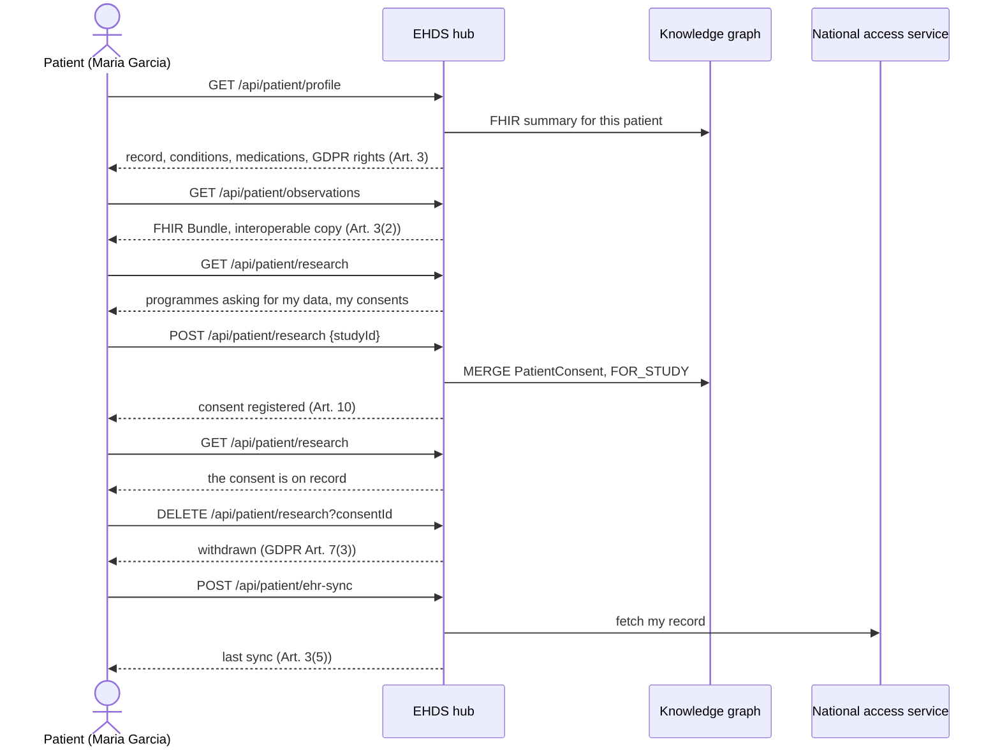
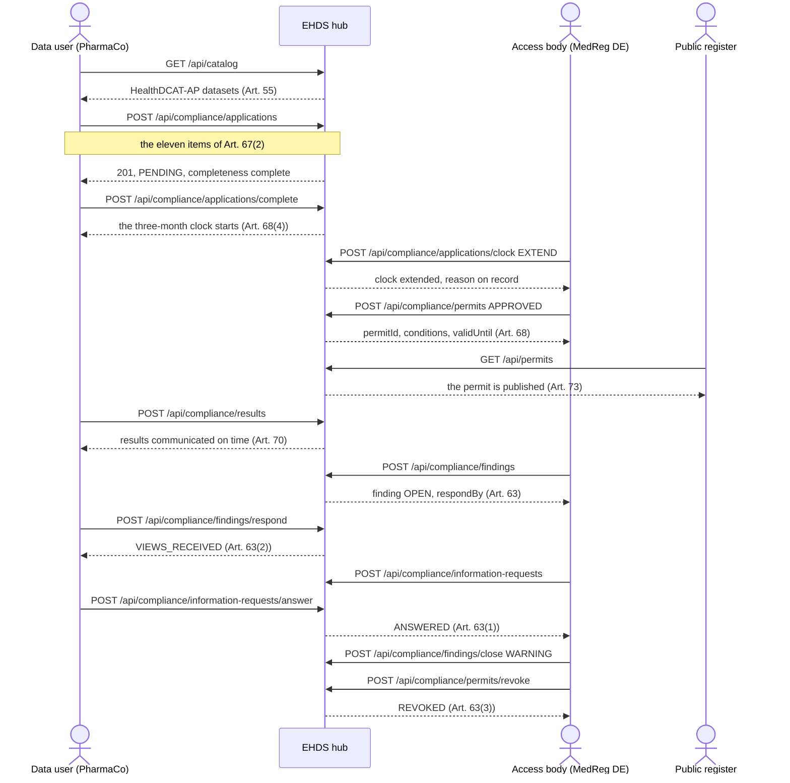
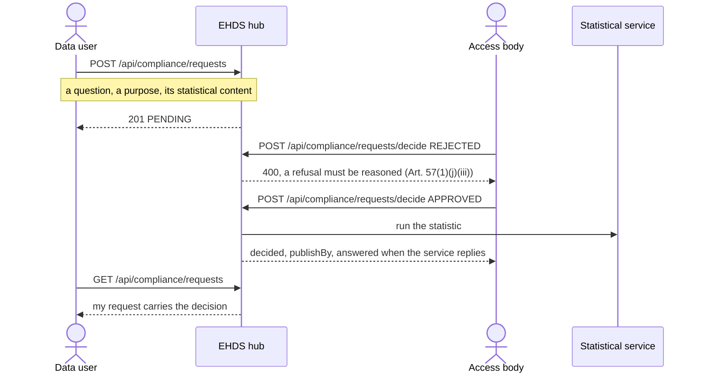
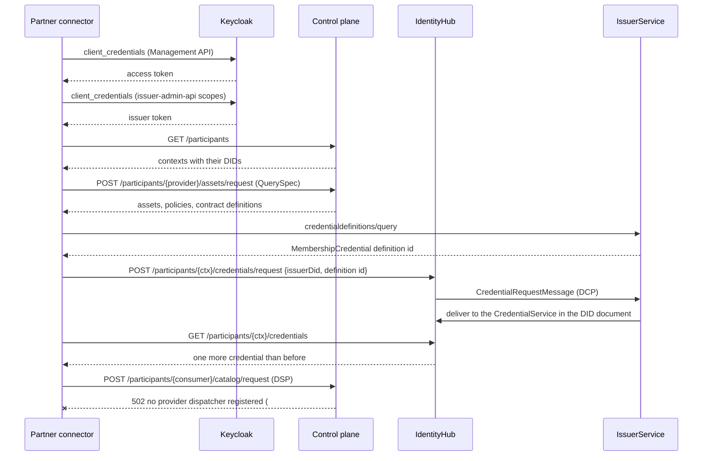

# ADR-032: The API collection is organised by EHDS persona, and every request asserts its outcome

**Status:** Accepted
**Date:** 2026-09-26
**Relates to:** [ADR-008](ADR-008-testing-strategy.md), [ADR-029](ADR-029-dependency-version-pinning.md), [ADR-031](ADR-031-checks-must-assert.md)
**Tracks:** [#348](https://github.com/ma3u/MinimumViableHealthDataspacev2/issues/348), [#349](https://github.com/ma3u/MinimumViableHealthDataspacev2/issues/349)

## Context

This repository calls itself an EHDS integration hub. The point of an integration
hub is that a hospital, an access body or a research organisation can rehearse
against it with synthetic data before connecting anything real. The artefact that
makes that possible is the Bruno collection in `bruno/MVHDv2/`: plain `.bru` files
in git that the desktop app, the VS Code extension and the `bru` CLI all run.

Measured against the code on 2026-09-26, it did not do that job.

**It was organised by resource, so nobody could find their own journey.** Folders
were named `Catalog`, `Graph`, `Patient`, `Admin`: the shape of the API, not the
shape of anyone's work. A regulator opening the collection to see what an access
body does had to know which of eighteen folders held the four requests that
concern them, and would still have missed the eighteen `/api/compliance/*`
operations that had no request at all.

**It could not fail.** All 49 requests carried one assertion, `res.status: lt
500`. A 401, a 403 and a 404 all passed. The `demo-smoke` workflow had been
running it against the live deployment with an expired cookie, every request
answering `401 Unauthorized`, for weeks; the only thing that went red was a
collection-level hint test. This is exactly the defect class [ADR-031](ADR-031-checks-must-assert.md)
is about, in the artefact that is supposed to prove the platform works.

**It covered 37 of 67 paths.** 36 of 87 implemented operations had no request:
the entire Chapter IV workflow (application, permit, findings, information
requests, data requests, results), participant registration, patient
observations, the public registers.

**Nothing in it spoke a protocol.** Every request went to the Next.js BFF. A
partner connecting its own EDC connector, which is the actual integration case,
found nothing to copy: no Management API, no IdentityHub, no IssuerService, no
DSP catalogue request. Those flows only became reproducible with [#345](https://github.com/ma3u/MinimumViableHealthDataspacev2/issues/345).

**A forged session cookie was committed** in `environments/Azure-Dev.bru`, and
`ui/scripts/forge-bruno-session.mjs` defaulted to a literal `NEXTAUTH_SECRET`
that the README then told the reader to set as the repository secret.

## Decision

### 1. One folder per EHDS role, holding that role's journey in order

The regulation defines who the actors are. The collection follows it:

| Folder                  | Role                                   | Regulation                                   |
| ----------------------- | -------------------------------------- | -------------------------------------------- |
| `00 Public`             | anyone, before signing in              | Art. 56 information duty, Art. 73 registers  |
| `01 Patient`            | natural person (`PATIENT`)             | Chapter II, Art. 3 to 12; GDPR Art. 15 to 22 |
| `02 Data Holder`        | hospital (`DATA_HOLDER`)               | Art. 51, 52, 55                              |
| `03 Data User`          | research organisation (`DATA_USER`)    | Art. 53, 67 to 70                            |
| `04 Access Body`        | HDAB (`HDAB_AUTHORITY`)                | Art. 55 to 63, 68, 71 to 73                  |
| `05 Dataspace Operator` | infrastructure (`EDC_ADMIN`)           | not a role the regulation names              |
| `06 Trust Centre`       | SPE operator (`TRUST_CENTER_OPERATOR`) | Art. 73                                      |
| `10 Connecting partner` | a partner's own connector              | DSP 2025-1, DCP v1.0                         |
| `11 Platform`           | the Neo4j proxy                        | internal                                     |
| `12 EUDI wallet`        | optional stack                         | EUDI ARF                                     |

Inside a folder the requests are numbered in the order that persona works:
discover, act, verify, then the validation branches. A person who is one of these
five roles opens one folder and sees their whole story.

### 2. The regulation's two-sided procedures are their own folders

Chapter IV's procedures are not one actor's journey. An application is submitted
by a data user, decided by an access body, its results communicated back by the
data user, and its supervision run by the access body again. Splitting those
requests across two persona folders would destroy the order and the variables
that carry ids between them.

So two folders hold procedures rather than personas, `07 Journey - Data permit`
and `08 Journey - Data request`, and each request inside names the acting
persona. This is a deliberate exception to rule 1 and the only one.

### 3. Every request asserts a status and a shape

No request may carry `res.status: lt 500` as its only assertion. Each states the
status it expects and at least one property of the body, measured against a
running stack rather than assumed. The negative branches are requests of their
own: a 400 for each validation rule, a 404 for each unknown id.

A request whose subject cannot exist on this stack skips loudly with the reason,
per [ADR-031](ADR-031-checks-must-assert.md) point 4; it never passes silently.

### 4. The role boundaries are asserted, not documented

`09 Access control` holds one request per line of the role matrix in
`.claude/rules/api-conventions.md`, each expecting its refusal: four 401s without
a session and eleven 403s across the five personas. That file stops being a claim
about the code and becomes a test of it.

### 5. Personas are forged per run, never committed

`scripts/run-api-tests.sh` forges one NextAuth session per persona at the start of
a run and passes them to `bru` as environment variables. On the compose stack the
signing secret is read from the running UI container; against Azure it comes from
the `NEXTAUTH_SECRET` repository secret. `forge-bruno-session.mjs` has no default
secret and exits 2 without one. No cookie is written to a file in git, and a 401
fails the run instead of printing a hint.

### 6. Two environments that differ in what they can reach

| Environment   | Base                                       | Folders it runs                                                        |
| ------------- | ------------------------------------------ | ---------------------------------------------------------------------- |
| `Local`       | `http://localhost:3003`, the compose stack | all thirteen                                                           |
| `Azure-Dev`   | `https://ehds.mabu.red`                    | 00 to 09; the EDC services and the proxy are on `.internal.` addresses |
| `Static-mock` | the GitHub Pages export                    | the 35 GET requests that map to a fixture, listed in `static-mock.txt` |

The runner decides which folders an environment can answer; no request silently
skips because its host was unreachable.

### 7. The result is a compliance suite

`scripts/run-api-tests.sh` writes `test-results/bruno/bruno-api-<env>-<stamp>.json`
in the shape `scripts/check-compliance-baseline.py` reads, so the collection gets
a floor in `scripts/compliance-baseline.json` alongside the DSP, DCP and EHDS
suites, and a regression in it fails the compliance workflow.

## The journeys, as the collection runs them

### Patient, primary use (Chapter II)

### Secondary use: application to permit to supervision (Art. 67 to 73)

### Data request answered in statistics (Art. 69)

### A partner connecting its own connector (DSP 2025-1, DCP v1.0)

## Consequences

**Easier.** A person who is one of the five roles opens one folder and sees their
whole journey with real request bodies and real expectations. The regulation
articles are in the folder and request names, so a compliance reviewer can read
the collection without reading the code. The role matrix is executable. A partner
gets copyable protocol requests.

**Harder.** The collection now goes red, and some of that red is old. The first
full run against a healthy compose stack scored 126 passed, 13 failed, and every
failure was a real defect: a six-month-old pinned proxy image, a DSP dispatcher
that is never registered, a consent that reports success while writing nothing.
Adopting this means budgeting for that backlog, exactly as ADR-031 warned.

**A generator, then the files.** The 142 requests were emitted once from a
script, and the `.bru` files are the source of truth from then on;
`scripts/check-bruno-coverage.py` keeps them aligned with the routes. Nobody has
to hand-write 142 files, and nobody has to regenerate to add one.

**Ordering is load-bearing.** The journey folders pass ids between requests
through `bru.setVar`, so `bru run` must receive them in one invocation. The
runner does; running a single request out of order skips loudly rather than
passing on a stale variable.

## Alternatives considered

**Keep the resource organisation and add the missing requests.** Rejected: it
would have fixed coverage and left the artefact unusable by the people it is for.
The resource shape is already available in `ui/public/openapi.yaml`.

**One folder per persona with the Chapter IV procedure duplicated in both.**
Rejected: two copies of the same chain drift, and the second copy has no ids to
work with.

**Generate the collection at build time from the OpenAPI spec.** Rejected: the
spec documents 49 of 87 operations, carries no request bodies worth sending, and
knows nothing about which persona may call what. A generated-every-build
collection also cannot hold the prose that makes it readable.

**Assert only on status codes.** Rejected for the reason in ADR-031: a route that
returns 200 with an empty body would pass. Each request asserts at least one
property of the body.
