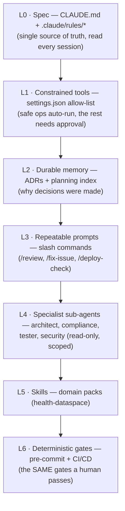
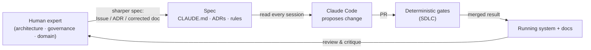

# Deterministic Agentic AI Development with Claude Code

- **Project:** Minimum Viable Health Dataspace v2 (EHDS reference implementation)
- **Audience:** anyone asking _"how do you actually use Agentic AI for programming
  without it going off the rails?"_
- **Last updated:** 2026-05-31 ·
- **Maintainer:** Matthias (`@ma3u`)

> Companion document: **[Software Development Life Cycle
> (SDLC)](./SDLC.md)** — the deterministic gates this AI author has to pass
> through, same as any human contributor.

> 🟢 **Not a software engineer?** Read the plain-language version first:
> **[How We Use AI to Help Build This](./AGENTIC-AI-explained.md)**.

---

## 1. The thesis: wrap a non-deterministic author in a deterministic harness

Large Language Models are **non-deterministic**. Ask the same question twice and
you may get two different answers. Software, by contrast, demands
**determinism** — the build is reproducible, the tests are reproducible, the
deployment is reproducible.

The whole craft of "agentic AI for programming" is bridging that gap:

> **Treat the agent as a fast, tireless, broadly-knowledgeable junior developer.
> Then make every piece of its output pass the _same deterministic gates_ a
> senior would enforce — automatically, every time.**

The agent supplies _breadth and speed_. The harness supplies _determinism and
trust_. Neither is sufficient alone. This document describes the harness I use
with [Claude Code](https://claude.com/claude-code) on this project, and the rules
of engagement that keep AI-generated code reviewable and safe in a
regulated-health-data domain.

The guiding principle, borrowed from how I run human teams:
**Evidence > assumptions · Code > documentation · The gate, not the author,
decides what ships.**

---

## 2. The determinism stack

Determinism is layered. Each layer narrows what the agent _can_ do and sharpens
what it _should_ do, so that by the time code reaches the deterministic gates it
is already shaped by the project's rules.



The bottom layer (L6) is shared with humans and is documented in the
[SDLC](./SDLC.md). The layers above it are the _agentic_ scaffolding and are the
subject of this document.

---

## 3. Anatomy of the [`.claude/`](https://github.com/ma3u/MinimumViableHealthDataspacev2/tree/main/.claude) folder

Everything that constrains and configures the agent is **checked into the repo**,
so it is versioned, reviewable, and identical for every session and every
contributor.

| Path                                                                                                                                    | Role                                                                                                                                                                                                                                         |
| --------------------------------------------------------------------------------------------------------------------------------------- | -------------------------------------------------------------------------------------------------------------------------------------------------------------------------------------------------------------------------------------------- |
| [`CLAUDE.md`](https://github.com/ma3u/MinimumViableHealthDataspacev2/blob/main/CLAUDE.md) (repo root)                                   | The operating manual the agent reads **every session**: build commands, the 5-layer architecture, key directories, coding conventions, and the **Top Gotchas** (the traps that waste an hour if you don't know them). Kept short on purpose. |
| [`.claude/settings.json`](https://github.com/ma3u/MinimumViableHealthDataspacev2/blob/main/.claude/settings.json)                       | **Permission allow-list** — which tool calls run without asking (see §4).                                                                                                                                                                    |
| [`.claude/rules/code-style.md`](https://github.com/ma3u/MinimumViableHealthDataspacev2/blob/main/.claude/rules/code-style.md)           | TypeScript/Next.js + Cypher + Bash + Prettier conventions, scoped to source paths.                                                                                                                                                           |
| [`.claude/rules/testing.md`](https://github.com/ma3u/MinimumViableHealthDataspacev2/blob/main/.claude/rules/testing.md)                 | Test frameworks, locations, commands, what _not_ to mock.                                                                                                                                                                                    |
| [`.claude/rules/api-conventions.md`](https://github.com/ma3u/MinimumViableHealthDataspacev2/blob/main/.claude/rules/api-conventions.md) | Protocols (DSP/DCP/FHIR/OMOP/EHDS/GDPR), data models, route patterns, role/access matrix, mock-fixture mapping.                                                                                                                              |
| `.claude/commands/*.md`                                                                                                                 | **Slash commands** — repeatable, parameterised prompts (§5).                                                                                                                                                                                 |
| `.claude/agents/*.md`                                                                                                                   | **Specialist sub-agents** — scoped, read-only experts (§6).                                                                                                                                                                                  |
| [`.claude/skills/SKILL.md`](https://github.com/ma3u/MinimumViableHealthDataspacev2/blob/main/.claude/skills/SKILL.md)                   | A domain **skill** pack auto-triggered by task type.                                                                                                                                                                                         |

Because this lives in git, improving the agent is a normal PR: change a rule,
review the diff, merge. The agent's behaviour is **configuration, not folklore**.

---

## 4. Constrained tools & permissions (blast-radius control)

`.claude/settings.json` is an **allow-list**. Read-only and obviously-safe
operations run without interrupting the flow; everything else requires explicit
approval:

```jsonc
{
  "permissions": {
    // Abridged excerpt — the live .claude/settings.json has ~51 allow entries.
    // A representative subset of what auto-runs:
    "allow": [
      "Bash(git diff:*)",
      "Bash(git status)",
      "Bash(npm test:*)",
      "Bash(npm run build:*)",
      "Bash(npx tsc:*)",
      "Bash(grep:*)",
      "Bash(find:*)",
      "Bash(docker compose ps:*)",
      "Bash(kubectl get:*)",
      "Bash(gh pr view:*)"
    ],
    "deny": [
      "Bash(kubectl delete:*)",
      "Bash(kubectl drain:*)",
      "Bash(docker system prune:*)"
    ]
  }
}
```

The agent can freely **inspect, build, type-check, and test** — the actions you
_want_ it doing constantly. Anything that mutates outside the working tree
(pushing, deleting, deploying, installing) surfaces for a human decision. This is
the "least privilege" principle applied to an AI author.

---

## 5. Repeatable prompts: slash commands

A free-form prompt is non-deterministic by nature. A **slash command** is a
checked-in, version-controlled prompt that produces a _consistent workflow_ every
time it's invoked — the determinism trick applied to the instruction itself.

| Command          | What it does                                                                                                                                                                                                                                   |
| ---------------- | ---------------------------------------------------------------------------------------------------------------------------------------------------------------------------------------------------------------------------------------------- |
| `/review`        | Reviews the working `git diff` against this project's conventions: TS strict mode + `@/*` imports, Cypher `MERGE`-only + PascalCase labels, **fictional org names only**, mock fixtures kept in sync with API routes, tests for new behaviour. |
| `/fix-issue <N>` | Investigates a GitHub Issue end-to-end: `gh issue view N` → locate relevant files → implement → verify.                                                                                                                                        |
| `/deploy-check`  | Pre-deployment validation using the project's real build/test commands.                                                                                                                                                                        |

These encode "the way we do X here" once, so the _quality of the prompt_ no
longer depends on how I phrased it that day.

---

## 6. Specialist sub-agents (scoped, read-only experts)

For deep reasoning in one domain, the project ships **specialist sub-agents**
under [`.claude/agents/`](https://github.com/ma3u/MinimumViableHealthDataspacev2/tree/main/.claude/agents). Each is deliberately constrained:

| Agent                   | When to use it                                                                                                        | Model  | Tools                                |
| ----------------------- | --------------------------------------------------------------------------------------------------------------------- | ------ | ------------------------------------ |
| **architect**           | Reason about the 5-layer Neo4j graph, DSP/FHIR/OMOP/DCAT-AP interactions, service topology, cross-cutting trade-offs. | Sonnet | `Read, Grep, Glob, Bash` (read-only) |
| **compliance-reviewer** | Verify EHDS conformance, DSP/DCP protocol correctness, GDPR patient-rights, audit-trail integrity.                    | Sonnet | read-only                            |
| **tester**              | Audit coverage, triage test failures, plan new Playwright journeys, assess Vitest health.                             | Sonnet | read-only                            |
| **security**            | Review auth flows, RBAC, Keycloak config, credential/secret handling, vulnerabilities.                                | Sonnet | read-only                            |

Two deliberate constraints make these safe:

1. **Read-only toolset.** They reason and advise; they don't write. (The
   architect agent's brief literally says _"Do not write code unless explicitly
   asked; your job is to reason and advise."_) A wrong opinion is cheap; a wrong
   edit is not.
2. **Sonnet, not the top model.** Right-sized for focused, scoped review — fast
   and economical, with the orchestrating session retaining the harder
   reasoning.

This mirrors a real team: you bring in a security or compliance reviewer to _look
and advise_, not to silently rewrite your branch.

---

## 7. Rules of engagement (the determinism techniques)

These are the habits — encoded in `CLAUDE.md` and the rules files — that keep
agent output predictable and trustworthy:

- **Read before write.** Always inspect a file before editing it. No blind edits.
- **Idempotent by default.** Cypher uses `MERGE`, never bare `CREATE`; schema
  constraints use `IF NOT EXISTS`. Re-running a change is a no-op, not a
  duplication — so a retried or repeated agent action is safe.
- **Plan / ADR first for big changes.** Architectural work starts with an ADR
  (see [SDLC §3](./SDLC.md#3-plan-before-you-build-issues-adrs-and-a-token-efficient-plan)),
  so the _decision_ is reviewed before a single line is written.
- **Token-efficient context** ([ADR-026](./ADRs/ADR-026-token-efficient-planning-structure.md)).
  Routinely-loaded docs are kept under **~15K tokens**. A sharp, relevant context
  produces sharper reasoning — load the ADR _index_ then the one relevant ADR,
  not the whole corpus.
- **Evidence over assertion.** A change isn't "done" because the agent says so —
  it's done when the **gates are green** (lint, type-check, tests, scans). The
  [SDLC](./SDLC.md) gates apply to AI commits identically to human commits.
- **Traceable provenance.** AI-assisted commits carry a `Co-Authored-By: Claude`
  trailer, so `git log` always shows what the agent touched — essential for audit
  in a health-data context.
- **Domain guardrails.** Hard rules the agent must never break — e.g. **only
  fictional organisation names** in demo data and docs (AlphaKlinik Berlin,
  PharmaCo Research AG, …; never real entities). These live in the rules files
  and are checked by `/review`.

---

## 8. The human-in-the-loop: the conceptual-review flywheel

The most important part of agentic development is **not** the AI — it's the
**feedback loop** that turns human expertise into better specifications.



An AI agent is only as good as the spec it reads. When a human corrects a
sequence diagram, tightens an ADR, or files a precise Issue, that correction
becomes **durable input** the agent honours in _every_ subsequent session. So the
highest-leverage contribution to this project is often **conceptual, not
code**: better requirements, clearer governance rules, corrected architecture
descriptions. Each one raises the floor of everything the AI produces next.

This is the answer to _"how to best use Agentic AI for programming"_: don't aim
for a hands-off autopilot. Aim for a **tight loop** where human judgement
continuously sharpens the spec, and deterministic tooling continuously verifies
the output.

---

## 9. Strengths, risks, and mitigations (an honest assessment)

| Where agentic AI excels here                                              | Where it needs the harness                             | Mitigation in this project                                                                                 |
| ------------------------------------------------------------------------- | ------------------------------------------------------ | ---------------------------------------------------------------------------------------------------------- |
| Breadth — wiring CI, security scanners, SBOM, multi-layer schemas quickly | **Confidently wrong** output (plausible but incorrect) | Deterministic gates (tests, type-check, scans); `/review`; read-only specialist sub-agents                 |
| Consistency — applies project conventions uniformly                       | **Drift from intent** over a long task                 | ADR-first for big changes; small PRs; human review of the diff                                             |
| Speed — repetitive refactors, fixtures, boilerplate                       | **Hallucinated APIs / fabricated facts**               | "Base everything strictly on the repo, don't invent" (the init recipe, §10); CI catches non-existent calls |
| Tireless — never skips a checklist step                                   | **Over-engineering / scope creep**                     | KISS/YAGNI in the rules; maintainer trims scope at PR                                                      |
| Great at scaffolding tedious safety work                                  | **Blast radius** if given broad tools                  | Permission allow-list; least-privilege tools (§4)                                                          |

The pattern: **AI handles the breadth; deterministic tooling and human judgement
handle the correctness.**

---

## 10. The init recipe — bootstrapping Claude Code on any repo

The `.claude/` setup above wasn't hand-written from scratch — it was generated by
pointing Claude Code at the existing repo with a single, carefully-bounded
instruction, then reviewed like any other change. The reusable recipe is
published as a gist:

**→ [ClaudeCodeInit — the bootstrap prompt](https://gist.github.com/ma3u/09e76d3b604d132673bc4a59b092709a)**

In summary, it asks the agent to _read all planning and architecture docs in the
repo_ and generate a complete `.claude/` folder:

1. **`CLAUDE.md`** — concise: build commands, architecture, key dirs,
   conventions, top project-specific gotchas.
2. **[`settings.json`](https://github.com/ma3u/MinimumViableHealthDataspacev2/blob/main/.claude/settings.json)** — allow safe ops (build/test/git-read/grep/find), require
   approval for destructive actions.
3. **[`code-style.md`](https://github.com/ma3u/MinimumViableHealthDataspacev2/blob/main/.claude/rules/code-style.md)** — conventions extracted from the _actual_ codebase.
4. **[`testing.md`](https://github.com/ma3u/MinimumViableHealthDataspacev2/blob/main/.claude/rules/testing.md)** — real test frameworks, commands, standards.
5. **[`api-conventions.md`](https://github.com/ma3u/MinimumViableHealthDataspacev2/blob/main/.claude/rules/api-conventions.md)** — protocols, data models, API patterns.
6. **[`review.md`](https://github.com/ma3u/MinimumViableHealthDataspacev2/blob/main/.claude/commands/review.md)** — a code-review command using `git diff` injection.
7. **[`fix-issue.md`](https://github.com/ma3u/MinimumViableHealthDataspacev2/blob/main/.claude/commands/fix-issue.md)** — an Issue-investigation workflow with `gh` CLI.
8. **[`deploy-check.md`](https://github.com/ma3u/MinimumViableHealthDataspacev2/blob/main/.claude/commands/deploy-check.md)** — pre-deploy validation using the real build command.
9. **[`SKILL.md`](https://github.com/ma3u/MinimumViableHealthDataspacev2/blob/main/.claude/skills/SKILL.md)** — domain skill packs, auto-triggered by task type.
10. **`agents/`** — specialist read-only agents (architect, compliance, tester,
    security) on Sonnet.

The one constraint that makes it trustworthy:

> **"Base all content strictly on what you find in this repository. Do not invent
> architecture or conventions not present in the code or docs."**

That single rule is what turns a generic AI into a _project-specific_ one — and
it's the same anti-hallucination discipline that runs through everything above.

---

## 11. Outlook — maturing the agentic setup

1. **Claude in CI** — automated PR review via the Claude GitHub app/Action, so
   every PR gets an AI first-pass review on the server, not just locally.
2. **Branch protection** (see [SDLC §11](./SDLC.md#11-outlook--next-steps)) so
   even AI commits cannot bypass green CI.
3. **Commit-message enforcement** (`commitlint`) so AI-authored commits keep the
   Conventional-Commit shape that drives release notes.
4. **Live context via MCP** — Model Context Protocol servers exposing Neo4j /
   FHIR so the agent can reason against _current_ data, not just the schema.
5. **An eval / regression harness for agent output** — golden tasks the setup is
   re-run against when `CLAUDE.md` or the rules change, so configuration changes
   are themselves tested.

---

## References

- `CLAUDE.md`, `.claude/settings.json`, `.claude/rules/*`, `.claude/commands/*`,
  `.claude/agents/*`, `.claude/skills/SKILL.md` — the live configuration.
- [ClaudeCodeInit gist](https://gist.github.com/ma3u/09e76d3b604d132673bc4a59b092709a)
  — the bootstrap recipe.
- [ADR-026 — Token-Efficient Planning & ADR Structure](./ADRs/ADR-026-token-efficient-planning-structure.md)
- [ADR-008 — Testing Strategy](./ADRs/ADR-008-testing-strategy.md)
- Companion: [Software Development Life Cycle (SDLC)](./SDLC.md)
- [Claude Code](https://claude.com/claude-code)
