# Full User Journey — EHDS Health Dataspace v2

> End-to-end multi-user journey for the European Health Data Space (EHDS)
> secondary-use data exchange, covering onboarding through analytics.

## Contents

1. [Overview](#overview) — Personas & Login
2. [Sequence Diagram](#sequence-diagram)
3. [Journey Steps](#journey-steps)
   - [Step 0 — Participant Onboarding](#step-0--participant-onboarding)
   - [Step 1 — Data Provider Creates Metadata](#step-1--data-provider-creates-metadata)
   - [Step 2 — Publish with Access & Usage Policies](#step-2--publish-with-access--usage-policies)
   - [Step 3 — Consumer Discovers Assets](#step-3--consumer-discovers-assets)
   - [Step 4 — Request Access to Datasets](#step-4--request-access-to-datasets)
   - [Step 5 — Contract Negotiation & Approval](#step-5--contract-negotiation--approval)
   - [Step 6 — Data Transfer & Access](#step-6--data-transfer--access)
   - [Step 7 — Analytics & Compliance](#step-7--analytics--compliance)
4. [Cross-Border Federation (Art. 51)](#cross-border-federation-art-51)
5. [EHDS Regulation Mapping](#ehds-regulation-mapping)
6. [E2E Test Summary](#e2e-test-summary)
7. [Running the Full Journey](#running-the-full-journey)
8. [Related Documentation](#related-documentation)

---

## Overview

This document traces the complete EHDS secondary-use flow across **three
user personas** interacting with the Health Dataspace v2 platform. Each
step maps to EHDS Regulation articles, Dataspace Protocol (DSP 2025-1)
states, and Decentralised Claims Protocol (DCP v1.0) operations.

### Personas

| Persona          | User         | Role                   | Organisation            | DID                                   |
| ---------------- | ------------ | ---------------------- | ----------------------- | ------------------------------------- |
| Portal Admin     | `edcadmin`   | `EDC_ADMIN`            | Dataspace Operator      | _(system-level, no DID)_              |
| Data Holder      | `clinicuser` | `EDC_USER_PARTICIPANT` | AlphaKlinik Berlin (DE) | `did:web:alpha-klinik.de:participant` |
| Data User        | `researcher` | `EDC_USER_PARTICIPANT` | PharmaCo Research AG    | `did:web:pharmaco.de:research`        |
| HDAB (Authority) | `regulator`  | `HDAB_AUTHORITY`       | MedReg DE               | `did:web:medreg.de:hdab`              |

All passwords match the username (local dev only).

### Login

```
URL:  http://localhost:3003/auth/signin   (live data in seeded databases you find in the Docker cluster)
Keycloak:  http://keycloak.localhost      (admin / admin)
```

---

## Sequence Diagram

```mermaid
sequenceDiagram
    autonumber
    participant OP as Operator<br/>(edcadmin)
    participant DH as Data Holder<br/>(clinicuser)
    participant DU as Data User<br/>(researcher)
    participant HDAB as HDAB<br/>(regulator)
    participant KC as Keycloak
    participant CP as EDC-V<br/>Control Plane
    participant DP as DCore<br/>Data Plane
    participant IH as Identity Hub
    participant NEO as Neo4j
    participant UI as UI<br/>(Next.js)

    rect rgb(30, 41, 59)
    Note over OP,IH: Step 0 — Participant Onboarding (Art. 33, DCP §4)
    OP->>KC: Authenticate (OIDC)
    KC-->>OP: Access token (EDC_ADMIN)
    OP->>CP: Register participants (5×)
    CP->>IH: Create DID (did:web)
    IH-->>CP: DID document
    CP->>IH: Issue MembershipCredential
    CP->>IH: Issue EHDSParticipantCredential
    CP-->>OP: Participants registered ✓
    end

    rect rgb(30, 41, 59)
    Note over DH,NEO: Step 1 — Create Metadata (Art. 45, HealthDCAT-AP 3.0)
    DH->>KC: Authenticate (OIDC)
    KC-->>DH: Access token (EDC_USER_PARTICIPANT)
    DH->>UI: Navigate to /data/share
    DH->>CP: POST /api/assets (HealthDCAT-AP metadata)
    CP->>NEO: Store dataset catalog entry
    NEO-->>CP: Dataset ID
    CP-->>DH: Asset registered ✓
    end

    rect rgb(30, 41, 59)
    Note over DH,CP: Step 2 — Publish with Policies (Art. 46, ODRL 2.2)
    DH->>CP: Create ODRL access policy
    DH->>CP: Create ODRL usage policy
    DH->>CP: Create contract definition (asset + policies)
    CP-->>DH: Catalog offering published ✓
    end

    rect rgb(30, 41, 59)
    Note over DU,NEO: Step 3 — Discover Assets (Art. 47, DSP §5 Catalog)
    DU->>UI: Browse /catalog (public)
    UI->>CP: GET /api/catalog
    CP-->>UI: HealthDCAT-AP dataset list
    DU->>UI: Explore /graph (5-layer model)
    UI->>NEO: GET /api/graph
    NEO-->>UI: Nodes & relationships
    DU->>UI: Search /data/discover (federated)
    end

    rect rgb(30, 41, 59)
    Note over DU,CP: Step 4 — Request Access (Art. 48, DSP §7.1 Negotiation)
    DU->>KC: Authenticate (OIDC)
    KC-->>DU: Access token (EDC_USER_PARTICIPANT)
    DU->>UI: Navigate to /negotiate
    DU->>CP: GET contract offers
    CP-->>DU: Available offers
    DU->>CP: POST ContractRequestMessage
    CP-->>DU: State: REQUESTED
    end

    rect rgb(30, 41, 59)
    Note over DH,HDAB: Step 5 — Negotiation & Approval (Art. 49, DSP §7.1)
    CP->>DH: Notify: new request
    DH->>CP: ContractOfferMessage
    CP-->>DU: State: OFFERED
    DU->>CP: ContractAcceptMessage
    CP-->>CP: State: ACCEPTED → AGREED
    CP->>HDAB: Request HDAB verification (Art. 49)
    HDAB->>CP: Verify compliance (Art. 53 purpose)
    CP-->>CP: State: VERIFIED
    CP->>DU: ContractAgreementMessage
    CP-->>DU: State: FINALIZED (contractAgreementId)
    Note right of CP: Rejected → TERMINATED
    end

    rect rgb(30, 41, 59)
    Note over DU,NEO: Step 6 — Data Transfer (Art. 50, DSP §8 Transfer)
    DU->>UI: Navigate to /data/transfer
    DU->>CP: TransferRequestMessage (agreementId)
    CP-->>DU: State: REQUESTED
    CP->>DP: Provision EDR token
    DP-->>DU: State: STARTED (EDR token)
    DU->>DP: GET FHIR bundles / OMOP cohort
    DP-->>DU: Health data payload
    DU->>CP: TransferCompletionMessage
    CP-->>DU: State: COMPLETED
    CP->>NEO: Log audit event
    end

    rect rgb(30, 41, 59)
    Note over DU,NEO: Step 7 — Analytics & Compliance (Art. 52–53)
    DU->>UI: View /analytics (OMOP cohort stats)
    UI->>NEO: GET /api/analytics
    NEO-->>UI: Aggregated results
    DU->>UI: Explore /patient (FHIR timeline)
    UI->>NEO: GET /api/patient
    NEO-->>UI: Patient journey data
    HDAB->>KC: Authenticate (OIDC)
    KC-->>HDAB: Access token (HDAB_AUTHORITY)
    HDAB->>UI: Review /compliance (audit chain)
    UI->>NEO: GET /api/admin/audit
    NEO-->>UI: Audit trail
    end
```



---

## Journey Steps

### Step 0 — Participant Onboarding

| Field          | Value                                             |
| -------------- | ------------------------------------------------- |
| **Actor**      | Operator (`edcadmin`)                             |
| **EHDS Ref**   | Art. 33 — Health Data Access Body                 |
| **DCP Ref**    | DCP §4 — Participant Registration                 |
| **UI Page**    | `/onboarding`                                     |
| **API Routes** | `POST /api/participants`, `GET /api/participants` |

**Flow:**

1. Operator signs in via Keycloak SSO → lands on `/onboarding`.
2. The onboarding wizard shows the 5-step participant registration:
   - Identity verification (DID resolution)
   - Credential issuance (MembershipCredential, EHDSParticipantCredential)
   - Dataspace profile assignment
   - Data-plane endpoint registration
   - Compliance check
3. All 5 fictional participants are registered with valid DIDs.

**E2E Coverage:**

| Test | Description                         | Status |
| ---- | ----------------------------------- | ------ |
| J01  | Admin dashboard requires auth       | ✅     |
| J02  | All 5 participants registered       | ✅     |
| J03  | Each participant has valid DID      | ✅     |
| J04  | Credentials exist for all holders   | ✅     |
| J05  | EHDS & DataQuality credential types | ✅     |

**Seed Phase:** `jad/seed-health-tenants.sh` (Phase 1),
`jad/seed-ehds-credentials.sh` (Phase 2)

---

### Step 1 — Data Provider Creates Metadata

| Field          | Value                                  |
| -------------- | -------------------------------------- |
| **Actor**      | Data Holder (`clinicuser`)             |
| **EHDS Ref**   | Art. 45 — Dataset Description          |
| **Standard**   | HealthDCAT-AP 3.0 metadata profile     |
| **UI Page**    | `/data/share` (Create tab)             |
| **API Routes** | `POST /api/assets`, `GET /api/catalog` |

**Flow:**

1. Data Holder signs in → navigates to `/data/share`.
2. Selects "Create New" tab → fills out metadata form:
   - Title, description, publisher, license
   - EHDS Article 53 legal basis reference
   - HealthDCAT-AP mandatory fields (temporal coverage, spatial, theme)
   - FHIR R4 conformance profile (Patient, Encounter, Condition, etc.)
3. Dataset is registered in the catalog as a HealthDCAT-AP entry.

**Datasets in the catalog include:**

- Synthea FHIR R4 Patient Cohort (127 patients)
- FHIR Encounter History
- FHIR Diagnostic Reports
- OMOP CDM Analytics
- FHIR Immunization Records
- Clinical Trial Phases I–IV
- MedDRA v27 Adverse Events
- FHIR AllergyIntolerance Records

**E2E Coverage:**

| Test | Description                               | Status |
| ---- | ----------------------------------------- | ------ |
| J06  | Synthea FHIR R4 Patient Cohort in catalog | ✅     |
| J07  | FHIR Encounter History (HealthDCAT-AP)    | ✅     |
| J08  | FHIR Diagnostic Reports visible           | ✅     |
| J09  | OMOP CDM dataset in catalog API           | ✅     |
| J10  | EHDS Article 53 legal basis               | ✅     |
| J11  | FHIR Immunization Records visible         | ✅     |
| J12  | FHIR Care Plan Registry                   | ✅     |
| J13  | MedDRA v27 Adverse Events                 | ✅     |
| J14  | Clinical Trial Phases I–IV                | ✅     |
| J15  | FHIR AllergyIntolerance + R4 conformance  | ✅     |

**Seed Phase:** `jad/seed-data-assets.sh` (Phase 4)

---

### Step 2 — Publish with Access & Usage Policies

| Field          | Value                                         |
| -------------- | --------------------------------------------- |
| **Actor**      | Data Holder (`clinicuser`)                    |
| **EHDS Ref**   | Art. 46 — Data Permit Conditions              |
| **Standard**   | ODRL 2.2 (Open Digital Rights Language)       |
| **UI Page**    | `/admin/policies`                             |
| **API Routes** | `GET /api/admin/policies`, `POST /api/assets` |

**Flow:**

1. Data Holder defines access and usage policies in ODRL format:
   - **Access policy:** Who can request access (role-based, participant-based)
   - **Usage policy:** What the data can be used for (purpose limitation,
     temporal restriction, geographic restriction)
2. Policies are attached to catalog offerings as contract definitions.
3. Catalog entries are published and become discoverable.

**E2E Coverage:**

| Test | Description                              | Status |
| ---- | ---------------------------------------- | ------ |
| J16  | Policies exist for multiple participants | ✅     |
| J17  | ODRL permission/prohibition fields       | ✅     |
| J18  | Policy page requires authentication      | ✅     |
| J19  | MedReg has registered policies           | ✅     |
| J20  | Catalog page renders dataset cards       | ✅     |
| J21  | Catalog API returns ≥15 datasets         | ✅     |
| J22  | ≥1 SyntheticData type dataset            | ✅     |

**Seed Phase:** `jad/seed-ehds-policies.sh` (Phase 3)

---

### Step 3 — Consumer Discovers Assets

| Field          | Value                                  |
| -------------- | -------------------------------------- |
| **Actor**      | Data User (`researcher`)               |
| **EHDS Ref**   | Art. 47 — Data Access Application      |
| **DSP Ref**    | DSP §5 — Catalog Protocol              |
| **UI Pages**   | `/catalog`, `/data/discover`, `/graph` |
| **API Routes** | `GET /api/catalog`, `GET /api/graph`   |

**Flow:**

1. Data User browses the public catalog at `/catalog`:
   - Searches by dataset type, publisher, or keyword
   - Expands dataset cards to see HealthDCAT-AP metadata
   - Filters by clinical trial phase, FHIR resource type, etc.
2. Uses `/data/discover` (authenticated) to access federated search across
   multiple catalogs.
3. Explores the knowledge graph at `/graph` to see the 5-layer model:
   - Layer 1: Marketplace (DataProduct, ContractOffer)
   - Layer 2: HealthDCAT-AP (HealthDataset, Distribution)
   - Layer 3: FHIR R4 (Patient, Encounter, Condition, Observation)
   - Layer 4: OMOP CDM (Person, VisitOccurrence, Measurement)
   - Layer 5: Ontology (SNOMED CT, LOINC, RxNorm)

**E2E Coverage:**

| Test | Description                           | Status |
| ---- | ------------------------------------- | ------ |
| J23  | Catalog displays FHIR datasets        | ✅     |
| J24  | Catalog API includes various types    | ✅     |
| J25  | Clinical trial dataset exists         | ✅     |
| J26  | Discover Data requires authentication | ✅     |
| J27  | Graph shows all 5 layers              | ✅     |
| J28  | Graph includes FHIR R4 + OMOP CDM     | ✅     |
| J29  | Patient Journey shows cohort          | ✅     |
| J30  | OMOP Analytics page renders           | ✅     |
| J82  | Catalog search filter input           | ✅     |
| J83  | Search filter narrows datasets        | ✅     |
| J91  | Catalog references HealthDCAT-AP      | ✅     |

**Seed Phase:** `jad/seed-federated-catalog.sh` (Phase 6)

---

### Step 4 — Request Access to Datasets

| Field          | Value                                                         |
| -------------- | ------------------------------------------------------------- |
| **Actor**      | Data User (`researcher`)                                      |
| **EHDS Ref**   | Art. 48 — Data Permit                                         |
| **DSP Ref**    | DSP §7.1 — Contract Negotiation Protocol                      |
| **UI Page**    | `/negotiate`                                                  |
| **API Routes** | `GET /api/tasks`, `POST /api/negotiations`, `GET /api/assets` |

**Flow:**

1. Data User signs in → navigates to `/negotiate`.
2. **Step 1 — Discover Offers:** Selects a participant, browses available
   contract offers.
3. **Step 2 — Initiate Negotiation:** Selects an offer and starts the
   DSP contract negotiation.
4. The negotiation follows the DSP 2025-1 state machine:

```
   REQUESTED → OFFERED → ACCEPTED → AGREED → VERIFIED → FINALIZED
                                                    ↓
                                              TERMINATED
```

5. Each state transition creates an audit event.

**E2E Coverage:**

| Test | Description                               | Status |
| ---- | ----------------------------------------- | ------ |
| J31  | Negotiate page requires authentication    | ✅     |
| J32  | Tasks API includes negotiations           | ✅     |
| J33  | ≥1 FINALIZED negotiation exists           | ✅     |
| J34  | Negotiations span multiple participants   | ✅     |
| J35  | Participant-scoped negotiations API       | ✅     |
| J36  | Negotiations follow DSP protocol          | ✅     |
| J37  | Assets API returns participant assets     | ✅     |
| J38  | TERMINATED negotiation exists             | ✅     |
| J39  | Finalized negotiations have agreement ID  | ✅     |
| J40  | Cross-border negotiation (different DIDs) | ✅     |
| J92  | Negotiations have DSP protocol fields     | ✅     |
| J95  | Finalized negotiations → transfer chain   | ✅     |
| J96  | Assets API returns structured entries     | ✅     |
| J99  | Negotiations reference multiple DIDs      | ✅     |

**Seed Phase:** `jad/seed-contract-negotiation.sh` (Phase 5)

---

### Step 5 — Contract Negotiation & Approval

| Field          | Value                                                                    |
| -------------- | ------------------------------------------------------------------------ |
| **Actors**     | Data User (`researcher`), Data Holder (`clinicuser`), HDAB (`regulator`) |
| **EHDS Ref**   | Art. 49 — HDAB decision on data permit                                   |
| **DSP Ref**    | DSP §7.1 — Contract Negotiation lifecycle                                |
| **UI Pages**   | `/negotiate`, `/admin/policies`, `/compliance`                           |
| **API Routes** | `GET /api/negotiations`, `GET /api/tasks`                                |

**Flow — Multi-User Interaction:**

1. **Data User** receives the OFFERED state → reviews contract terms.
2. **Data Holder** verifies the requestor's credentials and purpose.
3. **HDAB (MedReg)** reviews the data permit application against
   EHDS Art. 49 criteria:
   - Purpose limitation (Art. 53 secondary-use categories)
   - Data minimisation
   - Temporal restriction
   - Geographic scope (cross-border rules per Art. 51)
4. On approval, the negotiation transitions: ACCEPTED → AGREED →
   VERIFIED → **FINALIZED**.
5. A `contractAgreementId` is issued on finalisation.
6. Rejected requests transition to **TERMINATED** with reason.

**DSP State Machine:**

| State        | Actor       | Action                          |
| ------------ | ----------- | ------------------------------- |
| `REQUESTED`  | Data User   | Sends initial request           |
| `OFFERED`    | Data Holder | Responds with contract offer    |
| `ACCEPTED`   | Data User   | Accepts the offer terms         |
| `AGREED`     | Both        | Mutual agreement recorded       |
| `VERIFIED`   | HDAB        | Authority verifies compliance   |
| `FINALIZED`  | System      | Contract agreement issued       |
| `TERMINATED` | Any party   | Negotiation rejected or expired |

---

### Step 6 — Data Transfer & Access

| Field          | Value                                                          |
| -------------- | -------------------------------------------------------------- |
| **Actor**      | Data User (`researcher`)                                       |
| **EHDS Ref**   | Art. 50 — Secure Processing Environment                        |
| **DSP Ref**    | DSP §8 — Transfer Process Protocol                             |
| **UI Pages**   | `/data/transfer`, `/data/share`, `/graph`                      |
| **API Routes** | `GET /api/tasks`, `GET /api/transfers`, `GET /api/admin/audit` |

**Flow:**

1. With a FINALIZED contract agreement, the Data User navigates to
   `/data/transfer`.
2. The **DSP Transfer Pipeline** shows the transfer stepper:
   - Request EDR token
   - Retrieve data via DCore data plane
   - View FHIR bundles / OMOP cohort data
   - Confirm receipt
3. Transfer states follow DSP Transfer Process Protocol:

```
   REQUESTED → STARTED → COMPLETED | TERMINATED | SUSPENDED
```

4. FHIR data viewer displays patient bundles with resource details.
5. All transfers are logged in the audit trail.

**E2E Coverage:**

| Test | Description                                 | Status |
| ---- | ------------------------------------------- | ------ |
| J41  | Transfer page requires authentication       | ✅     |
| J42  | Share Data page requires authentication     | ✅     |
| J43  | Tasks API includes transfers                | ✅     |
| J44  | ≥1 in-progress transfer                     | ✅     |
| J45  | Transfers span ≥2 states                    | ✅     |
| J46  | Audit API includes transfers & negotiations | ✅     |
| J47  | Knowledge graph renders clickable canvas    | ✅     |
| J48  | Transfers involve multiple participants     | ✅     |
| J93  | Transfer API includes all 4 DSP states      | ✅     |
| J94  | Transfer entries have contractId linkage    | ✅     |
| J97  | Share Data page requires authentication     | ✅     |
| J98  | Transfers use HttpData-PULL type            | ✅     |
| J100 | Transfer entries include stateTimestamp     | ✅     |

**Seed Phase:** `jad/seed-data-transfer.sh` (Phase 7)

---

### Step 7 — Analytics & Compliance

| Field          | Value                                                                              |
| -------------- | ---------------------------------------------------------------------------------- |
| **Actor**      | Data User (`researcher`), HDAB (`regulator`)                                       |
| **EHDS Ref**   | Art. 52 — Fees & cost recovery; Art. 53 — Secondary-use categories                 |
| **UI Pages**   | `/analytics`, `/patient`, `/compliance`, `/eehrxf`                                 |
| **API Routes** | `GET /api/analytics`, `GET /api/patient`, `GET /api/compliance`, `GET /api/eehrxf` |

**Flow:**

1. **Data User** accesses research analytics at `/analytics`:
   - OMOP CDM cohort statistics (age/gender distribution)
   - Condition prevalence, measurement trends
   - Cross-dataset analysis
2. **Data User** explores individual patient journeys at `/patient`:
   - FHIR timeline (encounters, conditions, observations)
   - OMOP-mapped clinical events
3. **HDAB** reviews compliance at `/compliance`:
   - Credential chain verification
   - Policy enforcement audit
   - Cross-border transfer compliance (Art. 51)
4. Both review EEHRxF profile alignment at `/eehrxf`:
   - Coverage scores for 6 EHDS priority categories
   - Gap analysis against HL7 Europe Implementation Guides

**E2E Coverage:**

| Test | Description                                      | Status |
| ---- | ------------------------------------------------ | ------ |
| J49  | Cross-border: multi-country, negotiations, graph | ✅     |
| J50  | Compliance audit: credentials, policies, catalog | ✅     |
| J56  | Settings redirect (auth check)                   | ✅     |
| J57  | Catalog renders dataset cards (mock)             | ✅     |
| J58  | Catalog API returns populated array              | ✅     |
| J59  | Policy API returns ODRL structure                | ✅     |
| J60  | Credentials API returns EHDS credentials         | ✅     |
| J61  | Catalog dataset cards expand to metadata         | ✅     |
| J62  | Analytics renders 6 OMOP stat cards              | ✅     |
| J63  | Analytics Top Conditions & Drug Exposures        | ✅     |
| J64  | Analytics Gender Distribution section            | ✅     |
| J66  | Patient Journey 6 cohort stat badges             | ✅     |
| J67  | Patient selector dropdown renders                | ✅     |
| J68  | Patient page describes FHIR R4                   | ✅     |
| J71  | Analytics references OMOP CDM & Synthea          | ✅     |
| J72  | EEHRxF Priority Categories & EU Profiles         | ✅     |
| J73  | EEHRxF Overall Coverage stat                     | ✅     |
| J74  | EEHRxF EHDS Implementation Timeline              | ✅     |
| J75  | EEHRxF Available/Partial/Gap badges              | ✅     |
| J76  | EEHRxF References section                        | ✅     |
| J77  | EEHRxF description mentions HL7 Europe           | ✅     |
| J78  | Compliance requires authentication               | ✅     |
| J79  | Compliance validation API reachable              | ✅     |
| J84  | Dataset card shows publisher info                | ✅     |
| J85  | Dataset card shows legal basis                   | ✅     |
| J86  | HealthDCAT-AP Metadata heading renders           | ✅     |
| J87  | Show Data Model action available                 | ✅     |
| J88  | Download DCAT-AP action available                | ✅     |

---

## Cross-Border Federation (Art. 51)

The journey supports cross-border data exchange with participants in
multiple EU member states:

| Participant                 | Country | Role            |
| --------------------------- | ------- | --------------- |
| AlphaKlinik Berlin          | DE      | Data Holder     |
| PharmaCo Research AG        | DE      | Data User       |
| MedReg DE                   | DE      | HDAB            |
| Limburg Medical Centre      | NL      | Data Holder     |
| Institut de Recherche Santé | FR      | HDAB (Research) |

Cross-border negotiations require:

- DID resolution across national trust domains
- Mutual credential recognition (EHDSParticipantCredential)
- HDAB approval from both origin and destination countries

---

## EHDS Regulation Mapping

| Article | Title                    | Journey Step | Implementation Status |
| ------- | ------------------------ | ------------ | --------------------- |
| Art. 33 | Health Data Access Body  | Step 0       | ✅ Implemented        |
| Art. 45 | Dataset Description      | Step 1       | ✅ Implemented        |
| Art. 46 | Data Permit Conditions   | Step 2       | ✅ Implemented        |
| Art. 47 | Data Access Application  | Step 3       | ✅ Implemented        |
| Art. 48 | Data Permit              | Step 4       | ✅ Implemented        |
| Art. 49 | HDAB Decision            | Step 5       | ✅ Implemented        |
| Art. 50 | Secure Processing Env    | Step 6       | ⚠️ Partial (mock SPE) |
| Art. 51 | Cross-Border Exchange    | Step 6–7     | ✅ Implemented        |
| Art. 52 | Fees & Cost Recovery     | Step 7       | ⚠️ Not yet modelled   |
| Art. 53 | Secondary-Use Categories | Step 1, 7    | ✅ Implemented        |

---

## E2E Test Summary

| Journey | Tests | Requires      | Spec File                                |
| ------- | ----: | ------------- | ---------------------------------------- |
| A       |     5 | Neo4j (J04-5) | `01-identity-onboarding.spec.ts`         |
| B       |    10 | —             | `02-dataset-metadata.spec.ts`            |
| C       |     7 | —             | `03-policy-catalog.spec.ts`              |
| D       |     8 | Neo4j (J27-8) | `04-discovery-search.spec.ts`            |
| E       |    10 | —             | `05-contract-negotiation.spec.ts`        |
| F       |     8 | Neo4j (J46-7) | `06-data-transfer.spec.ts`               |
| G       |     2 | Neo4j         | `07-cross-border-federated.spec.ts`      |
| H       |     6 | Neo4j (J60)   | `08-credential-catalog-policy.spec.ts`   |
| I       |    10 | —             | `09-analytics-patient-content.spec.ts`   |
| J       |    10 | Neo4j (J79)   | `10-eehrxf-compliance-content.spec.ts`   |
| K       |    10 | —             | `11-catalog-search-detail.spec.ts`       |
| L       |    10 | —             | `12-negotiate-transfer-workflow.spec.ts` |

**Additional E2E specs:**

| Spec                     | Tests | Requires         |
| ------------------------ | ----: | ---------------- |
| `auth.spec.ts`           |     3 | Keycloak         |
| `browser-errors.spec.ts` |    18 | Keycloak + Neo4j |
| `docs.spec.ts`           |     4 | —                |
| `navigation.spec.ts`     |     5 | —                |
| `pages.spec.ts`          |    18 | —                |
| `smoke.spec.ts`          |     5 | Neo4j (2 tests)  |

**Total: 166 E2E tests** across 18 spec files.

---

## Running the Full Journey

### Against mock data (no services required)

```bash
cd ui
npm run dev                   # http://localhost:3000
npx playwright test           # ~145 pass, ~21 skip (services unavailable)
```

### Against live JAD stack

```bash
# 1. Start the full stack
./scripts/bootstrap-jad.sh

# 2. Seed all data (phases 1–7)
./jad/seed-all.sh

# 3. Start the live UI on port 3003
docker compose -f docker-compose.yml \
               -f docker-compose.jad.yml \
               -f docker-compose.live.yml \
               up -d graph-explorer

# 4. Run E2E tests against live
cd ui
PLAYWRIGHT_BASE_URL=http://localhost:3003 npx playwright test

# 5. Open the interactive report
open playwright-report/index.html
```

---

## Related Documentation

- [Test Coverage Report](test-coverage-report.md) — per-file coverage
  metrics
- [Test Report](test-report.md) — DSP TCK, DCP, EHDS compliance results
- [Graph Schema](health-dataspace-graph-schema.md) — 5-layer Neo4j model
- [Planning Roadmap](planning-health-dataspace-v2.md) — implementation
  phases

---

_Updated: 2026-03-22 — 166 E2E tests, 1490 unit tests, 12 user journey
specs_
