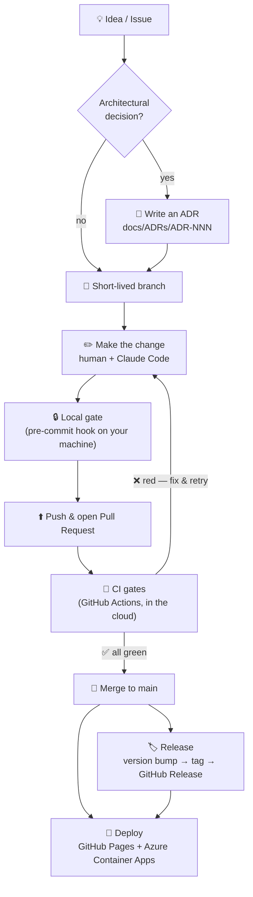

# Software Development Life Cycle (SDLC)

- **Project:** Minimum Viable Health Dataspace v2 (EHDS reference implementation)
- **Audience:** contributors, reviewers, and anyone curious how a one-person,
  AI-assisted project keeps a regulated-domain codebase shippable.
- **Last updated:** 2026-06-01
- **Maintainer:** Matthias (`@ma3u`)

> Companion document: **[Deterministic Agentic AI Development with Claude
> Code](./AGENTIC-DEVELOPMENT-WITH-CLAUDE-CODE.md)** — how the AI author plugs
> into the lifecycle described here.

> 🟢 **Not a software engineer?** Read the plain-language version first:
> **[How We Build This Software](./SDLC-explained.md)**.

> **SDLC** = _Software Development Life Cycle_ — the full process of planning,
> building, testing, releasing, and operating software.

<details>
<summary><b>Acronyms used in this document</b> (click to expand)</summary>

| Acronym             | Expansion                                                                               |
| ------------------- | --------------------------------------------------------------------------------------- |
| **CI/CD**           | Continuous Integration / Continuous Delivery — automated build-test-publish pipeline    |
| **PR**              | Pull Request — a proposed change, reviewed before it is merged                          |
| **ADR**             | Architecture Decision Record — a short written note capturing a decision and its reason |
| **LLM**             | Large Language Model — the kind of AI behind Claude Code                                |
| **SBOM**            | Software Bill of Materials — a machine-readable list of every third-party component     |
| **CVE**             | Common Vulnerabilities and Exposures — a public catalogue of known security flaws       |
| **WCAG**            | Web Content Accessibility Guidelines — accessibility (a11y) standard                    |
| **OWASP**           | Open Worldwide Application Security Project — web-security best-practice body           |
| **BSI C5**          | Germany's BSI Cloud Computing Compliance Criteria Catalogue                             |
| **EU CRA**          | EU Cyber Resilience Act                                                                 |
| **EHDS**            | European Health Data Space — the EU health-data regulation this project models          |
| **DSP / DCP / TCK** | Dataspace Protocol / Decentralised Claims Protocol / Technology Compatibility Kit       |
| **MSW**             | Mock Service Worker — intercepts network calls in tests                                 |
| **SARIF**           | Static Analysis Results Interchange Format — how scanners report findings to GitHub     |
| **SLSA**            | Supply-chain Levels for Software Artifacts — a build-provenance standard                |

</details>

---

## 1. Philosophy: deterministic tooling around a non-deterministic author

On my day job I run an SDLC for teams of **10–30 developers**. The non-negotiable
lesson from those teams is this:

> **The author proposes; deterministic tooling disposes.**

It does not matter whether the author is a senior engineer, a junior, or an AI
agent — humans and Large Language Models (LLMs) are both _non-deterministic_ (ask
the same question twice, get two different answers). You make the _output_
trustworthy by wrapping the author in **deterministic, repeatable, automated
gates**: code formatters, [linters](https://eslint.org/) (tools that flag
likely mistakes), type-checkers, tests, security scanners, and a **Continuous
Integration / Continuous Delivery (CI/CD)** pipeline that runs the same way every
time, for everyone.

This project is currently **a team of one** (me) plus an AI pair-programmer
([Claude Code](./AGENTIC-DEVELOPMENT-WITH-CLAUDE-CODE.md)). So I run a
**pragmatic, partial SDLC**: I keep every deterministic gate a large team would
have, and I consciously collapse the _people-coordination_ ceremonies (mandatory
peer review, sprint rituals, release boards) that only make sense with more
people. Section 10 is explicit about what is collapsed and why, and Section 11 is
the outlook for re-introducing the parts that will matter as soon as a second
contributor joins.

The deterministic backbone is **GitHub**: Issues, Pull Requests (PRs),
[GitHub Actions](https://docs.github.com/actions) (CI/CD), GitHub Pages, GitHub
Releases, and Architecture Decision Records (ADRs) checked into the repo.

### Why this rigour matters

This is a reference implementation for the **European Health Data Space
(EHDS)** — a regulated domain where health data, patient rights, and audit
obligations are in scope. In that world _how_ you build is part of _whether you
can be trusted_. Concretely, the gates below buy five things:

1. **Trust & safety.** A bug in health-data software can leak data or mislead a
   clinician. Automated checks catch whole classes of mistakes _before_ they ship.
2. **Auditability.** Every change is permanently logged with author, time, and
   reason — you can prove what happened, which regulators and hospitals expect.
3. **Repeatability.** The same checks run every time, so quality does not depend
   on who was on shift or whether they were having a good day.
4. **Cheap mistakes.** A problem caught by a local check costs seconds; the same
   problem caught in production costs hours and erodes trust. Quality gates move
   the cost of error as early (and cheap) as possible.
5. **Safe AI assistance.** Because an AI writes much of the code, the gates are
   what let it move fast _without_ being able to break things unnoticed (see the
   [companion document](./AGENTIC-DEVELOPMENT-WITH-CLAUDE-CODE.md)).

---

## 2. The lifecycle at a glance

Every change flows top-to-bottom through the same path. The **human/AI judgement**
lives only at the top (deciding _what_ and _why_); everything below the dashed
line is **automated and reproducible**.



**Step by step:**

1. **Idea / Issue** — work starts as a GitHub _Issue_ (a public to-do card).
2. **Architectural?** — if the change involves a hard-to-reverse or cross-cutting
   decision, its reasoning is recorded first as an **ADR** (Section 3).
3. **Short-lived branch** — the change is drafted on a side copy of the code, never
   directly on the live `main` version.
4. **Make the change** — a human and/or Claude Code edits the code (Section 4).
5. **Local gate** — the moment you commit, the **pre-commit hook** runs fast
   checks on your own machine (Section 5).
6. **Push & open a Pull Request (PR)** — the change is published to a branch and
   proposed for review as a side-by-side "before/after".
7. **CI gates** — **GitHub Actions** runs the full battery of checks on neutral
   cloud machines, the same way for everyone (Section 6).
8. **Merge to main** — only if everything is green. Red means fix and retry.
9. **Release & Deploy** — a version bump produces a tagged GitHub Release, and the
   public demo + live system rebuild themselves automatically (Sections 6–7).

> 💡 _Tip: the diagram renders larger if you open this file on GitHub and click
> it; the numbered list above is the authoritative description either way._

---

## 3. Plan before you build: Issues, ADRs, and a token-efficient plan

Before any significant change, the workflow (encoded in [`CLAUDE.md`](https://github.com/ma3u/MinimumViableHealthDataspacev2/blob/main/CLAUDE.md)) is:

1. **Check existing ADRs.** Architecture Decision Records live in
   `docs/ADRs/ADR-NNN-slug.md` — **27 ADRs** today (ADR-001 … ADR-027), each a
   short, dated, _Status / Context / Decision / Consequences_ record. You start
   from the ADR index table, then open only the ADR(s) relevant to the task.
2. **Consult the planning index** at [`docs/planning-health-dataspace-v2.md`](https://github.com/ma3u/MinimumViableHealthDataspacev2/blob/main/docs/planning-health-dataspace-v2.md) — a
   slim index (issue table, phase-status summary, ADR index, links). Per-phase
   detail lives in `docs/planning/roadmap-phases-*.md` archives.
3. **Check GitHub Issues** for related tracking:
   `gh issue list --repo ma3u/MinimumViableHealthDataspacev2`.
4. **Write a new ADR** for any architectural decision, and link it in the
   planning index's ADR table.

**Why it matters:** an ADR is the project's long-term memory. It answers the
question every newcomer (and the AI, every session) eventually asks — _"why was it
done this way?"_ — without anyone having to remember. This is also the easiest
place for a non-coder to contribute: you can read and question a decision without
reading a line of code.

### Why the plan is split into an index + archives

This is itself an ADR — **[ADR-026: Token-Efficient Planning &
ADR Structure](./ADRs/ADR-026-token-efficient-planning-structure.md)**. The
planning document had grown to **72,000 tokens (288 KB)** — too large to load
into an AI agent's context alongside working files. The rule now:

> Keep any routinely-loaded document under **~15K tokens (~60 KB)**. The index
> stays slim; detail moves into phase archives, loaded only when that phase is
> being worked.

This is a _human_ readability win and an _AI_ effectiveness win — a smaller,
sharper context produces better reasoning.

### When to write an ADR

Write one when a decision is **expensive to reverse** or **cross-cutting**:
database split, protocol choice, deployment topology, testing strategy, cost
trade-offs. Examples in the corpus: ADR-001 (PostgreSQL + Neo4j split), ADR-008
(testing strategy), ADR-016/023/027 (off-hours scale-down cost decisions),
ADR-022/024 (EDC connector cost vs. function).

---

## 4. Branching, commits, and pull requests

- **Trunk-based.** `main` is the trunk and is always deployable. Work happens on
  **short-lived branches** and merges back via a **Pull Request (PR)** — a
  proposed change shown as before/after, open for review (recent examples: #52,
  #53, #54). The static demo and the Azure live demo both build from `main`.
- **[Conventional Commits](https://www.conventionalcommits.org/)** with scopes —
  a standard naming convention for commit messages. Real history:

  - `fix(finops): scale the EDC stack off-hours — close ADR-024/023 cost gap (#54)`
  - `feat(neo4j+ui): add 9th tenant — Health Dataspace Operations (EDC_ADMIN slot)`
  - `docs(adr): ADR-026 — token-efficient planning & ADR structure`

  The `type(scope): subject (#PR)` shape makes history machine-readable and
  feeds automated release notes (Section 7).

- **AI attribution.** Commits produced with the AI carry a
  `Co-Authored-By: Claude …` trailer so the provenance of agent-assisted work is
  always traceable in `git log` — important in a regulated domain.
- **PRs reference Issues and ADRs.** A PR description links the Issue it closes
  and any ADR it implements, so the _why_ is one click from the _what_.

> ⚠️ Today, the Conventional-Commit format is followed by **convention, not
> enforced** by a commit-message hook. Enforcing it is an outlook item (Section 11).

---

## 5. Local quality gate — the pre-commit hook

The first deterministic gate runs **on your machine, the moment you create a
commit**. It is configured in **[`.pre-commit-config.yaml`](https://github.com/ma3u/MinimumViableHealthDataspacev2/blob/main/.pre-commit-config.yaml)**
and managed by the [pre-commit framework](https://pre-commit.com/) (install it
once per clone with `pre-commit install`, which wires it into Git's local
`.git/hooks/` — those generated hooks are _not_ committed, so the config file is
the source of truth).

It runs **fast** checks only — the heavy, slow suite runs in CI (Section 6).
Several checks are **scoped by file type**, so they skip automatically when a
commit doesn't touch the relevant files (e.g. a docs-only commit skips the
TypeScript and Vitest hooks).

| Group            | Hook(s)                                                                                                                                                                | What it does & why it matters                                                                                                       |
| ---------------- | ---------------------------------------------------------------------------------------------------------------------------------------------------------------------- | ----------------------------------------------------------------------------------------------------------------------------------- |
| **Formatting**   | [Prettier](https://prettier.io/)                                                                                                                                       | Auto-formats staged `*.md`, `*.yaml`, `*.json`, `*.ts(x)`, `*.js(x)` and re-stages them — so style never derails a review.          |
| **Lint**         | [ESLint](https://eslint.org/) (`next lint --max-warnings 55`)                                                                                                          | Flags likely bugs and bad patterns in TypeScript/React; `--max-warnings 55` is the project's warning budget.                        |
| **Type-check**   | [TypeScript `tsc`](https://www.typescriptlang.org/) ([`tsconfig.build.json`](https://github.com/ma3u/MinimumViableHealthDataspacev2/blob/main/ui/tsconfig.build.json)) | Confirms the typed pieces still fit together (strict mode; excludes tests). Catches whole classes of runtime errors at author time. |
| **Tests**        | [Vitest](https://vitest.dev/) (`vitest run --bail 1`)                                                                                                                  | Runs the unit test suite when UI source changes, stopping at the first failure — so you can't commit code that breaks a known case. |
| **Secrets**      | [gitleaks](https://github.com/gitleaks/gitleaks) + private-key detector                                                                                                | Blocks accidentally-staged passwords, tokens, and private keys — the cheapest possible place to stop a credential leak.             |
| **Shell/Docker** | [shellcheck](https://www.shellcheck.net/), [hadolint](https://github.com/hadolint/hadolint)                                                                            | Lints Bash scripts and Dockerfiles for unsafe or fragile patterns.                                                                  |
| **Dependencies** | [`npm audit`](https://docs.npmjs.com/cli/v10/commands/npm-audit) (HIGH+)                                                                                               | Fails on known HIGH/CRITICAL vulnerabilities in third-party packages.                                                               |
| **File hygiene** | trailing-whitespace, end-of-file, valid YAML/JSON, no large files, no merge-conflict markers, case/symlinks                                                            | Standard sanity checks that keep the repo clean and prevent common foot-guns.                                                       |
| **Docs**         | Markdown broken-link check, "no screenshot images in doc pages"                                                                                                        | Keeps documentation links working and enforces a project doc convention.                                                            |

Because Prettier **re-writes and re-stages** files, a commit can require a
`git add` + retry — that is by design, not a bug.

> **Bypass policy:** `git commit --no-verify` is reserved for genuine
> emergencies only. The CI gate (next section) re-runs the same checks, so a
> bypass buys you nothing on `main`.

---

## 6. CI gates — GitHub Actions

**CI** stands for **Continuous Integration**: every time code is pushed, an
automated pipeline rebuilds it from scratch on a clean cloud machine and runs the
full set of checks. A **"gate"** is a check that can **block** a change from being
merged if it fails. Because CI runs on neutral [GitHub Actions](https://docs.github.com/actions)
runners — not on anyone's laptop — it is the **authoritative, deterministic
verdict** on whether a change is safe. The pipeline is split into several
workflows by purpose.

### 6.1 Test Suite — [`.github/workflows/test.yml`](https://github.com/ma3u/MinimumViableHealthDataspacev2/blob/main/.github/workflows/test.yml)

Triggers: **push to any branch** and **pull request to `main`** (scoped to
`ui/**` and `services/neo4j-proxy/**` paths), plus manual dispatch.

| Job                                                                                          | What it checks                                                                                                  | Runs on                  |
| -------------------------------------------------------------------------------------------- | --------------------------------------------------------------------------------------------------------------- | ------------------------ |
| **UI Tests ([Vitest](https://vitest.dev/))**                                                 | unit + integration tests + coverage                                                                             | push & PR                |
| **Neo4j Proxy Tests (Vitest)**                                                               | proxy service unit tests + coverage                                                                             | push & PR                |
| **Lint ([ESLint](https://eslint.org/))**                                                     | `npm run lint`                                                                                                  | push & PR                |
| **Secret Scan ([gitleaks](https://github.com/gitleaks/gitleaks))**                           | full-history secret detection — _blocks_                                                                        | push & PR                |
| **Dependency Audit ([npm audit](https://docs.npmjs.com/cli/v10/commands/npm-audit))**        | `--audit-level=high` (UI blocks; proxy reports)                                                                 | push & PR                |
| **SBOM ([CycloneDX](https://cyclonedx.org/))**                                               | a Software Bill of Materials (ingredients list of every dependency), spec 1.5                                   | push & PR                |
| **Licence Compliance**                                                                       | confirms every dependency uses an approved open-source licence                                                  | push & PR                |
| **Security Scan ([Trivy](https://trivy.dev/))**                                              | vulnerabilities / secrets / misconfigurations → SARIF to the GitHub Security tab                                | push & PR                |
| **K8s Posture ([Kubescape](https://kubescape.io/))**                                         | scans [`k8s/`](https://github.com/ma3u/MinimumViableHealthDataspacev2/tree/main/k8s) against NSA/CIS benchmarks | push & PR                |
| **Performance Budget ([Lighthouse](https://developer.chrome.com/docs/lighthouse/overview))** | Core Web Vitals (page-speed) budgets                                                                            | **main / dispatch only** |
| **E2E ([Playwright](https://playwright.dev/)) + WCAG + pentest**                             | full browser journeys, accessibility (WCAG), OWASP/BSI security checks                                          | **main / dispatch only** |

**What each gate protects against, in one line:** tests → behaviour regressions ·
lint/type-check → bugs and bad patterns · secret scan → leaked credentials ·
dependency audit + Trivy → known vulnerabilities (CVEs) · SBOM + licence →
supply-chain transparency and legal compliance · Kubescape → insecure Kubernetes
config · Lighthouse → slow pages · E2E/WCAG/pentest → broken user journeys,
inaccessible UI, and common web-attack surfaces.

Two deliberate design choices:

- **Fast PR feedback.** The expensive jobs (Lighthouse, Playwright E2E) are
  gated to `main`/dispatch, so a PR gets quick deterministic feedback from the
  unit/lint/security tier. Depth runs after merge.
- **Hard gates vs. reporting.** Unit tests, lint, and the secret scan _block_ a
  merge. Some scanners (Trivy findings, the WCAG colour-contrast ratchet, the
  pentest suite that needs live services) currently run as **report-only**
  (`continue-on-error`) and publish to the GitHub **Security** tab / step
  summaries. Driving those to _blocking_ is an outlook item.

### 6.2 Supply-chain hardening (a concrete example)

This is a regulated-domain reference implementation, so the pipeline is itself
treated as an attack surface — a good illustration of "deterministic" meaning
_pinned and verified_:

- Security tools ([gitleaks](https://github.com/gitleaks/gitleaks),
  [Trivy](https://trivy.dev/), [Kubescape](https://kubescape.io/)) are installed
  as **official binaries pinned by version and verified by SHA-256 checksum**, not
  via floating GitHub Actions.
- After the **March 2026 `trivy-action` supply-chain compromise**
  (CVE-2026-33634), the pipeline explicitly **avoids** `aquasecurity/trivy-action`
  / `setup-trivy` and installs Trivy `0.69.3` (last clean version) directly. The
  reasoning is documented inline in [`test.yml`](https://github.com/ma3u/MinimumViableHealthDataspacev2/blob/main/.github/workflows/test.yml) so the next person — or the next
  AI session — does not silently re-introduce the compromised action.

The security/compliance jobs map to recognisable controls: **BSI C5**
(Germany's cloud-security catalogue), **OWASP** (web-security best practice),
**EU CRA** Art. 13 (the Cyber Resilience Act's SBOM requirement), and **EHDS**
Art. 50 / SIMPL-Open.

### 6.3 Protocol Compliance — [`.github/workflows/compliance.yml`](https://github.com/ma3u/MinimumViableHealthDataspacev2/blob/main/.github/workflows/compliance.yml)

Triggers: **push to `main`** (on protocol-relevant paths), **weekly (Mon 06:00
UTC)**, and manual dispatch. Runs the **DSP 2025-1 TCK** (Dataspace Protocol
Technology Compatibility Kit), **DCP v1.0** (Decentralised Claims Protocol), and
**EHDS domain** suites against an ephemeral full stack spun up in CI. These are
report-heavy and currently `continue-on-error` — the weekly cadence catches
protocol drift without blocking day-to-day PRs.

### 6.4 GitHub Pages (static demo) — [`.github/workflows/pages.yml`](https://github.com/ma3u/MinimumViableHealthDataspacev2/blob/main/.github/workflows/pages.yml)

Triggers: **push to `main`**. This is the public demo deploy and a nice example
of an end-to-end deterministic build:

1. Spin up a **Neo4j 5** database container and **seed** it from
   [`neo4j/init-schema.cypher`](https://github.com/ma3u/MinimumViableHealthDataspacev2/blob/main/neo4j/init-schema.cypher) + [`insert-synthetic-schema-data.cypher`](https://github.com/ma3u/MinimumViableHealthDataspacev2/blob/main/neo4j/insert-synthetic-schema-data.cypher).
2. Build the Next.js app, **refresh the mock JSON fixtures** from the live API
   ([`scripts/refresh-mocks.sh`](https://github.com/ma3u/MinimumViableHealthDataspacev2/blob/main/scripts/refresh-mocks.sh)) so the static fixtures match the real shapes.
3. Run Vitest + Playwright + WCAG + pentest (report-only).
4. **Disable API routes** (`mv src/app/api …`) and build the **static export**
   (`NEXT_PUBLIC_STATIC_EXPORT=true`).
5. Publish to **GitHub Pages**.

> 🔑 **Gotcha:** in the static build there are _no_ server API routes — feature
> pages fall back to `ui/public/mock/*.json`. Mock fixtures must match the live
> API response shape exactly; CI regenerates them so they cannot drift.

### 6.5 Release — [`.github/workflows/release.yml`](https://github.com/ma3u/MinimumViableHealthDataspacev2/blob/main/.github/workflows/release.yml)

Triggers: **push to `main` that changes [`ui/package.json`](https://github.com/ma3u/MinimumViableHealthDataspacev2/blob/main/ui/package.json)**. It resolves the
version, creates the `vX.Y.Z` tag if missing, **composes release notes from the
commit log since the previous tag**, and publishes a **GitHub Release**. It is
idempotent (skips if the release already exists) — built specifically to stop the
"tag pushed without a release entry" drift that bit an earlier version bump.

### 6.6 Operations tier

Beyond build/test, a family of workflows runs the **live Azure demo**: Azure
Container Apps deploy, weekly demo reset (ADR-014), off-hours scale-down for cost
(ADR-016/023/027), Keycloak custom domain, EDC participant seeding, and Bruno API
smoke tests. They are operational automation, not part of the merge gate, but
they follow the same principle: **every environment change is a versioned,
re-runnable workflow**, never a manual click.

---

## 7. Releasing & versioning

- **Source of truth:** the `version` field in [`ui/package.json`](https://github.com/ma3u/MinimumViableHealthDataspacev2/blob/main/ui/package.json).
- **Mechanism:** bump it in a PR → on merge, the Release workflow tags
  `vX.Y.Z` and publishes notes generated from Conventional-Commit subjects.
- **Changelog:** derived from `git log` (which is _why_ commit hygiene matters).

Moving to **fully automated version bumps** (release-please / semantic-release)
is an outlook item — today the human decides the semantic-version bump; the
tooling does the tagging and publishing.

---

## 8. Testing strategy

Codified in **[ADR-008](./ADRs/ADR-008-testing-strategy.md)** as a four-tier
pyramid:

| Tier            | Framework                             | Scope                                                                                            | When it runs              |
| --------------- | ------------------------------------- | ------------------------------------------------------------------------------------------------ | ------------------------- |
| **Unit**        | [Vitest](https://vitest.dev/)         | pure functions, React components, API handlers mocked with `vi.mock()` — no live services, <30 s | every push (+ pre-commit) |
| **Integration** | Vitest + [MSW](https://mswjs.io/)     | API routes with mocked Neo4j responses; validates request/response shapes                        | every push                |
| **E2E**         | [Playwright](https://playwright.dev/) | numbered browser journeys (`J001`+) across 35 spec files                                         | `main` + dispatch         |
| **Compliance**  | custom (DSP TCK / DCP / EHDS)         | protocol conformance                                                                             | weekly + protocol changes |

**Why a pyramid?** Fast, cheap unit tests catch most mistakes in seconds; slower,
broader end-to-end (E2E) tests confirm real user journeys still work. You want
many of the former and a focused set of the latter.

📊 **Live test reports** (regenerated by CI and published with the demo):

- **[Unit & integration coverage report](./test-coverage-report.md)** — Vitest
  coverage across the codebase.
- **[End-to-end (E2E) test report](./e2e-test-report.md)** — Playwright journey
  results.
- **[Quality Gates reference](./quality-gates.md)** — the full list of CI quality
  standards (lint, type-check, coverage, security).

Conventions ([`.claude/rules/testing.md`](https://github.com/ma3u/MinimumViableHealthDataspacev2/blob/main/.claude/rules/testing.md)): unit tests in [`ui/__tests__/unit/`](https://github.com/ma3u/MinimumViableHealthDataspacev2/tree/main/ui/__tests__/unit)
mirror [`ui/src/`](https://github.com/ma3u/MinimumViableHealthDataspacev2/tree/main/ui/src); E2E specs in `ui/__tests__/e2e/journeys/NN-*.spec.ts`; tests
assert on visible text / aria-labels / `data-testid`, never CSS classes; do not
mock the Neo4j driver — use the JSON fixtures under [`ui/public/mock/`](https://github.com/ma3u/MinimumViableHealthDataspacev2/tree/main/ui/public/mock).

> Coverage is **collected and published** on every run but **thresholds are not
> yet enforced** (aim: critical-path coverage). Enforcing minimums is an outlook
> item.

---

## 9. Environments

| Environment              | How                                                                                                                                                                                                         | Purpose                      |
| ------------------------ | ----------------------------------------------------------------------------------------------------------------------------------------------------------------------------------------------------------- | ---------------------------- |
| **Local (minimal)**      | `docker compose up -d` (Neo4j + UI)                                                                                                                                                                         | day-to-day dev               |
| **Local (full JAD)**     | `docker compose -f docker-compose.yml -f docker-compose.jad.yml up -d` + [`./jad/seed-all.sh`](https://github.com/ma3u/MinimumViableHealthDataspacev2/blob/main/jad/seed-all.sh) (phases 1–7, strict order) | full 19-service stack        |
| **GitHub Pages**         | [`pages.yml`](https://github.com/ma3u/MinimumViableHealthDataspacev2/blob/main/.github/workflows/pages.yml) static export                                                                                   | public, zero-backend demo    |
| **Azure Container Apps** | [`deploy-azure.yml`](https://github.com/ma3u/MinimumViableHealthDataspacev2/blob/main/.github/workflows/deploy-azure.yml) + ops workflows                                                                   | live demo with real services |

---

## 10. The single-maintainer adaptation (what is collapsed, and why)

| A 10–30 dev team has…                      | This project does instead                                                               | Why it's acceptable _for now_                                                                       |
| ------------------------------------------ | --------------------------------------------------------------------------------------- | --------------------------------------------------------------------------------------------------- |
| Mandatory peer review on every PR          | **AI review** (`/review`, specialist sub-agents) + **CI gates**; maintainer self-merges | Deterministic gates catch the regressions a second human would; the AI provides a first-pass review |
| Branch-protection blocking merge on red CI | Maintainer discipline (don't merge red)                                                 | One person, one intent; **outlook: enforce**                                                        |
| Dedicated QA / release manager             | The testing pyramid + the Release workflow                                              | Automation replaces the role, not the rigour                                                        |
| Sprint/ceremony overhead                   | Issues + ADRs + planning index                                                          | Lightweight, async, written-down                                                                    |

The point is to keep **rigour** while shedding **coordination cost**. The moment
a second contributor joins, the Section 11 items move from "nice" to "required".

---

## 11. Outlook — next steps

Ordered roughly by leverage. These are the gates a growing team would expect, and
the natural maturation path for this repo:

1. **Branch protection on `main`** — require the blocking CI jobs to be green and
   the branch up to date before merge. (Highest leverage: makes the gate
   non-bypassable, including for AI commits.)
2. **Enforce Conventional Commits** — a `commitlint` + commit-message hook so the
   format that drives release notes can't drift.
3. **Guarantee the local gate is installed** — make `pre-commit install` part of
   onboarding (and add a pre-push full-suite + coverage run) so every clone gets
   the same checks, not just documented behaviour.
4. **Enforce coverage thresholds** — start with critical paths, ratchet up.
5. **Make report-only scanners blocking** — drive the WCAG contrast ratchet
   (Issue #25) to zero and the pentest suite to green, then drop
   `continue-on-error`.
6. **Automated versioning** — release-please / semantic-release for changelog +
   semantic version from commit history.
7. **Governance files** — `CONTRIBUTING.md`, `CODEOWNERS`, PR template, Issue
   templates; **Dependabot/Renovate** for dependency PRs.
8. **Make compliance suites blocking** once stable, and add **release provenance /
   SLSA attestation** to releases.
9. **Promote the compliance + Lighthouse signals into PR status** so quality is
   visible before merge, not only after.

---

## 12. How to contribute

### If you write code

```bash
gh issue list --repo ma3u/MinimumViableHealthDataspacev2   # pick / file an Issue
git switch -c fix/short-slug                                # short-lived branch
# … make the change (with or without Claude Code) …
git commit -m "fix(scope): subject (#NN)"                  # pre-commit gate runs
git push -u origin HEAD && gh pr create                     # CI gate runs
# … merge once CI is green …
```

For anything architectural, **open an ADR first** (`docs/ADRs/ADR-NNN-slug.md`)
and link it from the planning index.

### If you work at the conceptual / governance / architecture layer

You do **not** need to touch code to have outsized impact here — arguably the
opposite. The highest-value contributions to an AI-assisted project are **better
specifications**:

- **File Issues** that pin down a requirement, a sequence diagram, a governance
  rule, or a documentation gap precisely.
- **Propose or correct ADRs** — these are exactly the durable specs the AI reads
  every session, so a sharper ADR directly improves every future AI change.
- **Review user-facing docs, diagrams, and journeys** and describe what's wrong
  conceptually.

That feedback becomes the **input** that makes the next AI iteration better — the
loop is described in the companion document, [Deterministic Agentic AI
Development with Claude Code](./AGENTIC-DEVELOPMENT-WITH-CLAUDE-CODE.md#8-the-human-in-the-loop-the-conceptual-review-flywheel).

---

## References

- [`CLAUDE.md`](https://github.com/ma3u/MinimumViableHealthDataspacev2/blob/main/CLAUDE.md) — the project's operating manual (build commands, architecture, conventions, gotchas).
- [`.pre-commit-config.yaml`](https://github.com/ma3u/MinimumViableHealthDataspacev2/blob/main/.pre-commit-config.yaml) — the local quality gate (Section 5).
- [`.claude/rules/`](https://github.com/ma3u/MinimumViableHealthDataspacev2/tree/main/.claude/rules) — [`code-style.md`](https://github.com/ma3u/MinimumViableHealthDataspacev2/blob/main/.claude/rules/code-style.md), [`testing.md`](https://github.com/ma3u/MinimumViableHealthDataspacev2/blob/main/.claude/rules/testing.md), [`api-conventions.md`](https://github.com/ma3u/MinimumViableHealthDataspacev2/blob/main/.claude/rules/api-conventions.md).
- [ADR-008 — Testing Strategy](./ADRs/ADR-008-testing-strategy.md) · [ADR-026 — Token-Efficient Planning & ADR Structure](./ADRs/ADR-026-token-efficient-planning-structure.md)
- [Quality Gates](./quality-gates.md) · [Unit coverage report](./test-coverage-report.md) · [E2E test report](./e2e-test-report.md)
- [`docs/planning-health-dataspace-v2.md`](https://github.com/ma3u/MinimumViableHealthDataspacev2/blob/main/docs/planning-health-dataspace-v2.md) — the slim planning index.
- Companion: [Deterministic Agentic AI Development with Claude Code](./AGENTIC-DEVELOPMENT-WITH-CLAUDE-CODE.md)
