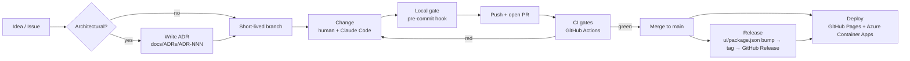

# Software Development Life Cycle (SDLC)

**Project:** Minimum Viable Health Dataspace v2 (EHDS reference implementation)
**Audience:** contributors, reviewers, and anyone curious how a one-person,
AI-assisted project keeps a regulated-domain codebase shippable.
**Last updated:** 2026-05-31 · **Maintainer:** Matthias (`@ma3u`)

> Companion document: **[Deterministic Agentic AI Development with Claude
> Code](./AGENTIC-DEVELOPMENT-WITH-CLAUDE-CODE.md)** — how the AI author plugs
> into the lifecycle described here.

---

## 1. Philosophy: deterministic tooling around a non-deterministic author

On my day job I run an SDLC for teams of **10–30 developers**. The non-negotiable
lesson from those teams is this:

> **The author proposes; deterministic tooling disposes.**

It does not matter whether the author is a senior engineer, a junior, or an AI
agent — humans and LLMs are both _non-deterministic_. You make the _output_
trustworthy by wrapping the author in **deterministic, repeatable, automated
gates**: linters, type-checkers, tests, security scanners, and a CI/CD pipeline
that runs the same way every time, for everyone.

This project is currently **a team of one** (me) plus an AI pair-programmer
([Claude Code](./AGENTIC-DEVELOPMENT-WITH-CLAUDE-CODE.md)). So I run a
**pragmatic, partial SDLC**: I keep every deterministic gate a large team would
have, and I consciously collapse the _people-coordination_ ceremonies (mandatory
peer review, sprint rituals, release boards) that only make sense with more
people. Section 10 is explicit about what is collapsed and why, and Section 11 is
the outlook for re-introducing the parts that will matter as soon as a second
contributor joins.

The deterministic backbone is **GitHub**: Issues, Pull Requests, GitHub Actions
(CI/CD), GitHub Pages, GitHub Releases, and Architecture Decision Records (ADRs)
checked into the repo.

---

## 2. The lifecycle at a glance



Each arrow that crosses a machine boundary is **automated and reproducible**.
The human/AI judgement lives in the _Idea → ADR → Change_ segment; everything
downstream is deterministic.

---

## 3. Plan before you build: Issues, ADRs, and a token-efficient plan

Before any significant change, the workflow (encoded in `CLAUDE.md`) is:

1. **Check existing ADRs.** Architectural decisions live in
   `docs/ADRs/ADR-NNN-slug.md` — **27 ADRs** today (ADR-001 … ADR-027), each a
   short, dated, _Status / Context / Decision / Consequences_ record. You start
   from the ADR index table, then open only the ADR(s) relevant to the task.
2. **Consult the planning index** at `docs/planning-health-dataspace-v2.md` — a
   slim index (issue table, phase-status summary, ADR index, links). Per-phase
   detail lives in `docs/planning/roadmap-phases-*.md` archives.
3. **Check GitHub Issues** for related tracking:
   `gh issue list --repo ma3u/MinimumViableHealthDataspacev2`.
4. **Write a new ADR** for any architectural decision, and link it in the
   planning index's ADR table.

### Why the plan is split into an index + archives

This is itself an ADR — **[ADR-026: Token-Efficient Planning &
ADR Structure](./ADRs/ADR-026-token-efficient-planning-structure.md)**. The
planning document had grown to **72,000 tokens (288 KB)** — too large to load
into an AI agent's context alongside working files. The rule now:

> Keep any routinely-loaded document under **~15K tokens (~60 KB)**. The index
> stays slim; detail moves into phase archives, loaded only when that phase is
> being worked.

This is a _human_ readability win and an _AI_ effectiveness win — a smaller,
sharper context produces better reasoning. See the companion document for how
this feeds the agent.

### When to write an ADR

Write one when a decision is **expensive to reverse** or **cross-cutting**:
database split, protocol choice, deployment topology, testing strategy, cost
trade-offs. Examples in the corpus: ADR-001 (PostgreSQL + Neo4j split), ADR-008
(testing strategy), ADR-016/023/027 (off-hours scale-down cost decisions),
ADR-022/024 (EDC connector cost vs. function). ADRs are the project's long-term
memory — for humans _and_ for the AI, which reads them to stay consistent.

---

## 4. Branching, commits, and pull requests

- **Trunk-based.** `main` is the trunk and is always deployable. Work happens on
  **short-lived branches** and merges back via **Pull Request** (recent
  examples: #52, #53, #54). The static demo and the Azure live demo both build
  from `main`.
- **Conventional Commits** with scopes. Real history:

  - `fix(finops): scale the EDC stack off-hours — close ADR-024/023 cost gap (#54)`
  - `feat(neo4j+ui): add 9th tenant — Health Dataspace Operations (EDC_ADMIN slot)`
  - `docs(adr): ADR-026 — token-efficient planning & ADR structure`

  The `type(scope): subject (#PR)` shape makes history machine-readable and
  feeds automated release notes (Section 7).

- **AI attribution.** Commits produced with the AI carry a
  `Co-Authored-By: Claude …` trailer so the provenance of agent-assisted work is
  always traceable in `git log` — important in a regulated domain.
- **PRs reference Issues and ADRs.** A PR description links the Issue it closes
  and any ADR it implements, so the _why_ is one click from the _what_.

> ⚠️ Today, the Conventional-Commit format is followed by **convention, not
> enforced** by a commit-msg hook. Enforcing it is an outlook item (Section 11).

---

## 5. Local quality gate — the pre-commit hook

The first deterministic gate runs **on your machine, before a commit is
created** (`.git/hooks/pre-commit`, `core.hooksPath` → `.git/hooks`). It runs
fast checks only — the heavy suite runs in CI:

| Step | Tool            | What it does                                                                                                    |
| ---- | --------------- | --------------------------------------------------------------------------------------------------------------- |
| 1    | **Prettier**    | Auto-formats staged `*.md`, `*.yaml`, `*.json`, `*.ts(x)`, `*.js(x)` and re-stages them.                        |
| 2    | **ESLint**      | Lints staged TS/TSX with `--max-warnings 55` — the project's ESLint warning budget (documented in `CLAUDE.md`). |
| 3    | **tsc**         | Type-checks the UI with `tsconfig.build.json` (strict mode, excludes tests).                                    |
| 4    | **Secret scan** | Blocks obvious secret patterns (`api_key`, `token`, `private_key`, …) in staged content.                        |

Because Prettier **re-writes and re-stages** files, a commit can require a
`git add` + retry — that is by design, not a bug.

> **Bypass policy:** `git commit --no-verify` is reserved for genuine
> emergencies only. The CI gate (next section) re-runs the same checks, so a
> bypass buys you nothing on `main`.

The unit/integration test suite runs in CI on **every push** (Section 6); the
documented `pre-push` hook (full Vitest run) is part of the standard and is an
outlook item to ship to every contributor's clone uniformly (Section 11).

---

## 6. CI gates — GitHub Actions

CI is the **authoritative, deterministic gate**. It runs the same way for every
push and PR, independent of anyone's laptop. The pipeline is split into several
workflows by purpose.

### 6.1 Test Suite — `.github/workflows/test.yml`

Triggers: **push to any branch** and **pull request to `main`** (scoped to
`ui/**` and `services/neo4j-proxy/**` paths), plus manual dispatch.

| Job                                   | Gate                                            | Runs on                  |
| ------------------------------------- | ----------------------------------------------- | ------------------------ |
| **UI Tests (Vitest)**                 | unit + integration + coverage                   | push & PR                |
| **Neo4j Proxy Tests (Vitest)**        | proxy unit + coverage                           | push & PR                |
| **Lint (ESLint)**                     | `npm run lint`                                  | push & PR                |
| **Secret Scan (gitleaks)**            | full-history secret detection — _blocks_        | push & PR                |
| **Dependency Audit (npm audit)**      | `--audit-level=high` (UI blocks; proxy reports) | push & PR                |
| **SBOM (CycloneDX)**                  | software bill of materials, spec 1.5            | push & PR                |
| **Licence Compliance**                | allow-list of OSS licences only                 | push & PR                |
| **Trivy Security Scan**               | vuln/secret/misconfig → SARIF to Security tab   | push & PR                |
| **Kubescape K8s Posture**             | NSA (+ CIS) framework scan of `k8s/`            | push & PR                |
| **Performance Budget (Lighthouse)**   | Core Web Vitals budgets                         | **main / dispatch only** |
| **E2E (Playwright)** + WCAG + pentest | browser journeys, a11y, OWASP/BSI               | **main / dispatch only** |

Two deliberate design choices:

- **Fast PR feedback.** The expensive jobs (Lighthouse, Playwright E2E) are
  gated to `main`/dispatch, so a PR gets quick deterministic feedback from the
  unit/lint/security tier. Depth runs after merge.
- **Hard gates vs. reporting.** Unit tests, lint, and the secret scan _block_.
  Some scanners (Trivy findings, the WCAG ratchet, the pentest suite that needs
  live services) currently run as **report-only** (`continue-on-error`) and
  publish to the GitHub **Security** tab / step summaries. Driving those to
  _blocking_ is an outlook item.

### 6.2 Supply-chain hardening (a concrete example)

This is a regulated-domain reference implementation, so the pipeline is itself
treated as an attack surface — a good illustration of "deterministic" meaning
_pinned and verified_:

- Security tools (gitleaks, Trivy, kubescape) are installed as **official
  binaries pinned by version and verified by SHA-256 checksum**, not via
  floating GitHub Actions.
- After the **March 2026 `trivy-action` supply-chain compromise**
  (CVE-2026-33634), the pipeline explicitly **avoids** `aquasecurity/trivy-action`
  / `setup-trivy` and installs Trivy `0.69.3` (last clean version) directly. The
  reasoning is documented inline in `test.yml` so the next person — or the next
  AI session — does not silently re-introduce the compromised action.

The security/compliance jobs map to recognisable controls: **BSI C5**
(DEV-05/08, OPS-04), **OWASP** (A06), **EU CRA** Art. 13 (SBOM), and **EHDS**
Art. 50 / SIMPL-Open.

### 6.3 Protocol Compliance — `.github/workflows/compliance.yml`

Triggers: **push to `main`** (on protocol-relevant paths), **weekly (Mon 06:00
UTC)**, and manual dispatch. Runs the **DSP 2025-1 TCK**, **DCP v1.0**, and
**EHDS domain** suites against an ephemeral JAD stack spun up in CI. These are
report-heavy and currently `continue-on-error` — the weekly cadence catches
protocol drift without blocking day-to-day PRs.

### 6.4 GitHub Pages (static demo) — `.github/workflows/pages.yml`

Triggers: **push to `main`**. This is the public demo deploy and a nice example
of an end-to-end deterministic build:

1. Spin up a **Neo4j 5** service container and **seed** it from
   `neo4j/init-schema.cypher` + `insert-synthetic-schema-data.cypher`.
2. Build the Next.js app, **refresh the mock JSON fixtures** from the live API
   (`scripts/refresh-mocks.sh`) so the static fixtures match the real shapes.
3. Run Vitest + Playwright + WCAG + pentest (report-only).
4. **Disable API routes** (`mv src/app/api …`) and build the **static export**
   (`NEXT_PUBLIC_STATIC_EXPORT=true`).
5. Publish to **GitHub Pages**.

> 🔑 **Gotcha:** in the static build there are _no_ server API routes — feature
> pages fall back to `ui/public/mock/*.json`. Mock fixtures must match the live
> API response shape exactly; CI regenerates them so they cannot drift.

### 6.5 Release — `.github/workflows/release.yml`

Triggers: **push to `main` that changes `ui/package.json`**. It resolves the
version, creates the `vX.Y.Z` tag if missing, **composes release notes from the
commit log since the previous tag**, and publishes a **GitHub Release**. It is
idempotent (skips if the release already exists) — built specifically to stop the
"tag pushed without a release entry" drift that bit an earlier version bump.

### 6.6 Operations tier

Beyond build/test, a family of workflows runs the **live Azure demo**: Azure
Container Apps deploy, weekly demo reset (ADR-014), off-hours scale-down for cost
(ADR-016/023/027), Keycloak custom domain, EDC participant seeding, and Bruno API
smoke tests. They are operational automation, not part of the merge gate, but
they follow the same principle: **every environment change is a versioned,
re-runnable workflow**, never a manual click.

---

## 7. Releasing & versioning

- **Source of truth:** the `version` field in `ui/package.json`.
- **Mechanism:** bump it in a PR → on merge, the Release workflow tags
  `vX.Y.Z` and publishes notes generated from Conventional-Commit subjects.
- **Changelog:** derived from `git log` (which is _why_ commit hygiene matters).

Moving to **fully automated version bumps** (release-please / semantic-release)
is an outlook item — today the human decides the semver bump; the tooling does
the tagging and publishing.

---

## 8. Testing strategy

Codified in **[ADR-008](./ADRs/ADR-008-testing-strategy.md)** as a four-tier
pyramid:

| Tier            | Framework                     | Scope                                                                                            | When it runs                 |
| --------------- | ----------------------------- | ------------------------------------------------------------------------------------------------ | ---------------------------- |
| **Unit**        | Vitest                        | pure functions, React components, API handlers mocked with `vi.mock()` — no live services, <30 s | every push (+ pre-push hook) |
| **Integration** | Vitest + **MSW**              | API routes with mocked Neo4j responses; validates request/response shapes                        | every push                   |
| **E2E**         | Playwright                    | numbered browser journeys (`J001`+) across 35 spec files                                         | `main` + dispatch            |
| **Compliance**  | custom (DSP TCK / DCP / EHDS) | protocol conformance                                                                             | weekly + protocol changes    |

Conventions (`.claude/rules/testing.md`): unit tests in `ui/__tests__/unit/`
mirror `ui/src/`; E2E specs in `ui/__tests__/e2e/journeys/NN-*.spec.ts`; tests
assert on visible text / aria-labels / `data-testid`, never CSS classes; do not
mock the Neo4j driver — use the JSON fixtures under `ui/public/mock/`.

> Coverage is **collected and published** on every run but **thresholds are not
> yet enforced** (aim: critical-path coverage). Enforcing minimums is an outlook
> item.

---

## 9. Environments

| Environment              | How                                                                                                                     | Purpose                      |
| ------------------------ | ----------------------------------------------------------------------------------------------------------------------- | ---------------------------- |
| **Local (minimal)**      | `docker compose up -d` (Neo4j + UI)                                                                                     | day-to-day dev               |
| **Local (full JAD)**     | `docker compose -f docker-compose.yml -f docker-compose.jad.yml up -d` + `./jad/seed-all.sh` (phases 1–7, strict order) | full 19-service stack        |
| **GitHub Pages**         | `pages.yml` static export                                                                                               | public, zero-backend demo    |
| **Azure Container Apps** | `deploy-azure.yml` + ops workflows                                                                                      | live demo with real services |

---

## 10. The single-maintainer adaptation (what is collapsed, and why)

| A 10–30 dev team has…                      | This project does instead                                                               | Why it's acceptable _for now_                                                                       |
| ------------------------------------------ | --------------------------------------------------------------------------------------- | --------------------------------------------------------------------------------------------------- |
| Mandatory peer review on every PR          | **AI review** (`/review`, specialist sub-agents) + **CI gates**; maintainer self-merges | Deterministic gates catch the regressions a second human would; the AI provides a first-pass review |
| Branch-protection blocking merge on red CI | Maintainer discipline (don't merge red)                                                 | One person, one intent; **outlook: enforce**                                                        |
| Dedicated QA / release manager             | The pyramid + the Release workflow                                                      | Automation replaces the role, not the rigour                                                        |
| Sprint/ceremony overhead                   | Issues + ADRs + planning index                                                          | Lightweight, async, written-down                                                                    |

The point is to keep **rigour** while shedding **coordination cost**. The moment
a second contributor joins, the Section 11 items move from "nice" to "required".

---

## 11. Outlook — next steps

Ordered roughly by leverage. These are the gates a growing team would expect, and
the natural maturation path for this repo:

1. **Branch protection on `main`** — require the blocking CI jobs to be green and
   the branch up to date before merge. (Highest leverage: makes the gate
   non-bypassable, including for AI commits.)
2. **Enforce Conventional Commits** — a `commitlint` + `commit-msg` hook so the
   format that drives release notes can't drift.
3. **Ship the `pre-push` test hook uniformly** — install it via the repo
   (e.g. a `postinstall` / Husky setup) so every clone gets the fast Vitest gate,
   not just documented behaviour.
4. **Enforce coverage thresholds** — start with critical paths, ratchet up.
5. **Make report-only scanners blocking** — drive the WCAG contrast ratchet
   (Issue #25) to zero and the pentest suite to green, then drop
   `continue-on-error`.
6. **Automated versioning** — release-please / semantic-release for changelog +
   semver from commit history.
7. **Governance files** — `CONTRIBUTING.md`, `CODEOWNERS`, PR template, Issue
   templates; **Dependabot/Renovate** for dependency PRs.
8. **Make compliance suites blocking** once stable, and add **release provenance
   / SLSA attestation** to releases.
9. **Promote the compliance + Lighthouse signals into PR status** so quality is
   visible before merge, not only after.

---

## 12. How to contribute

### If you write code

```bash
gh issue list --repo ma3u/MinimumViableHealthDataspacev2   # pick / file an Issue
git switch -c fix/short-slug                                # short-lived branch
# … make the change (with or without Claude Code) …
git commit -m "fix(scope): subject (#NN)"                  # pre-commit gate runs
git push -u origin HEAD && gh pr create                     # CI gate runs
# … merge once CI is green …
```

For anything architectural, **open an ADR first** (`docs/ADRs/ADR-NNN-slug.md`)
and link it from the planning index.

### If you work at the conceptual / governance / architecture layer

You do **not** need to touch code to have outsized impact here — arguably the
opposite. The highest-value contributions to an AI-assisted project are **better
specifications**:

- **File Issues** that pin down a requirement, a sequence diagram, a governance
  rule, or a documentation gap precisely.
- **Propose or correct ADRs** — these are exactly the durable specs the AI reads
  every session, so a sharper ADR directly improves every future AI change.
- **Review user-facing docs, diagrams, and journeys** and describe what's wrong
  conceptually.

That feedback becomes the **input** that makes the next AI iteration better — the
loop is described in the companion document, [Deterministic Agentic AI
Development with Claude Code](./AGENTIC-DEVELOPMENT-WITH-CLAUDE-CODE.md#8-the-human-in-the-loop-the-conceptual-review-flywheel).

---

## References

- `CLAUDE.md` — the project's operating manual (build commands, architecture,
  conventions, gotchas).
- `.claude/rules/` — `code-style.md`, `testing.md`, `api-conventions.md`.
- [ADR-008 — Testing Strategy](./ADRs/ADR-008-testing-strategy.md)
- [ADR-026 — Token-Efficient Planning & ADR Structure](./ADRs/ADR-026-token-efficient-planning-structure.md)
- `docs/planning-health-dataspace-v2.md` — the slim planning index.
- Companion: [Deterministic Agentic AI Development with Claude Code](./AGENTIC-DEVELOPMENT-WITH-CLAUDE-CODE.md)
