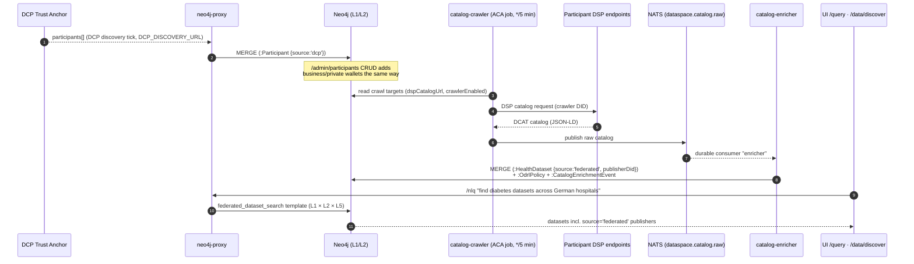

# Federated Catalog Discovery — Architecture

**Tracks:** [ADR-020](../ADRs/ADR-020-cross-participant-dataset-discovery.md) ·
[Issue #8](https://github.com/ma3u/MinimumViableHealthDataspacev2/issues/8) ·
Phase 26 in [planning-health-dataspace-v2.md](../planning-health-dataspace-v2.md)

How a natural-language question like _"find diabetes datasets across German
hospitals"_ reaches datasets published by participants we never pre-configured.

## Component flow

## Freshness SLA

The crawler runs as ACA job `mvhd-catalog-crawler` on a `*/5 * * * *`
schedule; the enricher consumes durably, so a participant added through
`/admin/participants` (or discovered via DCP) surfaces in Discover/NLQ within
**≤ 5 minutes** — no service restart anywhere. `HealthDataset.lastSeenAt`
records the last successful crawl per dataset.

## Privacy rules on the federated query path

Enforced in `services/neo4j-proxy/src/index.ts` (`POST /federated/query`):

1. **Read-only Cypher** — write patterns (incl. `CALL { CREATE … }`) are
   rejected with 403 before dispatch.
2. **Caller-side ODRL** — the caller's `odrlScope` is evaluated first:
   temporal validity (`checkOdrlTemporal`) and the re-identification
   prohibition heuristic (`checkReIdentification`, name × birth × geo).
3. **Row k-anonymity** — result groups smaller than
   `max(minK, MIN_COHORT_SIZE)` (default 5) are dropped (`filtered` count in
   the response).
4. **Contributor k-anonymity (dual-side)** — any contributor whose row count
   is non-zero but below `minK` is suppressed entirely, and because a missing
   contributor is itself identifying, the **global aggregate is suppressed
   with it**: `{ aggregateSuppressed: true, suppressionReason:
"contributor_k_violation" }`.
5. **Audit** — every federated query writes a `:QueryAuditEvent` with
   `federated: true`, `contributors: [labels]`, `aggregateSuppressed`, and
   `suppressionReason`, so EHDS Art. 53 transparency reports show _who we
   asked_ alongside _what we answered_.

Publisher-side ODRL policies arrive verbatim as `:OdrlPolicy` nodes via the
enricher and are enforced at negotiation time (`/negotiate`); VC-gated
dataset visibility (e.g. requiring a DataQualityLabelCredential before a
dataset surfaces at all) stays on the Phase 26 deferred list alongside the
`federation-ops` Grafana board.

## Operational surfaces

| Surface                | Purpose                                                             |
| ---------------------- | ------------------------------------------------------------------- |
| `/admin/participants`  | Directory CRUD — add/remove crawl targets without restarts          |
| `/data/discover`       | Dual-source browse (EDC assets + HealthDCAT-AP, federated included) |
| `/query`               | NLQ incl. `federated_dataset_search` template                       |
| `/admin/audit`         | `:QueryAuditEvent` log incl. federated + suppression fields         |
| `GET /federated/stats` | Contributor/SPE health                                              |
