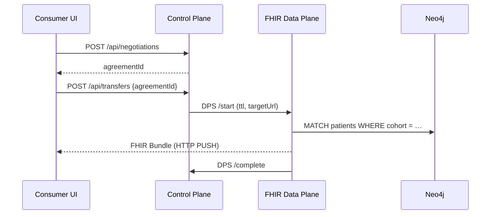

# EHDS Data Planes — Integration Guide

> Reference document for the EHDS Integration Hub. Explains the Data Plane
> concept, how data planes plug into hospital, ambulatory, and research
> systems, and proposes 20 EHDS-specific data planes for the future roadmap.

## 1. What is a Data Plane?

In the [Eclipse Dataspace Components (EDC)](https://eclipse-edc.github.io/docs/)
architecture, the **Control Plane** and **Data Plane** are separated:

| Concern                                   | Control Plane | Data Plane |
| ----------------------------------------- | ------------- | ---------- |
| DSP negotiation, policy evaluation, state | ✅            | —          |
| Actual byte transfer between participants | —             | ✅         |
| Authorisation token minting               | ✅            | validates  |
| Format translation (FHIR ⇄ OMOP ⇄ JSON)   | —             | ✅         |
| Stream vs. batch semantics                | orchestrates  | executes   |

A **data plane** is a pluggable adapter that owns the wire protocol (HTTP,
S3, Kafka, DICOM, HL7 v2, MLLP, SQL) and the payload format for a specific
class of data. It executes a transfer once the control plane has signed an
agreement on its behalf.

EDC-V defines **Data Plane Signalling (DPS)** — a lightweight API that lets
the control plane start, pause, resume, and revoke a transfer without
touching bytes. Every data plane in this project speaks DPS so it can be
swapped independently of the rest of the stack.

## 2. The Two Reference Data Planes Today

| #   | Data plane          | Port  | Payload             | Direction |
| --- | ------------------- | ----- | ------------------- | --------- |
| 1   | **FHIR Data Plane** | 11002 | FHIR R4 bundles     | PUSH      |
| 2   | **OMOP Data Plane** | 11012 | OMOP CDM CSV / JSON | PULL      |

Both are thin Java services that honour a DSP transfer process and stream
data through the same Neo4j-backed graph used by the UI.

## 3. Integrating Data Planes Into Existing Systems

A data plane is the bridge between the dataspace and a provider's or
consumer's **system of record**. Integration looks different for each actor:

### 3.1 Hospitals (inpatient providers)

- **Source system**: Epic, Cerner, ORBIS, Meditech, CGM, Dedalus.
- **Existing interfaces**: HL7 v2.x over MLLP, FHIR R4 REST, IHE XDS.b, DICOMweb.
- **Integration pattern**: deploy the data plane adapter in a DMZ or
  sidecar next to an **HL7/FHIR gateway** (Mirth Connect, HAPI FHIR).
  The adapter subscribes to an outbound queue (Kafka / NATS / IBM MQ)
  that the gateway emits for each ADT, ORU, or OML message; it
  transforms and forwards the payload to the consumer over DSP.
- **Authentication**: the hospital's SAML / OIDC realm federates into
  Keycloak (realm `edcv`); the data plane uses a service account in
  its own realm and attests as `DATA_HOLDER` via DCP verifiable
  credentials.
- **Consent**: every outbound message is checked against a consent
  cache populated from the hospital's consent management system (e.g.
  CentraXX, Deep.Consent).
- **Pitfalls**: clock skew for token TTLs, MLLP framing at firewalls,
  and PID/MRN mapping when the hospital does not yet use did:web.

### 3.2 Ambulatory / general practice

- **Source system**: TurboMed, MEDISTAR, DocCirrus, CGM Albis, telematik
  connectors (gematik TI).
- **Existing interfaces**: KV-Connect, KIM, ISiK FHIR Stage 4.
- **Integration pattern**: a **KIM-aware data plane** polls the
  practice's KIM mailbox, unwraps the S/MIME envelope, maps the
  enclosed CDA or FHIR bundle to the hub's canonical FHIR R4 profile,
  and pushes it onto the dataspace. Outbound contracts map back onto
  KIM addresses so data reaches the practitioner in their existing
  inbox.
- **Identity**: in Germany, practitioners hold an SMC-B / eHBA; the
  data plane uses these to sign the outbound TransferEvent instead of
  a long-lived service account.

### 3.3 Research & secondary use

- **Source system**: REDCap, i2b2, OMOP warehouses, SAS, R/RStudio,
  Jupyter, DuckDB.
- **Existing interfaces**: SQL/JDBC, Parquet / DuckDB files, OHDSI
  Atlas, TriNetX connectors.
- **Integration pattern**: researchers prefer a **PULL data plane** —
  the hub mints a short-lived pre-signed URL (S3/MinIO or a DuckDB HTTP
  endpoint) after an agreement is signed; the consumer pulls the
  dataset into their trusted research environment. For streaming
  cohorts, an OMOP Stream data plane pushes Delta Lake change events.
- **Compute-to-data**: when the data cannot leave the provider (e.g.
  genomic data), the plane instead accepts a **container image** from
  the researcher, runs it inside the provider's TEE, and returns only
  aggregate results.

## 4. Cross-cutting Requirements for Any New Plane

1. **DPS compliance** — speaks `/start`, `/suspend`, `/resume`, `/terminate`.
2. **Zero-trust token validation** — every chunk of bytes is gated by a
   token issued by the control plane.
3. **Observability** — OpenTelemetry traces per transfer, metric names
   `dataplane_{bytes,chunks,errors}_total`, structured audit logs that
   feed the EHDS Art. 50 audit trail (see `docs/audit-retention-policy.md`).
4. **GDPR lawful basis** — a data plane **never** executes a transfer
   without an associated `ConsentRecord` or `HDABApproval` node in the
   knowledge graph.
5. **Pseudonymisation hook** — every plane runs a configurable
   pseudonymisation function on PII fields before they leave the
   provider's perimeter.
6. **Idempotency** — restart-safe; re-emitted DPS events converge on the
   same end-state.

## 5. Twenty Future EHDS-Specific Data Planes

The current hub ships with two planes. The 20 candidates below cover the
payload and transport classes that EHDS Article 33 (primary use) and
Articles 46–54 (secondary use) imply, ordered roughly by clinical impact.

| #   | Name                                     | Source domain                             | Payload / Protocol                                | Why it matters                       |
| --- | ---------------------------------------- | ----------------------------------------- | ------------------------------------------------- | ------------------------------------ |
| 1   | **EEHRxF Patient Summary Plane**         | PS and IPS                                | HL7 Europe EEHRxF / IPS Bundle                    | Cross-border emergency care (Art. 9) |
| 2   | **ePrescription (eRx) Plane**            | Pharmacies                                | NCP-eHealth eRx / CP-IS profile                   | Art. 5 (primary use)                 |
| 3   | **Laboratory Results Plane**             | LIS                                       | HL7 v2 ORU^R01 → FHIR Observation                 | Longitudinal labs across borders     |
| 4   | **DICOM Imaging Plane**                  | PACS                                      | DICOMweb QIDO/WADO-RS                             | Teleradiology & AI training sets     |
| 5   | **Pathology Whole-Slide Plane**          | Digital path LIS                          | DICOM-WSI tiles over S3                           | Oncology trials, rare tumours        |
| 6   | **Genomics VCF Plane**                   | Sequencing centres                        | GA4GH htsget / VCF.gz                             | Rare disease & pharmacogenomics      |
| 7   | **Federated Learning Plane**             | Hospitals + TEEs                          | gRPC over MTLS, ONNX deltas                       | Compute-to-data, no raw export       |
| 8   | **OMOP Stream Plane**                    | OHDSI warehouses                          | Debezium → Kafka / Avro                           | Near-real-time cohort studies        |
| 9   | **Clinical Trial EDC Plane**             | REDCap / Medidata                         | CDISC ODM v2 / USDM JSON                          | Art. 33 clinical research use        |
| 10  | **Wearable / RPM Plane**                 | Fitbit, Apple Health, GATT                | FHIR Observation + MQTT                           | Chronic disease management           |
| 11  | **Registries Plane**                     | Cancer / stroke / rare-disease registries | FHIR QuestionnaireResponse batch                  | Quality of care benchmarking         |
| 12  | **Biobank Sample Plane**                 | SPREC, MIABIS                             | HL7 FHIR BiologicallyDerivedProduct               | Sample brokering                     |
| 13  | **Mental-Health Plane**                  | PHQ-9, GAD-7, ePROM                       | FHIR Questionnaire + pseudonyms                   | Sensitive-use opt-in (Art. 51)       |
| 14  | **ICU Waveform Plane**                   | Philips IntelliVue, GE CARESCAPE          | ISO/IEEE 11073-10201, WFDB                        | Critical-care ML                     |
| 15  | **Public Health Surveillance Plane**     | ECDC / RKI / Santé pub Fr.                | TESSy / HL7 FHIR MeasureReport                    | Cross-border epidemiology            |
| 16  | **Pharmacovigilance Plane**              | EMA EudraVigilance                        | ICH E2B(R3)                                       | Adverse-event reporting              |
| 17  | **Medical Device Telemetry Plane**       | ISO 11073 PoC devices                     | MDC streams over HL7 FHIR R5                      | IEC 62304 post-market surveillance   |
| 18  | **Environmental / Exposome Plane**       | EEA, Copernicus                           | GeoJSON + NetCDF over STAC                        | Environmental health correlations    |
| 19  | **Reimbursement Claims Plane**           | Statutory insurers                        | X12 837 / EDIFACT MED → FHIR ExplanationOfBenefit | Health-economics research            |
| 20  | **Patient-Generated Social Graph Plane** | Consented patient apps                    | ActivityStreams 2.0 / FHIR Communication          | Patient empowerment (Art. 3)         |

Each future plane is a separate repository / container image that implements
the DPS contract — so the hub's control plane remains unchanged as new
payloads come online.

## 6. Where to Start

- **Today**: Issue tracker tag `data-plane` in the
  [GitHub project](https://github.com/ma3u/MinimumViableHealthDataspacev2/issues).
- **Reference implementation**: `services/neo4j-proxy/` wraps the FHIR
  plane behaviour for demo purposes.
- **Specifications**:
  - Eclipse EDC DPS: <https://eclipse-edc.github.io/docs/>
  - DSP 2025-1: <https://docs.internationaldataspaces.org/ids-knowledgebase/v/dataspace-protocol>
  - EHDS Regulation (EU) 2025/327 — primary use: Art. 3–12; secondary
    use: Art. 46–54; logging: Art. 50.

See also:

- [`docs/architecture-diagrams.md`](architecture-diagrams.md) — component
  diagrams the planes plug into.
- [`docs/onboarding-guide.md`](onboarding-guide.md) — developer setup.
- [`docs/security/threat-model.md`](security/threat-model.md) — trust
  boundaries each plane crosses.
