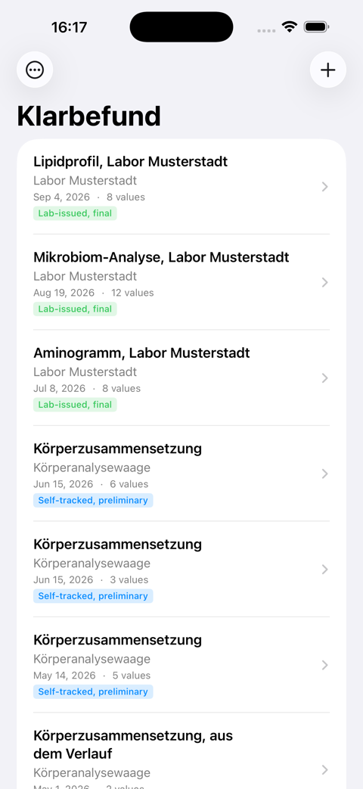
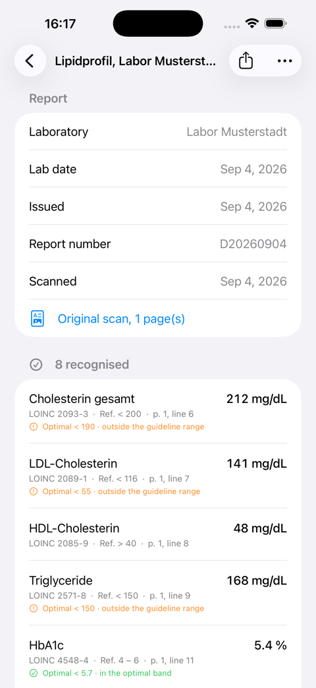
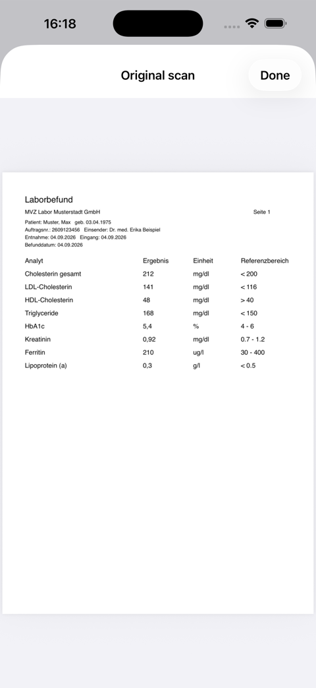
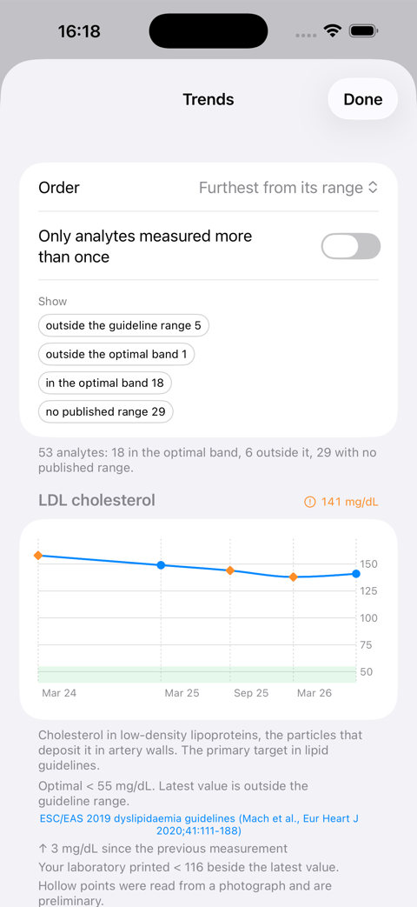
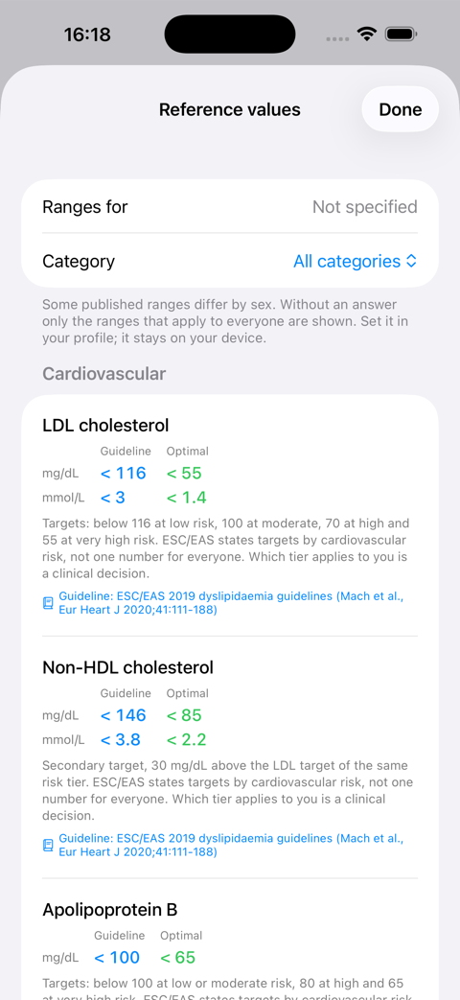
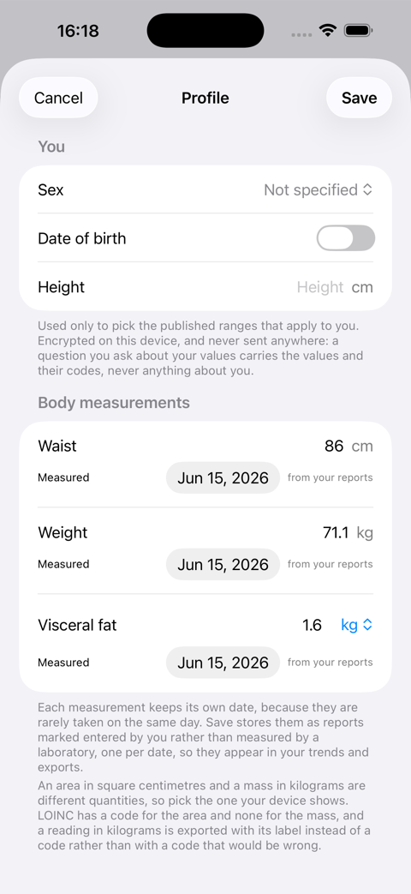
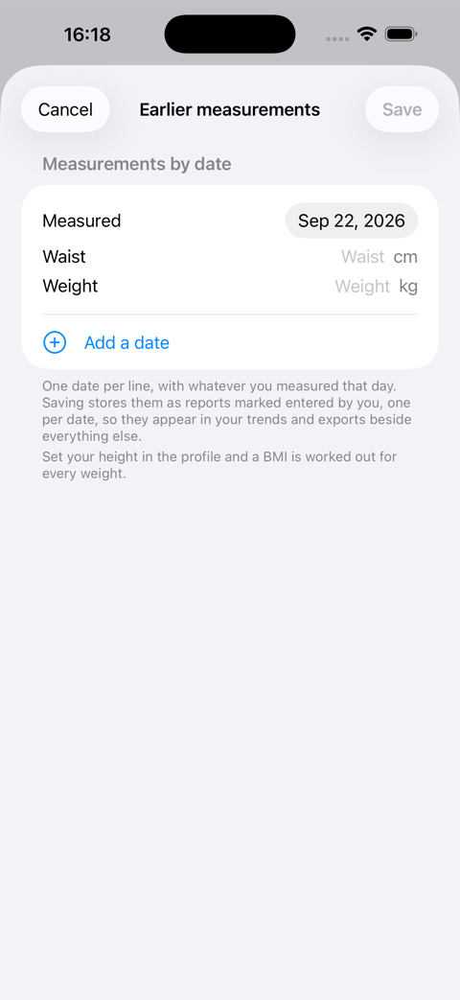
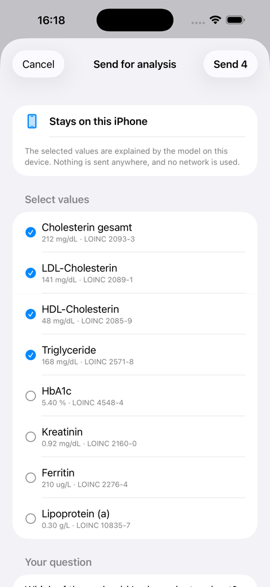
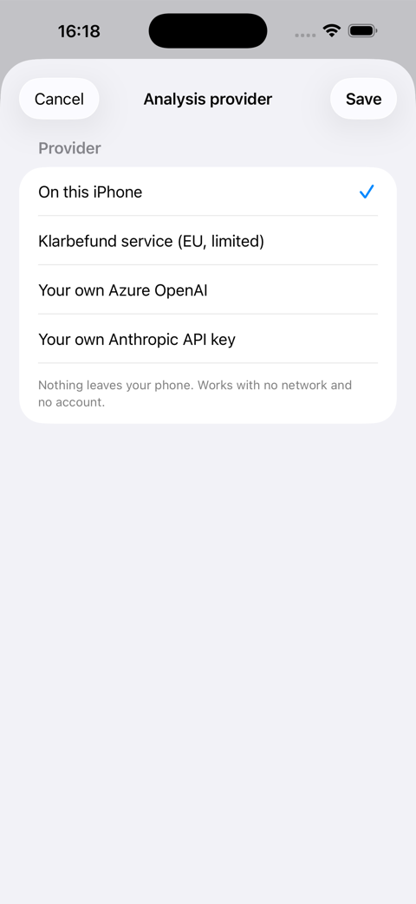
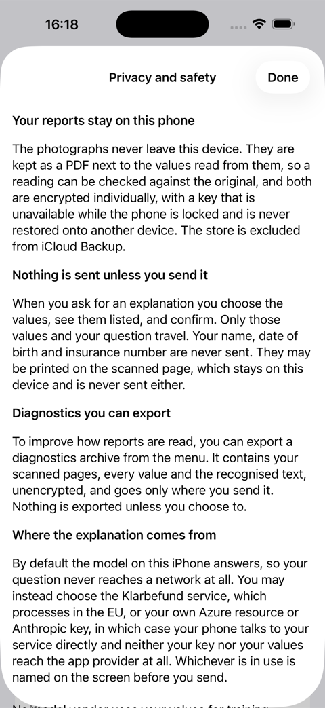

# Klarbefund: the iPhone app, screen by screen

Klarbefund turns a paper lab report into values you can read, check against
the paper, and follow over time. Everything runs on the phone: the scan, the
reading, the coding, the store and the exports. Nothing needs an account, and
nothing leaves the device unless you send it.

This page walks through the app as a person uses it. The developer side
(building, testing, the shared dictionary, the store layout) is in
[`clients/ios/README.md`](../../clients/ios/README.md). The work is tracked in
[issue #186](https://github.com/ma3u/MinimumViableHealthDataspacev2/issues/186).

Every screenshot on this page shows invented data. The laboratory, the patient
and every number come from the app's own fictional dev dataset, so a screenshot
can be published without a real report ever being involved. How they are made
is at the [end of this page](#how-these-screenshots-are-made).

| App name    | Klarbefund, in English and German                                                               |
| ----------- | ----------------------------------------------------------------------------------------------- |
| Bundle id   | `red.mabu.meinbefund`                                                                           |
| Runs on     | iPhone, iOS 26                                                                                  |
| Distributed | TestFlight, internal testing ([`clients/ios/TESTFLIGHT.md`](../../clients/ios/TESTFLIGHT.md))   |
| Source      | [`clients/ios/`](../../clients/ios/)                                                            |
| Privacy     | [Privacy policy](https://ma3u.github.io/MinimumViableHealthDataspacev2/meinbefund/privacy.html) |

## Your reports



The home screen lists every report, newest first: the title, the laboratory or
device it came from, the date it was taken and how many values were read.

The coloured badge is the report's **provenance**, and it matters more than it
looks. **Lab-issued, final** means the values came out of a PDF that carried
the laboratory's own text, so nothing was guessed. **Self-tracked,
preliminary** means the values were read from a photograph, of a paper sheet or
of a body-composition scale's screen, and a photograph can be misread. A value
stays preliminary until you have checked it against the original.

The **+** button starts a scan or an import. The **⋯** button holds everything
else: trends, reference values, your profile, earlier measurements, exports,
privacy and the analysis provider.

## Getting a report in

There are three ways, and the document decides what its values are worth.

- **Scan report** opens the camera for a paper report. The app finds the page edges,
  reads the table on the device, and keeps the pages as a PDF next to the values.
  Multi-page reports are fine.
- **Import a PDF or photo** takes a file your laboratory or portal gave you. If the PDF
  carries the laboratory's own text layer, the values are marked final; a PDF
  that is only a picture goes through the recogniser like a scan.
- **Import from Photos** takes photographs already on the phone, up to twelve at
  a time.

A **body-composition scale** photographed in a gym is recognised as what it is:
a dashboard, not a report. The app reads the metric, its current value and the
date the scale shows, and where the scale plots a history it measures the
points on the chart and marks those values as estimates. The scale's own
verdicts ("Normal", "Low") are ignored; they are the manufacturer's bands, not
a guideline's.

Before anything is saved, the app shows what it read and asks you to confirm
the laboratory date it found on the sheet.

## A report, value by value



The top of a report is what the app read from the sheet's header: the
laboratory, the date the sample was taken, the date the report was issued, the
report number, and a link to the original pages.

Then every measurement, and under each one the four things that make it
checkable:

- **the LOINC code** it was matched to, so the value means the same thing in
  every system it is exported to. The unit picks the code, never the name:
  lipoprotein(a) in mg/dL and in nmol/L are different measurements with
  different codes. A quantity LOINC does not code says so plainly instead of
  showing a near-enough code, and an organism from a stool report shows its
  NCBI Taxonomy id instead, because LOINC names tests and not organisms;
- **the reference range your laboratory printed**, exactly as printed, never
  normalised;
- **the page and line** it was read from, so any number can be checked against
  the paper in front of you;
- **the published band**, where a guideline or a named study states one, with
  the words and a symbol beside the colour: "in the optimal band", "outside
  the optimal band", "outside the guideline range". This is a comparison to a
  number somebody published. It is not a finding.

Below the recognised values come two lists the app never hides: the lines that
looked like measurements but matched nothing in the dictionary, and the lines
that could not be read at all. A row that vanished silently would be
indistinguishable from a row that was never printed, so no row vanishes.

The share button offers the exports described further down. The menu lets you
read the report again with the current version of the reader, export its
diagnostics, or delete it.

## The original pages



Every report keeps its pages, as one PDF, encrypted like the values. **Original
scan** shows them back, so the source is always one tap away from the reading.

## Trends



**Trends** draws one chart per measurement across every report, ordered by
what is furthest from its range. The filters narrow it to what matters: only
analytes measured more than once, or only those outside a band.

Each chart says what it is showing. A filled point came from a laboratory's own
document; a hollow point was read from a photograph and is preliminary. The
green band is the published optimal band where one exists; for everything else
the band drawn is the range your own laboratory printed, in its own colour and
named as such. Under the chart every point is listed with its date, where it
came from and which report it belongs to, and tapping a point opens that
report.

A sentence under each chart says **what the measurement is**: a definition of
the test, in English or German. It is never a reading of your own value.

## Reference values



**Reference values** is the table behind the bands. One card per measurement,
a line per unit, two columns: **Guideline**, the threshold a guideline body
states for adults, and **Optimal**, the lowest-risk band the same source
names. Every card names its source and links to it; where a source
partitions by risk tier or by age, the card says so and leaves the choice of
tier to a clinician.

A measurement with no citable source is simply absent. That is the difference
from the longevity tables this screen was modelled on, which quote numbers
nobody can check. The category menu narrows the list to one panel, and setting
your sex in the profile adds the ranges that differ by sex.

## Profile and earlier measurements

<table><tr>
<td></td>
<td></td>
</tr></table>

The **profile** holds sex, date of birth and height, used only to pick the
published ranges that apply to you, and the body measurements: waist, weight
and visceral fat. Each measurement keeps its own date and says where it came
from. A value read from a scale's photograph is labelled as such; one you type
is labelled as entered by you.

**Earlier measurements** is for catching up: one date per line, with whatever
you measured that day. Saving stores each date as its own report, marked as
entered by you, and works out the BMI and waist-to-height ratio from the
height in the profile. They join the trends and the exports through the same
path as a laboratory's values.

## Asking what a value is

<table><tr>
<td></td>
<td></td>
</tr></table>

You can ask the app to explain a set of values. By default the model on the
iPhone answers, so the question never reaches a network at all.

If you would rather use a service, you pick the values, see them listed with
their codes, and confirm before anything is sent. Only those values and your
question travel. Your name, date of birth and insurance number are never
sent, because the app does not hold them; they may be printed on the scanned
page, which stays on the phone. Whichever provider is in use is named on the
screen before you send.

**Analysis provider** in the menu chooses where an answer comes from: on this iPhone, the Klarbefund service in
the EU, or your own Azure OpenAI resource or Anthropic key. With your own
service the phone talks to it directly, and neither the key nor the values
reach the provider of this app.

## Exports and your data rights

Everything the app holds can leave it, in the form the recipient needs, and
only when you say so.

| Action                     | For                 | What you get                                                            |
| -------------------------- | ------------------- | ----------------------------------------------------------------------- |
| Share for my doctor        | a practice, the ePA | a PDF summary with the original pages appended, plus a FHIR R4 bundle   |
| Export for research (OMOP) | an analytics team   | OMOP CDM v5.4 `measurement.csv`, `person.csv`, `observation_period.csv` |
| Export all my data         | you, under GDPR     | every report, page, value and profile field, readable, in one archive   |
| Delete all my data         | you                 | the store is wiped for good, and the app says so before it does it      |
| Export diagnostics         | the developers      | the recognised text and both recogniser passes, to fix a misread line   |

The FHIR bundle carries every value with its LOINC code, its UCUM unit, the
range the laboratory printed, and the page and line it was read from. A value
read from a photograph is marked preliminary in the bundle too. The doctor
export fits the ePA's 25 MB limit with the pages attached.

Everything goes through the system share sheet: to the ePA app, Files,
AirDrop, or mail. There is deliberately no upload of its own, because there is
no API into the ePA for an app like this, and the citizen is the integration
point.

## Privacy and safety



The photographs never leave the device. Values, pages and diagnostics are
encrypted individually with a key that is unavailable while the phone is
locked and is never restored onto another device. The store is excluded from
iCloud Backup. When the app is not in front, its content is covered, so the
app switcher shows nothing.

This was checked, not assumed: with the phone on a cable, copying a stored
record, an export left in the temporary folder, or the system's own snapshot
of the app all fail with a permission error, which is what complete file
protection looks like from outside.

## Not a medical device

Klarbefund explains what a measurement is. It does not diagnose, does not
assess your risk and does not recommend treatment. No screen says normal or
abnormal, scores anything, or advises. A value read from a photograph can be
misread and is marked preliminary until you check it against the paper.
Reference ranges are shown exactly as your laboratory printed them, and the
published bands beside them are quotations with a source, not a verdict.

Always consult a doctor before making any decision about your health.

## How these screenshots are made

The images on this page are shot from a simulator by
[`clients/ios/Scripts/capture-screenshots.sh`](../../clients/ios/Scripts/capture-screenshots.sh),
launching the app straight into each screen with the fictional dev dataset:

```bash
cd clients/ios
SEED=-MBDevData OUT=/tmp/shots \
  SCREENS="list detail scan trends reference history profile consent settings privacy" \
  Scripts/capture-screenshots.sh
for f in /tmp/shots/*.png; do sips --resampleWidth 480 "$f" --out "../../docs/klarbefund/img/$(basename "$f")"; done
```

The dataset is built in code, in memory, and is compiled out of a release
build. Every laboratory in it is invented and every value made up, which is the
only reason a screenshot may be committed at all: the rule in
`clients/ios/README.md` is that no real health data enters the repository, not
even as a picture, not even temporarily.
