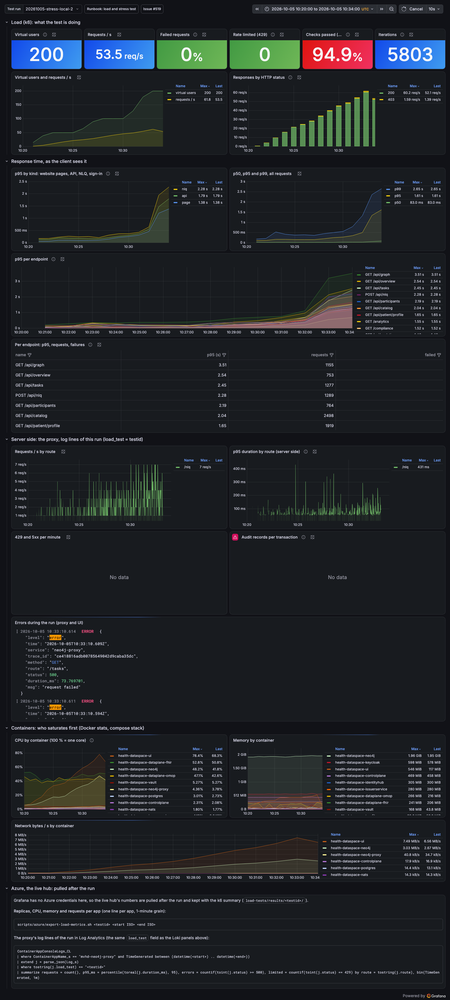
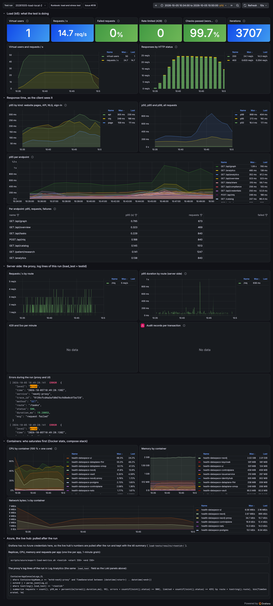
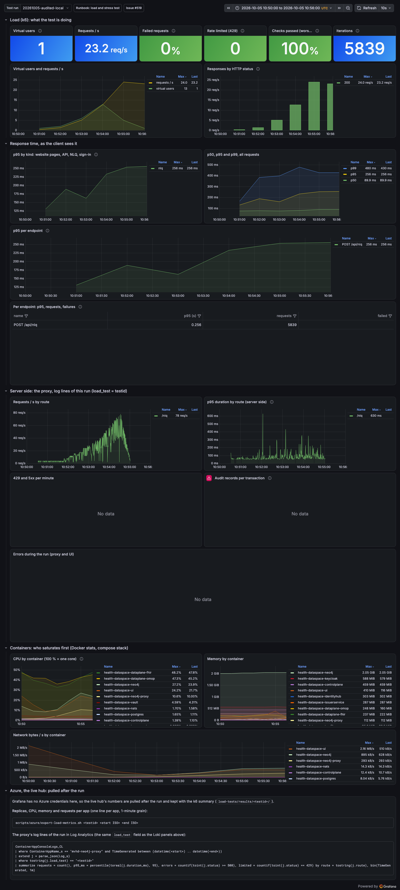

# Load and stress test, compose stack, 2026-10-05

Issue [#519](https://github.com/ma3u/MinimumViableHealthDataspacev2/issues/519). The local
half of the baseline: the k6 suite from `load-tests/` against the JAD compose stack on a
laptop, streamed to the Grafana dashboard "Load and stress test". The live hub's runs are
reported in #519 separately.

## Setup

| What        | Value                                                                                                                   |
| ----------- | ----------------------------------------------------------------------------------------------------------------------- |
| Host        | Laptop, Docker Desktop with 10 CPUs and 15.7 GiB                                                                        |
| Stack       | `docker-compose.yml` + `docker-compose.jad.yml`, UI on `:3003`, proxy on `:9090`                                        |
| Images      | `neo4j-proxy` and UI built from `main` at `a06020b` (after #534)                                                        |
| Rate limits | **Lifted for these runs only**: `RATE_LIMIT_MAX` and `RATE_LIMIT_HEAVY_MAX` at 1,000,000. Not the shipped configuration |
| Tool        | k6 2.3.0, metrics by Prometheus remote write, one run at a time                                                         |
| Suite fixes | #537 (persona mix, two dashboard tiles) and #538 (expected 403, POST cohort, failed share, CPU panel)                   |

The rate limit was measured on its own earlier (#534, #536). With it in place a local run
measures the limit, not the platform; these runs measure capacity.

**Noise on the host.** Two data planes crash-loop on this stack (36,000 restarts in five
days, each JVM start taking 2 to 3.5 cores for a few seconds), a kind cluster peaks at 4
cores, and two observability stacks run side by side. The numbers below are therefore
pessimistic, and one stall (below) is the host, not the platform.

## Results

| Run (testid)              | Shape                          | Requests | Failed | p95    | p99    | Verdict                     |
| ------------------------- | ------------------------------ | -------- | ------ | ------ | ------ | --------------------------- |
| `20261005-smoke-local`    | 1 user, 1 min                  | 30       | 0 %    | 1.25 s | 2.11 s | cold start after a restart  |
| `20261005-load-local-2`   | 50 users, 15 min, full mix     | 19,216   | 0 %    | 184 ms | 488 ms | **passes every SLO**        |
| `20261005-stress-local-2` | 50 → 100 → 200 → 400 users     | 30,563   | 0 %    | 979 ms | 2.10 s | breaks between 100 and 200  |
| `20261005-audited-local`  | NLQ only, 1 → 20 parallel      | 5,786    | 0 %    | 252 ms | 416 ms | passes                      |
| `20261005-proxy-local-2`  | proxy direct, 5 → 25 users     | 3,531    | 0.06 % | 499 ms | 1.71 s | passes                      |
| `20261005-signin-local`   | Keycloak sign-in, 5 → 50 a min | 889      | 0 %    | 797 ms | 2.54 s | 12 of 127 sign-ins over 3 s |

Load, 50 users: pages p95 97 ms, API p95 220 ms, NLQ p95 211 ms. Slowest endpoint
`GET /api/graph`, p95 587 ms.

### Stress, by stage

| Stage     | Requests / s | Page p95 | API p95  | NLQ p95  | UI CPU (avg / max) | Neo4j CPU (avg / max) |
| --------- | ------------ | -------- | -------- | -------- | ------------------ | --------------------- |
| 50 users  | 24.6         | 93 ms    | 167 ms   | 249 ms   | 32 / 53 %          | 36 / 234 %            |
| 100 users | 48.3         | 267 ms   | 341 ms   | 433 ms   | 60 / 100 %         | 34 / 114 %            |
| 100 → 200 | 70.3         | 1,452 ms | 1,902 ms | 2,338 ms | **86 / 127 %**     | 45 / 91 %             |

k6 stopped the run at 12 min 48 s, at 200 users, when the API p95 passed 1 s. No request
failed at any stage. The slowest endpoints at 200 users: `/api/graph` 3.5 s,
`/api/overview` 2.5 s, `/api/tasks` 2.5 s, `/api/nlq` 2.3 s.

## Findings

1. **The UI is the ceiling, not Neo4j.** Next.js serves from one Node.js process, one event
   loop on one core: at 100 users the UI container reached 100 % of a core and the p95
   started to climb; between 100 and 200 users it stayed at a core while Neo4j used under
   half of one. Locally, one core of UI carries about 50 to 60 requests a second (100
   users at this think time) within the SLOs. On Azure each `mvhd-ui` replica has 0.5 vCPU
   and ACA scales to 3, so the same arithmetic gives roughly 1.5 cores, about 150 users,
   provided the replicas are up before the load; to be checked by the live stress run.
2. **The audit chain keeps up (hypothesis 2).** 5,786 audited queries at up to 42 a
   second, p95 121 ms at one user and 254 ms at 20. The batch writer took up to 18 records
   per transaction, and both chains verified afterwards (`query` 8,975 records, `dsp` 60).
3. **Neo4j is not the ceiling locally (hypothesis 5).** Average 34 to 45 % of a core
   through the stress run. Its stop-the-world pauses (below) were the host.
4. **Keycloak is not the ceiling locally (hypothesis 6).** 127 real sign-ins at up to 50 a
   minute, Keycloak at 20 % average, 71 % at peak, no failures. The 12 slow sign-ins
   coincide with the host's CPU spikes.
5. **A regulator never sees the trust centres.** `/compliance`, the HDAB_AUTHORITY page,
   fetches `/api/trust-center`; the route admits only TRUST_CENTER_OPERATOR and EDC_ADMIN,
   so it answers 403 and the page shows an empty section without an error. Found once the
   persona mix ran the regulator journey (#537). Needs an access decision; the suite now
   expects the 403 (#538).
6. **`/api/tasks` hides two broken backends.** Locally the EDC management API answers 404
   for `/v5alpha/participants` and the proxy's `/tasks` answers 500 ("must be owner of
   table tasks"); the route still answers 200 with mock tasks.
7. **One 60-second stall, from the host.** In the first load run every in-flight request
   waited 60 s between 10:05:47 and 10:06:49 UTC. Neo4j logged JVM pauses of up to 23.7 s
   with no garbage collection, and the proxy logged nothing for that minute: the Docker VM
   was not scheduled. The rerun had no stall.

## Bugs in the suite and the dashboard, found by these runs

| Bug                                                                                   | Fixed in |
| ------------------------------------------------------------------------------------- | -------- |
| VUs 1 to 50 were all patients and researchers (`vu % 100`)                            | #537     |
| "Failed requests" read 100 % (max over per-status rate series)                        | #537     |
| "Checks passed" showed the best check, not the worst                                  | #537     |
| "Failed requests" counted the expected 403                                            | #538     |
| "CPU by container" barely moved under load (lifetime ratio); now the CPU time counter | #538     |
| The proxy scenario sent `GET /omop/cohort`; the route is `POST`                       | #538     |

## Dashboards

Grafana "Load and stress test", one run per `testid`:

- Stress: `http://localhost:3301/d/mvhd-load-test/load-and-stress-test?var-testid=20261005-stress-local-2&from=1791195600000&to=1791196440000`
- Load: `http://localhost:3301/d/mvhd-load-test/load-and-stress-test?var-testid=20261005-load-local-2&from=1791196440000&to=1791197400000`
- Audited: `http://localhost:3301/d/mvhd-load-test/load-and-stress-test?var-testid=20261005-audited-local&from=1791197400000&to=1791197760000`

The port is the second observability stack's (`:3301`), which holds these runs and the
live hub's; the default stack serves the same dashboard on `:3300`.

### Stress, 50 → 200 users



### Load, 50 users, 15 minutes



### Audited queries, 1 → 20 parallel



## Reproduce

```bash
docker compose -f docker-compose.observability.yml up -d
load-tests/run.sh load local       # TESTID=... to name the run
load-tests/run.sh stress local
load-tests/run.sh audited local
```

The runbook is [`docs/knowledge/runbooks/load-and-stress-test.md`](../knowledge/runbooks/load-and-stress-test.md).
