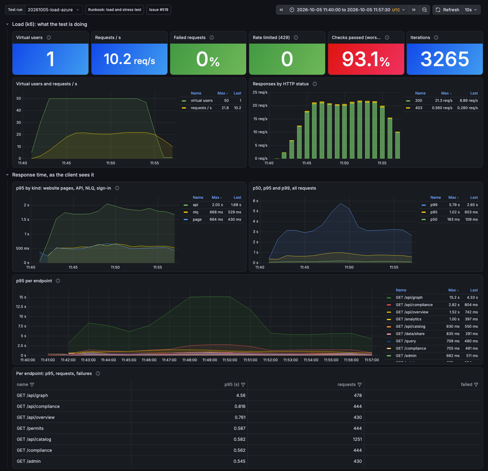
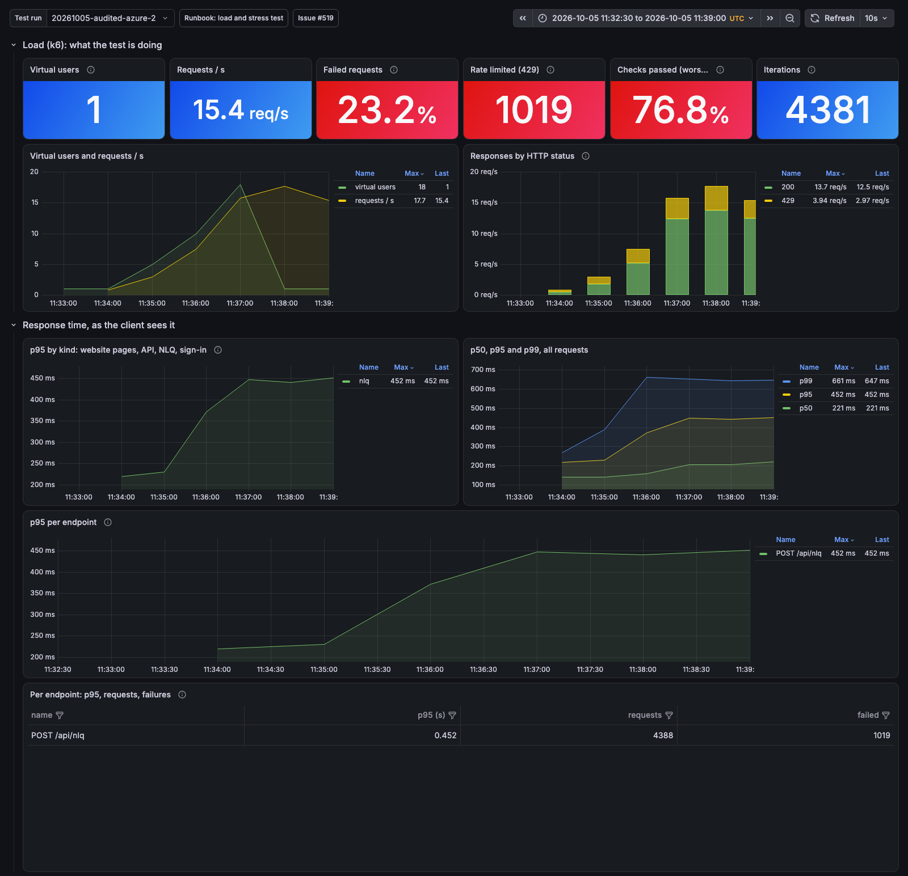

# Load test baseline, Azure, 2026-10-05 (#519)

Four k6 runs against https://ehds.mabu.red from a laptop in Berlin, inside
office hours, with the suite of `load-tests/` (persona mix, forged sessions, ten
users per persona). Metrics streamed to the local Grafana ("Load and stress
test" dashboard); the platform's side from `scripts/azure/export-load-metrics.sh`
(Azure Monitor, 1-minute grain). Raw data: `load-tests/results/<testid>*` on the
laptop.

The platform that day: UI 1 to 3 replicas at 0.5 vCPU, proxy 1 to 2 at 0.25,
Neo4j 5.26 Community, one replica, 1 vCPU and 2 GiB, Keycloak one replica,
Flexible Server B1ms. ACA's default HTTP rule (10 concurrent requests) scaled
the UI and the proxy.

## Runs

| testid                     | What                                            | Requests | Failed                  | p95 (ms): pages / API / NLQ |
| -------------------------- | ----------------------------------------------- | -------- | ----------------------- | --------------------------- |
| `20261005-smoke-azure`     | 1 user, 30 s                                    | 15       | 0                       | 626 / 221 / -               |
| `20261005-audited-azure`   | 1 → 20 parallel NLQ, one participant, #534 live | 4,871    | 4,071 (83.6 %, all 429) | - / - / 544 (successes)     |
| `20261005-audited-azure-2` | same, #536 live (per user)                      | 4,341    | 1,006 (23.2 %, all 429) | - / - / 434                 |
| `20261005-load-azure`      | 50 users, 15 min, persona mix                   | 16,950   | **0**                   | 546 / **1,800** / 563       |

The dashboard's client-side rows for the two main runs (the server-side and
container rows read the local Loki and Docker, not Azure):





## The platform during the 50-user run (11:40 to 11:56 UTC)

| App              | Replicas | CPU max | Memory max | Ingress response time, 1-min average max |
| ---------------- | -------- | ------- | ---------- | ---------------------------------------- |
| mvhd-ui          | 3 (max)  | 48 %    | 16 %       | 85 ms                                    |
| mvhd-neo4j-proxy | 2 (max)  | 8 %     | 7 %        | 68 ms                                    |
| mvhd-neo4j       | 1        | 45 %    | **97 %**   | (no ingress)                             |
| mvhd-keycloak    | 1        | 0 %     | 29 %       | 17 ms (no sign-ins in this run)          |
| Flexible Server  |          | 16 %    |            | 23 connections, 64 burst credits         |

Neo4j's CPU rose from 1 % to 41 to 45 % within three minutes of the ramp and
stayed there; its memory sat at 97 % of the 2 GiB limit.

## Per endpoint, 50 users (p95 over the run)

| Endpoint                    | p95        | Requests |
| --------------------------- | ---------- | -------- |
| `GET /api/graph`            | **10.0 s** | 453      |
| `GET /api/compliance`       | 1.8 s      | 419      |
| `GET /api/overview`         | 1.2 s      | 409      |
| `GET /api/catalog`          | 0.69 s     | 1,186    |
| `GET /api/credentials`      | 0.47 s     | 411      |
| `GET /api/participants`     | 0.46 s     | 412      |
| `GET /api/tasks`            | 0.46 s     | 722      |
| `GET /api/analytics`        | 0.45 s     | 726      |
| `GET /api/patient/profile`  | 0.36 s     | 1,095    |
| `GET /api/patient/research` | 0.35 s     | 1,087    |
| `GET /api/patient/insights` | 0.35 s     | 1,090    |
| `GET /api/trust-center`     | 0.29 s     | 418      |
| `POST /api/nlq`             | 0.56 s     | 723      |
| pages (11 routes)           | ≤ 0.55 s   | 7,330    |

## Findings

1. **Rate limit (hypothesis 1), three states in one day.** Per IP (before #534):
   one bucket for the whole platform. Per participant (#534): one organisation's
   20 users exhausted 100 a minute in seconds, 83.6 % refused. Per user (#536):
   the 50-user mix saw no 429 at all; the remaining 23 % in `audited-2` is that
   scenario's shape (20 VUs on 10 users, five questions a second each, no think
   time), not a person's behaviour.
2. **The audit chain (hypothesis 2) is not a ceiling** at the rates reached:
   434 ms p95 at about 16 audited queries a second, with the batch writer live.
3. **Neo4j is the ceiling (hypothesis 5), by memory before CPU.** 97 % of 2 GiB
   during the 50-user run, and the three slow endpoints are the three that read
   the most of the graph: `/api/graph` (the whole knowledge graph, p95 10 s),
   `/api/compliance` and `/api/overview`. Neo4j Community has no cluster mode:
   the options are a larger container (memory first), a smaller or cached answer
   for `/api/graph`, or Enterprise / Aura. Follow-up: #540.
4. **Postgres (hypothesis 4):** 16 % CPU and 64 burst credits at 50 users with
   no sign-ins; the morning start had drawn the credits down to 36 earlier. The
   `signin` and `soak` runs are the ones to measure it.
5. **Sign-in (hypothesis 6):** not exercised live yet; on compose 13 of 13
   sign-ins passed at 310 ms p95 per request.
6. **Scale-out works where it exists:** UI to 3 and proxy to 2 within the ramp,
   both with headroom at 50 users (48 % and 8 % CPU). The `stress` run will find
   the UI's knee; locally one Node process saturated at 50 to 60 requests a
   second, so about 150 users for three replicas, if ACA scales ahead of it.

## Not yet run live

`stress`, `spike`, `soak`, `signin`, `proxy` (internal; needs a job inside the
environment). Each inside office hours, announced, one at a time.

## Reproduce

```bash
docker compose -f docker-compose.observability.yml up -d
export NEXTAUTH_SECRET="$(az containerapp secret show -n mvhd-ui -g rg-mvhd-dev --secret-name nextauth-secret --query value -o tsv)"
load-tests/run.sh load azure
scripts/azure/export-load-metrics.sh <testid> <start> <end>
```

Runbook: [`docs/knowledge/runbooks/load-and-stress-test.md`](../knowledge/runbooks/load-and-stress-test.md).
Local counterpart: [`2026-10-05-local.md`](2026-10-05-local.md).
