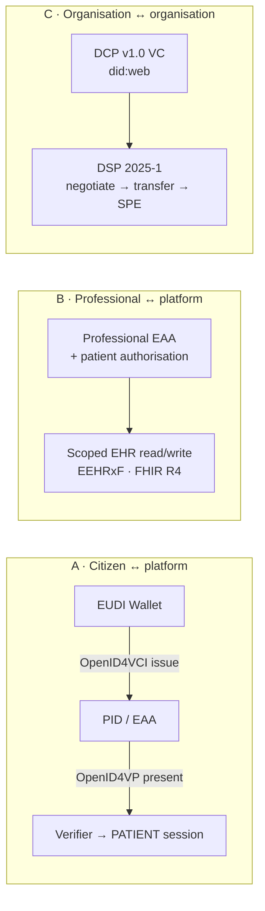
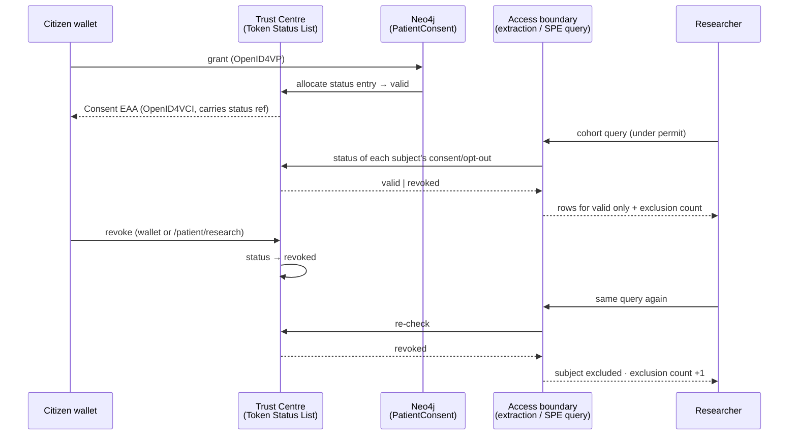

# Actor journeys — registration · identification · data exchange

The platform has five personas today ([`../persona-journeys.md`](../persona-journeys.md)),
all of them **organisational** except the patient. Implementing the hackathon demo from
[#72](https://github.com/ma3u/MinimumViableHealthDataspacev2/issues/72) — the EUDI Wallet as
the citizen's channel into the European Health Data Space — needs the _human_ side of both
EHDS regimes to be drawn properly first: who registers, how they are identified on each
visit, and what actually moves between them.

This document is that map. It covers **seven actor groups across two regimes**, and for each
one the three flows the demo turns on: **registration** (how they come to exist in the
dataspace), **identification** (how they prove who they are, per session), and **data
exchange** (what moves, under which legal basis, on which protocol).

It is a _specification_, not a report: the **Status** column separates what ships today from
what #72/#182 must build.

> **Article numbering.** EHDS article references follow the mapping already used across this
> repository's code, seeds and tests. The load-bearing part of every claim below is the
> **mechanism** (data permit, opt-out, SPE, EEHRxF, priority categories, HDAB) — those names
> are stable in Regulation (EU) 2025/327; a specific article number may need adjusting
> against the published text before it goes in front of a regulator.

---

## 0. The one correction that shapes every secondary-use journey

The #72 fact-check established — and this is worth restating at the top, because it inverts
the obvious design:

> **EHDS Chapter IV secondary use runs on an HDAB _data permit_ plus a citizen _opt-out_.
> It does not run on GDPR Art. 9(2)(a) opt-in consent.** Opt-in is the exception (notably
> genetic data), not the rule.

So the wallet is **not** the legal basis for research access. It is the citizen's
**verifiable channel to exercise EHDS rights**:

| What the citizen does in the wallet | Legal character                                                                                     | Effect in the dataspace                              |
| ----------------------------------- | --------------------------------------------------------------------------------------------------- | ---------------------------------------------------- |
| Opt out of secondary use            | EHDS right, unilateral                                                                              | Patient excluded at extraction, before the SPE       |
| Restrict access (primary use)       | EHDS right, per professional/category                                                               | GP sees a redacted record; the restriction is logged |
| Grant consent to a specific study   | Consent — only where consent _is_ the basis (genetic data, community registry, primary-use sharing) | `PatientConsent` + Consent EAA in the wallet         |
| Revoke                              | Withdrawal of the above                                                                             | Status-list flip → access boundary re-check fails    |
| Read the access log                 | EHDS transparency right                                                                             | Every access, primary and secondary, is listed       |

Everything below is built on that distinction. A journey that shows a researcher "asking the
patient for permission" is a journey that misrepresents the regulation, and a jury of the
kind #72 targets will say so.

---

## 1. Actor overview

### Primary use — Chapter II / III

| #      | Actor                             | Fictional org                        | Role (Keycloak)               | Identity credential                                      | Status                         |
| ------ | --------------------------------- | ------------------------------------ | ----------------------------- | -------------------------------------------------------- | ------------------------------ |
| **P1** | Citizen / patient                 | Maria Lindqvist (AlphaKlinik Berlin) | `PATIENT`                     | EUDI Wallet **PID** (OpenID4VP)                          | 🟢 shipped (ADR-028)           |
| **P2** | Home doctor / GP                  | Praxis Dr. Sommerfeld, Berlin        | `HEALTH_PROFESSIONAL` _(new)_ | **Professional-qualification EAA** (eHBA/SMC-B analogue) | 🔴 gap                         |
| **P3** | Statutory insurer / ePA custodian | AlphaKasse DE                        | `INSURER` _(new)_             | GesundheitsID-style OIDC; `did:web` as participant       | 🟡 simulated (transfer flow C) |

### Secondary use — Chapter IV

| #      | Actor                          | Fictional org                               | Role (Keycloak)             | Identity credential                               | Status     |
| ------ | ------------------------------ | ------------------------------------------- | --------------------------- | ------------------------------------------------- | ---------- |
| **S1** | Hospital / data holder         | AlphaKlinik Berlin · Limburg Medical Centre | `DATA_HOLDER`               | DCP v1.0 VC + `did:web`                           | 🟢 shipped |
| **S2** | Scientist / researcher         | PharmaCo Research AG                        | `DATA_USER`                 | DCP v1.0 VC + `did:web`                           | 🟢 shipped |
| **S3** | Patient community / non-profit | AlphaPatients e.V., Berlin                  | `DATA_USER` + `DATA_HOLDER` | DCP VC; **citizen consent EAAs** for its registry | 🔴 gap     |
| **S4** | HDAB                           | MedReg DE · Institut de Recherche Santé     | `HDAB_AUTHORITY`            | DCP VC + `did:web`                                | 🟢 shipped |
| **S5** | Trust Centre operator          | ⚠️ see §7                                   | `TRUST_CENTER_OPERATOR`     | `did:web` + HMAC key custody                      | 🟢 shipped |

Supporting issuer (new, fictional): **AlphaKammer DE** — the professional body that issues
P2's qualification EAA. It is an _issuer_, not a dataspace participant.

---

## 2. Three flow archetypes

The seven actors use only three mechanisms. Naming them once keeps the journeys short.



- **A — citizen layer**: OpenID4VCI / OpenID4VP, end-user, wallet-held, revocable.
- **B — professional layer**: attribute attestation _plus_ a patient-side authorisation
  (restriction register). Neither alone is sufficient.
- **C — organisation layer**: DCP for trust, DSP for exchange. Unchanged by #72 — the
  citizen layer _gates_ it, it does not replace it (issue #22's Option B: bridge at the
  verifier, never make the wallet speak DSP).

---

## 3. Primary use

### P1 — Citizen / patient

| Flow               | Today                                                                                                                                                                                      | Target (#72)                                                                                                                                                                           |
| ------------------ | ------------------------------------------------------------------------------------------------------------------------------------------------------------------------------------------ | -------------------------------------------------------------------------------------------------------------------------------------------------------------------------------------- |
| **Registration**   | `/auth/eudi-qr?mode=register` + `RegisterDialog`: QR → wallet approves → `PATIENT` session. PID comes from the EU reference issuer.                                                        | Same, plus a **German-wallet path** (#182 W1/W4) and a first-visit **rights screen**: opt-out state, restriction defaults, access-log location.                                        |
| **Identification** | OpenID4VP cross-device, selective disclosure of PID claims; NextAuth `eudi-wallet` credentials provider mints the session (ADR-028). Returning login skips the trust step (`LOGIN_STEPS`). | Unchanged wire format. The `sid` store becomes durable (#182 W1) so a revision rollover stops dropping in-flight logins.                                                               |
| **Data exchange**  | `/patient/profile` (FHIR R4), `/patient/insights`, `/patient/research` grant + revoke (`PatientConsent`), ePA pull from AlphaKasse (simulated, flow C).                                    | Adds: **Consent EAA issued into the wallet** on grant; **opt-out register** honoured at extraction; **access log** (`/patient/access-log`) listing every primary and secondary access. |

**Journey — the #72 loop, end to end:**

```
1. Wallet holds a PID (EU reference issuer, or German wallet once #182 W1 lands)
2. /auth/eudi-qr  → scan → approve → PATIENT session          [identification]
3. /patient/profile → own EHR, FHIR R4                         [EHDS Chapter II]
4. /patient/research → study card → Grant
     ├── PatientConsent node (Neo4j)
     ├── Consent EAA issued to the wallet (OpenID4VCI)
     └── status entry allocated on the Token Status List
5. Researcher cohort query → access boundary checks the status list  [governed]
6. /patient/research → Revoke   (or revoke inside the wallet)
     └── status flips → next boundary check fails → access stops
7. /patient/access-log → the revocation and the stopped access are both visible
```

Steps 4–7 are the demo. Step 5 is where the citizen layer meets the DSP/DCP layer, and it is
the only place the two touch.

**EHDS mapping:** Art. 3 (access own record) · Art. 7 (portability, MyHealth@EU) ·
Art. 8 (restrict access) · Art. 9 (information on access) · Chapter IV opt-out.

### P2 — Home doctor / GP

**Status: 🔴 entirely new.**

The platform has no health-professional actor at all today. This is the largest gap in the
primary-use story, and the most visible one in a live demo: a patient record nobody treats
the patient with is not a health dataspace.

| Flow               | Design                                                                                                                                                                                                                                                                                                                                                                                   |
| ------------------ | ---------------------------------------------------------------------------------------------------------------------------------------------------------------------------------------------------------------------------------------------------------------------------------------------------------------------------------------------------------------------------------------- |
| **Registration**   | Two-step, and both steps are needed: (1) the **practice** onboards as a participant (`did:web:praxis-sommerfeld.de:participant`, DCP credential) — the same onboarding a hospital uses, at a smaller scale; (2) the **person** receives a professional-qualification EAA from **AlphaKammer DE** into their own wallet. The practice being registered does not make the doctor a doctor. |
| **Identification** | Professional EAA presented over OpenID4VP → `HEALTH_PROFESSIONAL` session, carrying `specialty`, `registrationNumber`, `validUntil`. In Germany this is the eHBA (person) + SMC-B (institution) pair over the TI; the EAA is the wallet-native analogue, and the demo should say so rather than imply the eHBA is already wallet-based.                                                  |
| **Authorisation**  | **The EAA is not enough.** Access to a specific patient's record requires either a treatment relationship the patient has not restricted (EHDS default), or an explicit patient authorisation. Both resolve to a check against the patient's restriction register, and **every** read is written to the access log the patient can see.                                                  |
| **Data exchange**  | Read: patient summary + priority categories (ePrescription/eDispensation, lab results, imaging reports, discharge reports) in EEHRxF, served as FHIR R4. Write: a new `Condition`, an `Observation`, a prescription — the GP is a _data holder_ for what they write, which is what later makes it available for secondary use.                                                           |

```
1. Practice onboarding → did:web + DCP credential            [/onboarding]
2. Doctor presents professional EAA → HEALTH_PROFESSIONAL    [/auth/eudi-qr?actor=hp]
3. /clinical/patients → search by patient identifier
4. Patient restriction check → full | redacted | denied
5. /clinical/patient/[id] → EEHRxF summary (FHIR R4)
6. Write back: diagnosis · prescription
7. Access written to the patient's access log — visible to P1 at step 7 of their journey
```

**The demo moment worth building:** the patient restricts a category in their wallet, the GP
reloads, and the category is gone — with a "restricted by the patient" marker rather than a
silent omission. Silent omission is a clinical safety problem, and saying so out loud is
exactly the kind of detail that separates a demo from a mock-up.

**EHDS mapping:** Art. 4 (health-professional access) · Art. 5 (priority categories) ·
Art. 6 (EEHRxF) · Art. 8 (restriction) · Art. 9 (access log).

### P3 — Statutory insurer / ePA custodian

**Status: 🟡 simulated.**

| Flow               | Today                                                                                                                                           | Target                                                                                                                                                       |
| ------------------ | ----------------------------------------------------------------------------------------------------------------------------------------------- | ------------------------------------------------------------------------------------------------------------------------------------------------------------ |
| **Registration**   | None — AlphaKasse DE exists only as a slide in the patient journey.                                                                             | Onboard as a participant with a **restricted role**: ePA custodian for primary use, and explicitly _not_ a secondary-use data user (see below).              |
| **Identification** | The insured person authenticates in the insurer's app with **GesundheitsID**, not the EUDI Wallet.                                              | Keep it. EUDI → ePA is a ~2027–28 roadmap item; the copy in `eudi-wallet-flows-2026.md` already carries that caveat and it must survive into any new screen. |
| **Data exchange**  | Patient-initiated ePA → portal transfer, E2E-encrypted, category-scoped, revocable, insurer cannot read the payload (flow C, `EhrTransferSim`). | Make the revocation real rather than copy: the transfer grant gets a status entry, and revoking it in the wallet stops the next sync.                        |

**The governance journey worth building here is the refusal.** EHDS prohibits secondary use
for decisions detrimental to a natural person — insurance underwriting and premium setting
are the textbook case. So:

```
AlphaKasse DE applies for a secondary-use permit ("risk model calibration")
  → MedReg DE (HDAB) reviews
  → REJECTED — prohibited purpose, with the article cited on the decision
  → rejection is visible in /compliance and in the graph as a rejected HDABApproval
```

This is the only journey in the whole map where the right outcome is **no data moving**, and
it is worth more to a regulator-facing audience than three more happy paths. It also
exercises the rejected-application branch that the current seed never produces.

---

## 4. Secondary use

### S1 — Hospital / data holder

**Status: 🟢 shipped, one gap.**

Registration (`/onboarding` → `did:web` → DCP credentials), identification (DCP VC for
machines, Keycloak for humans) and exchange (publish HealthDCAT-AP → DSP negotiate →
transfer into the SPE) all work. Detail in [`../persona-journeys.md`](../persona-journeys.md) §1.

**Gap:** the extraction does not consult the citizen opt-out register, because there isn't
one. Today `PatientConsent` is checked in `/api/patient/insights` and the graph query, not at
the point data leaves the holder. #72 moves the check to the boundary — which is both the
legally correct place and the only place a revocation can actually stop anything.

### S2 — Scientist / researcher

**Status: 🟢 shipped.**

Registration, identification and exchange work end to end (`/data/discover` → `/negotiate` →
`/data/transfer` → `/analytics`, aggregate-only, k-anonymity ≥ 5). Detail in
[`../persona-journeys.md`](../persona-journeys.md) §2 and
[`data-user-federated-discovery.md`](./data-user-federated-discovery.md).

**What #72 changes:** nothing about the researcher's _permissions_ — the permit remains the
basis — and one thing about their _cohort_. The cohort count drops when a citizen opts out or
revokes, and the researcher sees why: "n = 118 (9 excluded: opt-out)". Showing the exclusion
count rather than silently shrinking the cohort is what makes the mechanism auditable, and
it is a two-line change to the analytics response that carries the entire narrative.

### S3 — Patient community / non-profit

**Status: 🔴 entirely new.**

The user group the current model has no shape for at all. A patient organisation is
_both_ a data user and a data holder, and it is the one actor for which **consent genuinely
is the legal basis** — which makes it the honest home for the wallet-consent mechanism that
Chapter IV does not need.

| Flow                               | Design                                                                                                                                                                                                                                                                                                                                                 |
| ---------------------------------- | ------------------------------------------------------------------------------------------------------------------------------------------------------------------------------------------------------------------------------------------------------------------------------------------------------------------------------------------------------ |
| **Registration**                   | Onboards as a participant (`did:web:alphapatients.de:community`) with a non-profit attestation. Two capabilities: `DATA_USER` (applies for permits like any researcher — EHDS sets reduced or waived fees for non-profits, which is worth surfacing on the application screen) and `DATA_HOLDER` (operates its own patient-reported-outcome registry). |
| **Identification**                 | DCP VC for the organisation. Its _members_ are citizens: they identify with their own PID and contribute under consent, not under a permit.                                                                                                                                                                                                            |
| **Data exchange — as data user**   | Permit application → HDAB → SPE, identical to S2.                                                                                                                                                                                                                                                                                                      |
| **Data exchange — as data holder** | Citizens enrol in the registry from `/patient/research` by granting a **Consent EAA** scoped to that registry. The community's dataset is the set of currently-valid consents — it shrinks the moment someone revokes.                                                                                                                                 |

```
1. AlphaPatients e.V. onboards → did:web + non-profit attestation
2. Publishes "Type-2 diabetes PROM registry" to the catalogue (HealthDCAT-AP)
3. Citizen (P1) enrols from /patient/research → Consent EAA into the wallet
4. Registry dataset = valid consents  (status-list checked at query time)
5. Citizen revokes in the wallet → cohort shrinks on the next query
6. PharmaCo Research AG (S2) applies to the HDAB for the registry
   → permit granted → SPE → aggregate results back to the community
```

Step 6 is the payoff: citizen-donated data re-entering the regulated secondary-use path,
with the consent chain intact from wallet to SPE. It is also the clearest answer to "what is
the wallet actually _for_, if the permit is the legal basis" — this is the case where it is
the basis.

### S4 — HDAB · S5 — Trust Centre

**Status: 🟢 shipped.**

Unchanged by #72 in mechanism, extended in surface:

- **HDAB** additionally maintains the **opt-out register** and decides the P3 rejection above.
- **Trust Centre** additionally publishes the **Token Status List** (#182 W2) that carries
  consent-EAA revocation. This is the piece that turns ADR-028's "revocation = roadmap" into
  running code, and it is why #182 W2 and #72 are one workstream rather than two.

Detail in [`../persona-journeys.md`](../persona-journeys.md) §3–4.

---

## 5. Cross-cutting: how a revocation actually stops access

The single most-questioned claim in the #72 pitch. Written out so the implementation has one
target:



Three properties this has to keep, because they are what a sceptical reviewer tests:

1. **The check is at the boundary, not in the UI.** A filter in a React component is a
   demonstration of nothing.
2. **Revocation is not retroactive over data already in an SPE** — and the demo must say so.
   It stops _future_ access and it is logged; claiming deletion from a running SPE session
   would be false.
3. **Opt-out and consent are different columns**, evaluated separately. Conflating them
   reintroduces exactly the legal error §0 corrects.

---

## 6. Gap summary → what #72 has to build

| #   | Item                                                   | Actors         | Depends on                  |
| --- | ------------------------------------------------------ | -------------- | --------------------------- |
| 1   | Opt-out register + boundary check                      | P1, S1, S2, S4 | —                           |
| 2   | Consent EAA issuance (OpenID4VCI)                      | P1, S3         | wallet issuer endpoint      |
| 3   | Status-list-backed revocation                          | P1, S5         | #182 W2 (status list runs)  |
| 4   | `HEALTH_PROFESSIONAL` role + GP surfaces               | P2             | Keycloak realm + middleware |
| 5   | Professional-qualification EAA issuer (AlphaKammer DE) | P2             | item 2                      |
| 6   | Restriction register + redaction markers               | P1, P2         | item 4                      |
| 7   | Patient access log (`/patient/access-log`)             | P1, P2, S2     | items 4, 1                  |
| 8   | `INSURER` role + prohibited-purpose rejection          | P3, S4         | —                           |
| 9   | Community participant + PROM registry                  | S3             | items 2, 3                  |
| 10  | Exclusion count in analytics output                    | S2             | item 1                      |

Items 1–3 are the #72 demo spine. Items 4–7 are the primary-use half the platform is
missing. Items 8–10 are each a single, high-value journey on top of an existing surface.

**Journey test ID allocation** (current maximum J859; J900–J919 already reserved by #182 W4
for the wallet chooser):

| Range     | Scope                                                                  |
| --------- | ---------------------------------------------------------------------- |
| J920–J939 | Citizen consent loop — grant → govern → revoke → access log            |
| J940–J959 | GP primary-use journey — EAA login, restriction, redaction, write-back |
| J960–J979 | Insurer — ePA transfer grant/revoke, prohibited-purpose rejection      |
| J980–J999 | Community — enrolment, registry cohort, permit over donated data       |

---

## 7. Finding — real organisations in the Trust Centre seed

`neo4j/seed-trust-center.cypher` names the two Trust Centres **"RKI Trust Center DE"** and
**"RIVM Trust Center NL"**, and [`../persona-journeys.md`](../persona-journeys.md) §4 lists
"RKI (DE), RIVM (NL)" as the persona's actors. RKI and RIVM are **real public institutions**,
which the fictional-organisation policy in `CLAUDE.md` and
`.claude/rules/code-style.md` forbids outside the `NEXT_PUBLIC_DEMO_TK` exception — and this
is not behind that flag; it ships in the default build and on the public GitHub Pages site.

Suggested replacements, consistent with the existing fictional set: **"Alpha Trust Centre
DE"** and **"Limburg Trust Centre NL"**. The rename touches `seed-trust-center.cypher`, the
`trust_center_name` uniqueness constraint's data, `14-trust-center.spec.ts`, and four docs —
tracked as a discrete item rather than folded into a journey change, because it rewrites
seed identities.

---

## Related

- [`../persona-journeys.md`](../persona-journeys.md) — the five shipped organisational personas
- [`./data-user-federated-discovery.md`](./data-user-federated-discovery.md) — S2 in depth
- [`../FULL_USER_JOURNEY.md`](../FULL_USER_JOURNEY.md) — the shipped secondary-use walkthrough
- [`../planning/eudi-wallet-flows-2026.md`](../planning/eudi-wallet-flows-2026.md) — flows A/B/C, TK reconciliation
- [`../planning/current/issue-182-german-national-wallet-integration.md`](../planning/current/issue-182-german-national-wallet-integration.md) — verifier, wallet backend, status list
- [`../ADRs/ADR-028-patient-qr-login-eudi-wallet.md`](../ADRs/ADR-028-patient-qr-login-eudi-wallet.md) — the shipped QR login
