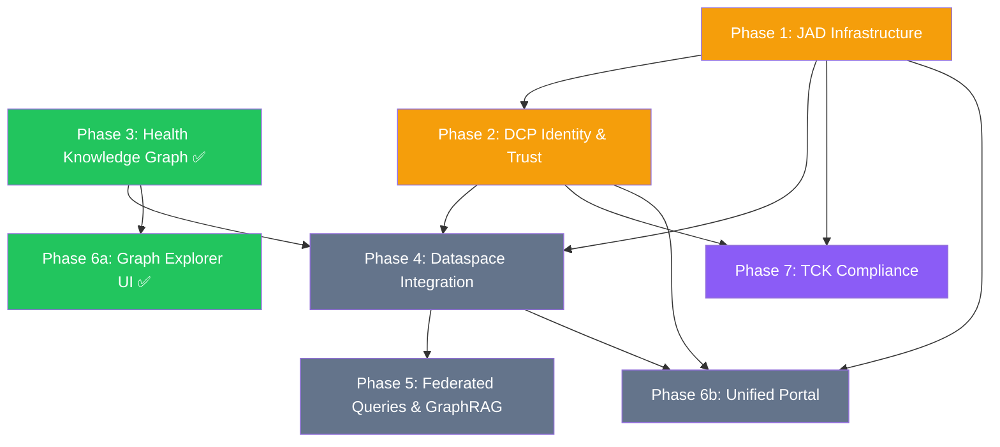

# Planning: Health Dataspace v2

## Background & Inspiration

This project is contextualised by:
[European Health Dataspaces, Digital Twins: A Journey from FHIR Basics to Intelligent Patient Models](https://www.linkedin.com/pulse/european-health-dataspaces-digital-twins-journey-fhir-buchhorn-roth-8t51c/)

The Eclipse Dataspace ecosystem has undergone a fundamental architectural evolution since the first health demo. Three new projects change how dataspaces are built and operated — the [MinimumViableDataspace health demo](https://github.com/ma3u/MinimumViableDataspace/tree/health-demo) needs to evolve with them.

---

## New EDC Component Architecture

The original MVD used a monolithic EDC Connector with an embedded data plane. The new architecture disaggregates this into purpose-built components:

| Component                          | Project                                                                                    | Purpose                                                           | Key Change                                                                                                                                                                       |
| ---------------------------------- | ------------------------------------------------------------------------------------------ | ----------------------------------------------------------------- | -------------------------------------------------------------------------------------------------------------------------------------------------------------------------------- |
| **EDC-V** (Virtual Connector)      | [eclipse-edc/Virtual-Connector](https://github.com/eclipse-edc/Virtual-Connector)          | Virtualized control plane optimized for cloud service providers   | Multi-tenant isolation, participant-scoped APIs, provisioning system integration [github](https://github.com/eclipse-edc/Virtual-Connector/blob/main/docs/administration_api.md) |
| **DCore** (Data Plane Core)        | [Eclipse Data Plane Core](https://projects.eclipse.org/projects/technology.dataplane-core) | Multi-language data plane SDKs (Go, Java, .NET, Rust, TypeScript) | Rust-based HTTP data plane, Data Plane Signaling spec compliance [projects.eclipse](https://projects.eclipse.org/proposals/eclipse-data-plane-core)                              |
| **CFM** (Connector Fabric Manager) | [Eclipse CFM](https://projects.eclipse.org/proposals/eclipse-cfm)                          | Management plane for multi-tenant connector orchestration         | Tenant Manager + Provision Manager, multi-role UI (operator, reseller, end user) [projects.eclipse](https://projects.eclipse.org/proposals/eclipse-connector-fabric-manager)     |
| **JAD** (Joint Architecture Demo)  | [Metaform/jad](https://github.com/Metaform/jad)                                            | Reference demonstrator combining EDC-V + CFM + DCore + onboarding | Replaces old MVD as the canonical demo for cloud provider deployments [linkedin](https://www.linkedin.com/posts/mbuchhorn_fulcrum-daas-edc-activity-7427340949279809536-OaG6)    |

EDC-V is not a monolith — it consists of multiple services with separate administration APIs, strictly enforcing isolation boundaries between participants to prevent data leakage. The CFM sits above EDC-V as an automated provisioning system that handles keypair generation, DID document creation, and Verifiable Credential issuance when new participants onboard. [projects.eclipse](https://projects.eclipse.org/proposals/eclipse-connector-fabric-manager)

### Protocol Foundation: DSP + DCP + DPS

All three core specifications are now final or near-final:

- **DSP 2025-1** (Dataspace Protocol) — Catalog access, contract negotiation, and transfer management over RESTful HTTPS. Normative JSON schemas for all message payloads. Technology Compatibility Kit with 140+ test cases passed by both EDC and TNO connectors. [internationaldataspaces](https://internationaldataspaces.org/dataspace-protocol-nears-first-official-release/)
- **DCP v1.0** (Decentralized Claims Protocol) — Self-issued identity tokens, Verifiable Credential storage/presentation, and credential issuance protocols. Released July 2025 with 119 merged PRs from 12 organizations. [projects.eclipse](https://projects.eclipse.org/projects/technology.dataspace-dcp/releases/1.0.0)
- **DPS** (Data Plane Signaling) — Signaling interface between control plane and data plane, enabling independently deployed and scaled DCore data planes. DCore implements this specification natively. [projects.eclipse](https://projects.eclipse.org/proposals/eclipse-data-plane-core)

---

## Implementation Progress

| Phase  | Title                                                  | Status         | Notes                                                                                            |
| ------ | ------------------------------------------------------ | -------------- | ------------------------------------------------------------------------------------------------ |
| **1**  | Infrastructure Migration (EDC-V + DCore + CFM)         | � In progress  | Phase 1c complete: docker-compose.jad.yml + configs + bootstrap script + OpenAPI client setup    |
| **2**  | Identity and Trust (DCP v1.0 + Verifiable Credentials) | 🔲 Not started | Depends on Phase 1                                                                               |
| **3**  | Health Knowledge Graph Layer — Schema & Synthetic Data | ✅ Complete    | 5-layer Neo4j schema, EHDS HDAB chain, style sheet                                               |
| **3b** | Real FHIR Data Pipeline (Synthea → Neo4j → OMOP)       | ✅ Complete    | 127 patients · 3,031 encounters · 1,045 conditions · 19,195 observations · 2,232 drug Rxes       |
| **3c** | HealthDCAT-AP Metadata Registration for FHIR Dataset   | ✅ Complete    | Synthea cohort registered as HealthDCAT-AP catalog entry; 2 distributions + EHDS Art 53 purpose  |
| **3d** | README + UI completeness hardening                     | ✅ Complete    | README step order fixed; catalog UI shows datasetType/legalBasis/recordCount                     |
| **3e** | DSP Marketplace Registration + Compliance Chain        | ✅ Complete    | Layer 1 DataProduct/Contract/HDABApproval wired to Synthea dataset; compliance UI live dropdowns |
| **3f** | OMOP Research Analytics View                           | ✅ Complete    | Layer 4 cohort dashboard: top conditions/drugs/measurements, gender breakdown, stat cards        |
| **3g** | Procedure Pipeline + UI Polish                         | ✅ Complete    | 8,534 Procedure → OMOPProcedureOccurrence; Analytics card on home; 6-stat patient page           |
| **3h** | EEHRxF FHIR Profile Alignment                          | ✅ Complete    | EEHRxF category/profile nodes; gap analysis UI; EHDS priority coverage                           |
| **4**  | Dataspace Integration (EDC-V ↔ Neo4j data assets)     | 🔲 Not started | Depends on Phases 1, 2, 3c                                                                       |
| **5**  | Federated Queries & GraphRAG                           | 🔲 Not started | Depends on Phase 4                                                                               |
| **6a** | Graph Explorer UI (Next.js → Neo4j Bolt)               | ✅ Complete    | Four views; runs at localhost:3000                                                               |
| **6b** | Full Participant Portal (Aruba + Fraunhofer + Redline) | 🔲 Not started | Depends on Phases 1–4                                                                            |
| **7**  | TCK DCP & DSP Compliance Verification                  | 🔲 Not started | Protocol conformance testing; depends on Phases 1–2                                              |

---

## Implementation Roadmap

### Phase 1: Infrastructure Migration (JAD-Based)

Phase 1 bootstraps the full EDC-V + DCore + CFM stack using the [JAD (Joint Architecture Demo)](https://github.com/Metaform/jad) as the reference deployment. JAD provides pre-built container images, Kubernetes manifests, and automated end-to-end tests — we adapt its infrastructure to serve the health dataspace domain.

#### 1a: JAD Local Deployment

1. Set up **KinD** (Kubernetes in Docker) cluster with Traefik Gateway API ingress as per JAD's `deployment/kind/` manifests
2. Deploy JAD's 11 core services from pre-built **GHCR images** (`ghcr.io/metaform/jad/*`):
   - `controlplane` — EDC-V virtualized control plane (DSP + admin APIs)
   - `dataplane` — DCore HTTP data plane (Data Plane Signaling)
   - `identityhub` — DCP v1.0 credential storage and presentation
   - `issuerservice` — Verifiable Credential issuance (trust anchor)
   - `keycloak` — OAuth2/OIDC identity provider (PKCE flows)
   - `vault` — HashiCorp Vault for secret management
   - `postgres` — Persistent storage for EDC-V state
   - `nats` — Event messaging bus
   - `cfm-tenant-manager` — Multi-tenant participant lifecycle
   - `cfm-provision-manager` — Automated resource provisioning
   - `cfm-agents` — Background provisioning agents
3. Validate deployment with JAD's **Bruno API collection** (interactive testing) and automated smoke tests

#### 1b: Health-Specific Tenant Configuration

4. Configure three tenant profiles via CFM Tenant Manager API:
   - **Clinic** (`clinic-charité`) — data provider publishing FHIR R4 patient data
   - **CRO** (`cro-bayer`) — data consumer requesting OMOP research queries
   - **HDAB** (`hdab-bfarm`) — intermediary operating HealthDCAT-AP catalog + SPE
5. Configure CFM Provision Manager to automatically provision per-tenant:
   - EDC-V control plane instance (participant-scoped DSP endpoint)
   - DCore data plane instance (FHIR HTTP transfer + query result streaming)
   - IdentityHub instance (DID:web document + credential wallet)
6. Wire the existing **Neo4j Health Knowledge Graph** as a data source:
   - Register Cypher query endpoint as a DSP Data Asset on the Clinic's EDC-V instance
   - Register HealthDCAT-AP catalog metadata on the HDAB's Federated Catalog

#### 1c: Docker Compose Development Profile

7. Create `docker-compose.jad.yml` extending the existing `docker-compose.yml`:
   - Adds JAD services alongside Neo4j for **local development without KinD**
   - Maps JAD service ports to localhost (controlplane:11003, identityhub:11005, keycloak:8080)
   - Shares the `neo4j-data` Docker volume with the EDC-V data plane
   - Configures Traefik routing to match KinD Gateway API routes
8. Create `scripts/bootstrap-jad.sh` automation script:
   - Checks prerequisites (Docker, KinD or docker-compose)
   - Pulls latest JAD GHCR images
   - Initializes Keycloak realm with health-specific roles
   - Provisions the three tenant profiles via CFM API
   - Runs Neo4j schema initialization + Synthea data load
   - Validates end-to-end with JAD's E2E test suite

#### 1d: OpenAPI TypeScript Client Generation

9. Generate typed TypeScript API clients from JAD's OpenAPI specifications:
   - **EDC-V Admin API** — participant management, data asset registration, policy CRUD
   - **EDC-V DSP API** — catalog queries, contract negotiation, transfer processes
   - **CFM Tenant Manager API** — tenant CRUD, provisioning status, lifecycle events
   - **CFM Provision Manager API** — provisioning triggers, status polling, resource inventory
   - **IdentityHub API** — DID resolution, credential storage, presentation exchange
   - **IssuerService API** — credential issuance requests, schema management
10. Use `openapi-typescript-codegen` or `openapi-generator-cli` with TypeScript-fetch template
11. Publish clients as `ui/src/lib/edc/` module for use by Next.js API routes and client components

**Deliverables:** Full EDC-V + CFM + DCore stack running locally; 3 health-specific tenants provisioned; OpenAPI TypeScript clients generated; existing Neo4j graph accessible via EDC-V data plane.

### Phase 2: Identity and Trust (DCP v1.0)

Phase 2 implements the full DCP v1.0 credential lifecycle using JAD's IdentityHub and IssuerService, then adds EHDS-specific credential types.

#### 2a: DID:web and Verifiable Credential Setup

5. Configure **DID:web** identifiers for each tenant (auto-provisioned by CFM in Phase 1):
   - `did:web:clinic-charite.localhost` → Clinic's IdentityHub
   - `did:web:cro-bayer.localhost` → CRO's IdentityHub
   - `did:web:hdab-bfarm.localhost` → HDAB's IdentityHub
6. Configure the **IssuerService** as the trust anchor (simulating an EHDS-recognized authority):
   - Define credential schemas for `MembershipCredential` (dataspace membership attestation)
   - Configure Keycloak realm roles mapping to credential issuance policies
   - Set up credential revocation list (StatusList2021)
7. Implement the DCP **Credential Issuance** flow:
   - Participant registers via onboarding portal → CFM creates tenant → IssuerService issues `MembershipCredential`
   - IdentityHub stores issued credentials and exposes DID document at `.well-known/did.json`

#### 2b: EHDS-Specific Credential Types

8. Define and register EHDS health domain credentials:
   - `EHDSParticipantCredential` — proof of HDAB registration (issued to Clinics and CROs by the HDAB)
   - `DataProcessingPurposeCredential` — EHDS Article 53 permitted purpose attestation (research, public health, etc.)
   - `DataQualityLabelCredential` — attests to data quality metrics (completeness, conformance to EEHRxF)
9. Implement DCP **Credential Presentation** during DSP contract negotiation:
   - CRO presents `EHDSParticipantCredential` + `DataProcessingPurposeCredential` to Clinic's EDC-V
   - Clinic's EDC-V validates credentials via IdentityHub before proceeding with contract agreement
   - Policy engine uses **CEL (Common Expression Language)** rules (as used by JAD) to evaluate credential claims
10. Add credential verification to the **Compliance UI** (`/compliance`):
    - Display VC status (valid/expired/revoked) alongside HDAB approval chain
    - Show trust chain: IssuerService → IdentityHub → Credential Presentation → Policy Evaluation

#### 2c: Keycloak SSO Integration

11. Configure **Keycloak** for unified authentication across all portals:
    - Single realm `health-dataspace` with client registrations for Next.js UI and EDC-V Admin API
    - PKCE authorization code flow for browser-based login (follows Aruba portal's pattern)
    - Service account flow for backend-to-backend API calls (Next.js API routes → EDC-V)
    - Role mapping: `EDC_ADMIN` (operator), `EDC_USER_PARTICIPANT` (clinic/CRO user), `HDAB_AUTHORITY` (regulator)
12. Integrate **NextAuth.js** with Keycloak provider in the Next.js app:
    - Session management with JWT tokens containing EDC-V participant context
    - Role-based route protection: `/admin/*` requires `EDC_ADMIN`, `/onboarding` requires authenticated, `/compliance` requires `HDAB_AUTHORITY`

**Deliverables:** DID:web identifiers for all participants; EHDS-specific VCs issued and stored; credential presentation integrated into DSP negotiation; Keycloak SSO protecting all UI views.

### Phase 3: Health Knowledge Graph Layer ✅

8. Deploy Neo4j with the [5-layer health graph schema](health-dataspace-graph-schema.md)
9. Implement **FHIR-to-Graph ingestion** pipeline:
   - Generate synthetic patient data with [Synthea](https://github.com/synthetichealth/synthea)
   - Load FHIR Bundles via CyFHIR into Neo4j
   - Create `CODED_BY` relationships to SNOMED CT / LOINC ontology nodes via neosemantics
10. Implement **HealthDCAT-AP metadata** layer:
    - Register datasets as HealthDCAT-AP RDF triples using rdflib-neo4j
    - Expose metadata via the EDC-V Federated Catalog extension
11. Implement **FHIR → OMOP transformation** pipeline for secondary use analytics

### Phase 3b: Real FHIR Data Pipeline ✅

Scripts in `scripts/` automate the full pipeline:

1. **Generate cohort** — `scripts/generate-synthea.sh [N]`
   - Downloads Synthea JAR (v3.3.0) on first run
   - Generates N patients (default 50) using all Synthea modules (chronic conditions emerge naturally)
   - Outputs FHIR R4 JSON bundles to `neo4j/import/fhir/`
2. **Load into Neo4j** — `python3 scripts/load_fhir_neo4j.py`
   - UNWIND bulk upserts: 1 Cypher call per resource type per bundle (handles 37K+ observations efficiently)
   - Parses: `Patient`, `Encounter`, `Condition`, `Observation`, `MedicationRequest`
   - Creates `CODED_BY` links to SNOMED CT / LOINC / RxNorm concepts; links patients to `HealthDataset`
3. **FHIR → OMOP transform** — `neo4j/fhir-to-omop-transform.cypher`
   - Creates: `OMOPPerson`, `OMOPVisitOccurrence`, `OMOPConditionOccurrence`, `OMOPMeasurement`, `OMOPDrugExposure`
   - Adds `MAPPED_TO` (FHIR → OMOP) and `CODED_BY` (OMOP → SNOMED/LOINC/RxNorm) relationships

**Current graph state (50-patient Synthea cohort, Massachusetts):**

| Layer 3 FHIR      | Count  | Layer 4 OMOP            | Count |
| ----------------- | ------ | ----------------------- | ----- |
| Patient           | 127\*  | OMOPPerson              | 127   |
| Encounter         | 3,031  | OMOPVisitOccurrence     | 3,031 |
| Condition         | 1,045  | OMOPConditionOccurrence | 1,045 |
| Observation       | 19,195 | OMOPMeasurement         | 737   |
| MedicationRequest | 2,232  | OMOPDrugExposure        | 2,232 |

_\* 127 includes deceased patients generated by Synthea alongside the 50 living target patients._

The Graph Explorer UI (`/graph` and `/patient`) immediately reflects the real patient data.

### Phase 3c: HealthDCAT-AP Metadata Registration ✅

The Synthea cohort loaded in Phase 3b needs a corresponding **Layer 2** catalog entry so EDC-V can expose it as a discoverable data asset. This is implemented as an idempotent Cypher script:

- `neo4j/register-fhir-dataset-hdcatap.cypher` — creates/updates the `HealthDataset` node with full HealthDCAT-AP properties (title, description, publisher, temporal coverage, spatial coverage, themes, access conditions)
- Links the dataset to all 127 `Patient` nodes via `FROM_DATASET`
- Registers a `DataDistribution` node (Bolt + REST endpoints) so EDC-V can reference the access URL
- Adds EHDS purpose restriction annotation (Article 53 permitted purposes)

### Phase 3d: README and UI Completeness Hardening ✅

With Phases 3–3c forming a working end-to-end local stack (Synthea → Neo4j → OMOP → HealthDCAT-AP → UI), the documentation and UI were brought to match:

**README (`README.md`):**

- Corrected step numbering (Phase 3b → Step 9, Phase 3c → Step 10, UI → Step 11)
- Removed stale “Type 2 Diabetes cohort” reference — all Synthea modules now run
- Added Phase 3c CLI invocation and expected outcome
- Added new `register-fhir-dataset-hdcatap.cypher` to the directory structure listing
- Added expected row-count table for the 50-patient cohort

**Dataset Catalog UI (`/catalog`):**

- Card now shows `datasetType` badge (e.g. `SyntheticData`)
- Card footer shows `legalBasis` in green (mapped to human-readable label, e.g. “EHDS Art. 53”)
- Card footer shows `recordCount` (patient count from live Neo4j graph)
- Filter now also searches `description` text

### Phase 3e: DSP Marketplace Registration + Compliance Chain ✅

With the Synthea FHIR dataset registered in HealthDCAT-AP (Phase 3c), Phase 3e wires the full Layer 1 DSP marketplace chain and fixes the EHDS compliance checker UI.

**DSP Marketplace Cypher (`neo4j/register-dsp-marketplace.cypher`):**

- MERGEs three Participants: `Charité Berlin` (CLINIC), `Bayer Research` (CRO), `BfArM` (HDAB)
- Creates `DataProduct {productId: 'product-synthea-fhir-r4-2026'}` → `[:DESCRIBED_BY]` → `HealthDataset {id: 'dataset:synthea-fhir-r4-mvd'}`
- Creates `OdrlPolicy` with EHDS Art.53 `researchPurpose` permission and re-identification `prohibition`
- Creates `Contract` → `[:GOVERNS]` → DataProduct
- Creates `AccessApplication` (status: `APPROVED`) and `HDABApproval` with relationships:
  - `[:APPROVES]` → AccessApplication
  - `[:APPROVED]` → Contract
  - `[:GRANTS_ACCESS_TO]` → HealthDataset ← key relationship enabling compliance check
- Verification RETURN confirms full chain: consumer, applicationStatus, approvalId, EHDS article, dataset

**Compliance API (`ui/src/app/api/compliance/route.ts`):**

- Added list mode (no query params → returns `{consumers, datasets}` for UI dropdowns)
- Fixed participant lookup: `coalesce(participantId, id) = $consumerId`
- Fixed chain path: `(approval:HDABApproval)-[:APPROVES]->(app)` then `(approval)-[:GRANTS_ACCESS_TO]->(dataset)`
- Fixed contract path: `Contract -[:GOVERNS]-> DataProduct -[:DESCRIBED_BY]-> HealthDataset`

**Compliance UI (`ui/src/app/compliance/page.tsx`):**

- Replaced static text inputs with dropdowns populated from live graph
- Shows consumer name + participantId, dataset title + id
- Result table adds `Contract` column alongside Application / Approval / EHDS Article

### Phase 3f: OMOP Research Analytics View ✅

With five Neo4j OMOP CDM layers populated (Phase 3b), Phase 3f adds a cohort-level research analytics view demonstrating EHDS Article 53 secondary use.

**Analytics API (`ui/src/app/api/analytics/route.ts`):**

- Queries five OMOP node types in parallel: `OMOPPerson`, `OMOPConditionOccurrence`, `OMOPDrugExposure`, `OMOPMeasurement`, `OMOPVisitOccurrence`
- Returns summary counts, top-15 conditions/drugs/measurements by occurrence, and gender breakdown
- Uses `Promise.all` for parallel Neo4j queries

**Analytics UI (`ui/src/app/analytics/page.tsx`):**

- Five stat cards (patients, conditions, drugs, measurements, visits)
- Gender distribution breakdown with percentages
- Three horizontal bar chart sections: Top Conditions, Top Drug Exposures, Top Measurements
- Colour-coded by graph layer: Layer 3 (teal) for conditions, Layer 4 (purple) for drugs, Layer 5 (orange) for measurements

**Navigation:** Added `/analytics` (OMOP Analytics) as fifth nav item with `BarChart2` icon.

### Phase 3g: Procedure Pipeline + UI Polish ✅

Synthea generates ~43 Procedure resources per patient (96% SNOMED CT, 4% ADA CDT) that were previously dropped during FHIR ingestion. Phase 3g closes this gap across the full pipeline.

**FHIR Loader (`scripts/load_fhir_neo4j.py`):**

- Added `UPSERT_PROCEDURES` and `LINK_PROCEDURES_SNOMED` bulk Cypher templates
- Parses Procedure resources: id, code, display, system, performedStart, performedEnd, status
- Creates `(:Patient)-[:HAS_PROCEDURE]->(:Procedure)` and `(:Procedure)-[:CODED_BY]->(:SnomedConcept)` relationships
- Result: 8,534 Procedure nodes upserted from 66 bundles

**Schema (`neo4j/init-schema.cypher`):**

- `CREATE CONSTRAINT procedure_id` (uniqueness)
- `CREATE INDEX procedure_code` (lookup)
- `CREATE CONSTRAINT omop_procedure_occurrence_id` (uniqueness)
- `CREATE INDEX omop_procedure_concept` (lookup)

**OMOP Transform (`neo4j/fhir-to-omop-transform.cypher`):**

- Section 6: `(:Procedure) → (:OMOPProcedureOccurrence)` with `(:OMOPPerson)-[:HAS_PROCEDURE_OCCURRENCE]->` relationships
- SNOMED vocabulary bridge: `(:OMOPProcedureOccurrence)-[:CODED_BY]->(:SnomedConcept)` — 7,768 links
- Result: 8,534 OMOPProcedureOccurrence nodes created

**UI Changes:**

- Home page: Added Analytics card (5th navigation tile)
- Graph explorer: Added Procedure (Layer 3) and OMOPProcedureOccurrence (Layer 4) to force-directed graph
- Analytics dashboard: Added Procedures stat card + Top Procedures bar chart; grid changed to 6-column
- Patient journey: Added Procedures stat badge (6 badges); Procedure events in timeline with purple (#7D3C98) colour

**Updated Node Counts:**

| FHIR Layer (3)    | Count     | OMOP Layer (4)              | Count     |
| ----------------- | --------- | --------------------------- | --------- |
| Patient           | 167       | OMOPPerson                  | 167       |
| Encounter         | 5,461     | OMOPVisitOccurrence         | 5,461     |
| Condition         | 2,421     | OMOPConditionOccurrence     | 2,421     |
| Observation       | 37,713    | OMOPMeasurement             | 34,203    |
| MedicationRequest | 3,895     | OMOPDrugExposure            | 3,895     |
| **Procedure**     | **8,534** | **OMOPProcedureOccurrence** | **8,534** |

### Phase 3h: EEHRxF FHIR Profile Alignment

The **European Electronic Health Record Exchange Format (EEHRxF)** was established by [Commission Recommendation C(2019)800](https://digital-strategy.ec.europa.eu/en/library/recommendation-european-electronic-health-record-exchange-format) of 6 February 2019. The [EHDS Regulation](https://health.ec.europa.eu/ehealth-digital-health-and-care/european-health-data-space_en) (entered into force 26 March 2025) elevates EEHRxF as the standard exchange format for 6 priority categories of electronic health data, with phased rollout:

| #   | Priority Category              | EHDS Deadline | Group |
| --- | ------------------------------ | ------------- | ----- |
| 1   | Patient Summaries              | March 2029    | 1     |
| 2   | ePrescriptions / eDispensation | March 2029    | 1     |
| 3   | Laboratory Results             | March 2031    | 2     |
| 4   | Hospital Discharge Reports     | March 2031    | 2     |
| 5   | Medical Images / Reports       | March 2031    | 2     |
| 6   | Rare Disease Registration      | TBD           | 3     |

**HL7 Europe** publishes FHIR R4 Implementation Guides that provide the technical specifications for EEHRxF, supported by the **Xt-EHR Joint Action** for EHDS alignment:

| Implementation Guide               | Package                          | FHIR | Status  | URL                                           |
| ---------------------------------- | -------------------------------- | ---- | ------- | --------------------------------------------- |
| Base and Core Profiles             | `hl7.fhir.eu.base#0.1.0`         | R4   | STU 1.0 | https://hl7.eu/fhir/base/                     |
| Laboratory Report                  | `hl7.fhir.eu.laboratory#0.1.1`   | R4   | STU 1.1 | https://hl7.eu/fhir/laboratory/               |
| Hospital Discharge Report          | `hl7.fhir.eu.hdr#1.0.0-ci-build` | R4   | Ballot  | https://build.fhir.org/ig/hl7-eu/hdr/         |
| Medication Prescription & Dispense | `hl7.fhir.eu.mpd`                | R4   | Ballot  | https://build.fhir.org/ig/hl7-eu/medications/ |
| Imaging Study Report               | `hl7.fhir.eu.imaging`            | R5   | Ballot  | https://build.fhir.org/ig/hl7-eu/imaging/     |
| Extensions                         | `hl7.fhir.eu.extensions#0.1.0`   | R4   | STU 1.2 | https://hl7.eu/fhir/extensions/               |

**Implementation scope:** Phase 3h adds `EEHRxFProfile` and `EEHRxFCategory` nodes to the knowledge graph, maps them to existing FHIR resources, and provides a gap analysis showing which priority categories the current Synthea data partially or fully covers.

**Graph Schema Additions:**

- `EEHRxFCategory` — EHDS priority category (Patient Summary, Lab Results, etc.)
- `EEHRxFProfile` — HL7 Europe FHIR profile (PatientEuCore, DiagnosticReportLabEu, etc.)
- `(:EEHRxFProfile)-[:PART_OF_CATEGORY]->(:EEHRxFCategory)` — profile → category
- `(:EEHRxFProfile)-[:PROFILES_RESOURCE]->(resource)` — profile → FHIR resource type in graph

**Cypher Script (`neo4j/register-eehrxf-profiles.cypher`):**

- Creates 6 EEHRxFCategory nodes (one per EHDS priority)
- Creates EEHRxFProfile nodes for the 14 key HL7 Europe profiles across all published IGs
- Maps profiles to existing FHIR resource types via `PROFILES_RESOURCE` relationships
- Calculates coverage status per category based on available FHIR data

**EEHRxF API (`ui/src/app/api/eehrxf/route.ts`):**

- Returns all categories with profile coverage (profiles, matched resource counts, coverage %)
- Returns individual profile details with gap analysis (required vs present fields)

**EEHRxF UI (`ui/src/app/eehrxf/page.tsx`):**

- Priority category cards with EHDS deadline badges and coverage indicators
- Profile-level detail showing which FHIR resources match each EU profile
- EHDS implementation timeline visualization (2025 → 2031)
- Gap analysis highlighting missing resources (e.g., DiagnosticReport, ImagingStudy)

### Phase 4: Dataspace Integration (EDC-V ↔ Neo4j)

Phase 4 wires the Neo4j health knowledge graph into the live EDC-V data plane, enabling full DSP contract negotiation and credentialed data access.

#### 4a: Data Asset Registration

12. Register Neo4j data assets on the Clinic's EDC-V instance via the generated TypeScript Admin API client:
    - **FHIR Cohort Asset** — Cypher query endpoint returning FHIR R4 patient bundles
    - **OMOP Analytics Asset** — Cypher query endpoint returning OMOP CDM aggregated results
    - **HealthDCAT-AP Catalog Asset** — Metadata endpoint for federated catalog discovery
13. Define **ODRL usage policies** per asset:
    - EHDS purpose restriction (Article 53 permitted purposes array)
    - Temporal access limits (e.g., 90-day research window)
    - Anonymization requirements (k-anonymity threshold for cohort queries)
    - Re-identification prohibition (as currently modeled in `OdrlPolicy` graph nodes)

#### 4b: Contract Negotiation Flow

14. Implement end-to-end DSP contract negotiation:
    - CRO discovers FHIR Cohort Asset via HDAB Federated Catalog
    - CRO initiates `ContractNegotiation` request with `DataProcessingPurposeCredential` presentation
    - HDAB validates EHDS compliance (credential verification + policy evaluation via CEL)
    - Contract agreed → `TransferProcess` initiated → DCore data plane provisions query endpoint
15. Capture contract lifecycle events in Neo4j provenance graph:
    - `(:Contract)-[:NEGOTIATED_BY]->(:Participant)` with timestamps
    - `(:TransferProcess)-[:GOVERNED_BY]->(:Contract)` linking data flows to legal basis

#### 4c: Federated Catalog with HealthDCAT-AP

16. Configure HDAB's EDC-V **Federated Catalog** extension:
    - Clinic publishes HealthDCAT-AP dataset descriptions to HDAB catalog
    - CRO discovers available cohorts via DSP catalog request protocol
    - CFM orchestrates catalog federation across multiple HDAB instances
17. Expose Federated Catalog via the `/catalog` UI view (extending Phase 6a):
    - Live catalog queries via EDC-V DSP API (replacing mock data in production mode)
    - Show dataset provenance: publisher participant + access conditions + credential requirements

#### 4d: Data Plane Transfer via DCore

18. Configure DCore Rust data plane for FHIR transfer:
    - HTTP push/pull transfer types for FHIR Bundle JSON streaming
    - Data Plane Signaling (DPS) for control plane → data plane coordination
    - Transfer audit log: `(:TransferProcess)-[:ACCESSED]->(asset)` stored in Neo4j
19. Implement query result proxying:
    - CRO sends parameterized Cypher query via DCore HTTP endpoint
    - DCore enforces contract-scoped access (only permitted OMOP aggregation queries)
    - Query results streamed back through DCore with transfer completion signaling

**Deliverables:** Neo4j assets registered in EDC-V; DSP contract negotiation working end-to-end; Federated Catalog exposing HealthDCAT-AP metadata; DCore handling FHIR transfers with audit trail.

### Phase 5: Federated Queries and GraphRAG

15. Deploy two separate Neo4j instances (simulating two HDAB SPEs)
16. Configure **Neo4j Composite Database** for federated Cypher queries across both instances
17. Implement **Privacy-Preserving Multiparty Query** layer using SMPC protocols
18. Add **GraphRAG interface** for natural language querying of patient journeys:
    - Neo4j Text2Cypher for natural language → Cypher translation
    - Vector embeddings for semantic search across clinical narratives
    - Structured + unstructured retrieval for comprehensive patient context

### Phase 6a: Graph Explorer UI ✅

Deployed as a standalone Next.js 14 web app connecting directly to Neo4j Bolt — no EDC-V dependency, immediately useful for demos and stakeholder review.

| View            | Path          | Description                                        |
| --------------- | ------------- | -------------------------------------------------- |
| Graph Explorer  | `/graph`      | Force-directed graph of all 5 architecture layers  |
| Dataset Catalog | `/catalog`    | HealthDCAT-AP metadata browser                     |
| EHDS Compliance | `/compliance` | HDAB approval chain validator (Articles 45–52)     |
| Patient Journey | `/patient`    | FHIR R4 → OMOP CDM event timeline                  |
| OMOP Analytics  | `/analytics`  | Cohort-level OMOP CDM research analytics dashboard |

### Phase 6b: Unified Participant Portal (Next.js)

Phase 6b consolidates the onboarding and management functionality from three reference implementations — [Aruba Participant Portal](https://github.com/Aruba-it-S-p-A/edc-public-participant-portal) (Angular 20), [Fraunhofer End-User API](https://github.com/FraunhoferISST/End-User-API) (Angular + daisyUI), and [Dataspace Builder Redline](https://dataspacebuilder.github.io/website/docs/components/redline) — into the existing **Next.js 14** application. This avoids running three separate frontend stacks and leverages the 6 views already built in Phase 6a.

#### Technology Decision: Next.js 14 as Unified Frontend

| Criteria             | Next.js 14 (existing)             | Angular 20 (Aruba/Fraunhofer) | Decision                           |
| -------------------- | --------------------------------- | ----------------------------- | ---------------------------------- |
| Existing investment  | 6 views, 8 API routes, mock layer | None in this project          | **Next.js** — avoid rewrite        |
| Styling              | Tailwind CSS                      | Tailwind CSS (both)           | Compatible — port styles directly  |
| API integration      | Next.js API routes → Neo4j        | REST fetch + mock server      | Next.js routes also serve EDC-V    |
| Static export        | `output: "export"` for GH Pages   | nginx static build            | Next.js already configured         |
| SSR/ISR              | Full support                      | Not applicable (SPA)          | **Next.js** — SEO + performance    |
| Auth                 | NextAuth.js ecosystem             | Keycloak PKCE (custom)        | NextAuth.js with Keycloak provider |
| EDC client libraries | OpenAPI-generated TS-fetch        | `edc-connector-client` (npm)  | Both usable; prefer typed clients  |

**Decision:** Remain on Next.js 14. Port the Aruba and Fraunhofer Angular UIs into Next.js pages, reusing their REST API patterns, Tailwind CSS layouts, and Keycloak authentication flow.

#### 6b-1: Participant Onboarding Portal (from Aruba)

Ported from Aruba's Angular self-registration flow into Next.js:

| New Route            | Source                                | Description                                         |
| -------------------- | ------------------------------------- | --------------------------------------------------- |
| `/onboarding`        | Aruba `RegistrationComponent`         | Self-registration form: org name, DID, contact info |
| `/onboarding/status` | Aruba `DashboardComponent`            | Registration status tracker, pending approvals      |
| `/credentials`       | Aruba `CredentialManagementComponent` | View/request/revoke Verifiable Credentials          |
| `/settings`          | Aruba `AccountSettingsComponent`      | Participant profile, API keys, notification prefs   |

**API routes backing onboarding:**

- `POST /api/participants` → CFM Tenant Manager API (create participant tenant)
- `GET /api/participants/me` → EDC-V Admin API (current participant profile)
- `PUT /api/participants/me` → CFM Tenant Manager API (update participant)
- `POST /api/credentials/request` → IssuerService API (request VC issuance)
- `GET /api/credentials` → IdentityHub API (list stored credentials)

**Keycloak integration:** Follows Aruba's PKCE pattern via NextAuth.js Keycloak provider. Registration creates both a Keycloak user and a CFM tenant. Roles `EDC_ADMIN` and `EDC_USER_PARTICIPANT` gate access.

#### 6b-2: Data Sharing & Discovery Portal (from Fraunhofer)

Ported from Fraunhofer's Angular + EDC Data Dashboard into Next.js:

| New Route        | Source                                    | Description                                         |
| ---------------- | ----------------------------------------- | --------------------------------------------------- |
| `/data/share`    | Fraunhofer `DataSharingComponent`         | Publish data assets with usage policies             |
| `/data/discover` | Fraunhofer `DataDiscoveryComponent`       | Browse federated catalog, initiate negotiations     |
| `/data/transfer` | Fraunhofer `TransferManagementComponent`  | Monitor active/completed transfers                  |
| `/negotiate`     | Fraunhofer `ContractNegotiationComponent` | Contract negotiation wizard with credential prompts |

**API routes backing data sharing:**

- `POST /api/assets` → EDC-V Admin API (register data asset)
- `GET /api/catalog` → EDC-V DSP API (federated catalog query) — extends existing `/api/catalog`
- `POST /api/negotiations` → EDC-V DSP API (initiate contract negotiation)
- `GET /api/negotiations/:id` → EDC-V DSP API (negotiation status)
- `POST /api/transfers` → EDC-V DSP API (initiate data transfer)
- `GET /api/transfers/:id` → EDC-V DSP API (transfer status)

**EDC client integration:** Uses the OpenAPI-generated TypeScript clients from Phase 1d (`ui/src/lib/edc/`) rather than Fraunhofer's `edc-connector-client` npm package, ensuring consistent typing with the exact JAD API version.

#### 6b-3: Operator Dashboard (from Redline)

| New Route         | Source                     | Description                                   |
| ----------------- | -------------------------- | --------------------------------------------- |
| `/admin`          | Redline operator dashboard | Tenant overview, system health, audit log     |
| `/admin/tenants`  | CFM Tenant Manager         | Manage participant tenants (create/suspend)   |
| `/admin/policies` | Redline policy editor      | ODRL policy templates + CEL rule editor       |
| `/admin/audit`    | Neo4j provenance graph     | Contract negotiation + transfer event history |

**Role requirement:** All `/admin/*` routes require `EDC_ADMIN` role in Keycloak JWT.

#### Updated Navigation Structure

```
┌─────────────────────────────────────────────────────────────┐
│  Health Dataspace v2                                [User ▼]│
├─────────────────────────────────────────────────────────────┤
│  Existing (Phase 6a)          │  New (Phase 6b)             │
│  ─────────────────────        │  ───────────────────        │
│  /graph      Graph Explorer   │  /onboarding  Registration  │
│  /catalog    Dataset Catalog  │  /credentials Credentials   │
│  /compliance EHDS Compliance  │  /data/share  Data Sharing  │
│  /patient    Patient Journey  │  /data/discover Discovery   │
│  /analytics  OMOP Analytics   │  /negotiate   Negotiation   │
│  /eehrxf     EEHRxF Profiles  │  /admin       Operator      │
└─────────────────────────────────────────────────────────────┘
```

**Deliverables:** 10 new Next.js routes implementing Aruba onboarding + Fraunhofer data sharing + Redline operator dashboard; Keycloak SSO protecting all views; EDC-V/CFM/IdentityHub APIs accessible via typed TypeScript clients.

### Phase 7: TCK DCP & DSP Compliance Verification

Phase 7 validates that the Health Dataspace v2 deployment is **protocol-conformant** using the official Technology Compatibility Kits and custom EHDS-specific test suites. This phase runs after Phases 1–2 provide a working EDC-V + DCP stack.

#### 7a: DSP 2025-1 Technology Compatibility Kit

The [DSP 2025-1 specification](https://internationaldataspaces.org/dataspace-protocol-nears-first-official-release/) includes a **TCK with 140+ test cases** that both EDC and TNO connectors have passed. We run these against our health dataspace deployment:

1. **Catalog Protocol Tests** — Verify DSP catalog request/response between CRO → HDAB Federated Catalog
   - `CatalogRequestMessage` / `CatalogAcknowledgementMessage` schema validation
   - Federated catalog crawling across multiple HDAB instances
   - HealthDCAT-AP metadata faithfully represented in DSP catalog responses
2. **Contract Negotiation Tests** — Verify full negotiation lifecycle
   - `ContractOfferMessage` → `ContractNegotiationEventMessage` → `ContractAgreementMessage`
   - Policy evaluation with EHDS-specific ODRL constraints
   - Error handling: negotiation rejection on invalid credentials
3. **Transfer Process Tests** — Verify DPS-compliant data transfer
   - `TransferRequestMessage` → `TransferStartMessage` → `TransferCompletionMessage`
   - Data Plane Signaling between EDC-V control plane and DCore data plane
   - FHIR Bundle HTTP transfer completion and acknowledgment
4. **Message Schema Validation** — All DSP messages conform to normative JSON schemas
   - Request/response payload validation against published JSON Schema definitions
   - HTTP status code compliance (201 Created, 400 Bad Request, etc.)

**Test execution:**

```bash
# Clone DSP TCK
git clone https://github.com/International-Data-Spaces-Association/ids-specification.git
cd ids-specification/tck

# Configure TCK to target our deployment
export DSP_CONNECTOR_URL=https://clinic-charite.localhost/api/dsp
export DSP_CATALOG_URL=https://hdab-bfarm.localhost/api/dsp/catalog

# Run full TCK suite
./gradlew test
```

#### 7b: DCP v1.0 Compliance Tests

The [DCP v1.0 specification](https://projects.eclipse.org/projects/technology.dataspace-dcp/releases/1.0.0) defines credential presentation and issuance protocols. We verify compliance of IdentityHub and IssuerService:

1. **DID Resolution Tests** — Verify DID:web document resolution
   - `GET /.well-known/did.json` returns valid DID Document
   - DID Document contains correct verification methods and service endpoints
   - Cross-participant DID resolution works (CRO resolves Clinic's DID)
2. **Self-Issued Identity Token Tests** — Verify SI token generation and validation
   - Token format conforms to DCP SI Token specification
   - Token contains required claims (iss, sub, aud, iat, exp, jti)
   - Token signature verifiable against DID Document verification method
3. **Credential Presentation Tests** — Verify Verifiable Presentation exchange
   - `PresentationRequestMessage` triggers IdentityHub to assemble VP
   - VP contains requested credential types (`EHDSParticipantCredential`, etc.)
   - Verifier validates VP signature chain: VC issuer → VP holder → DID Document
4. **Credential Issuance Tests** — Verify IssuerService protocol compliance
   - `CredentialRequestMessage` triggers credential issuance
   - Issued VC conforms to W3C Verifiable Credentials Data Model 2.0
   - Credential status (StatusList2021) correctly reports active/revoked

**Test execution:**

```bash
# Run DCP compliance tests against local deployment
cd tests/dcp-compliance

# DID resolution
curl -s https://clinic-charite.localhost/.well-known/did.json | jq '.verificationMethod'

# SI Token validation
npm run test:si-token -- --issuer=did:web:clinic-charite.localhost

# Full presentation exchange
npm run test:presentation -- --verifier=did:web:cro-bayer.localhost \
  --holder=did:web:clinic-charite.localhost \
  --credential-type=EHDSParticipantCredential
```

#### 7c: EHDS Health-Domain Compliance Tests

Custom test suite verifying health-specific requirements not covered by generic DSP/DCP TCKs:

1. **EHDS Article 53 Purpose Enforcement** — Verify that access requests with unauthorized purposes are rejected
   - Submit negotiation with `researchPurpose` → accepted
   - Submit negotiation with `commercialPurpose` → rejected (CEL policy evaluation)
   - Submit negotiation without `DataProcessingPurposeCredential` → rejected
2. **HealthDCAT-AP Schema Compliance** — Verify catalog entries conform to HealthDCAT-AP v3.0
   - DCAT mandatory properties present (title, description, publisher, theme)
   - Health-specific extensions present (healthCategory, healthTheme, legalBasis)
   - EHDS data quality label annotations present
3. **EEHRxF Conformance** — Verify FHIR data transferred via DCore conforms to EEHRxF profiles
   - Patient Summary resources validate against `hl7.fhir.eu.base` profiles
   - Laboratory resources validate against `hl7.fhir.eu.laboratory` profiles
   - Coverage gap report generated per EEHRxF priority category
4. **OMOP CDM Integrity** — Verify FHIR → OMOP transformation correctness
   - All FHIR resources have corresponding OMOP entities (`MAPPED_TO` relationships complete)
   - Vocabulary mappings correct: SNOMED → condition_concept_id, LOINC → measurement_concept_id
   - No orphaned OMOP entities (every OMOPPerson links to at least one clinical event)

#### 7d: Automated CI/CD Compliance Pipeline

5. Add compliance verification to GitHub Actions:

```yaml
# .github/workflows/compliance.yml
name: Protocol Compliance
on:
  push:
    branches: [main]
  schedule:
    - cron: "0 6 * * 1" # Weekly Monday 6am UTC

jobs:
  dsp-tck:
    name: DSP 2025-1 TCK
    runs-on: ubuntu-latest
    steps:
      - uses: actions/checkout@v4
      - name: Start JAD infrastructure
        run: docker compose -f docker-compose.jad.yml up -d --wait
      - name: Run DSP TCK (140+ tests)
        run: ./scripts/run-dsp-tck.sh
      - name: Upload TCK results
        uses: actions/upload-artifact@v4
        with:
          name: dsp-tck-results
          path: test-results/dsp-tck/

  dcp-compliance:
    name: DCP v1.0 Compliance
    runs-on: ubuntu-latest
    steps:
      - uses: actions/checkout@v4
      - name: Start JAD infrastructure
        run: docker compose -f docker-compose.jad.yml up -d --wait
      - name: Run DCP compliance suite
        run: ./scripts/run-dcp-tests.sh
      - name: Upload DCP results
        uses: actions/upload-artifact@v4
        with:
          name: dcp-compliance-results
          path: test-results/dcp/

  ehds-compliance:
    name: EHDS Health Domain
    runs-on: ubuntu-latest
    steps:
      - uses: actions/checkout@v4
      - name: Start full stack
        run: docker compose -f docker-compose.jad.yml up -d --wait
      - name: Run EHDS compliance tests
        run: npm run test:ehds-compliance
      - name: Generate compliance report
        run: npm run report:compliance
```

**Compliance Dashboard:** Results are aggregated into a `/compliance/tck` UI view showing:

- DSP TCK pass/fail matrix (140+ test cases)
- DCP compliance status per participant
- EHDS domain test results with remediation guidance
- Historical compliance trend (from CI runs)

**Deliverables:** DSP 2025-1 TCK passing for all 3 participants; DCP v1.0 compliance verified for IdentityHub + IssuerService; EHDS-specific tests validating Article 53 enforcement + HealthDCAT-AP + EEHRxF; automated weekly CI compliance runs.

---

## Target Architecture

```
┌─────────────────────────────────────────────────────────────┐
│             TCK & Compliance Verification (Phase 7)         │
│  DSP 2025-1 TCK (140+ tests) · DCP v1.0 Suite · EHDS Tests│
└────────────┬──────────────────────────────┬─────────────────┘
             │                              │
┌────────────┴──────────────────────────────┴─────────────────┐
│          Unified Next.js 14 Portal (Phase 6a + 6b)         │
│  Graph Explorer · Catalog · Compliance · Patient · OMOP    │
│  Onboarding · Credentials · Data Sharing · Operator Admin  │
│  (Keycloak SSO via NextAuth.js · OpenAPI TypeScript clients)│
└────────────┬──────────────────────────────┬─────────────────┘
             │                              │
┌────────────┴──────────────────────────────┴─────────────────┐
│                    CFM (Management Plane)                   │
│  Tenant Manager · Provision Manager · Operator API          │
│  Credential Issuance · Lifecycle Management                 │
└────────────┬──────────────────────────────┬─────────────────┘
             │                              │
    ┌────────┴────────┐           ┌────────┴────────┐
    │   EDC-V Clinic  │           │   EDC-V CRO     │
    │  Control Plane  │           │  Control Plane  │
    │  (DSP + DCP)    │           │  (DSP + DCP)    │
    └────────┬────────┘           └────────┬────────┘
             │                              │
    ┌────────┴────────┐           ┌────────┴─────────┐
    │  DCore Rust     │           │  DCore Rust      │
    │  Data Plane     │           │  Data Plane      │
    │  (FHIR HTTP)    │           │  (Query HTTP)    │
    └────────┬────────┘           └────────┴─────────┘
             │                              │
    ┌────────┴──────────────────────────────┴─────────┐
    │              HDAB (Intermediary)                  │
    │  EDC-V Control Plane + Federated Catalog         │
    │  HealthDCAT-AP Metadata · Contract Enforcement   │
    └────────────────────┬────────────────────────────┘
                         │
    ┌────────────────────┴────────────────────────────┐
    │           Neo4j Health Knowledge Graph            │
    │  Layer 1: Marketplace (DSP Contracts)            │
    │  Layer 2: HealthDCAT-AP (Metadata)               │
    │  Layer 3: FHIR Clinical Graph (Patient Data)     │
    │  Layer 4: OMOP Research (Secondary Use)           │
    │  Layer 5: Ontology Backbone (SNOMED/LOINC/ICD)   │
    └──────────────────────────────────────────────────┘
```

---

## What This Proves

When complete, the Health MVD v2 will demonstrate:

1. **End-to-end EHDS compliance** — From participant onboarding (DCP credentials) through contract negotiation (DSP policies) to data access (SPE-enforced queries)
2. **Cloud-native multi-tenancy** — CFM managing multiple EDC-V instances for clinics, CROs, and HDABs on shared infrastructure
3. **Disaggregated data planes** — DCore Rust HTTP planes independently handling FHIR transfers and query results
4. **Federated knowledge graphs** — Cross-HDAB analytics without centralizing patient data
5. **Production-grade schema** — The 5-layer Neo4j health graph model working with real FHIR/OMOP data
6. **Protocol conformance** — DSP 2025-1 TCK passing (140+ test cases), DCP v1.0 compliance verified, EHDS-specific tests validating Article 53 enforcement
7. **Unified portal experience** — Single Next.js 14 app serving participant onboarding (Aruba pattern), data sharing (Fraunhofer pattern), operator admin (Redline pattern), and health knowledge graph exploration

The [JAD demo](https://github.com/Metaform/jad) provides the cloud-provider reference for EDC-V + CFM. The Health MVD v2 extends this with the **domain-specific health knowledge layer** — the piece that makes a generic dataspace into a health dataspace.

---

## Implementation Dependencies



**Critical path:** Phase 1 (JAD infrastructure) → Phase 2 (DCP identity) → Phase 4 (dataspace integration) → Phase 6b (unified portal)

**Parallel track:** Phase 7 (TCK compliance) can begin as soon as Phases 1–2 complete, running in parallel with Phase 4.
