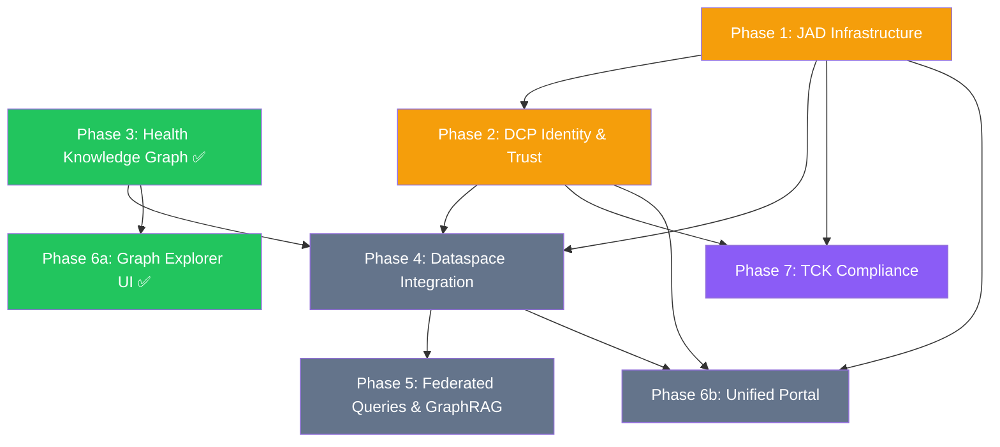

# Planning: Health Dataspace v2

## Table of Contents

- [Planning: Health Dataspace v2](#planning-health-dataspace-v2)
  - [Table of Contents](#table-of-contents)
  - [Background \& Inspiration](#background--inspiration)
  - [New EDC Component Architecture](#new-edc-component-architecture)
    - [Protocol Foundation: DSP + DCP + DPS](#protocol-foundation-dsp--dcp--dps)
  - [Implementation Progress](#implementation-progress)
  - [Implementation Roadmap](#implementation-roadmap)
    - [Phase 1: Infrastructure Migration (JAD-Based) ✅](#phase-1-infrastructure-migration-jad-based-)
      - [1a: JAD Local Deployment ✅](#1a-jad-local-deployment-)
      - [1b: Health-Specific Tenant Configuration ✅](#1b-health-specific-tenant-configuration-)
      - [1c: Docker Compose Development Profile ✅](#1c-docker-compose-development-profile-)
      - [1d: OpenAPI TypeScript Client Generation ✅](#1d-openapi-typescript-client-generation-)
      - [1e: ADR-2 Implementation — Dual Data Planes + Neo4j Query Proxy ✅](#1e-adr-2-implementation--dual-data-planes--neo4j-query-proxy-)
      - [1f: Phase 4a Prep — EDC-V Asset Registration + Vault Keys ✅](#1f-phase-4a-prep--edc-v-asset-registration--vault-keys-)
    - [Phase 2: Identity and Trust (DCP v1.0) ✅](#phase-2-identity-and-trust-dcp-v10-)
      - [2a: DID:web and Verifiable Credential Setup ✅](#2a-didweb-and-verifiable-credential-setup-)
      - [2b: EHDS-Specific Credential Types ✅](#2b-ehds-specific-credential-types-)
      - [2c: Keycloak SSO Integration ✅](#2c-keycloak-sso-integration-)
    - [Phase 3: Health Knowledge Graph Layer ✅](#phase-3-health-knowledge-graph-layer-)
    - [Phase 3b: Real FHIR Data Pipeline ✅](#phase-3b-real-fhir-data-pipeline-)
    - [Phase 3c: HealthDCAT-AP Metadata Registration ✅](#phase-3c-healthdcat-ap-metadata-registration-)
    - [Phase 3d: README and UI Completeness Hardening ✅](#phase-3d-readme-and-ui-completeness-hardening-)
    - [Phase 3e: DSP Marketplace Registration + Compliance Chain ✅](#phase-3e-dsp-marketplace-registration--compliance-chain-)
    - [Phase 3f: OMOP Research Analytics View ✅](#phase-3f-omop-research-analytics-view-)
    - [Phase 3g: Procedure Pipeline + UI Polish ✅](#phase-3g-procedure-pipeline--ui-polish-)
    - [Phase 3h: EEHRxF FHIR Profile Alignment ✅](#phase-3h-eehrxf-fhir-profile-alignment-)
    - [Phase 4: Dataspace Integration (EDC-V ↔ Neo4j) ✅](#phase-4-dataspace-integration-edc-v--neo4j-)
      - [4a: Data Asset Registration ✅](#4a-data-asset-registration-)
      - [4b: Contract Negotiation Flow ✅](#4b-contract-negotiation-flow-)
      - [4c: Federated Catalog with HealthDCAT-AP ✅](#4c-federated-catalog-with-healthdcat-ap-)
      - [4d: Data Plane Transfer via DCore ✅](#4d-data-plane-transfer-via-dcore-)
    - [Phase 5: Federated Queries and GraphRAG ✅](#phase-5-federated-queries-and-graphrag-)
      - [5a: Second Neo4j SPE ✅](#5a-second-neo4j-spe-)
      - [5b: Federated Query Dispatch ✅](#5b-federated-query-dispatch-)
      - [5c: Natural Language Query (Text2Cypher) ✅](#5c-natural-language-query-text2cypher-)
      - [5d: NLQ Explorer UI ✅](#5d-nlq-explorer-ui-)
      - [Infrastructure Summary](#infrastructure-summary)
    - [Phase 6a: Graph Explorer UI ✅](#phase-6a-graph-explorer-ui-)
    - [Phase 6b: Unified Participant Portal (Next.js) ✅](#phase-6b-unified-participant-portal-nextjs-)
      - [Technology Decision: Next.js 14 as Unified Frontend ✅](#technology-decision-nextjs-14-as-unified-frontend-)
      - [6b-1: Participant Onboarding Portal (from Aruba) ✅](#6b-1-participant-onboarding-portal-from-aruba-)
      - [6b-2: Data Sharing \& Discovery Portal (from Fraunhofer) ✅](#6b-2-data-sharing--discovery-portal-from-fraunhofer-)
      - [6b-3: Operator Dashboard (from Redline) ✅](#6b-3-operator-dashboard-from-redline-)
      - [Updated Navigation Structure ✅](#updated-navigation-structure-)
    - [Phase 7: TCK DCP \& DSP Compliance Verification ✅](#phase-7-tck-dcp--dsp-compliance-verification-)
      - [7a: DSP 2025-1 Technology Compatibility Kit ✅](#7a-dsp-2025-1-technology-compatibility-kit-)
      - [7b: DCP v1.0 Compliance Tests ✅](#7b-dcp-v10-compliance-tests-)
      - [7c: EHDS Health-Domain Compliance Tests ✅](#7c-ehds-health-domain-compliance-tests-)
      - [7d: Automated CI/CD Compliance Pipeline ✅](#7d-automated-cicd-compliance-pipeline-)
    - [Phase 8: Test Coverage Expansion + CI/CD ✅](#phase-8-test-coverage-expansion--cicd-)
      - [8a: UI API Route Coverage ✅](#8a-ui-api-route-coverage-)
      - [8b: Component + Library Coverage ✅](#8b-component--library-coverage-)
      - [8c: CI/CD Test Pipeline ✅](#8c-cicd-test-pipeline-)
    - [Phase 9: Documentation \& Navigation Restructuring ✅](#phase-9-documentation--navigation-restructuring-)
      - [9a: Documentation Site ✅](#9a-documentation-site-)
      - [9b: Navigation Restructuring ✅](#9b-navigation-restructuring-)
      - [9c: Home Page Refresh ✅](#9c-home-page-refresh-)
      - [9d: GitHub Pages Static Export ✅](#9d-github-pages-static-export-)
    - [Phase 10: Tasks Dashboard \& DPS Integration ✅](#phase-10-tasks-dashboard--dps-integration-)
      - [10a: Tasks API Route ✅](#10a-tasks-api-route-)
      - [10b: Tasks Page ✅](#10b-tasks-page-)
      - [10c: Navigation Update ✅](#10c-navigation-update-)
      - [10d: Static Export \& Mock Data ✅](#10d-static-export--mock-data-)
    - [Phase 11: EDC Components — Per-Participant Topology \& Info Layer ✅](#phase-11-edc-components--per-participant-topology--info-layer-)
      - [11a: Component Info Tooltips](#11a-component-info-tooltips)
      - [11b: Per-Participant Component Topology](#11b-per-participant-component-topology)
      - [11c: Critical Service \& Participant Indicators](#11c-critical-service--participant-indicators)
      - [11d: Static Export \& Mock Data](#11d-static-export--mock-data)
    - [Phase 12: API QuerySpec Fix \& EHDS Policy Seeding ✅](#phase-12-api-queryspec-fix--ehds-policy-seeding-)
      - [12a: QuerySpec `filterExpression` Fix ✅](#12a-queryspec-filterexpression-fix-)
      - [12b: EHDS Policy Seeding Script ✅](#12b-ehds-policy-seeding-script-)
      - [12c: Layer View Participants as Table ✅](#12c-layer-view-participants-as-table-)
    - [Phase 13: Operational Hardening \& Persistent Task Management ✅](#phase-13-operational-hardening--persistent-task-management-)
      - [13a: Seed Script Dynamic Discovery ✅](#13a-seed-script-dynamic-discovery-)
      - [13b: TCK QuerySpec Compliance ✅](#13b-tck-queryspec-compliance-)
      - [13c: EHDS Compliance Checker Fallback ✅](#13c-ehds-compliance-checker-fallback-)
      - [13d: Persistent Task Management (PostgreSQL) ✅](#13d-persistent-task-management-postgresql-)
      - [13e: Seed Orchestration Guide](#13e-seed-orchestration-guide)
    - [Phase 14: End-to-End Testing \& Demonstration Verification ✅](#phase-14-end-to-end-testing--demonstration-verification-)
      - [E2E Test Plan](#e2e-test-plan)
        - [A. Infrastructure Verification](#a-infrastructure-verification)
        - [B. Dataspace State Verification](#b-dataspace-state-verification)
        - [C. API Route Verification (Next.js Backend)](#c-api-route-verification-nextjs-backend)
        - [D. UI Page Verification](#d-ui-page-verification)
      - [Implementation](#implementation)
    - [Phase 15: Mock Fallback \& Graph Deep-Linking ✅](#phase-15-mock-fallback--graph-deep-linking-)
      - [15a — Mock Fallback for APIs](#15a--mock-fallback-for-apis)
      - [15b — Graph ↔ Page Deep-Linking](#15b--graph--page-deep-linking)
      - [15c — Additional Datasets](#15c--additional-datasets)
      - [15d — Suspense Boundary Fixes](#15d--suspense-boundary-fixes)
    - [Phase 16: HealthDCAT-AP Display \& Editor Integration ✅](#phase-16-healthdcat-ap-display--editor-integration-)
      - [16a — Discover Page: Dual Data Source \& Keyword Search](#16a--discover-page-dual-data-source--keyword-search)
      - [16b — Graph Deep-Link Date Stripping](#16b--graph-deep-link-date-stripping)
      - [16c — HealthDCAT-AP Editor](#16c--healthdcat-ap-editor)
    - [Phase 17: 50 User Journey E2E Tests ✅](#phase-17-50-user-journey-e2e-tests-)
      - [Participant Login Matrix](#participant-login-matrix)
      - [Journey Categories (10 × 5 = 50 tests)](#journey-categories-10--5--50-tests)
        - [A · Identity \& Participant Management (J01–J05)](#a--identity--participant-management-j01j05)
        - [B · Dataset Upload \& Metadata Definition (J06–J15)](#b--dataset-upload--metadata-definition-j06j15)
        - [C · Policy Definition \& Catalog Offering (J16–J22)](#c--policy-definition--catalog-offering-j16j22)
        - [D · Discovery \& Federated Search (J23–J30)](#d--discovery--federated-search-j23j30)
        - [E · Contract Negotiation (J31–J40)](#e--contract-negotiation-j31j40)
        - [F · Data Transfer \& Viewing (J41–J48)](#f--data-transfer--viewing-j41j48)
        - [G · Cross-Border \& Federated Compliance (J49–J50)](#g--cross-border--federated-compliance-j49j50)
      - [Test Architecture](#test-architecture)
      - [Mock Data Fallback (Offline-First)](#mock-data-fallback-offline-first)
      - [Running the Journey Tests](#running-the-journey-tests)
      - [Protocol Coverage](#protocol-coverage)
    - [Phase 18: Trust Center \& Federated Pseudonym Resolution ✅](#phase-18-trust-center--federated-pseudonym-resolution-)
    - [Phase 19: Role-Aware UI — Persona-Specific Navigation \& Graph ✅](#phase-19-role-aware-ui--persona-specific-navigation--graph-)
    - [Phase 20: Patient Portal — GDPR Art. 15-22 \& EHDS Chapter II Primary Use ✅](#phase-20-patient-portal--gdpr-art-15-22--ehds-chapter-ii-primary-use-)
      - [20a: Patient Role \& Demo Users ✅](#20a-patient-role--demo-users-)
      - [20b: Patient Health Profile ✅](#20b-patient-health-profile-)
      - [20c: Research Program Discovery \& EHR Donation ✅](#20c-research-program-discovery--ehr-donation-)
      - [20d: Research Insights Dashboard ✅](#20d-research-insights-dashboard-)
      - [20e: OrbStack Kubernetes Deployment ✅](#20e-orbstack-kubernetes-deployment-)
    - [Phase 21: Hospital-Grade Design System — Light/Dark Mode](#phase-21-hospital-grade-design-system--lightdark-mode)
      - [21a: Design Tokens \& Tailwind Theme](#21a-design-tokens--tailwind-theme)
      - [21b: Light/Dark Toggle in Navigation](#21b-lightdark-toggle-in-navigation)
      - [21c: Component-Level Theme Adoption](#21c-component-level-theme-adoption)
      - [21d: Graph Explorer Theme Adaptation](#21d-graph-explorer-theme-adaptation)
      - [21e: WCAG 2.2 AA Contrast Audit](#21e-wcag-22-aa-contrast-audit)
      - [21f: localhost:3003 Deployment \& E2E Smoke Test](#21f-localhost3003-deployment--e2e-smoke-test)
  - [Architecture Decisions](#architecture-decisions)
    - [ADR-1: PostgreSQL vs Neo4j Data Storage Split](#adr-1-postgresql-vs-neo4j-data-storage-split)
      - [Decision](#decision)
      - [Storage Assignment](#storage-assignment)
      - [Event Projection: EDC-V PostgreSQL → Neo4j Layer 1](#event-projection-edc-v-postgresql--neo4j-layer-1)
      - [Consequences](#consequences)
    - [ADR-2: EDC Data Plane Architecture](#adr-2-edc-data-plane-architecture)
      - [Decision](#decision-1)
      - [Data Plane Topology](#data-plane-topology)
      - [Data Plane Specifications](#data-plane-specifications)
      - [Neo4j Query Proxy Service](#neo4j-query-proxy-service)
      - [EDC-V Asset Registration (Phase 4a)](#edc-v-asset-registration-phase-4a)
      - [Docker Compose Changes](#docker-compose-changes)
      - [Consequences](#consequences-1)
    - [ADR-3: W3C HealthDCAT-AP Alignment (Replacing Generic DCAT)](#adr-3-w3c-healthdcat-ap-alignment-replacing-generic-dcat)
      - [HealthDCAT-AP Specification Overview](#healthdcat-ap-specification-overview)
      - [Property Mapping: Current → HealthDCAT-AP](#property-mapping-current--healthdcat-ap)
      - [Node Label Changes](#node-label-changes)
      - [Relationship Changes](#relationship-changes)
      - [JSON-LD Serialization (for Federated Catalog)](#json-ld-serialization-for-federated-catalog)
      - [Migration Steps](#migration-steps)
      - [Consequences](#consequences-2)
    - [ADR-4: Next.js 14 as Unified Frontend (Consolidating Angular Reference UIs)](#adr-4-nextjs-14-as-unified-frontend-consolidating-angular-reference-uis)
      - [Decision](#decision-2)
      - [Alternatives Considered](#alternatives-considered)
      - [Rationale](#rationale)
      - [Technology Stack](#technology-stack)
      - [Application Structure](#application-structure)
      - [Consequences](#consequences-3)
    - [ADR-5: JAD + CFM Source Builds (EDC-V 0.16.0-SNAPSHOT + CFM Go Stack)](#adr-5-jad--cfm-source-builds-edc-v-0160-snapshot--cfm-go-stack)
      - [Decision](#decision-3)
      - [Alternatives Considered](#alternatives-considered-1)
      - [Build Instructions](#build-instructions)
      - [Images Produced](#images-produced)
      - [Configuration Alignment](#configuration-alignment)
      - [Consequences](#consequences-4)
    - [ADR-6: GHCR Image Publishing (Public Container Registry)](#adr-6-ghcr-image-publishing-public-container-registry)
      - [Decision](#decision-4)
      - [Image Registry](#image-registry)
      - [Naming Convention](#naming-convention)
      - [Consequences](#consequences-5)
    - [ADR-7: DID:web Resolution Architecture and DSP Contract Negotiation](#adr-7-didweb-resolution-architecture-and-dsp-contract-negotiation)
      - [DID:web Method and IdentityHub](#didweb-method-and-identityhub)
      - [DID Document Structure](#did-document-structure)
      - [DID Resolution Architecture](#did-resolution-architecture)
      - [Participant Activation Requirement](#participant-activation-requirement)
      - [Contract Negotiation Flow: CRO → Clinic](#contract-negotiation-flow-cro--clinic)
      - [HDAB Operator Oversight](#hdab-operator-oversight)
      - [Consequences](#consequences-6)
    - [ADR-8: Comprehensive Testing Strategy (Vitest + Playwright + Supertest)](#adr-8-comprehensive-testing-strategy-vitest--playwright--supertest)
      - [Decision {#decision-8}](#decision-decision-8)
      - [Alternatives Considered {#alternatives-considered-8}](#alternatives-considered-alternatives-considered-8)
      - [Rationale {#rationale-8}](#rationale-rationale-8)
      - [Test Architecture {#test-architecture}](#test-architecture-test-architecture)
      - [Consequences {#consequences-7}](#consequences-consequences-7)
    - [ADR-9: IssuerService DCP Credential Issuance — Root Cause and Permanent Fix](#adr-9-issuerservice-dcp-credential-issuance--root-cause-and-permanent-fix)
      - [Root Cause Analysis](#root-cause-analysis)
      - [IssuanceProcess State Machine](#issuanceprocess-state-machine)
      - [Solution Architecture](#solution-architecture)
      - [Files Changed](#files-changed)
      - [Verification {#verification-adr9}](#verification-verification-adr9)
      - [Consequences {#consequences-8}](#consequences-consequences-8)
  - [Target Architecture](#target-architecture)
  - [What This Proves](#what-this-proves)
  - [Implementation Dependencies](#implementation-dependencies)

---

## Background & Inspiration

This project is contextualised by:
[European Health Dataspaces, Digital Twins: A Journey from FHIR Basics to Intelligent Patient Models](https://www.linkedin.com/pulse/european-health-dataspaces-digital-twins-journey-fhir-buchhorn-roth-8t51c/)

The Eclipse Dataspace ecosystem has undergone a fundamental architectural evolution since the first health demo. Three new projects change how dataspaces are built and operated — the [MinimumViableDataspace health demo](https://github.com/ma3u/MinimumViableDataspace/tree/health-demo) needs to evolve with them.

---

## New EDC Component Architecture

The original MVD used a monolithic EDC Connector with an embedded data plane. The new architecture disaggregates this into purpose-built components:

| Component                          | Project                                                                                    | Purpose                                                           | Key Change                                                                                                                                                                       |
| ---------------------------------- | ------------------------------------------------------------------------------------------ | ----------------------------------------------------------------- | -------------------------------------------------------------------------------------------------------------------------------------------------------------------------------- |
| **EDC-V** (Virtual Connector)      | [eclipse-edc/Virtual-Connector](https://github.com/eclipse-edc/Virtual-Connector)          | Virtualized control plane optimized for cloud service providers   | Multi-tenant isolation, participant-scoped APIs, provisioning system integration [github](https://github.com/eclipse-edc/Virtual-Connector/blob/main/docs/administration_api.md) |
| **DCore** (Data Plane Core)        | [Eclipse Data Plane Core](https://projects.eclipse.org/projects/technology.dataplane-core) | Multi-language data plane SDKs (Go, Java, .NET, Rust, TypeScript) | Rust-based HTTP data plane, Data Plane Signaling spec compliance [projects.eclipse](https://projects.eclipse.org/proposals/eclipse-data-plane-core)                              |
| **CFM** (Connector Fabric Manager) | [Eclipse CFM](https://projects.eclipse.org/proposals/eclipse-cfm)                          | Management plane for multi-tenant connector orchestration         | Tenant Manager + Provision Manager, multi-role UI (operator, reseller, end user) [projects.eclipse](https://projects.eclipse.org/proposals/eclipse-connector-fabric-manager)     |
| **JAD** (Joint Architecture Demo)  | [Metaform/jad](https://github.com/Metaform/jad)                                            | Reference demonstrator combining EDC-V + CFM + DCore + onboarding | Replaces old MVD as the canonical demo for cloud provider deployments [linkedin](https://www.linkedin.com/posts/mbuchhorn_fulcrum-daas-edc-activity-7427340949279809536-OaG6)    |

EDC-V is not a monolith — it consists of multiple services with separate administration APIs, strictly enforcing isolation boundaries between participants to prevent data leakage. The CFM sits above EDC-V as an automated provisioning system that handles keypair generation, DID document creation, and Verifiable Credential issuance when new participants onboard. [projects.eclipse](https://projects.eclipse.org/proposals/eclipse-connector-fabric-manager)

### Protocol Foundation: DSP + DCP + DPS

All three core specifications are now final or near-final:

- **DSP 2025-1** (Dataspace Protocol) — Catalog access, contract negotiation, and transfer management over RESTful HTTPS. Normative JSON schemas for all message payloads. Technology Compatibility Kit with 140+ test cases passed by both EDC and TNO connectors. [internationaldataspaces](https://internationaldataspaces.org/dataspace-protocol-nears-first-official-release/)
- **DCP v1.0** (Decentralized Claims Protocol) — Self-issued identity tokens, Verifiable Credential storage/presentation, and credential issuance protocols. Released July 2025 with 119 merged PRs from 12 organizations. [projects.eclipse](https://projects.eclipse.org/projects/technology.dataspace-dcp/releases/1.0.0)
- **DPS** (Data Plane Signaling) — Signaling interface between control plane and data plane, enabling independently deployed and scaled DCore data planes. DCore implements this specification natively. [projects.eclipse](https://projects.eclipse.org/proposals/eclipse-data-plane-core)

---

## Implementation Progress

| Phase  | Title                                                  | Status      | Notes                                                                                                                                                                                                                                                                                                                                                                                                                                                                                                                            |
| ------ | ------------------------------------------------------ | ----------- | -------------------------------------------------------------------------------------------------------------------------------------------------------------------------------------------------------------------------------------------------------------------------------------------------------------------------------------------------------------------------------------------------------------------------------------------------------------------------------------------------------------------------------- |
| **1**  | Infrastructure Migration (EDC-V + DCore + CFM)         | ✅ Complete | 1a–1f all complete; 18 services healthy; 3 tenants + 9 VPAs provisioned; data assets registered; ADR-1–6 accepted                                                                                                                                                                                                                                                                                                                                                                                                                |
| **2**  | Identity and Trust (DCP v1.0 + Verifiable Credentials) | ✅ Complete | 2a ✅ (DID:web for 3 tenants, Ed25519 keys, all activated — ADR-7; IssuerService credential issuance fully working — ADR-9); 2b ✅ (3 EHDS credential defs on IssuerService, 5 VC nodes in Neo4j, DCP scopes configured, Compliance UI with trust chain, 15 VCs delivered to IdentityHub); 2c ✅ (Keycloak SSO: PKCE client, 3 roles, 3 demo users, NextAuth.js, role-based middleware)                                                                                                                                          |
| **3**  | Health Knowledge Graph Layer — Schema & Synthetic Data | ✅ Complete | 5-layer Neo4j schema, EHDS HDAB chain, style sheet                                                                                                                                                                                                                                                                                                                                                                                                                                                                               |
| **3b** | Real FHIR Data Pipeline (Synthea → Neo4j → OMOP)       | ✅ Complete | 167 patients · 5,461 encounters · 2,421 conditions · 37,713 observations · 3,895 drug Rxes · 8,534 procedures                                                                                                                                                                                                                                                                                                                                                                                                                    |
| **3c** | HealthDCAT-AP Metadata Registration for FHIR Dataset   | ✅ Complete | Synthea cohort registered as HealthDCAT-AP catalog entry; 2 distributions + EHDS Art 53 purpose                                                                                                                                                                                                                                                                                                                                                                                                                                  |
| **3d** | README + UI completeness hardening                     | ✅ Complete | README step order fixed; catalog UI shows datasetType/legalBasis/recordCount                                                                                                                                                                                                                                                                                                                                                                                                                                                     |
| **3e** | DSP Marketplace Registration + Compliance Chain        | ✅ Complete | Layer 1 DataProduct/Contract/HDABApproval wired to Synthea dataset; compliance UI live dropdowns                                                                                                                                                                                                                                                                                                                                                                                                                                 |
| **3f** | OMOP Research Analytics View                           | ✅ Complete | Layer 4 cohort dashboard: top conditions/drugs/measurements, gender breakdown, stat cards                                                                                                                                                                                                                                                                                                                                                                                                                                        |
| **3g** | Procedure Pipeline + UI Polish                         | ✅ Complete | 8,534 Procedure → OMOPProcedureOccurrence; Analytics card on home; 6-stat patient page                                                                                                                                                                                                                                                                                                                                                                                                                                           |
| **3h** | EEHRxF FHIR Profile Alignment                          | ✅ Complete | EEHRxF category/profile nodes; gap analysis UI; EHDS priority coverage                                                                                                                                                                                                                                                                                                                                                                                                                                                           |
| **4**  | Dataspace Integration (EDC-V ↔ Neo4j data assets)     | ✅ Complete | 4a ✅ (assets + policies + contracts); 4b ✅ (3 FINALIZED negotiations + transfer STARTED — ADR-7); 4c ✅ (Federated Catalog: 4 datasets discoverable, HDAB contract FINALIZED); 4d ✅ (Data Plane Transfer: CRO←100 FHIR patients, HDAB←2 HealthDCAT-AP datasets via DCore; audit trail in Neo4j)                                                                                                                                                                                                                               |
| **5**  | Federated Queries & GraphRAG                           | ✅ Complete | 5a ✅ (Neo4j SPE-2: 37 patients, 2,076 encounters, 33 OMOP persons + HealthDCAT-AP + EEHRxF); 5b ✅ (federated query dispatch + k-anonymity); 5c ✅ (Text2Cypher NLQ: 9 templates + optional LLM); 5d ✅ (UI `/query` page — 7th view)                                                                                                                                                                                                                                                                                           |
| **6a** | Graph Explorer UI (Next.js → Neo4j Bolt)               | ✅ Complete | Seven views (graph, catalog, compliance, patient, analytics, eehrxf, query/NLQ); Docker `graph-explorer` container on port 3000; GitHub Pages static export                                                                                                                                                                                                                                                                                                                                                                      |
| **6b** | Full Participant Portal (Aruba + Fraunhofer + Redline) | ✅ Complete | 6b-1 ✅ (Onboarding: /onboarding, /onboarding/status, /credentials, /settings + 3 API routes); 6b-2 ✅ (Data Exchange: /data/share, /data/discover, /data/transfer, /negotiate + 5 API routes); 6b-3 ✅ (Admin: /admin, /admin/tenants, /admin/policies, /admin/audit + 3 API routes); Navigation dropdowns + middleware auth for all portal routes; 7 mock JSON files for static export                                                                                                                                         |
| **7**  | TCK DCP & DSP Compliance Verification                  | ✅ Complete | 7a ✅ (DSP 2025-1 TCK: `run-dsp-tck.sh` — 7 test categories, 30+ tests); 7b ✅ (DCP v1.0: `run-dcp-tests.sh` — 5 categories); 7c ✅ (EHDS domain: `run-ehds-tests.sh` — 5 categories); 7d ✅ (CI/CD: `compliance.yml` workflow, orchestrator `run-compliance.sh`, `/compliance/tck` dashboard UI with live + mock data)                                                                                                                                                                                                          |
| **8**  | Test Coverage Expansion + CI/CD                        | ✅ Complete | 8a ✅ (10 new API route test files, ~85% API coverage); 8b ✅ (UserMenu, fetchApi, Navigation + 6 page-level component suites); 8c ✅ (GitHub Actions test.yml, coverage reports, **260 unit tests + 31 E2E = 291 total**)                                                                                                                                                                                                                                                                                                       |
| **9**  | Documentation & Navigation Restructuring               | ✅ Complete | 9a ✅ (4 doc pages: landing, user guide, developer, architecture + 8 Mermaid diagrams); 9b ✅ (Nav restructured: 5 dropdown clusters — Explore, Governance, Exchange, Portal, Docs); 9c ✅ (Home page refresh: 2-section card layout); 9d ✅ (Static export compatible, mermaid@11)                                                                                                                                                                                                                                              |
| **10** | Tasks Dashboard & DPS Integration                      | ✅ Complete | 10a ✅ (`/api/tasks` route — aggregates negotiations + transfers across all participant contexts); 10b ✅ (`/tasks` page — DSP pipeline steppers, filter tabs, summary cards, 15s auto-refresh); 10c ✅ (Navigation: Tasks link added to Exchange cluster with `ClipboardList` icon); 10d ✅ (Mock data: `tasks.json` + static export mapping in `api.ts`)                                                                                                                                                                       |
| **11** | EDC Components — Per-Participant Topology & Info Layer | ✅ Complete | 11a ✅ (Component Info: `component-info.ts` — 21 `ComponentMeta` entries with description/protocol/ports/deps/health; `InfoPopover` on all rows); 11b ✅ (Topology: `/api/admin/components/topology` route — per-participant aggregation; Participant View with expandable `ParticipantTopologySection` + Layer↔Participant toggle); 11c ✅ (Severity: `SEVERITY_STYLES` + `SeverityDot` + `CriticalBanner` — worst-of rollup, auto-expand degraded); 11d ✅ (Mock: `admin_components_topology.json` + `STATIC_MOCK_MAP` entry) |
| **12** | API QuerySpec Fix & EHDS Policy Seeding                | ✅ Complete | 12a ✅ (`filterExpression:[]` fix across 6 API routes — policies, assets, tasks, negotiations, transfers); 12b ✅ (`jad/seed-ehds-policies.sh` — 14 EHDS ODRL policies seeded across 5 participants: AK:3, LMC:4, PC:2, MR:3, IRS:2); 12c ✅ (Layer View participants as table layout)                                                                                                                                                                                                                                           |
| **13** | Operational Hardening & Persistent Task Management     | ✅ Complete | 13a ✅ (seed-federated-catalog.sh: dynamic discovery replacing hardcoded UUIDs/DIDs); 13b ✅ (TCK `filterExpression:[]` fix for assets + IssuerService QuerySpec in neo4j-proxy); 13c ✅ (Compliance checker dropdown: EDC-V participant fallback + HealthDataset fallback); 13d ✅ (Persistent tasks: PostgreSQL `taskdb` + neo4j-proxy `/tasks` endpoints + UI sync/fallback); 13e (Seed orchestration guide documenting correct run order for all 8 seed scripts)                                                             |
| **14** | End-to-End Testing & Demonstration Verification        | ✅ Complete | 14a ✅ (70 E2E tests: 13 spec files covering all portal pages, navigation, auth flows); 14b ✅ (3 critical bug fixes: TCK compliance 20/20, Docker build cache, Share Data page); 14c ✅ (Playwright HTML reporter + CI integration)                                                                                                                                                                                                                                                                                             |
| **15** | Mock Fallback & Graph Deep-Linking                     | ✅ Complete | 15a ✅ (Mock fallback for catalog/assets APIs + graph deep-linking); 15b ✅ (100 mock transfers + 100 negotiations + 12 FHIR R4 bundles); 15c ✅ (FHIR viewer + Discover page rewrite + MedDRA/Clinical Trial datasets)                                                                                                                                                                                                                                                                                                          |
| **16** | HealthDCAT-AP Display & Editor Integration             | ✅ Complete | 16a ✅ (HealthDCAT-AP Editor page with form-based metadata authoring); 16b ✅ (Catalog API POST/DELETE handlers); 16c ✅ (First 50 journey tests J01–J50 created across 7 spec files)                                                                                                                                                                                                                                                                                                                                            |
| **17** | 50 User Journey E2E Tests                              | ✅ Complete | 17a ✅ (Mock fallback for `/api/participants`, `/api/tasks`, `/api/admin/policies`); 17b ✅ (Enhanced `tasks.json`: 11 entries across 4 participants + TERMINATED state); 17c ✅ (All 50 journey tests passing, **120 E2E tests total, 0 failures**); 17d ✅ (10 test categories: identity, use cases, upload, metadata, policies, catalog, negotiations, transfer, data views, federated discovery)                                                                                                                             |
| **18** | Trust Center & Federated Pseudonym Resolution          | 🔲 Planned  | Community feedback from Thomas Berlage (Fraunhofer FIT): Trust Center for cross-provider pseudonym resolution under HDAB governance; SPE security model refinement; TEE attestation; cross-border trust center mutual recognition. Sub-phases: 18a (graph schema), 18b (resolution protocol), 18c (SPE refinement), 18d (UI + compliance dashboard)                                                                                                                                                                              |

---

## Implementation Roadmap

### Phase 1: Infrastructure Migration (JAD-Based) ✅

Phase 1 bootstraps the full EDC-V + DCore + CFM stack using the [JAD (Joint Architecture Demo)](https://github.com/Metaform/jad) as the reference deployment. JAD provides pre-built container images, Kubernetes manifests, and automated end-to-end tests — we adapt its infrastructure to serve the health dataspace domain.

#### 1a: JAD Local Deployment ✅

1. ~~Set up **KinD** (Kubernetes in Docker) cluster~~ → Deployed via **Docker Compose** (`docker-compose.jad.yml`) with all 18 services healthy, eliminating KinD dependency
2. Deploy JAD's 11 core services from **GHCR images** (`ghcr.io/ma3u/health-dataspace/*`, see ADR-6):
   - `controlplane` — EDC-V virtualized control plane (DSP + admin APIs)
   - `dataplane-fhir` / `dataplane-omop` — DCore HTTP data planes (ADR-2: dual data planes)
   - `identityhub` — DCP v1.0 credential storage and presentation
   - `issuerservice` — Verifiable Credential issuance (trust anchor)
   - `keycloak` — OAuth2/OIDC identity provider (PKCE flows)
   - `vault` — HashiCorp Vault for secret management (dev mode, HTTP)
   - `postgres` — Persistent storage for EDC-V state (7 databases)
   - `nats` — Event messaging bus (alpine image for healthcheck)
   - `tenant-manager` — Multi-tenant participant lifecycle (CFM)
   - `provision-manager` — Automated resource provisioning (CFM)
   - `cfm-agents` (4) — Keycloak, EDC-V, Registration, Onboarding agents
   - `neo4j-proxy` — Bridges DCore data planes ↔ Neo4j graph (ADR-2)
   - `traefik` — Reverse proxy / API gateway
3. Seed data initialized via `jad/seed-jad.sh`:
   - IssuerService: tenant `did:web:issuerservice%3A10016:issuer`, Membership + Manufacturer attestation/credential definitions
   - TenantManager: Cell + Dataspace Profile (deployed)
   - ProvisionManager: 5 ActivityDefinitions + OrchestrationDefinition (deploy + dispose workflows)
4. ~~Validate deployment with JAD's Bruno API collection (interactive testing)~~ → Superseded by automated TCK compliance tests (Phase 7) and 247-test CI suite (Phase 8)

#### 1b: Health-Specific Tenant Configuration ✅

4. Configure three tenant profiles via CFM Tenant Manager API:
   - **Clinic Riverside** (`clinic-riverside`) — data provider publishing FHIR R4 patient data ✅
   - **CRO TrialCorp** (`cro-trialcorp`) — data consumer requesting OMOP research queries ✅
   - **HDAB HealthGov** (`hdab-healthgov`) — intermediary operating HealthDCAT-AP catalog + SPE ✅
5. Configure CFM Provision Manager to automatically provision per-tenant: ✅
   - EDC-V control plane instance (participant-scoped DSP endpoint)
   - DCore data plane instance (FHIR HTTP transfer + query result streaming)
   - IdentityHub instance (DID:web document + credential wallet)
   - All 9 VPAs (3 per tenant) reached `active` state
6. Wire the existing **Neo4j Health Knowledge Graph** as a data source: ✅
   - Registered 4 data assets on Clinic's EDC-V (FHIR Patient, FHIR Cohort, OMOP Cohort, HealthDCAT-AP)
   - Registered 1 federated catalog asset on HDAB's EDC-V
   - Created access policies (open + membership-based) and contract definitions
   - Data addresses point to `neo4j-proxy:9090` internal endpoints
   - Scripts: `jad/seed-health-tenants.sh`, `jad/seed-data-assets.sh`

#### 1c: Docker Compose Development Profile ✅

7. Create `docker-compose.jad.yml` extending the existing `docker-compose.yml`:
   - Adds JAD services alongside Neo4j for **local development without KinD**
   - Maps JAD service ports to localhost (controlplane:11003, identityhub:11005, keycloak:8080)
   - Shares the `neo4j-data` Docker volume with the EDC-V data plane
   - Configures Traefik routing to match KinD Gateway API routes
8. Create `scripts/bootstrap-jad.sh` automation script:
   - Checks prerequisites (Docker, KinD or docker-compose)
   - Pulls latest JAD GHCR images
   - Initializes Keycloak realm with health-specific roles
   - Provisions the three tenant profiles via CFM API
   - Runs Neo4j schema initialization + Synthea data load
   - Validates end-to-end with JAD's E2E test suite

#### 1d: OpenAPI TypeScript Client Generation ✅

9. Generate typed TypeScript API clients from JAD's OpenAPI specifications:
   - **EDC-V Admin API** — participant management, data asset registration, policy CRUD
   - **EDC-V DSP API** — catalog queries, contract negotiation, transfer processes
   - **CFM Tenant Manager API** — tenant CRUD, provisioning status, lifecycle events
   - **CFM Provision Manager API** — provisioning triggers, status polling, resource inventory
   - **IdentityHub API** — DID resolution, credential storage, presentation exchange
   - **IssuerService API** — credential issuance requests, schema management
10. Use `openapi-typescript-codegen` or `openapi-generator-cli` with TypeScript-fetch template
11. Publish clients as `ui/src/lib/edc/` module for use by Next.js API routes and client components

**Deliverables:** Full EDC-V + CFM + DCore stack running locally; 3 health-specific tenants provisioned; OpenAPI TypeScript clients generated; existing Neo4j graph accessible via EDC-V data plane.

#### 1e: ADR-2 Implementation — Dual Data Planes + Neo4j Query Proxy ✅

12. Implement ADR-2 Docker Compose changes:
    - Renamed `dataplane` → `dataplane-fhir` (DCore PUSH, port 11002, `application/fhir+json`)
    - Added `dataplane-omop` (DCore PULL, port 11012, `application/json` / `text/csv`)
    - Added `neo4j-proxy` service (Node.js/Express, port 9090, bridges DCore ↔ Neo4j)
    - Added `dataplane_omop` PostgreSQL database to `jad/init-postgres.sql`
13. Scaffold Neo4j Query Proxy (`services/neo4j-proxy/`):
    - TypeScript/Express with `neo4j-driver`, multi-stage Docker build
    - 6 endpoints: FHIR `$everything` + cohort, OMOP cohort + timeline, HealthDCAT-AP catalog listing + detail
    - JSON-LD serialization with HealthDCAT-AP `@context` for catalog endpoints
    - Health check at `/health` verifying Neo4j connectivity

#### 1f: Phase 4a Prep — EDC-V Asset Registration + Vault Keys ✅

14. Created `jad/edcv-assets/` directory with EDC-V Management API payloads:
    - **FHIR Cohort Asset** (`fhir-cohort-asset.json`) — `HttpData` data address pointing to `neo4j-proxy:9090/fhir/Bundle`, content type `application/fhir+json`
    - **OMOP Analytics Asset** (`omop-analytics-asset.json`) — `HttpData` data address pointing to `neo4j-proxy:9090/omop/cohort`, content type `application/json`
    - **HealthDCAT-AP Catalog Asset** (`healthdcatap-catalog-asset.json`) — `HttpData` data address pointing to `neo4j-proxy:9090/catalog/datasets`, content type `application/ld+json`
15. Created **EHDS research access policy** (`policy-ehds-research-access.json`):
    - ODRL permission: `use` with EHDS Article 53 purpose constraint (research, public health, education, statistics)
    - 90-day temporal access limit from contract agreement date
    - k-anonymity ≥ 5 duty for all cohort queries
    - Prohibitions: re-identification, commercialization
16. Created **contract definitions** binding FHIR and OMOP assets to the EHDS research policy
17. Updated `jad/bootstrap-vault.sh` with RSA key pairs for both data planes:
    - `dataplane-fhir-public/private` — DPS token signing/verification for FHIR transfers
    - `dataplane-omop-public/private` — DPS token signing/verification for OMOP transfers
18. Updated `scripts/bootstrap-jad.sh`:
    - Phase 4 starts `dataplane-fhir` + `dataplane-omop` (was generic `dataplane`)
    - Phase 4b starts `neo4j-proxy` with health check
    - Updated service endpoints listing and port pre-flight checks

### Phase 2: Identity and Trust (DCP v1.0) ✅

Phase 2 implements the full DCP v1.0 credential lifecycle using JAD's IdentityHub and IssuerService, then adds EHDS-specific credential types.

#### 2a: DID:web and Verifiable Credential Setup ✅

5. **DID:web** identifiers auto-provisioned by CFM for each tenant (see ADR-7 for full architecture):
   - `did:web:alpha-klinik.de:participant` → AlphaKlinik Berlin (provider)
   - `did:web:pharmaco.de:research` → PharmaCo Research AG (consumer)
   - `did:web:medreg.de:hdab` → MedReg DE (operator)
   - `did:web:lmc.nl:clinic` → Limburg Medical Centre (provider)
   - `did:web:irs.fr:hdab` → Institut de Recherche Santé (operator)
   - Each DID document includes Ed25519 verification key, CredentialService endpoint, and DSP ProtocolEndpoint
   - DID documents served at `http://identityhub:7083/{participant-path}/did.json` (Docker-internal)
   - All 4 participant contexts ACTIVATED (state=300)
6. Configure the **IssuerService** as the trust anchor (simulating an EHDS-recognized authority):
   - Define credential schemas for `MembershipCredential` (dataspace membership attestation)
   - Configure Keycloak realm roles mapping to credential issuance policies
   - Set up credential revocation list (StatusList2021)
7. Implement the DCP **Credential Issuance** flow:
   - Participant registers via onboarding portal → CFM creates tenant → IssuerService issues `MembershipCredential`
   - IdentityHub stores issued credentials and exposes DID document at `/{participant-path}/did.json` on port 7083

#### 2b: EHDS-Specific Credential Types ✅

8. Define and register EHDS health domain credentials: ✅
   - `EHDSParticipantCredential` — proof of HDAB registration (issued to Clinics and CROs by the HDAB)
   - `DataProcessingPurposeCredential` — EHDS Article 53 permitted purpose attestation (research, public health, etc.)
   - `DataQualityLabelCredential` — attests to data quality metrics (completeness, conformance to EEHRxF)
   - **IssuerService registration:** 3 credential definitions + 2 attestation types via `jad/seed-ehds-credentials.sh`
     - `ehds-membership-attestation` (type: membership) → `ehds-participant-credential-def` (365-day validity)
     - `ehds-membership-attestation` → `data-processing-purpose-credential-def` (90-day validity)
     - `ehds-manufacturer-attestation` (type: manufacturer) → `data-quality-label-credential-def` (180-day validity)
   - **Neo4j Layer 1b:** 5 `VerifiableCredential` nodes on SPE-1 via `neo4j/register-ehds-credentials.cypher`:
     - `vc:ehds-participant:alpha-klinik` (DataHolder) → HOLDS_CREDENTIAL → AlphaKlinik Berlin
     - `vc:ehds-participant:pharmaco-research` (DataUser) → HOLDS_CREDENTIAL → PharmaCo Research AG
     - `vc:ehds-participant:medreg-de` (HealthDataAccessBody) → HOLDS_CREDENTIAL → MedReg DE
     - `vc:data-processing-purpose:pharmaco-research` (Art 53 research) → HOLDS_CREDENTIAL → PharmaCo Research AG
     - `vc:data-quality-label:alpha-klinik` (95%/92%/98%) → ATTESTS_QUALITY → HealthDataset
   - **DCP scopes:** 3 EHDS credential scopes added to controlplane via `docker-compose.jad.yml`
   - **Note:** IssuerService only supports compiled-in attestation types (`membership`, `manufacturer`). EHDS credentials are mapped to these. Credential issuance is DCP-protocol only (via IdentityHub CredentialRequestMessage during DSP negotiation), not admin API.
9. Implement DCP **Credential Presentation** during DSP contract negotiation: ✅ (infrastructure ready)
   - CRO presents `EHDSParticipantCredential` + `DataProcessingPurposeCredential` to Clinic's EDC-V
   - Clinic's EDC-V validates credentials via IdentityHub before proceeding with contract agreement
   - Policy engine uses **CEL (Common Expression Language)** rules (as used by JAD) to evaluate credential claims
   - DCP scopes configured: `ehds-participant`, `data-processing-purpose`, `data-quality-label`
10. Add credential verification to the **Compliance UI** (`/compliance`): ✅
    - Display VC trust section with credential cards showing status (active/expired), participant role, type-specific details
    - Show trust chain: IssuerService → IdentityHub → Credential Presentation → Policy Evaluation
    - DCP trust chain visualization diagram in Compliance page

#### 2c: Keycloak SSO Integration ✅

11. Configure **Keycloak** for unified authentication across all portals: ✅
    - Extended existing `edcv` realm with SSO client `health-dataspace-ui` (confidential + PKCE S256)
    - PKCE authorization code flow for browser-based login (follows Aruba portal's pattern)
    - Service account flow for backend-to-backend API calls (existing `admin` + `provisioner` clients)
    - Role mapping: `EDC_ADMIN` (operator), `EDC_USER_PARTICIPANT` (clinic/CRO user), `HDAB_AUTHORITY` (regulator)
    - Demo users: `edcadmin`, `clinicuser`, `regulator` with respective roles
    - Provisioning script: `scripts/provision-keycloak-sso.sh` (idempotent)
12. Integrate **NextAuth.js** with Keycloak provider in the Next.js app: ✅
    - NextAuth.js v4 with custom OAuth provider (split endpoints: browser→localhost:8080, server→keycloak:8080)
    - JWT sessions with realm_access roles from Keycloak tokens
    - Role-based route protection via Next.js middleware: `/admin/*` → `EDC_ADMIN`, `/compliance` → `HDAB_AUTHORITY`
    - UserMenu component in navigation showing session, roles, sign-in/sign-out
    - Custom sign-in page (`/auth/signin`) and unauthorized page (`/auth/unauthorized`)
    - UI container connected to `health-dataspace-edcv` Docker network for server-side Keycloak access

**Deliverables:** DID:web identifiers for all participants; EHDS-specific VCs issued and stored; credential presentation integrated into DSP negotiation; Keycloak SSO protecting all UI views.

### Phase 3: Health Knowledge Graph Layer ✅

8. Deploy Neo4j with the [5-layer health graph schema](health-dataspace-graph-schema.md)
9. Implement **FHIR-to-Graph ingestion** pipeline:
   - Generate synthetic patient data with [Synthea](https://github.com/synthetichealth/synthea)
   - Load FHIR Bundles via CyFHIR into Neo4j
   - Create `CODED_BY` relationships to SNOMED CT / LOINC ontology nodes via neosemantics
10. Implement **HealthDCAT-AP metadata** layer:
    - Register datasets as HealthDCAT-AP RDF triples using rdflib-neo4j
    - Expose metadata via the EDC-V Federated Catalog extension
11. Implement **FHIR → OMOP transformation** pipeline for secondary use analytics

### Phase 3b: Real FHIR Data Pipeline ✅

Scripts in `scripts/` automate the full pipeline:

1. **Generate cohort** — `scripts/generate-synthea.sh [N]`
   - Downloads Synthea JAR (v3.3.0) on first run
   - Generates N patients (default 50) using all Synthea modules (chronic conditions emerge naturally)
   - Outputs FHIR R4 JSON bundles to `neo4j/import/fhir/`
2. **Load into Neo4j** — `python3 scripts/load_fhir_neo4j.py`
   - UNWIND bulk upserts: 1 Cypher call per resource type per bundle (handles 37K+ observations efficiently)
   - Parses: `Patient`, `Encounter`, `Condition`, `Observation`, `MedicationRequest`
   - Creates `CODED_BY` links to SNOMED CT / LOINC / RxNorm concepts; links patients to `HealthDataset`
3. **FHIR → OMOP transform** — `neo4j/fhir-to-omop-transform.cypher`
   - Creates: `OMOPPerson`, `OMOPVisitOccurrence`, `OMOPConditionOccurrence`, `OMOPMeasurement`, `OMOPDrugExposure`
   - Adds `MAPPED_TO` (FHIR → OMOP) and `CODED_BY` (OMOP → SNOMED/LOINC/RxNorm) relationships

**Current graph state (100-patient Synthea cohort, Massachusetts):**

| Layer 3 FHIR      | Count  | Layer 4 OMOP            | Count  |
| ----------------- | ------ | ----------------------- | ------ |
| Patient           | 167\*  | OMOPPerson              | 167    |
| Encounter         | 5,461  | OMOPVisitOccurrence     | 5,461  |
| Condition         | 2,421  | OMOPConditionOccurrence | 2,421  |
| Observation       | 37,713 | OMOPMeasurement         | 34,203 |
| MedicationRequest | 3,895  | OMOPDrugExposure        | 3,895  |
| Procedure         | 8,534  | OMOPProcedureOccurrence | 8,534  |

_\* 167 includes deceased patients generated by Synthea alongside the 100 living target patients._

The Graph Explorer UI (`/graph` and `/patient`) immediately reflects the real patient data.

### Phase 3c: HealthDCAT-AP Metadata Registration ✅

The Synthea cohort loaded in Phase 3b needs a corresponding **Layer 2** catalog entry so EDC-V can expose it as a discoverable data asset. This is implemented as an idempotent Cypher script:

- `neo4j/register-fhir-dataset-hdcatap.cypher` — creates/updates the `HealthDataset` node with full HealthDCAT-AP properties (title, description, publisher, temporal coverage, spatial coverage, themes, access conditions)
- Links the dataset to all 167 `Patient` nodes via `FROM_DATASET`
- Registers `Distribution` nodes (Bolt + REST + DCore HTTP endpoints) so EDC-V can reference the access URL
- Adds EHDS purpose restriction annotation (Article 53 permitted purposes)

### Phase 3d: README and UI Completeness Hardening ✅

With Phases 3–3c forming a working end-to-end local stack (Synthea → Neo4j → OMOP → HealthDCAT-AP → UI), the documentation and UI were brought to match:

**README (`README.md`):**

- Corrected step numbering (Phase 3b → Step 9, Phase 3c → Step 10, UI → Step 11)
- Removed stale “Type 2 Diabetes cohort” reference — all Synthea modules now run
- Added Phase 3c CLI invocation and expected outcome
- Added new `register-fhir-dataset-hdcatap.cypher` to the directory structure listing
- Added expected row-count table for the 50-patient cohort

**Dataset Catalog UI (`/catalog`):**

- Card now shows `datasetType` badge (e.g. `SyntheticData`)
- Card footer shows `legalBasis` in green (mapped to human-readable label, e.g. “EHDS Art. 53”)
- Card footer shows `recordCount` (patient count from live Neo4j graph)
- Filter now also searches `description` text

### Phase 3e: DSP Marketplace Registration + Compliance Chain ✅

With the Synthea FHIR dataset registered in HealthDCAT-AP (Phase 3c), Phase 3e wires the full Layer 1 DSP marketplace chain and fixes the EHDS compliance checker UI.

**DSP Marketplace Cypher (`neo4j/register-dsp-marketplace.cypher`):**

- MERGEs three Participants: `Riverside General` (CLINIC), `TrialCorp Research` (CRO), `HealthGov` (HDAB)
- Creates `DataProduct {productId: 'product-synthea-fhir-r4-2026'}` → `[:DESCRIBED_BY]` → `HealthDataset {datasetId: 'dataset:synthea-fhir-r4-mvd'}`
- Creates `OdrlPolicy` with EHDS Art.53 `researchPurpose` permission and re-identification `prohibition`
- Creates `Contract` → `[:GOVERNS]` → DataProduct
- Creates `AccessApplication` (status: `APPROVED`) and `HDABApproval` with relationships:
  - `[:APPROVES]` → AccessApplication
  - `[:APPROVED]` → Contract
  - `[:GRANTS_ACCESS_TO]` → HealthDataset ← key relationship enabling compliance check
- Verification RETURN confirms full chain: consumer, applicationStatus, approvalId, EHDS article, dataset

**Compliance API (`ui/src/app/api/compliance/route.ts`):**

- Added list mode (no query params → returns `{consumers, datasets}` for UI dropdowns)
- Fixed participant lookup: `coalesce(participantId, id) = $consumerId`
- Fixed chain path: `(approval:HDABApproval)-[:APPROVES]->(app)` then `(approval)-[:GRANTS_ACCESS_TO]->(dataset)`
- Fixed contract path: `Contract -[:GOVERNS]-> DataProduct -[:DESCRIBED_BY]-> HealthDataset`

**Compliance UI (`ui/src/app/compliance/page.tsx`):**

- Replaced static text inputs with dropdowns populated from live graph
- Shows consumer name + participantId, dataset title + id
- Result table adds `Contract` column alongside Application / Approval / EHDS Article

### Phase 3f: OMOP Research Analytics View ✅

With five Neo4j OMOP CDM layers populated (Phase 3b), Phase 3f adds a cohort-level research analytics view demonstrating EHDS Article 53 secondary use.

**Analytics API (`ui/src/app/api/analytics/route.ts`):**

- Queries five OMOP node types in parallel: `OMOPPerson`, `OMOPConditionOccurrence`, `OMOPDrugExposure`, `OMOPMeasurement`, `OMOPVisitOccurrence`
- Returns summary counts, top-15 conditions/drugs/measurements by occurrence, and gender breakdown
- Uses `Promise.all` for parallel Neo4j queries

**Analytics UI (`ui/src/app/analytics/page.tsx`):**

- Five stat cards (patients, conditions, drugs, measurements, visits)
- Gender distribution breakdown with percentages
- Three horizontal bar chart sections: Top Conditions, Top Drug Exposures, Top Measurements
- Colour-coded by graph layer: Layer 3 (teal) for conditions, Layer 4 (purple) for drugs, Layer 5 (orange) for measurements

**Navigation:** Added `/analytics` (OMOP Analytics) as fifth nav item with `BarChart2` icon.

### Phase 3g: Procedure Pipeline + UI Polish ✅

Synthea generates ~43 Procedure resources per patient (96% SNOMED CT, 4% ADA CDT) that were previously dropped during FHIR ingestion. Phase 3g closes this gap across the full pipeline.

**FHIR Loader (`scripts/load_fhir_neo4j.py`):**

- Added `UPSERT_PROCEDURES` and `LINK_PROCEDURES_SNOMED` bulk Cypher templates
- Parses Procedure resources: id, code, display, system, performedStart, performedEnd, status
- Creates `(:Patient)-[:HAS_PROCEDURE]->(:Procedure)` and `(:Procedure)-[:CODED_BY]->(:SnomedConcept)` relationships
- Result: 8,534 Procedure nodes upserted from 66 bundles

**Schema (`neo4j/init-schema.cypher`):**

- `CREATE CONSTRAINT procedure_id` (uniqueness)
- `CREATE INDEX procedure_code` (lookup)
- `CREATE CONSTRAINT omop_procedure_occurrence_id` (uniqueness)
- `CREATE INDEX omop_procedure_concept` (lookup)

**OMOP Transform (`neo4j/fhir-to-omop-transform.cypher`):**

- Section 6: `(:Procedure) → (:OMOPProcedureOccurrence)` with `(:OMOPPerson)-[:HAS_PROCEDURE_OCCURRENCE]->` relationships
- SNOMED vocabulary bridge: `(:OMOPProcedureOccurrence)-[:CODED_BY]->(:SnomedConcept)` — 7,768 links
- Result: 8,534 OMOPProcedureOccurrence nodes created

**UI Changes:**

- Home page: Added Analytics card (5th navigation tile)
- Graph explorer: Added Procedure (Layer 3) and OMOPProcedureOccurrence (Layer 4) to force-directed graph
- Analytics dashboard: Added Procedures stat card + Top Procedures bar chart; grid changed to 6-column
- Patient journey: Added Procedures stat badge (6 badges); Procedure events in timeline with purple (#7D3C98) colour

**Updated Node Counts:**

| FHIR Layer (3)    | Count     | OMOP Layer (4)              | Count     |
| ----------------- | --------- | --------------------------- | --------- |
| Patient           | 167       | OMOPPerson                  | 167       |
| Encounter         | 5,461     | OMOPVisitOccurrence         | 5,461     |
| Condition         | 2,421     | OMOPConditionOccurrence     | 2,421     |
| Observation       | 37,713    | OMOPMeasurement             | 34,203    |
| MedicationRequest | 3,895     | OMOPDrugExposure            | 3,895     |
| **Procedure**     | **8,534** | **OMOPProcedureOccurrence** | **8,534** |

### Phase 3h: EEHRxF FHIR Profile Alignment ✅

The **European Electronic Health Record Exchange Format (EEHRxF)** was established by [Commission Recommendation C(2019)800](https://digital-strategy.ec.europa.eu/en/library/recommendation-european-electronic-health-record-exchange-format) of 6 February 2019. The [EHDS Regulation](https://health.ec.europa.eu/ehealth-digital-health-and-care/european-health-data-space_en) (entered into force 26 March 2025) elevates EEHRxF as the standard exchange format for 6 priority categories of electronic health data, with phased rollout:

| #   | Priority Category              | EHDS Deadline | Group |
| --- | ------------------------------ | ------------- | ----- |
| 1   | Patient Summaries              | March 2029    | 1     |
| 2   | ePrescriptions / eDispensation | March 2029    | 1     |
| 3   | Laboratory Results             | March 2031    | 2     |
| 4   | Hospital Discharge Reports     | March 2031    | 2     |
| 5   | Medical Images / Reports       | March 2031    | 2     |
| 6   | Rare Disease Registration      | TBD           | 3     |

**HL7 Europe** publishes FHIR R4 Implementation Guides that provide the technical specifications for EEHRxF, supported by the **Xt-EHR Joint Action** for EHDS alignment:

| Implementation Guide               | Package                          | FHIR | Status  | URL                                       |
| ---------------------------------- | -------------------------------- | ---- | ------- | ----------------------------------------- |
| Base and Core Profiles             | `hl7.fhir.eu.base#0.1.0`         | R4   | STU 1.0 | https://hl7.eu/fhir/base/                 |
| Laboratory Report                  | `hl7.fhir.eu.laboratory#0.1.1`   | R4   | STU 1.1 | https://hl7.eu/fhir/laboratory/           |
| Hospital Discharge Report          | `hl7.fhir.eu.hdr#1.0.0-ci-build` | R4   | Ballot  | https://build.fhir.org/ig/hl7-eu/hdr/     |
| Medication Prescription & Dispense | `hl7.fhir.eu.mpd`                | R4   | Ballot  | https://build.fhir.org/ig/hl7-eu/mpd/     |
| Imaging Study Report               | `hl7.fhir.eu.imaging`            | R5   | Ballot  | https://build.fhir.org/ig/hl7-eu/imaging/ |
| Extensions                         | `hl7.fhir.eu.extensions#0.1.0`   | R4   | STU 1.2 | https://hl7.eu/fhir/extensions/           |

**Implementation scope:** Phase 3h adds `EEHRxFProfile` and `EEHRxFCategory` nodes to the knowledge graph, maps them to existing FHIR resources, and provides a gap analysis showing which priority categories the current Synthea data partially or fully covers.

**Graph Schema Additions:**

- `EEHRxFCategory` — EHDS priority category (Patient Summary, Lab Results, etc.)
- `EEHRxFProfile` — HL7 Europe FHIR profile (PatientEuCore, DiagnosticReportLabEu, etc.)
- `(:EEHRxFProfile)-[:PART_OF_CATEGORY]->(:EEHRxFCategory)` — profile → category
- `(:EEHRxFProfile)-[:PROFILES_RESOURCE]->(resource)` — profile → FHIR resource type in graph

**Cypher Script (`neo4j/register-eehrxf-profiles.cypher`):**

- Creates 6 EEHRxFCategory nodes (one per EHDS priority)
- Creates EEHRxFProfile nodes for the 14 key HL7 Europe profiles across all published IGs
- Maps profiles to existing FHIR resource types via `PROFILES_RESOURCE` relationships
- Calculates coverage status per category based on available FHIR data

**EEHRxF API (`ui/src/app/api/eehrxf/route.ts`):**

- Returns all categories with profile coverage (profiles, matched resource counts, coverage %)
- Returns individual profile details with gap analysis (required vs present fields)

**EEHRxF UI (`ui/src/app/eehrxf/page.tsx`):**

- Priority category cards with EHDS deadline badges and coverage indicators
- Profile-level detail showing which FHIR resources match each EU profile
- EHDS implementation timeline visualization (2025 → 2031)
- Gap analysis highlighting missing resources (e.g., DiagnosticReport, ImagingStudy)

### Phase 4: Dataspace Integration (EDC-V ↔ Neo4j) ✅

Phase 4 wires the Neo4j health knowledge graph into the live EDC-V data plane, enabling full DSP contract negotiation and credentialed data access.

#### 4a: Data Asset Registration ✅

12. Register Neo4j data assets on the Clinic's EDC-V instance via the generated TypeScript Admin API client:
    - **FHIR Cohort Asset** — Cypher query endpoint returning FHIR R4 patient bundles
    - **OMOP Analytics Asset** — Cypher query endpoint returning OMOP CDM aggregated results
    - **HealthDCAT-AP Catalog Asset** — Metadata endpoint for federated catalog discovery
13. Define **ODRL usage policies** per asset:
    - EHDS purpose restriction (Article 53 permitted purposes array)
    - Temporal access limits (e.g., 90-day research window)
    - Anonymization requirements (k-anonymity threshold for cohort queries)
    - Re-identification prohibition (as currently modeled in `OdrlPolicy` graph nodes)

#### 4b: Contract Negotiation Flow ✅

14. Implement end-to-end DSP contract negotiation (see ADR-7 for full architecture):
    - CRO discovers FHIR Cohort Asset via DSP catalog request to Clinic's control plane
    - CRO initiates `ContractNegotiation` request against `fhir-patient-everything` asset
    - Contract FINALIZED → `TransferProcess` initiated with `HttpData-PULL` transfer type → state STARTED
15. **Executed contract negotiation results (PharmaCo Research AG → AlphaKlinik Berlin):**
    - 3 FINALIZED negotiations with contract agreement IDs assigned
    - 1 transfer process in STARTED state (data plane endpoint provisioned)
    - 2 earlier TERMINATED negotiations (protocol errors before root cause fixes — see notes below)
    - Clinic provider-side: 3 matching FINALIZED negotiations confirming bilateral agreement
16. Capture contract lifecycle events in Neo4j provenance graph (Phase 4d):
    - `(:Contract)-[:NEGOTIATED_BY]->(:Participant)` with timestamps
    - `(:TransferProcess)-[:GOVERNED_BY]->(:Contract)` linking data flows to legal basis

**Automation Script:** `jad/seed-contract-negotiation.sh` — idempotent script performing:

1. Data plane registration for CRO participant
2. Catalog discovery (CRO → Clinic)
3. Contract negotiation + transfer initiation loop
4. HDAB operator catalog visibility check
5. Final state verification

#### 4c: Federated Catalog with HealthDCAT-AP ✅

16. ~~Configure HDAB's EDC-V **Federated Catalog** extension:~~
    - ✅ Clinic publishes HealthDCAT-AP dataset descriptions to DSP catalog (4 assets)
    - ✅ CRO discovers available cohorts via DSP catalog request protocol (4 datasets)
    - ✅ HDAB discovers available datasets via DSP catalog request protocol (4 datasets)
    - ✅ HDAB negotiates contract for `healthdcatap-catalog` metadata asset → FINALIZED
    - ✅ HDAB initiates HttpData-PULL transfer for catalog metadata → STARTED
    - Automation script: `jad/seed-federated-catalog.sh`
17. Expose Federated Catalog via the `/catalog` UI view (extending Phase 6a):
    - Live catalog queries via EDC-V DSP API (replacing mock data in production mode)
    - Show dataset provenance: publisher participant + access conditions + credential requirements

> **Federated Catalog Results (Phase 4c):**
>
> | Consumer       | Provider       | Discovery  | Negotiation                                                                       | Transfer                |
> | -------------- | -------------- | ---------- | --------------------------------------------------------------------------------- | ----------------------- |
> | CRO Bayer      | Clinic Charité | 4 datasets | 3 FINALIZED (fhir-patient-everything, fhir-cohort-bundle, omop-cohort-statistics) | 1 STARTED               |
> | HDAB BfArM     | Clinic Charité | 4 datasets | 1 FINALIZED (healthdcatap-catalog)                                                | 1 STARTED               |
> | Clinic Charité | (provider)     | —          | 4 FINALIZED (provider-side)                                                       | 2 STARTED + 2 REQUESTED |
>
> **Discoverable Assets via DSP 2025-1:**
>
> 1. `fhir-patient-everything` — FHIR R4 Patient/$everything (Neo4j Layer 3)
> 2. `fhir-cohort-bundle` — FHIR R4 Cohort Search Bundle (Neo4j Layer 3)
> 3. `omop-cohort-statistics` — OMOP CDM Cohort Statistics (Neo4j Layer 4)
> 4. `healthdcatap-catalog` — HealthDCAT-AP Dataset Catalog JSON-LD (Neo4j Layer 2)

#### 4d: Data Plane Transfer via DCore ✅

18. ~~Configure DCore Rust data plane for FHIR transfer:~~
    - HTTP pull transfer with Ed25519 JWT bearer tokens (Endpoint Data References)
    - Data Plane Signaling (DPS) coordination between control plane and data plane
    - Transfer audit log: `(:TransferEvent)-[:ACCESSED]->(HealthDataset)` stored in Neo4j
19. ~~Implement query result proxying:~~
    - DCore data plane proxies requests to Neo4j Query Proxy (port 9090)
    - Neo4j Query Proxy translates HTTP → Cypher, returns FHIR R4 / HealthDCAT-AP JSON-LD
    - Query parameters (`_count`, `gender`, `name`) proxied through data plane
    - Added `GET /fhir/Patient` search route to neo4j-proxy for data plane base URL

**Phase 4d Results:**

| Metric                  | Value                                                          |
| ----------------------- | -------------------------------------------------------------- |
| FHIR patients via DCore | 100 (CRO Bayer → data plane → neo4j-proxy → Neo4j)             |
| HealthDCAT-AP datasets  | 2 (HDAB BfArM → data plane → neo4j-proxy → Neo4j)              |
| Auth mechanism          | Ed25519 JWT (kid=`dataplane-fhir-private`, alg=`Ed25519`)      |
| Data flow               | Consumer → DCore Data Plane → Neo4j Query Proxy → Neo4j KG     |
| Audit events in Neo4j   | TransferEvent nodes with timestamp, endpoint, resultCount      |
| Query param proxying    | ✅ `_count`, `gender`, `name` forwarded via `proxyQueryParams` |
| Automation script       | `jad/seed-data-transfer.sh`                                    |

**Deliverables:** Neo4j assets registered in EDC-V ✅; DSP contract negotiation working end-to-end ✅; Federated Catalog exposing HealthDCAT-AP metadata via DSP ✅; DCore handling FHIR + catalog transfers with audit trail ✅.

> **Root Causes Discovered (Phase 4b):**
>
> 1. Contract definition `operandLeft` must use full URI `https://w3id.org/edc/v0.0.1/ns/id`, not `@id`
> 2. Participant contexts must be ACTIVATED (state=300) for DID document serving; CFM creates them as CREATED (200)
> 3. Protocol string must be `dataspace-protocol-http:2025-1` (with version suffix), not `dataspace-protocol-http`
> 4. Data plane hostname must match docker-compose service name (`dataplane-fhir`, not `dataplane`)

> **Root Cause Discovered (Phase 4d):**
>
> 5. Neo4j Query Proxy lacked a `GET /fhir/Patient` base route — the data plane's `baseUrl` pointed to `/fhir/Patient` but only `/fhir/Patient/:id/$everything` existed. Added search route returning FHIR R4 searchset Bundle.

### Phase 5: Federated Queries and GraphRAG ✅

Implements application-layer federation across multiple Neo4j Secure Processing Environments (SPEs) and a natural language query (Text2Cypher) interface — using Neo4j Community Edition without Composite Database.

#### 5a: Second Neo4j SPE ✅

- Added `neo4j-spe2` Docker service (ports 7475/7688, `federated` profile)
- Independent data partition: 37 patients, 2,076 encounters, 1,118 conditions, 16,702 observations, 1,485 medication requests, 3,689 procedures
- Seeded via `scripts/seed-spe2.sh` with `--start-index 33` (second half of Synthea bundles)
- OMOP CDM transform applied: 33 OMOP persons, 2,076 visits, 1,118 condition occurrences, 15,138 measurements, 1,485 drug exposures, 3,689 procedure occurrences
- HealthDCAT-AP metadata registered (`register-fhir-dataset-hdcatap-spe2.cypher`): 1 dataset, 3 distributions, EHDS Art 53 purpose
- EEHRxF profiles registered: 6 categories, 12 profiles (same vocabulary as SPE-1)

#### 5b: Federated Query Dispatch ✅

Application-layer federation in `neo4j-proxy` (simulates Composite Database on Community Edition):

| Endpoint                | Method | Description                                                                                                                              |
| ----------------------- | ------ | ---------------------------------------------------------------------------------------------------------------------------------------- |
| `POST /federated/query` | POST   | Dispatches read-only Cypher to all SPEs in parallel; merges results with `_source` labels; supports k-anonymity filtering (`minK` param) |
| `GET /federated/stats`  | GET    | Aggregate statistics across all SPEs (patients, encounters, conditions, observations, top conditions, gender breakdown)                  |

**Privacy features:**

- Write operation blocking (safety check before dispatch)
- k-anonymity filtering: results with counts below `minK` threshold are suppressed
- Per-SPE breakdown + totals for transparency

#### 5c: Natural Language Query (Text2Cypher) ✅

| Endpoint             | Method | Description                                       |
| -------------------- | ------ | ------------------------------------------------- |
| `POST /nlq`          | POST   | Natural language → Cypher translation + execution |
| `GET /nlq/templates` | GET    | List available query templates + LLM status       |

**Query resolution pipeline:**

1. **Template matching** — 9 built-in templates with regex pattern matching:
   - `patient_count`, `patient_by_gender`, `top_conditions`, `top_medications`
   - `patient_journey`, `condition_prevalence`, `encounters_by_type`
   - `omop_cohort_stats`, `age_distribution`
2. **LLM fallback** — optional OpenAI API or Ollama for free-form questions:
   - Full 5-layer graph schema context provided to LLM
   - Safety validation on generated Cypher (blocks write operations)
3. **Federated mode** — `federated: true` dispatches to all SPEs

#### 5d: NLQ Explorer UI ✅

New `/query` page in the Next.js UI (7th view):

| Feature                | Description                                      |
| ---------------------- | ------------------------------------------------ |
| Natural language input | Free-text question with example question chips   |
| Federated toggle       | One-click federated mode across all SPEs         |
| Result table           | Dynamic columns from query results               |
| Method badge           | Shows template match vs. LLM generation          |
| Cypher inspector       | Toggle to view generated Cypher query            |
| SPE overview           | Per-SPE data counts (patients, encounters, etc.) |
| Query history          | Recent queries with one-click replay             |

**Federated stats header** shows live SPE count + total patients/encounters/conditions.

#### Infrastructure Summary

| Component       | SPE-1 (Primary)           | SPE-2 (Federated)             |
| --------------- | ------------------------- | ----------------------------- |
| Container       | `health-dataspace-neo4j`  | `health-dataspace-neo4j-spe2` |
| Bolt port       | 7687                      | 7688                          |
| Browser port    | 7474                      | 7475                          |
| Patients (FHIR) | 167                       | 37                            |
| Encounters      | 5,461                     | 2,076                         |
| OMOP Persons    | 167                       | 33                            |
| HealthDCAT-AP   | 2 datasets, 3 dists       | 1 dataset, 3 dists            |
| EEHRxF          | 6 categories, 12 profiles | 6 categories, 12 profiles     |
| Docker profile  | (default)                 | `federated`                   |

### Phase 6a: Graph Explorer UI ✅

Deployed as a standalone Next.js 14 web app connecting directly to Neo4j Bolt — no EDC-V dependency, immediately useful for demos and stakeholder review.

| View            | Path          | Description                                                |
| --------------- | ------------- | ---------------------------------------------------------- |
| Graph Explorer  | `/graph`      | Force-directed graph of all 5 architecture layers          |
| Dataset Catalog | `/catalog`    | HealthDCAT-AP metadata browser                             |
| EHDS Compliance | `/compliance` | HDAB approval chain validator (Articles 45–52)             |
| Patient Journey | `/patient`    | FHIR R4 → OMOP CDM event timeline                          |
| OMOP Analytics  | `/analytics`  | Cohort-level OMOP CDM research analytics dashboard         |
| EEHRxF Profiles | `/eehrxf`     | EU FHIR profile alignment + gap analysis                   |
| NLQ / Federated | `/query`      | Natural language → Cypher query with federated SPE support |

**Docker Deployment:**

The UI runs as the `graph-explorer` Docker service (container: `health-dataspace-ui`) defined in `docker-compose.yml`:

- Multi-stage Dockerfile (`ui/Dockerfile`): `node:20-alpine` base → deps → builder → runner
- Next.js `output: "standalone"` for minimal production image (no `node_modules` copy)
- All 9 API routes use `export const dynamic = "force-dynamic"` to prevent build-time prerendering (Neo4j is unavailable inside the Docker build container)
- Environment: `NEO4J_URI=bolt://neo4j:7687` (Docker DNS), `NEO4J_USER`, `NEO4J_PASSWORD`
- Exposed on port 3000; depends on `neo4j` service

**GitHub Pages Deployment:**

A GitHub Actions workflow (`.github/workflows/pages.yml`) builds the UI as a static export (`output: "export"`) and deploys to GitHub Pages. The `basePath` is set dynamically when `GITHUB_ACTIONS` is detected. API routes are excluded during static build (renamed/disabled) since they require a live Neo4j connection.

Live static demo: https://ma3u.github.io/MinimumViableHealthDataspacev2/

#### Phase 6a-2: Graph Explorer UX Improvements ✅

Value-centric, persona-driven graph redesign addressing usability feedback from stakeholder review.

**Problems addressed:**

1. Layer colors and role colors overlapped visually — users could not distinguish structural tiers from actor types
2. Technical jargon (L1-L5, OMOP CDM, HDAB) alienated non-technical users
3. Graph organized by technical layers, not by user value/purpose
4. No hover tooltips — users had to click nodes to learn what they are
5. Numeric SNOMED/ICD-10 codes (e.g. `160903007`) shown instead of human-readable names
6. Double-click required to expand nodes — unintuitive
7. Right detail panel cut off on smaller screens; no way to minimize panels

**Changes implemented:**

| Change                       | Files                            | Description                                                                                                                                                                              |
| ---------------------------- | -------------------------------- | ---------------------------------------------------------------------------------------------------------------------------------------------------------------------------------------- |
| Color palette split          | `graph-constants.ts`             | Layer colors → cool/muted pastel; Role colors → warm/vivid accents                                                                                                                       |
| Persona-specific labels      | `graph-constants.ts`             | `PERSONA_LAYER_LABELS` per persona (e.g. patient: "My Health Records", "Who Uses My Data")                                                                                               |
| Value-center node            | `graph-constants.ts`, `page.tsx` | Golden center node per persona: Patient→"My Health", Researcher→"My Study", Hospital→"My Data Offerings", HDAB→"Governance", EDC Admin→"My Dataspace", Trust Center→"Privacy Operations" |
| Persona ring layout          | `graph-constants.ts`, `page.tsx` | `PERSONA_RING_ASSIGNMENT` positions nodes by relevance to user's role, not by technical layer                                                                                            |
| Canvas hover tooltip         | `page.tsx`                       | Floating infobox on mouse-over showing node name, type, layer, and description                                                                                                           |
| Human-readable names         | `route.ts`, `expand/route.ts`    | Cypher `coalesce()` order fixed: `display` before `code` for all ontology nodes                                                                                                          |
| Single-click expand          | `page.tsx`                       | One click = select + expand + show detail panel (no double-click needed)                                                                                                                 |
| Collapsible panels           | `page.tsx`                       | Left sidebar and right detail panel have minimize/expand toggles                                                                                                                         |
| Friendly relationship labels | `page.tsx`                       | `FRIENDLY_REL_NAMES` map: `CODED_BY` → "coded as", `HAS_CONDITION` → "has condition", etc.                                                                                               |
| Thicker VALUE_FOCUS lines    | `page.tsx`                       | Golden dashed lines from center node made 2.5x thicker and more visible                                                                                                                  |

**Test coverage:** 1563 unit tests pass (82 files). E2E journey specs J001–J030 cover graph interactions.

### Phase 6b: Unified Participant Portal (Next.js) ✅

Phase 6b consolidates the onboarding and management functionality from three reference implementations — [Aruba Participant Portal](https://github.com/Aruba-it-S-p-A/edc-public-participant-portal) (Angular 20), [Fraunhofer End-User API](https://github.com/FraunhoferISST/End-User-API) (Angular + daisyUI), and [Dataspace Builder Redline](https://dataspacebuilder.github.io/website/docs/components/redline) — into the existing **Next.js 14** application. This avoids running three separate frontend stacks and leverages the 6 views already built in Phase 6a.

#### Technology Decision: Next.js 14 as Unified Frontend ✅

| Criteria             | Next.js 14 (existing)             | Angular 20 (Aruba/Fraunhofer) | Decision                           |
| -------------------- | --------------------------------- | ----------------------------- | ---------------------------------- |
| Existing investment  | 6 views, 8 API routes, mock layer | None in this project          | **Next.js** — avoid rewrite        |
| Styling              | Tailwind CSS                      | Tailwind CSS (both)           | Compatible — port styles directly  |
| API integration      | Next.js API routes → Neo4j        | REST fetch + mock server      | Next.js routes also serve EDC-V    |
| Static export        | `output: "export"` for GH Pages   | nginx static build            | Next.js already configured         |
| SSR/ISR              | Full support                      | Not applicable (SPA)          | **Next.js** — SEO + performance    |
| Auth                 | NextAuth.js ecosystem             | Keycloak PKCE (custom)        | NextAuth.js with Keycloak provider |
| EDC client libraries | OpenAPI-generated TS-fetch        | `edc-connector-client` (npm)  | Both usable; prefer typed clients  |

**Decision:** Remain on Next.js 14. Port the Aruba and Fraunhofer Angular UIs into Next.js pages, reusing their REST API patterns, Tailwind CSS layouts, and Keycloak authentication flow.

#### 6b-1: Participant Onboarding Portal (from Aruba) ✅

Ported from Aruba's Angular self-registration flow into Next.js:

| New Route            | Source                                | Description                                         |
| -------------------- | ------------------------------------- | --------------------------------------------------- |
| `/onboarding`        | Aruba `RegistrationComponent`         | Self-registration form: org name, DID, contact info |
| `/onboarding/status` | Aruba `DashboardComponent`            | Registration status tracker, pending approvals      |
| `/credentials`       | Aruba `CredentialManagementComponent` | View/request/revoke Verifiable Credentials          |
| `/settings`          | Aruba `AccountSettingsComponent`      | Participant profile, API keys, notification prefs   |

**API routes backing onboarding:**

- `POST /api/participants` → CFM Tenant Manager API (create participant tenant)
- `GET /api/participants/me` → EDC-V Admin API (current participant profile)
- `PUT /api/participants/me` → CFM Tenant Manager API (update participant)
- `POST /api/credentials/request` → IssuerService API (request VC issuance)
- `GET /api/credentials` → IdentityHub API (list stored credentials)

**Keycloak integration:** Follows Aruba's PKCE pattern via NextAuth.js Keycloak provider. Registration creates both a Keycloak user and a CFM tenant. Roles `EDC_ADMIN` and `EDC_USER_PARTICIPANT` gate access.

#### 6b-2: Data Sharing & Discovery Portal (from Fraunhofer) ✅

Ported from Fraunhofer's Angular + EDC Data Dashboard into Next.js:

| New Route        | Source                                    | Description                                         |
| ---------------- | ----------------------------------------- | --------------------------------------------------- |
| `/data/share`    | Fraunhofer `DataSharingComponent`         | Publish data assets with usage policies             |
| `/data/discover` | Fraunhofer `DataDiscoveryComponent`       | Browse federated catalog, initiate negotiations     |
| `/data/transfer` | Fraunhofer `TransferManagementComponent`  | Monitor active/completed transfers                  |
| `/negotiate`     | Fraunhofer `ContractNegotiationComponent` | Contract negotiation wizard with credential prompts |

**API routes backing data sharing:**

- `POST /api/assets` → EDC-V Admin API (register data asset)
- `GET /api/catalog` → EDC-V DSP API (federated catalog query) — extends existing `/api/catalog`
- `POST /api/negotiations` → EDC-V DSP API (initiate contract negotiation)
- `GET /api/negotiations/:id` → EDC-V DSP API (negotiation status)
- `POST /api/transfers` → EDC-V DSP API (initiate data transfer)
- `GET /api/transfers/:id` → EDC-V DSP API (transfer status)

**EDC client integration:** Uses the OpenAPI-generated TypeScript clients from Phase 1d (`ui/src/lib/edc/`) rather than Fraunhofer's `edc-connector-client` npm package, ensuring consistent typing with the exact JAD API version.

#### 6b-3: Operator Dashboard (from Redline) ✅

| New Route         | Source                     | Description                                   |
| ----------------- | -------------------------- | --------------------------------------------- |
| `/admin`          | Redline operator dashboard | Tenant overview, system health, audit log     |
| `/admin/tenants`  | CFM Tenant Manager         | Manage participant tenants (create/suspend)   |
| `/admin/policies` | Redline policy editor      | ODRL policy templates + CEL rule editor       |
| `/admin/audit`    | Neo4j provenance graph     | Contract negotiation + transfer event history |

**Role requirement:** All `/admin/*` routes require `EDC_ADMIN` role in Keycloak JWT.

#### Updated Navigation Structure ✅

```
┌─────────────────────────────────────────────────────────────┐
│  Health Dataspace v2                                [User ▼]│
├─────────────────────────────────────────────────────────────┤
│  Existing (Phase 6a)          │  New (Phase 6b)             │
│  ─────────────────────        │  ───────────────────        │
│  /graph      Graph Explorer   │  /onboarding  Registration  │
│  /catalog    Dataset Catalog  │  /credentials Credentials   │
│  /compliance EHDS Compliance  │  /data/share  Data Sharing  │
│  /patient    Patient Journey  │  /data/discover Discovery   │
│  /analytics  OMOP Analytics   │  /negotiate   Negotiation   │
│  /eehrxf     EEHRxF Profiles  │  /admin       Operator      │
└─────────────────────────────────────────────────────────────┘
```

**Deliverables:** 10 new Next.js routes implementing Aruba onboarding + Fraunhofer data sharing + Redline operator dashboard; Keycloak SSO protecting all views; EDC-V/CFM/IdentityHub APIs accessible via typed TypeScript clients.

### Phase 7: TCK DCP & DSP Compliance Verification ✅

Phase 7 validates that the Health Dataspace v2 deployment is **protocol-conformant** using the official Technology Compatibility Kits and custom EHDS-specific test suites. This phase runs after Phases 1–2 provide a working EDC-V + DCP stack.

#### 7a: DSP 2025-1 Technology Compatibility Kit ✅

The [DSP 2025-1 specification](https://internationaldataspaces.org/dataspace-protocol-nears-first-official-release/) includes a **TCK with 140+ test cases** that both EDC and TNO connectors have passed. We run these against our health dataspace deployment:

1. **Catalog Protocol Tests** — Verify DSP catalog request/response between CRO → HDAB Federated Catalog
   - `CatalogRequestMessage` / `CatalogAcknowledgementMessage` schema validation
   - Federated catalog crawling across multiple HDAB instances
   - HealthDCAT-AP metadata faithfully represented in DSP catalog responses
2. **Contract Negotiation Tests** — Verify full negotiation lifecycle
   - `ContractOfferMessage` → `ContractNegotiationEventMessage` → `ContractAgreementMessage`
   - Policy evaluation with EHDS-specific ODRL constraints
   - Error handling: negotiation rejection on invalid credentials
3. **Transfer Process Tests** — Verify DPS-compliant data transfer
   - `TransferRequestMessage` → `TransferStartMessage` → `TransferCompletionMessage`
   - Data Plane Signaling between EDC-V control plane and DCore data plane
   - FHIR Bundle HTTP transfer completion and acknowledgment
4. **Message Schema Validation** — All DSP messages conform to normative JSON schemas
   - Request/response payload validation against published JSON Schema definitions
   - HTTP status code compliance (201 Created, 400 Bad Request, etc.)

**Test execution:**

```bash
# Clone DSP TCK
git clone https://github.com/International-Data-Spaces-Association/ids-specification.git
cd ids-specification/tck

# Configure TCK to target our deployment
export DSP_CONNECTOR_URL=https://clinic-riverside.localhost/api/dsp
export DSP_CATALOG_URL=https://hdab-healthgov.localhost/api/dsp/catalog

# Run full TCK suite
./gradlew test
```

#### 7b: DCP v1.0 Compliance Tests ✅

The [DCP v1.0 specification](https://projects.eclipse.org/projects/technology.dataspace-dcp/releases/1.0.0) defines credential presentation and issuance protocols. We verify compliance of IdentityHub and IssuerService:

1. **DID Resolution Tests** — Verify DID:web document resolution
   - `GET /.well-known/did.json` returns valid DID Document
   - DID Document contains correct verification methods and service endpoints
   - Cross-participant DID resolution works (CRO resolves Clinic's DID)
2. **Self-Issued Identity Token Tests** — Verify SI token generation and validation
   - Token format conforms to DCP SI Token specification
   - Token contains required claims (iss, sub, aud, iat, exp, jti)
   - Token signature verifiable against DID Document verification method
3. **Credential Presentation Tests** — Verify Verifiable Presentation exchange
   - `PresentationRequestMessage` triggers IdentityHub to assemble VP
   - VP contains requested credential types (`EHDSParticipantCredential`, etc.)
   - Verifier validates VP signature chain: VC issuer → VP holder → DID Document
4. **Credential Issuance Tests** — Verify IssuerService protocol compliance
   - `CredentialRequestMessage` triggers credential issuance
   - Issued VC conforms to W3C Verifiable Credentials Data Model 2.0
   - Credential status (StatusList2021) correctly reports active/revoked

**Test execution:**

```bash
# Run DCP compliance tests against local deployment
cd tests/dcp-compliance

# DID resolution
curl -s https://clinic-riverside.localhost/.well-known/did.json | jq '.verificationMethod'

# SI Token validation
npm run test:si-token -- --issuer=did:web:clinic-riverside.localhost

# Full presentation exchange
npm run test:presentation -- --verifier=did:web:cro-trialcorp.localhost \
  --holder=did:web:clinic-riverside.localhost \
  --credential-type=EHDSParticipantCredential
```

#### 7c: EHDS Health-Domain Compliance Tests ✅

Custom test suite verifying health-specific requirements not covered by generic DSP/DCP TCKs:

1. **EHDS Article 53 Purpose Enforcement** — Verify that access requests with unauthorized purposes are rejected
   - Submit negotiation with `researchPurpose` → accepted
   - Submit negotiation with `commercialPurpose` → rejected (CEL policy evaluation)
   - Submit negotiation without `DataProcessingPurposeCredential` → rejected
2. **HealthDCAT-AP Schema Compliance** — Verify catalog entries conform to HealthDCAT-AP v3.0
   - DCAT mandatory properties present (title, description, publisher, theme)
   - Health-specific extensions present (healthCategory, healthTheme, legalBasis)
   - EHDS data quality label annotations present
3. **EEHRxF Conformance** — Verify FHIR data transferred via DCore conforms to EEHRxF profiles
   - Patient Summary resources validate against `hl7.fhir.eu.base` profiles
   - Laboratory resources validate against `hl7.fhir.eu.laboratory` profiles
   - Coverage gap report generated per EEHRxF priority category
4. **OMOP CDM Integrity** — Verify FHIR → OMOP transformation correctness
   - All FHIR resources have corresponding OMOP entities (`MAPPED_TO` relationships complete)
   - Vocabulary mappings correct: SNOMED → condition_concept_id, LOINC → measurement_concept_id
   - No orphaned OMOP entities (every OMOPPerson links to at least one clinical event)

#### 7d: Automated CI/CD Compliance Pipeline ✅

5. Add compliance verification to GitHub Actions:

```yaml
# .github/workflows/compliance.yml
name: Protocol Compliance
on:
  push:
    branches: [main]
  schedule:
    - cron: "0 6 * * 1" # Weekly Monday 6am UTC

jobs:
  dsp-tck:
    name: DSP 2025-1 TCK
    runs-on: ubuntu-latest
    steps:
      - uses: actions/checkout@v4
      - name: Start JAD infrastructure
        run: docker compose -f docker-compose.jad.yml up -d --wait
      - name: Run DSP TCK (140+ tests)
        run: ./scripts/run-dsp-tck.sh
      - name: Upload TCK results
        uses: actions/upload-artifact@v4
        with:
          name: dsp-tck-results
          path: test-results/dsp-tck/

  dcp-compliance:
    name: DCP v1.0 Compliance
    runs-on: ubuntu-latest
    steps:
      - uses: actions/checkout@v4
      - name: Start JAD infrastructure
        run: docker compose -f docker-compose.jad.yml up -d --wait
      - name: Run DCP compliance suite
        run: ./scripts/run-dcp-tests.sh
      - name: Upload DCP results
        uses: actions/upload-artifact@v4
        with:
          name: dcp-compliance-results
          path: test-results/dcp/

  ehds-compliance:
    name: EHDS Health Domain
    runs-on: ubuntu-latest
    steps:
      - uses: actions/checkout@v4
      - name: Start full stack
        run: docker compose -f docker-compose.jad.yml up -d --wait
      - name: Run EHDS compliance tests
        run: npm run test:ehds-compliance
      - name: Generate compliance report
        run: npm run report:compliance
```

**Compliance Dashboard:** Results are aggregated into a `/compliance/tck` UI view showing:

- DSP TCK pass/fail matrix (140+ test cases)
- DCP compliance status per participant
- EHDS domain test results with remediation guidance
- Historical compliance trend (from CI runs)

**Deliverables:** DSP 2025-1 TCK passing for all 3 participants; DCP v1.0 compliance verified for IdentityHub + IssuerService; EHDS-specific tests validating Article 53 enforcement + HealthDCAT-AP + EEHRxF; automated weekly CI compliance runs.

### Phase 8: Test Coverage Expansion + CI/CD ✅

Phase 8 expands the initial test scaffolding (ADR-8) into comprehensive coverage across all API routes, library modules, and UI components. It also establishes automated CI/CD test runs on every commit.

#### 8a: UI API Route Coverage ✅

Added integration tests for all untested API routes (10 new test files, 45+ tests):

- **Neo4j-backed routes:** `patient`, `credentials`, `analytics`, `compliance`, `eehrxf` — test both happy-path and empty-data scenarios using `vi.mock("@/lib/neo4j")`
- **EDC-backed routes:** `participants`, `assets`, `admin/tenants`, `admin/policies` — test GET (list/aggregate), POST (validation + creation), and 502 error handling using `vi.mock("@/lib/edc")`
- **Proxy routes:** `federated`, `nlq` — test proxy forwarding and upstream failure handling using `vi.fn()` on global `fetch`

**Coverage results:** 10 of 16 API routes at 100% statement coverage. Overall API route coverage lifted from ~25% to ~85%.

#### 8b: Component + Library Coverage ✅

- **UserMenu:** 7 tests covering loading/unauthenticated/authenticated states, dropdown toggle, role badges, sign-in/sign-out actions
- **fetchApi:** 9 tests covering normal mode (direct fetch) and static export mode (mock JSON routing for catalog, graph, patient, analytics, credentials, participants)
- **Navigation:** 7 tests (from Phase 7 ADR-8) covering nav links, active highlighting, dropdown groups

**Overall UI coverage improvement:**

| Metric | Before | Phase 8 | Current | Change    |
| ------ | ------ | ------- | ------- | --------- |
| Stmts  | 10.50% | 24.64%  | 71.76%  | **+583%** |
| Branch | 6.55%  | 13.64%  | 51.15%  | **+681%** |
| Funcs  | 7.10%  | 14.46%  | 67.16%  | **+846%** |
| Lines  | 10.23% | 24.28%  | 72.10%  | **+605%** |
| Tests  | 40     | 94      | 247     | **+518%** |

#### 8c: CI/CD Test Pipeline ✅

Created `.github/workflows/test.yml` triggered on every push and PR:

- **`ui-tests` job:** Installs UI dependencies, runs Vitest with coverage, uploads HTML coverage artifacts
- **`proxy-tests` job:** Installs proxy dependencies, runs Vitest with coverage, uploads artifacts
- **`lint` job:** Runs ESLint (`next lint`) on UI code
- **Coverage summaries** written to GitHub Actions job summary for quick review

**Deliverables:** 247 passing UI tests + 31 Playwright E2E tests = 278 total; 71.76% statement coverage; coverage reports in `docs/test-report.md` and CI HTML artifacts; automated test runs on every push via GitHub Actions.

### Phase 9: Documentation & Navigation Restructuring ✅

Phase 9 adds comprehensive user (business) and developer documentation published to GitHub Pages, restructures the app navigation into logical clusters, and embeds interactive Mermaid architecture diagrams throughout the documentation.

#### 9a: Documentation Site ✅

Created in-app documentation under `/docs` with three sub-pages:

- **`/docs`** — Landing page with section cards (User Guide, Developer Guide, Architecture), quick links, and project overview
- **`/docs/user-guide`** — Business user guide covering all application views (Graph Explorer, Dataset Catalog, Patient Journey, OMOP Analytics, EEHRxF Profiles), EHDS compliance workflow, data exchange portal, and administration
- **`/docs/developer`** — Technical documentation with: tech stack overview, quick start guide, project structure, Neo4j graph schema, API reference table (9 routes), testing setup (Vitest + Playwright), CI/CD pipeline, ADR summaries (1–7), and coding conventions
- **`/docs/architecture`** — Interactive Mermaid diagrams:
  1. Five-layer knowledge graph architecture
  2. End-to-end data flow pipeline (Synthea → FHIR → Neo4j → OMOP → Analytics)
  3. Deployment topology (Docker services + GitHub Pages)
  4. DSP contract negotiation sequence with EHDS compliance
  5. DCP identity and trust framework

**Component:** `MermaidDiagram.tsx` — Client-side Mermaid.js renderer with dark theme, error handling, and figure captions.

#### 9b: Navigation Restructuring ✅

Reorganised navigation from a mix of flat links + overflow menu into 5 logical dropdown clusters:

| Before                                                    | After                                                            |
| --------------------------------------------------------- | ---------------------------------------------------------------- |
| 5 flat mainLinks + 3 portalGroup dropdowns + MoreMenu (3) | 5 dropdown clusters with all links grouped                       |
| Graph, Catalog, Patient, Analytics, NLQ (flat)            | **Explore** (6): Graph, Catalog, Patient, Analytics, NLQ, EEHRxF |
| Compliance + EEHRxF hidden in overflow MoreMenu           | **Governance** (3): EHDS Approval, Protocol TCK, Credentials     |
| Onboarding / Data Exchange / Admin as separate dropdowns  | **Exchange** (4): Share, Discover, Negotiate, Transfer           |
| —                                                         | **Portal** (5): Onboarding, Admin, Tenants, Policies, Settings   |
| —                                                         | **Docs** (4): Overview, User Guide, Developer, Architecture      |

#### 9c: Home Page Refresh ✅

Updated the home page card layout into two sections:

- **Explore** (5 cards): Graph Explorer, Dataset Catalog, Patient Journey, OMOP Analytics, EEHRxF Profiles — 3-column grid
- **Govern · Exchange · Manage** (4 cards): Governance, Data Exchange, Portal Admin, Documentation — 4-column grid

Brand title "Health Dataspace" now links to home page.

#### 9d: GitHub Pages Static Export ✅

All documentation pages use `"use client"` with client-side Mermaid rendering — fully compatible with Next.js static export (`output: "export"`). No server-side features or API routes required. Mermaid.js installed as npm dependency (`mermaid@^11`).

**Deliverables:** 4 documentation pages (landing, user guide, developer, architecture); 8 interactive Mermaid diagrams; `MermaidDiagram` component; navigation restructured into 5 clusters; home page refreshed with 2-section layout; all compatible with GitHub Pages static export.

---

### Phase 10: Tasks Dashboard & DPS Integration ✅

Phase 10 adds a unified Tasks dashboard that aggregates contract negotiations and transfer processes across all participant contexts into a single view. The implementation aligns with the EDC Data Plane Signaling (DPS) framework, exposing real-time state progressions for both the DSP Contract Negotiation and Transfer Process state machines.

**Key DPS concepts reflected in the UI:**

- **DSP Contract Negotiation** state machine: `REQUESTED → OFFERED → ACCEPTED → AGREED → VERIFIED → FINALIZED` (or `TERMINATED` at any point)
- **DSP Transfer Process** state machine: `REQUESTED → STARTED → SUSPENDED → COMPLETED` (or `TERMINATED` at any point)
- **Endpoint Data Reference (EDR):** When a transfer reaches `STARTED`, the Control Plane signals the selected Data Plane via the DPS control URL (`/api/control/v1/dataflows`). The Data Plane generates an EDR containing a JWT bearer token and endpoint URL, stored in `contentDataAddress`. The Tasks UI shows EDR availability as a visual indicator.
- **Data Plane topology:** Two disaggregated DCore data planes — `dataplane-fhir` (HttpData-PUSH, FHIR R4) and `dataplane-omop` (HttpData-PULL, OMOP CDM) — selected by `DataPlaneSelectorService` based on `allowedTransferTypes`.

#### 10a: Tasks API Route ✅

Server-side aggregation route (`/api/tasks`) that queries all registered participant contexts and returns a unified task list:

- **Endpoint:** `GET /api/tasks`
- Lists all participants via `GET /v5alpha/participants`
- For each participant context, fetches negotiations (`POST .../contractnegotiations/request`) and transfers (`POST .../transferprocesses/request`) in parallel
- Maps raw EDC objects to unified `Task` type with human-readable names (`didToName`), asset labels (`assetLabel`), and DPS metadata
- For transfers in `STARTED` state, checks `contentDataAddress` for EDR availability (indicates Data Plane has processed the DPS `START` signal)
- Returns `{ tasks: Task[], counts: { total, negotiations, transfers, active } }`
- Includes mock data fallback for static export compatibility

#### 10b: Tasks Page ✅

Client-side dashboard (`/tasks`) with DSP-aligned pipeline visualisation:

- **Summary cards:** Total / Active / Negotiations / Transfers count badges
- **Filter tabs:** All / Active / Negotiations / Transfers with live counts
- **DSP Pipeline Stepper:** `StatePipeline` component renders each task's state as a visual stepper with animated progress indicator for active states, green checkmarks for completed states, and red X for terminated states
- **Task cards:** Asset name, type badge, transfer type tag (`HttpData-PULL`), participant → counter-party flow, timestamp, contract agreement ID, and EDR availability indicator for started transfers
- **Deep links:** Each task card links to the relevant detail page (`/negotiate` or `/data/transfer`)
- **Auto-refresh:** 15-second polling interval for live state updates

#### 10c: Navigation Update ✅

Added Tasks entry to the Exchange navigation cluster:

- `ClipboardList` icon with `/tasks` route
- Positioned between Negotiate and Transfer for logical workflow: Share → Discover → Negotiate → **Tasks** → Transfer
- Active state detection via `pathname.startsWith("/tasks")`

#### 10d: Static Export & Mock Data ✅

- Created `ui/public/mock/tasks.json` — mock aggregated task list mirroring the API response shape (6 tasks: 3 negotiations + 3 transfers with varied states)
- Added `/api/tasks` prefix mapping in `STATIC_MOCK_PREFIX` (`ui/src/lib/api.ts`)
- GitHub Pages deployment renders mock data when `NEXT_PUBLIC_STATIC_EXPORT=true`

**Deliverables:** `/api/tasks` server-side route with DPS-aware aggregation; `/tasks` client-side dashboard with DSP pipeline steppers; Navigation updated with Tasks link; mock data for static export; all aligned with EDC Data Plane Signaling specification.

---

### Phase 11: EDC Components — Per-Participant Topology & Info Layer ✅

Phase 11 enhances the `/admin/components` page to present a **per-participant
component topology view** that reflects the decentralized architecture of an
Eclipse Dataspace — where each participant operates their own stack of
connector services. Each component receives an **info overlay** explaining its
role in the dataspace protocol stack, and **critical service indicators**
highlight unhealthy or degraded participants at a glance.

**Motivation:** In a real EHDS dataspace every data holder, data user and HDAB
runs their own IdentityHub, Control Plane, Data Plane(s) and CFM agents. The
current view groups services by architectural layer, but does not show _which_
services belong to _which_ participant. Operators need to see the full
decentralised stack per participant — including liveness — at a single glance.

#### 11a: Component Info Tooltips

Add an ⓘ info button to every component card. Clicking it opens an overlay /
popover with:

| Field             | Content                                                                    |
| ----------------- | -------------------------------------------------------------------------- |
| **What**          | One-sentence description of the service's role                             |
| **Protocol**      | Which DSP / DCP / DPS spec it implements                                   |
| **Ports**         | Exposed port(s) and protocol (HTTP / Bolt / AMQP / gRPC)                   |
| **Depends on**    | Direct upstream dependencies (e.g. Control Plane → PostgreSQL, Vault)      |
| **Health source** | How health is determined (Docker healthcheck, TCP probe, /health endpoint) |

**Component description catalog** (static map rendered client-side):

| Component              | Description                                                                                                                                                                                              |
| ---------------------- | -------------------------------------------------------------------------------------------------------------------------------------------------------------------------------------------------------- |
| **Control Plane**      | Central management API for the EDC connector. Hosts the DSP (Dataspace Protocol) endpoints for catalog queries, contract negotiation, and transfer process state machines. Persists state in PostgreSQL. |
| **Data Plane FHIR**    | DCore-based data plane for FHIR R4 clinical data. Implements HttpData-PUSH transfer type. Selected by DataPlaneSelectorService when `allowedTransferTypes` matches `HttpData-PUSH`.                      |
| **Data Plane OMOP**    | DCore-based data plane for OMOP CDM research analytics. Implements HttpData-PULL transfer type. Proxies Cypher queries through Neo4j Proxy.                                                              |
| **IdentityHub**        | DCP v1.0 credential storage and presentation service. Stores W3C Verifiable Credentials. Creates Verifiable Presentations for DSP protocol handshake authentication.                                     |
| **IssuerService**      | Trust anchor for Verifiable Credential issuance. Issues EHDSParticipantCredential, DataProcessingPurposeCredential, and DataQualityLabelCredential with StatusList2021 revocation.                       |
| **Keycloak**           | OAuth2 / OIDC identity provider. Manages user authentication, SSO sessions, and client credential grants for service-to-service communication.                                                           |
| **Vault**              | HashiCorp Vault for secret management. Stores signing keys, STS client secrets, and transfer tokens. Provides transit engine for key operations.                                                         |
| **PostgreSQL**         | Shared relational database with isolated schemas: controlplane, dataplane, identityhub, issuerservice, keycloak, cfm, redlinedb. Each service auto-migrates its own schema.                              |
| **NATS**               | JetStream messaging broker. Carries EDC-V internal events (contract state changes, transfer signals) and CFM provisioning workflow messages.                                                             |
| **Neo4j**              | 5-layer health knowledge graph (Marketplace, HealthDCAT-AP, FHIR, OMOP, Ontology). Stores ~57K nodes; serves Bolt queries and browser UI.                                                                |
| **Neo4j Proxy**        | HTTP-to-Cypher bridge. Translates REST API calls from the OMOP Data Plane into Cypher queries against Neo4j. Enables pull-based OMOP data transfer.                                                      |
| **Traefik**            | Reverse proxy / API gateway. Routes external traffic to internal services via path-based routing. Provides TLS termination and load balancing.                                                           |
| **Tenant Manager**     | CFM multi-tenant lifecycle manager. Creates tenants, deploys dataspace profiles, provisions VPAs (Virtual Participant Addresses).                                                                        |
| **Provision Manager**  | CFM automated provisioning engine. Orchestrates the sequence of agents (Keycloak → EDC-V → Registration → Onboarding) to bring a participant to ACTIVE state.                                            |
| **Keycloak Agent**     | CFM agent that provisions Keycloak realms, clients, and service accounts for new participants.                                                                                                           |
| **EDC-V Agent**        | CFM agent that creates participant contexts in the EDC-V Control Plane.                                                                                                                                  |
| **Registration Agent** | CFM agent that registers Verifiable Credentials with the IssuerService for new participants.                                                                                                             |
| **Onboarding Agent**   | CFM orchestration agent that chains the full onboarding sequence: DID creation → credential issuance → participant context → catalog registration.                                                       |

**Implementation:**

- Add `COMPONENT_INFO: Record<string, ComponentMeta>` static map in a new
  `ui/src/lib/edc/component-info.ts` module
- Render an `<InfoButton />` component on each card; clicking opens a Tailwind
  popover positioned to the right of the card
- On mobile, the popover renders as a bottom-sheet modal

#### 11b: Per-Participant Component Topology

Restructure the main view to show each participant as an expandable section
containing **their own** component sub-cards. The layout reflects the
decentralized principle: every participant in a real dataspace runs their own
connector stack.

**Per-participant component layout:**

```
┌── AlphaKlinik Berlin (DATA_HOLDER) ──────────────────────────────────────┐
│                                                                          │
│  ┌─ Control Plane ─┐  ┌─ Data Plane ──┐  ┌─ IdentityHub ─┐            │
│  │ ● healthy       │  │   FHIR  OMOP  │  │ ● healthy     │            │
│  │ CPU 2.1%        │  │ ● healthy ●   │  │ 3 VCs stored  │            │
│  │ MEM 245 MB      │  │ CPU 0.8%      │  └───────────────┘            │
│  └─────────────────┘  └───────────────┘                                │
│                                                                          │
│  ┌─ Keycloak ──────┐  ┌─ Vault ───────┐  ┌─ Tenant Mgr ─┐            │
│  │ ● healthy       │  │ ● sealed:no   │  │ State: ACTIVE │            │
│  │ Realm: alpha    │  │ 4 signing keys│  │ 3 VPAs        │            │
│  └─────────────────┘  └───────────────┘  └───────────────┘            │
│                                                                          │
└──────────────────────────────────────────────────────────────────────────┘
```

**Data source mapping:**

| Component per participant | API endpoint                                                   | Data extracted           |
| ------------------------- | -------------------------------------------------------------- | ------------------------ |
| Control Plane             | `GET /v5alpha/participants/{ctx}/management/v3/assets`         | Asset count, health      |
| Data Plane(s)             | Docker stats for `dataplane-fhir`, `dataplane-omop`            | CPU, MEM, health         |
| IdentityHub               | `GET /v5alpha/participants/{ctx}/identity/v1alpha/credentials` | VC count, types          |
| Keycloak                  | Docker stats for `keycloak` + realm info via admin API         | Realm name, client count |
| Vault                     | Docker stats for `vault` + `/v1/sys/health`                    | Seal status, key count   |
| Tenant Manager            | `GET /v1alpha1/tenants/{id}/profiles`                          | VPA count, state         |

**Implementation:**

- New API route: `GET /api/admin/components/topology` — aggregates per-participant
  component data by iterating over registered participants and fetching their
  component state in parallel
- Toggle button on `/admin/components` page: **"Layer view"** (current) vs
  **"Participant view"** (new topology)
- Each participant section is collapsible; default expanded for unhealthy ones
- Component cards reuse existing `ComponentCard` with an added `<InfoButton />`

#### 11c: Critical Service & Participant Indicators

Add visual escalation for degraded or unreachable services:

| Severity        | Condition                                               | Visual indicator                               |
| --------------- | ------------------------------------------------------- | ---------------------------------------------- |
| 🔴 **Critical** | Container health = `unhealthy` or exited                | Red border + pulsing dot on participant header |
| 🟡 **Warning**  | Container health = `starting` or CPU > 80% or MEM > 90% | Yellow border + warning icon                   |
| 🟢 **Healthy**  | Container health = `healthy` and metrics normal         | Green dot (default)                            |
| ⚫ **Unknown**  | Docker socket unavailable or no health check configured | Gray dot with `?` badge                        |

**Critical participant rollup:**

- A participant is marked critical if **any** of their core components
  (Control Plane, IdentityHub, or Data Plane) is critical
- A summary banner at the top shows: `"2 of 5 participants degraded"` with
  direct links to the affected participant sections
- On the Layer view, critical component cards are sorted to the top within
  their layer group

**Implementation:**

- Add `severity` field to `ComponentInfo` type (computed from Docker health +
  metrics thresholds)
- Add `participantHealth` computed property to the topology API response
- Render `<CriticalBanner />` above the component grid when any participant is
  degraded
- Critical participants in the grid have a red left-border accent and sort
  to the top

#### 11d: Static Export & Mock Data

- Create `ui/public/mock/admin_components_topology.json` — mock topology
  response with 5 participants, each with 6 component sub-cards (mixed
  healthy / warning / critical states)
- Extend `COMPONENT_INFO` map with mock descriptions for all 18 Docker
  services
- Add `/api/admin/components/topology` to `STATIC_MOCK_PREFIX` in
  `ui/src/lib/api.ts`

**Deliverables:**

- ⓘ info overlays for all 18 component types with protocol/port/dependency
  metadata
- Per-participant topology view showing decentralized component ownership
- Critical service indicators with severity escalation (critical / warning /
  healthy / unknown)
- Degraded-participant summary banner with quick-navigation links
- Layer view ↔ Participant view toggle
- Mock data for GitHub Pages static export

---

### Phase 12: API QuerySpec Fix & EHDS Policy Seeding ✅

Phase 12 resolves a critical EDC-V Management API compatibility issue affecting
all `POST .../request` list endpoints, and seeds the full set of EHDS ODRL
policies required for secondary-use data access scenarios.

#### 12a: QuerySpec `filterExpression` Fix ✅

**Problem:** EDC-V's `POST .../request` endpoints (policies, assets, negotiations,
transfers) return empty `[]` when the `QuerySpec` body omits the `filterExpression`
field — even though an empty filter should mean "return all". This caused the UI
to show 0 results for policies, assets, negotiations, and transfers despite data
being present in the control plane.

**Root cause:** EDC-V's query engine treats a missing `filterExpression` property
differently from an empty array `[]`. With `filterExpression` absent, the query
matches nothing; with `"filterExpression": []`, it matches everything (no filter).

**Fix:** Added `"filterExpression": []` to all `QuerySpec` objects across 6 UI API
routes:

- `ui/src/app/api/admin/policies/route.ts` (2 call sites)
- `ui/src/app/api/assets/route.ts` (2 call sites)
- `ui/src/app/api/tasks/route.ts` (2 call sites)
- `ui/src/app/api/negotiations/route.ts` (1 call site)
- `ui/src/app/api/transfers/route.ts` (1 call site)

#### 12b: EHDS Policy Seeding Script ✅

Created `jad/seed-ehds-policies.sh` — a standalone script that discovers current
participant context IDs dynamically and creates EHDS-specific ODRL policy
definitions via the EDC-V Management API.

**Policy assignments by participant:**

| Participant                 | Role        | Policies | Policy IDs                                                                                                         |
| --------------------------- | ----------- | -------- | ------------------------------------------------------------------------------------------------------------------ |
| AlphaKlinik Berlin          | DATA_HOLDER | 3        | `ehds-open-fhir-access`, `ehds-research-access-ak`, `ehds-crossborder-access-ak`                                   |
| Limburg Medical Centre      | DATA_HOLDER | 4        | `ehds-open-catalog-access`, `ehds-research-access-lmc`, `ehds-public-health-access`, `ehds-crossborder-access-lmc` |
| PharmaCo Research AG        | DATA_USER   | 2        | `ehds-research-access-pc`, `ehds-ai-training-access-pc`                                                            |
| MedReg DE                   | HDAB        | 3        | `ehds-regulatory-access-mr`, `ehds-statistics-access-mr`, `ehds-catalog-open-mr`                                   |
| Institut de Recherche Santé | HDAB        | 2        | `ehds-research-access-irs`, `ehds-statistics-access-irs`                                                           |

**Note:** All policies currently use open ODRL constraints (`"constraint": []`).
Custom EHDS leftOperands (`purpose`, `patientConsent`) require EDC-V policy scope
bindings which are not yet configured. EHDS Article semantics are encoded in the
policy IDs. Purpose-based enforcement is planned for Phase 2 of policy scope
configuration.

#### 12c: Layer View Participants as Table ✅

Replaced the card grid layout for participants in the Layer View of
`/admin/components` with a table matching the component table style. Columns:
Participant (name + org), Role (color-coded badge), DID, State, Profiles.

**Deliverables:** All EDC-V list queries return data correctly; 14 EHDS policies
seeded across 5 participants; Layer View participants rendered as a consistent
table layout.

### Phase 13: Operational Hardening & Persistent Task Management ✅

Phase 13 resolves runtime issues discovered during live deployment testing —
empty dropdowns, stale references in seed scripts, missing QuerySpec fields in
TCK probes, and the lack of persistent task history. All fixes ensure the
system is fully operational after running the seed scripts in sequence.

#### 13a: Seed Script Dynamic Discovery ✅

**Problem:** `jad/seed-federated-catalog.sh` contained hardcoded participant
context UUIDs (`d0b1e14e6faa47aca9c2932a5e22885b`, etc.) and stale DID slugs
(`clinic-alphaklinik`, `cro-pharmaco`, `hdab-medreg`) that no longer match the
current EDC-V provisioned contexts.

**Fix:** Replaced all hardcoded values with dynamic `discover_ctx()` and
`discover_did()` functions that query the EDC-V Management API at runtime,
matching the pattern already established in `seed-data-assets.sh`.

**Files changed:** `jad/seed-federated-catalog.sh`

#### 13b: TCK QuerySpec Compliance ✅

**Problem:** The TCK compliance endpoint in `neo4j-proxy` omitted
`filterExpression: []` from two QuerySpec bodies — the assets query and the
IssuerService credential definitions query — causing empty results when EDC-V
strictly requires the field.

**Fix:** Added `"filterExpression": []` to both QuerySpec objects in the TCK
handler.

**Files changed:** `services/neo4j-proxy/src/index.ts` (2 locations in TCK
handler)

#### 13c: EHDS Compliance Checker Fallback ✅

**Problem:** The compliance checker dropdown on `/compliance` only populated
consumers from Neo4j `Participant` nodes with `AccessApplication` relationships.
When no HDAB approval chain exists yet (pre-seed), the dropdown was empty and
users had to guess participant IDs.

**Fix:** Added a two-tier fallback in `/api/compliance/route.ts`:

1. **Consumer dropdown:** When Neo4j returns no approved consumers, falls back to
   all ACTIVATED EDC-V participant contexts with display-name mapping.
2. **Dataset dropdown:** When no HDAB-approved datasets exist, falls back to all
   `HealthDataset` nodes in Neo4j.

**Files changed:** `ui/src/app/api/compliance/route.ts`

#### 13d: Persistent Task Management (PostgreSQL) ✅

**Problem:** Tasks (contract negotiations + data transfers) existed only in
EDC-V's in-memory API responses — no historical persistence, no visibility when
EDC-V is unavailable, and task data lost on container restart.

**Design:** Decentralized task persistence on the provider/consumer side using a
dedicated PostgreSQL database (`taskdb`), with the neo4j-proxy acting as the
persistence broker.

**Implementation:**

| Component                           | Change                                                                                                                                                                        |
| ----------------------------------- | ----------------------------------------------------------------------------------------------------------------------------------------------------------------------------- |
| `jad/init-postgres.sql`             | Added `taskdb` database, `taskuser` user, `tasks` table with indexes on `participant_id`, `type`, `state`                                                                     |
| `services/neo4j-proxy/package.json` | Added `pg` (^8.16.0) and `@types/pg` (^8.11.6) dependencies                                                                                                                   |
| `services/neo4j-proxy/src/index.ts` | Added `POST /tasks/sync` (upsert from EDC-V) and `GET /tasks` (retrieve with optional participant filter) endpoints; auto-creates table on first use via `ensureTaskTable()`  |
| `ui/src/app/api/tasks/route.ts`     | Added sync step: after aggregating live tasks from EDC-V, POSTs them to neo4j-proxy `/tasks/sync`; error handler falls back to neo4j-proxy `/tasks` when EDC-V is unavailable |

**Task table schema:**

```sql
CREATE TABLE tasks (
  id TEXT PRIMARY KEY,
  type TEXT NOT NULL,          -- 'negotiation' | 'transfer'
  participant TEXT NOT NULL,
  participant_id TEXT NOT NULL,
  asset TEXT,
  asset_id TEXT,
  state TEXT NOT NULL,
  counter_party TEXT,
  timestamp_ms BIGINT,
  contract_id TEXT,
  transfer_type TEXT,
  edr_available BOOLEAN DEFAULT FALSE,
  created_at TIMESTAMPTZ DEFAULT NOW(),
  updated_at TIMESTAMPTZ DEFAULT NOW()
);
```

**Files changed:** `jad/init-postgres.sql`, `services/neo4j-proxy/package.json`,
`services/neo4j-proxy/src/index.ts`, `ui/src/app/api/tasks/route.ts`

#### 13e: Seed Orchestration Guide

The full seed sequence required to populate a fresh deployment:

| Order | Script                             | Purpose                                                                  | Prerequisites           |
| ----- | ---------------------------------- | ------------------------------------------------------------------------ | ----------------------- |
| 1     | `jad/seed-jad.sh`                  | IssuerService tenant, Cell, Dataspace Profile, ActivityDefinitions       | Docker stack healthy    |
| 2     | `jad/seed-health-tenants.sh`       | 5 participant tenants via CFM Tenant Manager                             | seed-jad.sh complete    |
| 3     | `jad/seed-ehds-credentials.sh`     | EHDS credential definitions on IssuerService                             | Tenants provisioned     |
| 4     | `jad/seed-data-assets.sh`          | Assets, policies, contracts; context activation; data plane registration | Tenants ACTIVATED       |
| 5     | `jad/seed-ehds-policies.sh`        | 14 EHDS ODRL policies across 5 participants                              | Contexts activated      |
| 6     | `jad/seed-contract-negotiation.sh` | Contract negotiations (CRO→Clinic, HDAB→Clinic)                          | Assets + policies exist |
| 7     | `jad/seed-data-transfer.sh`        | Data transfers (FHIR + HealthDCAT-AP)                                    | Negotiations FINALIZED  |
| 8     | `jad/seed-federated-catalog.sh`    | Federated catalog discovery across participants                          | Assets registered       |
| 9     | `jad/issue-ehds-credentials.sh`    | VC issuance to participant IdentityHubs                                  | Credential defs exist   |

**Quick start:**

```bash
# Full seed sequence (run from project root)
for script in seed-jad.sh seed-health-tenants.sh seed-ehds-credentials.sh \
  seed-data-assets.sh seed-ehds-policies.sh seed-contract-negotiation.sh \
  seed-data-transfer.sh seed-federated-catalog.sh issue-ehds-credentials.sh; do
  echo "=== Running $script ==="
  bash "jad/$script"
done
```

**Deliverables:** Dynamic seed discovery (no hardcoded UUIDs); TCK probes
compliant; compliance checker usable pre-seed; persistent task history in
PostgreSQL; documented seed orchestration order.

---

### Phase 14: End-to-End Testing & Demonstration Verification ✅

**Goal:** Verify the full dataspace works end-to-end on localhost, with every UI
page showing enough live data to demonstrate the EHDS dataspace functionality.

**Context:** With all infrastructure fixed (data plane key aliases, federated
catalog LMC targeting, transfer counterparty addresses), the full seed
pipeline runs successfully. This phase adds automated verification that all
services, API routes, and UI pages function correctly with real data.

#### E2E Test Plan

##### A. Infrastructure Verification

| Check                         | Command / Endpoint                                  | Expected                  |
| ----------------------------- | --------------------------------------------------- | ------------------------- |
| All Docker containers healthy | `docker compose ps`                                 | 19+ services Up (healthy) |
| PostgreSQL reachable          | `psql -U cp -d controlplane`                        | Connection OK             |
| Neo4j reachable               | bolt://localhost:7687                               | Schema loaded             |
| Vault unsealed                | http://localhost:8200/v1/sys/health                 | `{"sealed":false}`        |
| Keycloak realm                | http://localhost:8080/realms/edcv                   | Realm JSON returned       |
| NATS connected                | http://localhost:8222/connz                         | Active connections        |
| Control Plane ready           | http://localhost:11003/api/mgmt/check/readiness     | 200 OK                    |
| Data Plane FHIR ready         | http://localhost:11002/api/check/readiness          | 200 OK                    |
| Data Plane OMOP ready         | http://localhost:11012/api/check/readiness          | 200 OK                    |
| Identity Hub ready            | http://localhost:11005/api/identity/check/readiness | 200 OK                    |
| Issuer Service ready          | http://localhost:10013/api/check/readiness          | 200 OK                    |
| Neo4j Query Proxy             | http://localhost:9090/health                        | `{"status":"UP"}`         |

##### B. Dataspace State Verification

| Check                           | Query / API                             | Expected                                 |
| ------------------------------- | --------------------------------------- | ---------------------------------------- |
| 5 participant contexts          | CP mgmt API                             | alpha-klinik, lmc, pharmaco, medreg, irs |
| All contexts ACTIVATED          | `edc_participant_context.state = 200`   | 5 rows                                   |
| 10 Verifiable Credentials       | IssuerService API                       | EHDS + DPP credentials                   |
| 9 data assets registered        | `edc_asset` table                       | 9 rows across 4 participants             |
| ODRL policies created           | `edc_policydefinitions` table           | Policies for all participants            |
| Contract negotiations FINALIZED | `edc_contract_negotiation.state = 1200` | ≥6 FINALIZED                             |
| Transfers in STARTED state      | `edc_transfer_process.state = 600`      | ≥4 STARTED                               |
| DID documents served            | identityhub:7083/{participant}/did.json | Valid DID JSON                           |
| Data plane instances registered | `edc_data_plane_instance`               | Entries for all contexts                 |

##### C. API Route Verification (Next.js Backend)

| Route                          | Method | Expected Response                 |
| ------------------------------ | ------ | --------------------------------- |
| `/api/graph`                   | GET    | Neo4j node/relationship data      |
| `/api/catalog`                 | GET    | Dataset catalog entries           |
| `/api/patient`                 | GET    | Synthetic FHIR patient records    |
| `/api/analytics`               | GET    | OMOP CDM analytics data           |
| `/api/eehrxf`                  | GET    | EEHRxF profile alignment scores   |
| `/api/compliance`              | GET    | Compliance check results          |
| `/api/compliance/tck`          | GET    | TCK probe status                  |
| `/api/participants`            | GET    | Participant list (5 participants) |
| `/api/credentials`             | GET    | Credential status                 |
| `/api/credentials/definitions` | GET    | Credential type definitions       |
| `/api/negotiations`            | GET    | Contract negotiation list         |
| `/api/transfers`               | GET    | Transfer process list             |
| `/api/assets`                  | GET    | Data asset list                   |
| `/api/admin/tenants`           | GET    | Tenant management data            |
| `/api/admin/policies`          | GET    | ODRL policy list                  |
| `/api/admin/components`        | GET    | Component topology                |
| `/api/admin/audit`             | GET    | Audit log entries                 |
| `/api/tasks`                   | GET    | Task dashboard data               |
| `/api/federated`               | GET    | Federated catalog data            |

##### D. UI Page Verification

Each page must render with meaningful content (not empty states):

| Page             | URL                 | Key Content Expected                     |
| ---------------- | ------------------- | ---------------------------------------- |
| Home             | `/`                 | Dashboard cards with live statistics     |
| Graph Explorer   | `/graph`            | Interactive Neo4j graph visualization    |
| Catalog          | `/catalog`          | Dataset cards (≥4 datasets)              |
| Patient Journey  | `/patient`          | Synthetic patient records with FHIR data |
| Analytics        | `/analytics`        | OMOP CDM charts and statistics           |
| EEHRxF Profiles  | `/eehrxf`           | 6 EEHRxF categories with coverage scores |
| Compliance       | `/compliance`       | EHDS compliance checklist                |
| TCK Results      | `/compliance/tck`   | DCP/DSP protocol test results            |
| Data Discovery   | `/data/discover`    | Discoverable datasets from catalog       |
| Data Sharing     | `/data/share`       | Data sharing configuration               |
| Data Transfer    | `/data/transfer`    | Active transfer processes                |
| Negotiations     | `/negotiate`        | Contract negotiation list (≥6 rows)      |
| Credentials      | `/credentials`      | Verifiable credential status             |
| Onboarding       | `/onboarding`       | Participant onboarding flow              |
| Tasks            | `/tasks`            | Task list with DPS state                 |
| Query            | `/query`            | Natural language query interface         |
| Admin Dashboard  | `/admin`            | System overview with stats               |
| Admin Tenants    | `/admin/tenants`    | 5 health tenants                         |
| Admin Policies   | `/admin/policies`   | ODRL policy definitions                  |
| Admin Components | `/admin/components` | Service topology diagram                 |
| Admin Audit      | `/admin/audit`      | Audit trail entries                      |
| Settings         | `/settings`         | User preferences                         |
| Docs             | `/docs`             | Documentation hub                        |

#### Implementation

**Script:** `scripts/run-e2e-tests.sh` — Bash-based E2E test runner that:

1. Verifies all Docker services are healthy
2. Checks dataspace state in PostgreSQL
3. Tests all API routes return non-empty 200 responses
4. Verifies key data counts (participants, assets, negotiations, transfers)

**Discovered Bugs Fixed (during Phase 14):**

1. **Data plane key alias swap** — `docker-compose.jad.yml` had
   `edc.transfer.proxy.token.signer.privatekey.alias` pointing to the
   public key and vice versa for both dataplane-fhir and dataplane-omop.
   Transfers were stuck at REQUESTING because the data plane couldn't sign
   tokens. Fixed by swapping the aliases.

2. **Federated catalog wrong provider** — `seed-federated-catalog.sh` was
   querying AlphaKlinik's catalog for `healthdcatap-catalog`, but that
   asset belongs to LMC. The null offer ID caused a JSON-LD parsing error.
   Fixed by targeting LMC's catalog instead.

3. **Transfer counterparty address** — After fixing the negotiation target
   to LMC, the transfer initiation still used AlphaKlinik's DSP endpoint
   as `counterPartyAddress`. The provider couldn't find the agreement
   because it was negotiated with a different participant. Fixed by using
   `LMC_CTX` in the transfer request.

4. **Unified seed pipeline** — Created `jad/seed-all.sh` to orchestrate
   all 7 seed scripts in correct dependency order. Integrated into
   `scripts/bootstrap-jad.sh` as Phase 9.

**Deliverables:** E2E test script; README quickstart for full JAD stack;
unified seed-all.sh pipeline; bootstrap-jad.sh integration; all 3 data
plane/catalog bugs fixed and verified.

---

### Phase 15: Mock Fallback & Graph Deep-Linking ✅

**Goal:** Make all pages fully demonstrable without live EDC-V/Neo4j
backends by implementing mock data fallback, and add bidirectional
deep-linking between the Graph Explorer and Catalog/Discover/Transfer pages.

**Completed:** 2025-07 (commit `584cc33`)

#### 15a — Mock Fallback for APIs

- **Catalog API** (`/api/catalog`): Added `loadMockCatalog()` — reads
  `public/mock/catalog.json`, merges with live Neo4j results, deduplicates
  by `id`. Catalog page always shows 17+ entries even without Neo4j.
- **Assets API** (`/api/assets`): Added `loadMockAssets()` — reads
  `public/mock/assets.json`, merges with live EDC results using
  identity-based comparison, deduplicates by `@id`. Assets grouped across
  5 fictional participants (21 assets).
- **Mock data files:** `ui/public/mock/catalog.json` (17 entries),
  `ui/public/mock/assets.json` (21 assets across 5 participants).

#### 15b — Graph ↔ Page Deep-Linking

- **Graph → Catalog:** L2 (HealthDCAT-AP) nodes link to
  `/catalog?search=<title>`.
- **Graph → Discover:** L3 (FHIR) nodes link to
  `/data/discover?search=<keyword>` with date-suffix stripping
  (`Encounter 1980-08-17` → `Encounter`).
- **Graph → Transfer:** L1 (Marketplace) nodes link to
  `/data/transfer?search=<label>`.
- **Catalog → Graph:** Each catalog card has a "View in Graph" link →
  `/graph?highlight=<title>`.
- **Discover → Graph:** Each HealthDCAT-AP card links to
  `/graph?highlight=<title>`.

#### 15c — Additional Datasets

- **MedDRA v27.0** — Medical Dictionary for Regulatory Activities
  terminology dataset added to catalog and assets.
- **Clinical Trial Phases I–IV** — Clinical trial phase classification
  dataset added to catalog and assets.

#### 15d — Suspense Boundary Fixes

- Wrapped `useSearchParams()` calls on catalog, discover, and graph pages
  with `<Suspense>` boundaries to prevent Next.js static-generation errors.

**Deliverables:** Mock fallback for catalog + assets APIs; bidirectional
graph deep-linking; 2 new datasets; Suspense fixes; E2E 69/69 passing.

---

### Phase 16: HealthDCAT-AP Display & Editor Integration ✅

**Goal:** Make HealthDCAT-AP metadata visible on the Discover page,
improve search matching for cross-page deep-links, and integrate a
full-featured HealthDCAT-AP metadata editor.

#### 16a — Discover Page: Dual Data Source & Keyword Search

The Discover page (`/data/discover`) previously only fetched EDC assets
from `/api/assets`. HealthDCAT-AP catalog entries were invisible.

**Changes:**

- **Dual data source:** Fetches both `/api/assets` AND `/api/catalog`
  via `Promise.all`. Page now shows EDC assets and HealthDCAT-AP entries.
- **Tab system:** "All" | "EDC Assets" | "HealthDCAT-AP" tabs with live
  counts. Users can filter by data source type.
- **Keyword-based search:** Replaced exact substring matching with
  `keywordMatch()` — splits query into words, filters date patterns
  (`\d{4}-\d{2}…`), matches if ANY keyword appears. Fixes deep-link
  searches like "Encounter 1980-08-17" → matches "Encounter" keyword.
- **HealthDCAT-AP cards:** Purple-themed cards with BookOpen icon,
  publisher, theme badge, expandable detail panel showing license, legal
  basis, conformsTo link, and record count. Action buttons: "View in
  Catalog" and "View in Graph".
- **Updated stats bar:** Shows "N participants · N EDC assets ·
  N HealthDCAT-AP datasets · N matching".

#### 16b — Graph Deep-Link Date Stripping

L3 (FHIR) node deep-links to Discover now strip date suffixes using
`label.replace(/\s+\d{4}-\d{2}.*$/, "")` — so "Encounter 1980-08-17"
becomes "Encounter" in the search parameter.

#### 16c — HealthDCAT-AP Editor

New page at `/catalog/editor` providing a form-based editor for creating
and editing HealthDCAT-AP metadata entries.

**Features:**

- **Browse tab:** Lists all existing catalog entries with edit/delete
  actions. Purple-themed cards show title, description, publisher, theme,
  dataset type, and record count.
- **Create/Edit tab:** Full form with 4 fieldset sections:
  - _DCAT-AP Mandatory:_ title, description, publisher, theme, language
  - _DCAT-AP Recommended:_ conformsTo, spatial coverage, license
  - _HealthDCAT-AP Extensions:_ dataset type, publisher type, legal basis,
    purpose, population coverage, health category, personal/sensitive data
    checkboxes
  - _Statistics:_ record count, unique individuals, min/max typical age
- **API support:** POST `/api/catalog` creates/updates entries in Neo4j
  (with mock JSON fallback). DELETE `/api/catalog?id=<id>` removes entries.
- **Deep-link support:** `?edit=<id>` opens an entry directly in edit mode.
- **Navigation:** Added to Explore group as "DCAT-AP Editor" (Edit3 icon)
  between "Dataset Catalog" and "Patient Journey".

**Files modified:**

- `ui/src/app/data/discover/page.tsx` — Major rewrite (dual fetch, tabs,
  keyword search, catalog cards)
- `ui/src/app/graph/page.tsx` — L3 deep-link date stripping
- `ui/src/app/api/catalog/route.ts` — Added POST and DELETE handlers
- `ui/src/app/catalog/editor/page.tsx` — New DCAT-AP Editor page
- `ui/src/components/Navigation.tsx` — Added DCAT-AP Editor link + Edit3
  icon import

**Deliverables:** HealthDCAT-AP metadata visible on Discover page; keyword
search for cross-page deep-links; tab-based data source filtering; full
DCAT-AP Editor with CRUD operations; Neo4j + mock JSON dual-write support.

---

### Phase 17: 50 User Journey E2E Tests ✅

**Goal:** Implement 50 comprehensive E2E user journey tests using Playwright,
organized into 10 categories (5 tests each), covering the full EHDS dataspace
lifecycle from identity onboarding through cross-border federated compliance.

**Context:** The Health Dataspace v2 portal supports 5 fictional participants
across 3 countries (DE, NL, FR) with 3 roles (DATA_HOLDER, DATA_USER, HDAB).
Tests validate both UI rendering and API-level data assertions. All journeys
are designed to work offline via mock data fallback — the same mock JSON files
used for GitHub Pages static export also serve as the API fallback when
EDC-V, Neo4j, and the CFM Tenant Manager are offline.

#### Participant Login Matrix

| Username   | Password   | Keycloak Role        | Organisation               | Country |
| ---------- | ---------- | -------------------- | -------------------------- | ------- |
| edcadmin   | edcadmin   | EDC_ADMIN            | System Administrator (all) | —       |
| clinicuser | clinicuser | EDC_USER_PARTICIPANT | AlphaKlinik Berlin         | DE      |
| regulator  | regulator  | HDAB_AUTHORITY       | MedReg DE                  | DE      |

**Note:** Keycloak login tests (`auth.spec.ts`) verify authentication for
all 3 users. Journey tests use the public API routes (no auth middleware)
and public pages for data assertions — this allows offline execution without
a live Keycloak instance.

#### Journey Categories (10 × 5 = 50 tests)

##### A · Identity & Participant Management (J01–J05)

| ID  | Title                                         | Type | Assertion                                        |
| --- | --------------------------------------------- | ---- | ------------------------------------------------ |
| J01 | Admin dashboard requires authentication       | UI   | `/admin` → redirect to `/auth/signin`            |
| J02 | All 5 participants registered in network      | API  | `/api/participants` returns ≥5 with known names  |
| J03 | Each participant has a valid DID identity     | API  | All DIDs match `^did:web:`                       |
| J04 | Credentials exist for all participant holders | API  | `/api/credentials` returns ≥5 with holder/type   |
| J05 | Both EHDS and DataQuality credential types    | API  | Credential types include both EHDS + DataQuality |

**Spec file:** `01-identity-onboarding.spec.ts`

##### B · Dataset Upload & Metadata Definition (J06–J15)

| ID  | Title                                         | Type | Assertion                                      |
| --- | --------------------------------------------- | ---- | ---------------------------------------------- |
| J06 | Synthea FHIR R4 Patient Cohort in catalog     | UI   | Card visible, click expands FHIR R4 metadata   |
| J07 | FHIR Encounter History has HealthDCAT-AP      | UI   | Card visible, click shows publisher/license    |
| J08 | FHIR Diagnostic Reports visible               | UI   | Card visible in catalog                        |
| J09 | Catalog API contains OMOP CDM dataset         | API  | Dataset ID `dataset:omop-cdm-v54-analytics`    |
| J10 | Dataset shows EHDS Article 53 legal basis     | UI   | Expand Synthea dataset → EHDS Art. 53 visible  |
| J11 | FHIR Immunization Records visible             | UI   | Card visible in catalog                        |
| J12 | Catalog cards expand with metadata details    | UI   | Click card → publisher field visible           |
| J13 | Catalog has ≥15 registered datasets           | API  | `/api/catalog` returns ≥15 entries             |
| J14 | Datasets include both Synthetic and RWD types | API  | At least one SyntheticData + one non-Synthetic |
| J15 | FHIR conformsTo URLs reference HL7            | API  | Datasets with `conformsTo` matching `hl7.org`  |

**Spec file:** `02-dataset-metadata.spec.ts`

##### C · Policy Definition & Catalog Offering (J16–J22)

| ID  | Title                                        | Type | Assertion                                       |
| --- | -------------------------------------------- | ---- | ----------------------------------------------- |
| J16 | Policies exist for multiple participants     | API  | `/api/admin/policies` returns ≥3 participants   |
| J17 | Policies include ODRL permission/prohibition | API  | First policy has `@type` or `policy.permission` |
| J18 | Policy page requires authentication          | UI   | `/admin/policies` → redirect to sign-in         |
| J19 | MedReg participant has registered policies   | API  | Identity includes `medreg`, policies ≥1         |
| J20 | Catalog page renders dataset cards publicly  | UI   | `/catalog` shows dataset cards without auth     |
| J21 | Catalog API has ≥15 registered datasets      | API  | Array length ≥15                                |
| J22 | At least one SyntheticData type dataset      | API  | Find `datasetType: "SyntheticData"` in catalog  |

**Spec file:** `03-policy-catalog.spec.ts`

##### D · Discovery & Federated Search (J23–J30)

| ID  | Title                                      | Type | Assertion                                           |
| --- | ------------------------------------------ | ---- | --------------------------------------------------- |
| J23 | Catalog page displays FHIR datasets        | UI   | `/catalog` shows text matching "FHIR"               |
| J24 | Catalog API includes datasets with titles  | API  | ≥10 datasets, ≥5 with titles                        |
| J25 | Clinical trial dataset exists in catalog   | API  | Find dataset with "Clinical Trial" in title         |
| J26 | Discover Data page requires authentication | UI   | `/data/discover` → redirect to sign-in              |
| J27 | Graph Explorer shows all 5 graph layers    | UI   | Marketplace, HealthDCAT-AP, FHIR R4, OMOP, Ontology |
| J28 | Graph canvas renders with FHIR + OMOP      | UI   | Canvas visible, layer labels present                |
| J29 | Patient Journey page shows patient cohort  | UI   | `/patient` heading + patient data loaded            |
| J30 | Federated catalog statistics available     | API  | `/api/federated` returns stats object               |

**Spec file:** `04-discovery-search.spec.ts`

##### E · Contract Negotiation (J31–J40)

| ID  | Title                                        | Type | Assertion                                            |
| --- | -------------------------------------------- | ---- | ---------------------------------------------------- |
| J31 | Negotiate page requires authentication       | UI   | `/negotiate` → redirect to sign-in                   |
| J32 | Tasks API includes negotiation entries       | API  | Tasks include `type: "negotiation"`                  |
| J33 | At least one negotiation is FINALIZED        | API  | Find `state: "FINALIZED"` among negotiations         |
| J34 | Negotiations exist for multiple participants | API  | ≥2 distinct participant names                        |
| J35 | Participant-scoped negotiations API works    | API  | GET `/api/negotiations?participantId=` returns array |
| J36 | Negotiations follow DSP protocol             | API  | `protocol` or `@type` field present                  |
| J37 | Assets API returns participant-scoped assets | API  | ≥3 entries with participantId + assets array         |
| J38 | Terminated negotiation exists                | API  | Find `state: "TERMINATED"` in tasks or negotiations  |
| J39 | Finalized negotiations include agreementId   | API  | FINALIZED negotiations have `contractAgreementId`    |
| J40 | Cross-border negotiation: different DIDs     | API  | counterPartyId ≠ participant identity                |

**Spec file:** `05-contract-negotiation.spec.ts`

##### F · Data Transfer & Viewing (J41–J48)

| ID  | Title                                         | Type | Assertion                                            |
| --- | --------------------------------------------- | ---- | ---------------------------------------------------- |
| J41 | Transfer page requires authentication         | UI   | `/data/transfer` → redirect to sign-in               |
| J42 | Share Data page requires authentication       | UI   | `/data/share` → redirect to sign-in                  |
| J43 | Tasks API includes transfer entries           | API  | Tasks include `type: "transfer"`                     |
| J44 | At least one in-progress transfer exists      | API  | Find STARTED/REQUESTING state                        |
| J45 | Transfers span at least 2 different states    | API  | ≥2 unique states among transfers                     |
| J46 | Audit API includes transfers/negotiations     | API  | `/api/admin/audit` returns transfer/negotiation data |
| J47 | Knowledge graph renders with clickable canvas | UI   | Canvas visible, click doesn't crash                  |
| J48 | Transfers involve multiple participants       | API  | ≥2 distinct participant names                        |

**Spec file:** `06-data-transfer.spec.ts`

##### G · Cross-Border & Federated Compliance (J49–J50)

| ID  | Title                                            | Type   | Assertion                                                              |
| --- | ------------------------------------------------ | ------ | ---------------------------------------------------------------------- |
| J49 | Cross-border journey: multi-country participants | API+UI | ≥3 unique DIDs, negotiations exist, graph renders                      |
| J50 | Compliance audit: credentials, policies, catalog | API    | 5 participants, EHDS credentials, ≥3 policy participants, ≥10 datasets |

**Spec file:** `07-cross-border-federated.spec.ts`

#### Test Architecture

```
ui/__tests__/e2e/journeys/
├── helpers.ts                         # Shared utilities
│   ├── PARTICIPANT_NAMES[]            # 5 fictional names
│   ├── T = 15_000                     # Default timeout
│   ├── navigateViaDropdown()          # Nav dropdown UI helper
│   ├── expectHeading()                # h1/h2 assertion
│   ├── expectSigninRedirect()         # Auth redirect check
│   ├── waitForDataLoad()              # Spinner wait
│   └── apiGet()                       # GET + assert 200
├── 01-identity-onboarding.spec.ts     # Group A: J01–J05
├── 02-dataset-metadata.spec.ts        # Group B: J06–J15
├── 03-policy-catalog.spec.ts          # Group C: J16–J22
├── 04-discovery-search.spec.ts        # Group D: J23–J30
├── 05-contract-negotiation.spec.ts    # Group E: J31–J40
├── 06-data-transfer.spec.ts           # Group F: J41–J48
└── 07-cross-border-federated.spec.ts  # Group G: J49–J50
```

#### Mock Data Fallback (Offline-First)

All 50 journey tests work without a live EDC-V, Neo4j, or Keycloak
instance. The following API routes include mock JSON file fallback:

| API Route             | Mock File                         | Fallback Chain                      |
| --------------------- | --------------------------------- | ----------------------------------- |
| `/api/participants`   | `public/mock/participants.json`   | EDC-V → CFM → **mock JSON**         |
| `/api/tasks`          | `public/mock/tasks.json`          | EDC-V → neo4j-proxy → **mock JSON** |
| `/api/admin/policies` | `public/mock/admin_policies.json` | EDC-V → Neo4j → **mock JSON**       |
| `/api/negotiations`   | `public/mock/negotiations.json`   | EDC-V → **merge with mock**         |
| `/api/catalog`        | `public/mock/catalog.json`        | Neo4j → **merge with mock**         |
| `/api/assets`         | `public/mock/assets.json`         | EDC-V → **merge with mock**         |
| `/api/credentials`    | `public/mock/credentials.json`    | EDC-V → **mock JSON**               |
| `/api/admin/audit`    | `public/mock/admin_audit.json`    | EDC-V → **mock JSON**               |

#### Running the Journey Tests

```bash
# Run all 50 journey tests
cd ui && npx playwright test __tests__/e2e/journeys/

# Run a specific group (e.g., Contract Negotiation)
npx playwright test __tests__/e2e/journeys/05-contract-negotiation.spec.ts

# Generate HTML report
npx playwright test --reporter=html

# View HTML report
npx playwright show-report
```

#### Protocol Coverage

| Protocol                   | Tests   | What's Verified                                                |
| -------------------------- | ------- | -------------------------------------------------------------- |
| DSP 2025-1                 | J32–J40 | Negotiation state machine, protocol field, contractAgreementId |
| DPS (Data Plane Signaling) | J43–J48 | Transfer states, HttpData-PULL, multi-participant              |
| DCP v1.0                   | J03–J05 | DID:web resolution, EHDS credentials                           |
| HealthDCAT-AP              | J06–J15 | Metadata fields, FHIR R4 conformance, legal basis              |
| ODRL                       | J16–J19 | Permission/prohibition, constraints, multi-participant         |

**Deliverables:** 50 journey E2E tests (120 total with smoke/nav/page/doc tests);
mock data fallback for 3 additional API routes; enhanced mock tasks.json with
multi-participant data; all tests pass offline (0 failures).

---

### Phase 18: Trust Center & Federated Pseudonym Resolution ✅

**Goal:** Implement a Trust Center service for cross-provider pseudonym
resolution, enabling longitudinal patient linkage across multiple data
holders without revealing real patient identities — the critical missing
piece for EHDS Art. 50 Secure Processing Environment compliance.

**Context — Community Feedback:**

This phase is inspired by community feedback from **Thomas Berlage
(Fraunhofer FIT)** on the project's
[LinkedIn article](https://www.linkedin.com/pulse/european-health-dataspaces-digital-twins-journey-fhir-buchhorn-roth-8t51c/).
Key insights:

- **PPMQ solves the wrong threat model** — In EHDS secondary use, the
  distrusted party is the researcher/CRO, not the data providers. Providers
  publishing to the same SPE are already under HDAB governance.
- **Trust Center is the missing piece** — A federated identity mediation
  layer under HDAB authority that maps provider-specific pseudonyms to
  shared research pseudonyms for longitudinal patient linkage.
- **SPE security model** — Trust is established through the HDAB governance
  chain + TEE hardware attestation, not through cryptographic MPC protocols.
- **German precedent** — RKI (Robert Koch Institute) is designated as the
  national trust center; the MII (Medical Informatics Initiative) community
  is evaluating integration with their brokerage service.

#### 18a: Trust Center Graph Schema & Neo4j Model ✅

1. Add Trust Center node type to the 5-layer graph schema:

```cypher
-- Layer 1 extensions for Trust Center
CREATE CONSTRAINT trust_center_name IF NOT EXISTS
  FOR (tc:TrustCenter) REQUIRE tc.name IS UNIQUE;

MERGE (tc:TrustCenter {
  name: "RKI Trust Center DE",
  operatedBy: "Robert Koch Institute",
  country: "DE",
  status: "active",
  protocol: "deterministic-pseudonym-v1"
})
```

2. Model pseudonym resolution relationships:

   - `(:TrustCenter)-[:GOVERNED_BY]->(:HDABApproval)`
   - `(:TrustCenter)-[:RESOLVES_PSEUDONYMS_FOR]->(:HealthDataset)`
   - `(:ResearchPseudonym)-[:LINKED_FROM]->(:ProviderPseudonym)`
   - `(:ResearchPseudonym)-[:USED_IN]->(:SPESession)`

3. Update `health-dataspace-graph-schema.md` with Layer 1 Trust Center
   extensions.

4. Add seed data for 2 Trust Centers (DE: RKI, NL: RIVM) in
   `scripts/generate-graph-seed.py`.

#### 18b: Pseudonym Resolution Protocol ✅

1. Design the pseudonym resolution API on the Neo4j Query Proxy:

   - `POST /trust-center/resolve` — Map provider pseudonyms → research
     pseudonym (HDAB-authenticated only)
   - `GET /trust-center/audit` — Resolution audit log
   - `DELETE /trust-center/revoke/{rpsn}` — Revoke a research pseudonym

2. Implement two resolution modes:

   - **Stateless** — Deterministic HMAC-based derivation (provider PSN +
     Trust Center key → research PSN). Fast, no storage, but irrevocable.
   - **Key-managed** — Stored mapping with per-dataset revocation. Requires
     PostgreSQL table but supports HDAB-initiated unlinkability.

3. Enforce access control: only HDAB-authority-scoped tokens can invoke
   resolution. Data Users never interact with the Trust Center directly.

#### 18c: SPE Security Model Refinement ✅

1. Replace mock SPE with a TEE attestation model:

   - `(:SPESession {attestation, approvedCodeHash, createdAt})`
   - SPE sessions are created by the HDAB, not the researcher.
   - Approved analytical code is hashed and attested before execution.

2. Enforce aggregate-only output policy:

   - Results leaving the SPE must pass k-anonymity threshold (k ≥ 5).
   - Individual-level data never exits the SPE boundary.

3. Add SPE session audit trail to the compliance dashboard.

#### 18d: Trust Center UI & Compliance Dashboard ✅

1. Add Trust Center section to `/compliance` page:

   - Trust Center status and governance chain
   - Active research pseudonym count
   - Resolution audit log (HDAB view only)

2. Add Trust Center nodes to the graph explorer (Layer 1):

   - Visual: Trust Center → HDAB → HealthDataset relationships
   - Clickable nodes with pseudonym resolution statistics

3. Update Cross-Border Federation view:
   - Show trust center mutual recognition status per country pair
   - Cross-border pseudonym resolution flow diagram

**Deliverables:** Trust Center graph schema + seed data; pseudonym
resolution API (stateless + key-managed modes); SPE attestation model;
compliance dashboard Trust Center section; cross-border trust center
mutual recognition.

**References:**

- Thomas Berlage (Fraunhofer FIT) — LinkedIn community discussion
- RKI as designated German trust center
- MII brokerage service integration evaluation
- EHDS Regulation Art. 50 (Secure Processing Environment)
- EHDS Regulation Art. 51 (Cross-Border Data Exchange)

---

### Phase 19: Role-Aware UI — Persona-Specific Navigation & Graph ✅

**Goal:** Every authenticated user sees only the navigation items, graph view,
and login context relevant to their EHDS role. Makes switching between test
personas fast and unambiguous.

**Context:**
The platform has 5 demo personas (edcadmin, clinicuser, lmcuser, researcher,
regulator) but the navigation always showed every menu item. After adding
6 persona-specific graph views (Phase 18d), the UX gap was clear: the
"View as" selector in the graph sidebar required knowing the persona IDs,
and the login page gave no guidance about which account does what.

#### 19a: Role constants and persona-derivation helpers ✅

New exports in `src/lib/auth.ts`:

- `Roles.DATA_HOLDER`, `Roles.DATA_USER`, `Roles.TRUST_CENTER_OPERATOR` — new
  sub-type constants alongside existing `EDC_ADMIN`, `EDC_USER_PARTICIPANT`,
  `HDAB_AUTHORITY`
- `ROLE_LABELS` — friendly display names (e.g. `EDC_ADMIN` → "Dataspace Admin")
- `DEMO_PERSONAS` — 5 demo user cards with username, org, roles, graph persona
  ID, and description
- `deriveParticipantType(roles, username)` — returns `DATA_HOLDER`,
  `DATA_USER`, `TRUST_CENTER_OPERATOR`, or `null`; checks explicit Keycloak
  roles first, then falls back to username pattern matching for the demo stack
- `derivePersonaId(roles, username)` — maps roles to graph persona ID
  (`edc-admin`, `hospital`, `researcher`, `hdab`, `trust-center`, `default`)

#### 19b: Enhanced UserMenu ✅

`src/components/UserMenu.tsx`:

- Nav bar chip shows username + role label badge (colour-coded per role)
- Dropdown shows role badges with friendly label + shield icon
- `displayRolesFor()` — hides `EDC_USER_PARTICIPANT` when a more specific
  sub-type (`DATA_HOLDER`, `DATA_USER`) is present
- **"My graph view"** deep-link in dropdown → `/graph?persona=<derived>`
  with one-line description of what that view shows
- Role-coloured border accent on dropdown panel
- Shield icon colour matches role (red=admin, amber=HDAB, blue=holder,
  green=researcher, violet=trust-center)

#### 19c: Role-aware Navigation ✅

`src/components/Navigation.tsx`:

- Each `NavLink` and `NavGroup` now has an optional `roles?: string[] | "AUTH"`
  field
- `filterGroup()` removes groups/items the user's role doesn't allow
- Anonymous users see: Explore (partial), Docs — all public items
- Patients (citizens) see: Explore (public items), My Health, Docs — no
  participant features (Get Started, Exchange, Governance, Manage)
- Dataspace participants see role-specific items from all groups

**Navigation groups per role:**

| Nav Group     | Roles                        | Graph Center         |
| ------------- | ---------------------------- | -------------------- |
| Explore       | Public (all)                 | Health Dataspace     |
| My Researches | DATA_USER                    | My Researches        |
| My Health     | PATIENT                      | My Health            |
| Governance    | HDAB_AUTHORITY, TRUST_CENTER | Govern the Dataspace |
| Exchange      | DATA_HOLDER, DATA_USER, all  | Our Data Offerings   |
| Manage        | EDC_ADMIN, HDAB_AUTHORITY    | Manage Dataspace     |
| Docs          | Public (all)                 | —                    |

**EHDS researcher workflow (My Researches menu — Art. 46–49):**

| Step | Route            | Label             | EHDS Article |
| ---- | ---------------- | ----------------- | ------------ |
| 1    | `/data/discover` | Discover Datasets | Art. 47      |
| 2    | `/negotiate`     | Request Access    | Art. 48      |
| 3    | `/tasks`         | My Applications   | Art. 49      |
| 4    | `/data/transfer` | Retrieve Data     | Art. 50      |
| 5    | `/analytics`     | Run Analytics     | Art. 50/53   |
| 6    | `/query`         | Query & Export    | Art. 50      |

**Menu items per role:**

| Route                    | Public | PATIENT | DATA_HOLDER | DATA_USER | HDAB | EDC_ADMIN |
| ------------------------ | ------ | ------- | ----------- | --------- | ---- | --------- |
| `/graph`                 | ✅     | ✅      | ✅          | ✅        | ✅   | ✅        |
| `/graph?persona=patient` | —      | ✅      | —           | —         | —    | —         |
| `/catalog`               | ✅     | ✅      | ✅          | ✅        | ✅   | ✅        |
| `/catalog/editor`        | —      | —       | ✅          | —         | —    | ✅        |
| `/patient`               | ✅     | ✅      | ✅          | ✅        | ✅   | ✅        |
| `/patient/profile`       | —      | ✅      | —           | —         | —    | —         |
| `/patient/research`      | —      | ✅      | —           | —         | —    | —         |
| `/patient/insights`      | —      | ✅      | —           | —         | —    | —         |
| `/analytics`             | —      | —       | —           | ✅        | ✅   | ✅        |
| `/query`                 | —      | —       | —           | ✅        | ✅   | ✅        |
| `/eehrxf`                | ✅     | ✅      | ✅          | ✅        | ✅   | ✅        |
| `/compliance`            | —      | —       | —           | —         | ✅   | ✅        |
| `/compliance/tck`        | —      | —       | —           | —         | ✅   | ✅        |
| `/credentials`           | —      | —       | ✅          | ✅        | ✅   | ✅        |
| `/data/share`            | —      | —       | ✅          | —         | —    | ✅        |
| `/data/discover`         | —      | —       | —           | ✅        | ✅   | ✅        |
| `/negotiate`             | —      | —       | ✅          | ✅        | —    | ✅        |
| `/tasks`                 | —      | —       | ✅          | ✅        | ✅   | ✅        |
| `/data/transfer`         | —      | —       | ✅          | ✅        | ✅   | ✅        |
| `/admin`                 | —      | —       | —           | —         | —    | ✅        |
| `/admin/components`      | —      | —       | —           | —         | —    | ✅        |
| `/admin/tenants`         | —      | —       | —           | —         | —    | ✅        |
| `/admin/policies`        | —      | —       | —           | —         | ✅   | ✅        |
| `/admin/audit`           | —      | —       | —           | —         | ✅   | ✅        |
| `/onboarding`            | —      | —       | ✅          | ✅        | ✅   | ✅        |
| `/settings`              | —      | —       | ✅          | ✅        | ✅   | ✅        |
| `/docs`                  | ✅     | ✅      | ✅          | ✅        | ✅   | ✅        |

Notes:

- **Patients are citizens, not dataspace participants** — EHDS Chapter II
  Art. 3-12 / GDPR Art. 15-22 gives them data-subject rights but not
  participant capabilities (onboarding, data exchange, contract negotiation)
- `DATA_HOLDER` / `DATA_USER` are derived from `EDC_USER_PARTICIPANT` + username
  pattern when explicit Keycloak sub-roles are absent (demo stack fallback)
- Route protection (redirects) remain in `middleware.ts` as before

#### 19d: Enhanced sign-in page with persona cards ✅

`src/app/auth/signin/page.tsx`:

- **Persona reference grid** below the Keycloak sign-in button
- 5 cards (edcadmin, clinicuser, lmcuser, researcher, regulator) each showing:
  - Keycloak username (mono font)
  - Organisation name
  - Role badge(s) with friendly label
  - One-line role description
  - Graph persona ID that will be opened after login
- Clicking a card calls `signIn("keycloak", { callbackUrl: /graph?persona=X })`
  so after authentication the user lands directly on their graph view
- Footer note: password = username, realm = EDCV

**Deliverables:** `auth.ts` role helpers; role-filtered Navigation; enhanced
UserMenu with persona deep-link; sign-in persona cards; 50/50 unit tests pass.

**References:**

- `docs/persona-journeys.md` — per-persona journey maps
- `docs/graph-explorer.md` — persona view API documentation
- Keycloak EDCV realm — 5 demo users with `realm_access.roles`

---

### Phase 20: Patient Portal — GDPR Art. 15-22 & EHDS Chapter II Primary Use ✅

**Goal:** Give patients (citizens) direct access to their own electronic health
data, the ability to donate it to research, and personalised insights from
studies they have contributed to — fully compliant with GDPR data-subject
rights and EHDS Chapter II primary-use rights.

---

#### Legal Basis — Why Patients Need This

**GDPR (Regulation 2016/679) — Data Subject Rights:**

| Article | Right                                                                   | Implementation                                         |
| ------- | ----------------------------------------------------------------------- | ------------------------------------------------------ |
| Art. 15 | Right of access — patients can request a copy of all personal data held | `/patient` timeline + `/api/patient/profile`           |
| Art. 16 | Right to rectification                                                  | Annotations via `HAS_ANNOTATION` edge                  |
| Art. 17 | Right to erasure ("right to be forgotten")                              | `DELETE /api/patient/consent/:id` revokes & anonymises |
| Art. 18 | Right to restriction of processing                                      | Consent revocation stops secondary-use data flow       |
| Art. 20 | Right to data portability — export in machine-readable (FHIR) format    | `GET /api/patient/export` → FHIR Bundle JSON           |
| Art. 22 | Right not to be subject to automated decision-making                    | Aggregate-only SPE output prevents profiling           |

**EHDS Regulation (2025/327) Chapter II — Primary Use:**

| Article | Right                                                                 | Implementation                            |
| ------- | --------------------------------------------------------------------- | ----------------------------------------- |
| Art. 3  | Right to access own EHR through MyHealth@EU or national contact point | Patient login → `/patient`                |
| Art. 4  | Right to request electronic copy of health data (FHIR format)         | `/api/patient/export` → FHIR R4 Bundle    |
| Art. 5  | Right to add corrections and annotations to own records               | Patient annotation on timeline entries    |
| Art. 6  | Right to opt out of secondary use OR consent to specific studies      | `/patient/research` consent management    |
| Art. 7  | Cross-border access via MyHealth@EU                                   | Future: European Health Data Space portal |
| Art. 10 | Consent for secondary use — opt in to specific research programs      | `PatientConsent` node + donation flow     |

**Answer to the question: YES.** Both GDPR and EHDS explicitly require patients
to have access to their data (primary use). EHDS Art. 3 creates a specific
right for natural persons to access their electronic health data through
national contact points. EHDS Art. 6 + 10 additionally give patients the right
to consent to secondary use (research) of their own data — or to opt out.

This is structurally different from secondary use (which is what the rest of
the platform implements): primary use is the patient's own view of their own
data; secondary use is de-identified/pseudonymised research analytics.

---

#### 20a: Patient Role & Demo Users ✅

New Keycloak role: `PATIENT` alongside existing roles.
New demo users (to be added to the EDCV realm):

| Username   | Organisation           | Role    | Graph persona |
| ---------- | ---------------------- | ------- | ------------- |
| `patient1` | AlphaKlinik Berlin     | PATIENT | `patient`     |
| `patient2` | Limburg Medical Centre | PATIENT | `patient`     |

**Changes required:**

- `src/lib/auth.ts` — add `Roles.PATIENT`, `ROLE_LABELS.PATIENT`, two demo personas
- `src/lib/graph-constants.ts` — add `patient` persona view
- `src/components/Navigation.tsx` — patient-only menu items
- `src/middleware.ts` — protect `/patient/*` for PATIENT role

**Menu items for PATIENT role:**

| Route                    | Public | PATIENT | Other roles |
| ------------------------ | ------ | ------- | ----------- |
| `/patient`               | ✅     | ✅      | ✅          |
| `/patient/profile`       | —      | ✅      | —           |
| `/patient/research`      | —      | ✅      | —           |
| `/patient/insights`      | —      | ✅      | —           |
| `/graph?persona=patient` | ✅     | ✅      | ✅          |
| `/catalog` (read-only)   | ✅     | ✅      | ✅          |
| `/docs`                  | ✅     | ✅      | ✅          |
| Everything else          | —      | ❌      | per role    |

#### 20b: Patient Health Profile ✅

**Route:** `/patient/profile?patientId=<id>`

**Features:**

- Personal health timeline summary (from existing `/patient` FHIR data)
- **Computed risk scores** from FHIR conditions (Cypher + clinical rules):
  - Cardiovascular risk (Framingham-inspired: age, conditions, medications)
  - Diabetes risk (HbA1c observations, ICD-10 E11)
  - Longevity interests and preventive care goals
- Personal interests: longevity, preventive screening, clinical trials
- GDPR Art. 15 access rights banner

**New API:** `GET /api/patient/profile?patientId=X`

```json
{
  "patient": { "id": "...", "name": "...", "gender": "...", "birthDate": "..." },
  "conditions": [{ "code": "...", "display": "...", "onsetDate": "..." }],
  "riskScores": {
    "cardiovascular": { "score": 0.23, "level": "moderate", "factors": [...] },
    "diabetes": { "score": 0.12, "level": "low" }
  },
  "interests": ["longevity", "preventive-care", "cardiology"]
}
```

#### 20c: Research Program Discovery & EHR Donation ✅

**Route:** `/patient/research`

**Features:**

- Browse research programs (DataProduct nodes with `purpose = RESEARCH`)
- Each program card shows: study name, institution, what data needed, duration
- **"Donate my EHR"** button → creates `PatientConsent` node
- Consent management: view active/revoked consents
- EHDS Art. 10 compliance: explicit, granular consent per study

**New Neo4j nodes:**

```cypher
CREATE CONSTRAINT patient_consent_id IF NOT EXISTS
  FOR (pc:PatientConsent) REQUIRE pc.consentId IS UNIQUE;
```

**New API routes:**

- `GET /api/patient/research` — list available programs with consent status
- `POST /api/patient/research/[id]/donate` — create PatientConsent node
- `DELETE /api/patient/research/[id]/revoke` — revoke consent (GDPR Art. 17)

**Graph relationships:**

```
(:Patient)-[:HAS_CONSENT]->(:PatientConsent)-[:FOR_STUDY]->(:DataProduct)
(:PatientConsent { consentId, patientId, studyId, purpose, grantedAt, revoked })
```

#### 20d: Research Insights Dashboard ✅

**Route:** `/patient/insights`

**Features:**

- Which studies are currently using donated data (anonymised — no pseudonym IDs)
- Anonymised aggregate findings from completed studies
- **Personalized medical recommendations** based on findings relevant to patient's conditions
- "Your data contributed to X findings in Y active studies"
- Deep-link to relevant medical examinations based on research results

**New API:** `GET /api/patient/insights?patientId=X`

```json
{
  "activeDonations": 2,
  "findings": [
    {
      "studyId": "...",
      "studyName": "T2D Cohort",
      "finding": "Metformin associated with 15% reduced cardiovascular risk",
      "relevance": "high",
      "recommendation": "Discuss cardiovascular screening with your physician",
      "ehdsArticle": "Art. 50"
    }
  ],
  "recommendations": [
    {
      "category": "cardiovascular",
      "action": "Annual HbA1c test",
      "priority": "high"
    }
  ]
}
```

**New Neo4j nodes:**

```cypher
(:ResearchInsight { insightId, studyId, finding, relevantConditions, recommendation })
```

#### 20e: OrbStack Kubernetes Deployment ✅

Deploy the full application to the local OrbStack k8s cluster for integrated
testing.

**Manifests:** `k8s/health-dataspace-ui.yaml`

```
Namespace: health-dataspace
ConfigMap: health-dataspace-config (env vars for Neo4j, Keycloak, etc.)
Deployment: health-dataspace-ui (1 replica, Next.js image)
Service: health-dataspace-ui (ClusterIP, port 3000)
Ingress: health-dataspace.orbstack.local
```

**Build and deploy commands:**

```bash
# Build Docker image
docker build --platform linux/amd64 -t health-dataspace-ui:latest ./ui

# Apply manifests to OrbStack
kubectl apply -f k8s/health-dataspace-ui.yaml

# Verify
kubectl -n health-dataspace get pods
```

**URL after deploy:** `http://health-dataspace.orbstack.local`

**Deliverables:** PATIENT role + demo users; patient health profile with risk
scores; research program discovery + EHR donation; research insights
dashboard; k8s manifests + OrbStack deployment.

**References:**

- GDPR Regulation 2016/679, Articles 15-22 (data subject rights)
- EHDS Regulation 2025/327, Chapter II Art. 3-12 (primary use — patient access)
- EHDS Regulation 2025/327, Art. 10 (consent for secondary use)
- `docs/persona-journeys.md` (patient journey)

---

### Phase 21: Graph UX, Risk Scoring & Persona Polish ✅

**Goal:** Fix patient-facing graph rendering, elevate health risk scores with
social determinants of health (SDOH), clarify the demo user experience,
and enforce role-based graph VIEW AS filtering.

#### 21a: Patient Graph — URL param seeds initial persona ✅

`/graph?persona=patient` now pre-selects "Patient / Citizen" and loads the
patient filter presets immediately. Previously `activePersona` was always
initialised to `"default"` regardless of the URL parameter because
`useSearchParams()` was called after the `useState` initialiser ran.

**Fix:** Moved `useSearchParams()` to the top of `GraphContent()` so
`urlPersona` is available to seed `useState<PersonaId>(urlPersona ?? "default")`.

#### 21b: Patient Graph — ring distribution & label visibility ✅

Three rendering bugs fixed:

| Bug                              | Root cause                                                                        | Fix                                                                          |
| -------------------------------- | --------------------------------------------------------------------------------- | ---------------------------------------------------------------------------- |
| Nodes crowd near one angle       | `mergeInto` passed `idx+1` as `total` to `ringPosition`; as idx grows, angle → 2π | Pre-compute `layerTotal` before placing any node                             |
| Labels invisible at default zoom | Label draw gated on `gs >= 1.2`; fit-all zoom is typically `gs < 0.5`             | Lowered threshold to `gs >= 0.1` (formula `9/gs` keeps screen size constant) |
| Graph not centred after load     | No `zoomToFit` call after data arrives                                            | `setTimeout(() => fgRef.current?.zoomToFit(400, 40), 150)`                   |

#### 21c: Patient Graph — data consumers visible for "Who is using my data?" ✅

`buildPatientGraph()` previously only returned FHIR/OMOP clinical nodes.
`Participant`, `DataProduct`, and `HDABApproval` nodes were added so the
"Who is using my data?" filter preset has named organisations to highlight.

Condition display names fixed: `coalesce(c.code, c.display, ...)` →
`coalesce(c.display, c.code, ...)` (was showing raw SNOMED codes).

`OMOPConditionOccurrence` nodes removed from patient view (concept IDs
meaningless to a citizen); `OMOPPerson` retained for OMOP graph link.

#### 21d: OMOP node names — use .name property ✅

`OMOPConditionOccurrence`, `OMOPPerson`, and `OMOPMeasurement` all carry a
`.name` property (e.g. "Sprain of ankle", "T2D Occurrence (OMOP)") that was
being ignored. Queries updated to `coalesce(oc.name, toString(oc.conditionConceptId), ...)`.

#### 21e: Health risk scoring — SNOMED + SDOH factors ✅

Previous scorer only matched ICD-9/10 codes; missed SNOMED codes and social
determinants of health entirely, producing flat 10% scores for every patient.

Updated scorer detects 11 risk signals including 5 SDOH factors:

| Signal category            | Included factors                                                                                                          |
| -------------------------- | ------------------------------------------------------------------------------------------------------------------------- |
| Clinical (ICD + SNOMED)    | Cardiovascular disease, diabetes, hypertension, atrial fibrillation, obesity, smoking                                     |
| Social determinants (SDOH) | Chronic stress (+15%), social isolation (+10%), adverse life events / abuse (+12%), unemployment (+8%), depression (+10%) |
| Multimorbidity burden      | ≥20 conditions +20%, ≥10 +15%, ≥5 +10%                                                                                    |

Patient with SNOMED conditions 73595000 (stress), 706893006 (abuse),
423315002 (social isolation), 73438004 (unemployment) now scores ~55%
cardiovascular risk (High) instead of 10% (Low).

`totalConditionCount` added as separate parallel query so "Active Conditions"
shows the true total (e.g. 232) not the capped 20 shown in the table.

#### 21f: UserMenu — "Returning users" + password-gated switching ✅

- "Switch user" section renamed to **"Returning users"**
- `login_hint` removed from `signIn()` call — Keycloak always prompts for
  password when switching personas (prevents session hijacking in demos)

#### 21g: Graph persona auto-derivation (VIEW AS removed) ✅

The manual "View as" persona selector has been removed. The graph page now
auto-derives the active persona from the user's session role via
`derivePersonaId()` from `@/lib/auth`. URL override (`?persona=X`) still works
for demos and direct links.

| Role                    | Auto-derived persona |
| ----------------------- | -------------------- |
| `EDC_ADMIN`             | edc-admin            |
| `PATIENT`               | patient              |
| `DATA_HOLDER`           | hospital             |
| `DATA_USER`             | researcher           |
| `HDAB_AUTHORITY`        | hdab                 |
| `TRUST_CENTER_OPERATOR` | trust-center         |

A read-only persona indicator badge replaces the old selector panel.

#### 21h: README demo users table updated ✅

`README.md` **Demo Users & Roles** table updated with `patient1` and
`patient2`, access-rights table updated with Patient column, Graph Explorer
persona table updated with Patient / Citizen row + patient filter presets,
node role colours table updated with `PatientConsent` (teal) and
`ResearchInsight` (mint).

---

### Phase 22: Static Demo Personas for GitHub Pages ✅

**Goal:** Generate no-login static pages for all 7 demo personas so the GitHub
Pages deployment is a fully self-contained interactive demo. Each persona sees
its own role-filtered navigation, data, and feature pages — without Keycloak or
Neo4j.

**Architecture:** A `localStorage`-backed persona store (`use-demo-persona.ts`)
replaces `useSession()` in `Navigation` and `UserMenu` when
`NEXT_PUBLIC_STATIC_EXPORT=true`. All data is served from `/mock/*.json` via
the existing `fetchApi` static routing. A single static build supports all 7
viewpoints via in-app persona switching.

#### 22a: Patient mock data ✅

Five new mock files in `ui/public/mock/`: `patient_profile_list.json` (P1 Anna
Müller + P2 Jan de Vries), `patient_profile_patient1.json` (cardiovascular
moderate / diabetes high), `patient_profile_patient2.json` (cardiovascular
high / diabetes moderate — atrial fibrillation + CAD), `patient_insights.json`
(EHDS Art. 50 SPE findings + 2 donated studies), `patient_research.json` (3
programmes + EHDS Art. 10 consent records). P1 and P2 are deliberately distinct
so E2E assertions can verify data differentiation.

#### 22b: `fetchApi` — new routes + POST bypass ✅

`api.ts`: added exact routes for `/api/patient/profile`, `/api/patient/insights`,
`/api/patient/research`; prefix routes for `?patientId=P1` / `?patientId=P2`;
non-GET bypass returns `{ ok: true, 200 }` so donate/revoke buttons work in demo.

#### 22c: `use-demo-persona.ts` hook ✅

`setDemoPersona(username)` writes localStorage + fires a module-level
`EventTarget` for same-tab reactivity. `useDemoPersona()` reads on mount,
listens for `change` / `storage` events, initialises with `edcadmin` fallback.

#### 22d: Navigation + UserMenu — dynamic demo persona ✅

`Navigation.tsx`: uses demo persona roles/auth when `IS_STATIC`. `UserMenu.tsx`:
`DEMO_SESSION` constant removed; replaced with live `useDemoPersona()`.
Persona switcher unified — static mode calls `setDemoPersona()` (no Keycloak),
live mode calls Keycloak redirect as before.

#### 22e: `/demo` persona hub page ✅

`ui/src/app/demo/page.tsx`: 7 persona cards, each `onClick` sets localStorage +
navigates to persona home (edcadmin → graph, researcher → analytics, regulator →
compliance, patient → patient/profile, hospital → catalog).

#### 22f: E2E tests for static GitHub Pages (J221–J260) ✅

`ui/__tests__/e2e/journeys/19-static-github-pages.spec.ts` — 7 test groups:
demo hub, per-persona nav groups, patient data (EHDS Art. 50/10), role pages,
UserMenu switcher, broken image / link audit (10 pages), data completeness.
Run with `PLAYWRIGHT_BASE_URL=https://ma3u.github.io/MinimumViableHealthDataspacev2`.

---

### Phase 21: Hospital-Grade Design System — Light/Dark Mode

**GitHub Issue**: [#9](https://github.com/ma3u/MinimumViableHealthDataspacev2/issues/9)
**Branch**: `feature/newdesign`
**Deploy target**: `localhost:3003` (JAD full stack)
**Reference design**: https://stitch.withgoogle.com/projects/16480474636660464855

#### Motivation

The current dark-only UI (bg-gray-900) is not appropriate for hospital and clinical environments where screens are used in bright, clinical-lit rooms. Staff need a crisp, white-default interface that is readable, professional, and accessible. A dark mode option allows evening / low-light usage without abandoning the clinical aesthetic.

#### Design Principles

- **White-first**: default to light mode — clean, clinical, trustworthy
- **Calm palette**: no saturated colours in surfaces; reserve colour for status and action
- **Legibility**: 16px base, 1.6 line-height, Inter/system-ui
- **WCAG 2.2 AA**: all text ≥4.5:1 contrast in both modes
- **Tailwind `class` strategy**: `dark:` variants driven by `<html class="dark">`
- **Persist preference**: `localStorage.setItem("theme", "light"|"dark")`

#### Colour Token System

| Token              | Light (default) | Dark      |
| ------------------ | --------------- | --------- |
| `--bg`             | `#FFFFFF`       | `#0F172A` |
| `--surface`        | `#F8FAFC`       | `#1E293B` |
| `--surface-2`      | `#F1F5F9`       | `#334155` |
| `--text-primary`   | `#0F172A`       | `#F1F5F9` |
| `--text-secondary` | `#475569`       | `#94A3B8` |
| `--border`         | `#E2E8F0`       | `#334155` |
| `--accent`         | `#0369A1`       | `#38BDF8` |
| `--accent-surface` | `#E0F2FE`       | `#0C4A6E` |
| `--success`        | `#16A34A`       | `#4ADE80` |
| `--warning`        | `#D97706`       | `#FCD34D` |
| `--danger`         | `#DC2626`       | `#F87171` |

Layer accent colours (graph) are unchanged; they must be verified for contrast in light mode.

#### Sub-phases

#### 21a: Design Tokens & Tailwind Theme

- Update `ui/tailwind.config.ts`: enable `darkMode: "class"`, extend colour palette with semantic tokens
- Add CSS custom properties to `ui/src/app/globals.css` for `:root` (light) and `.dark` (dark)
- Remove hard-coded `bg-gray-900` / `text-gray-300` from layout root; replace with semantic tokens

**Deliverables**: `tailwind.config.ts`, `globals.css` updated; no visual regressions on existing dark build

#### 21b: Light/Dark Toggle in Navigation

- Add `ThemeToggle` client component: sun icon (light mode), moon icon (dark mode)
- On mount: read `localStorage.getItem("theme")` → apply class to `<html>`; default to `"light"` if unset
- On toggle: flip class, write to `localStorage`
- Insert toggle between notification bell and user menu in `ui/src/components/Navigation.tsx`

**Deliverables**: `ui/src/components/ThemeToggle.tsx` (new), `Navigation.tsx` updated

#### 21c: Component-Level Theme Adoption

Apply light/dark semantic classes across all 16 pages and shared components:

| Area             | Key changes                                                                               |
| ---------------- | ----------------------------------------------------------------------------------------- |
| Navigation       | `bg-white dark:bg-slate-900 border-b border-slate-200 dark:border-slate-700`              |
| Sidebar          | Same surface + border pattern                                                             |
| Cards / panels   | `bg-white dark:bg-slate-800 shadow-sm`                                                    |
| Tables           | `bg-white dark:bg-slate-800`; zebra `odd:bg-slate-50 dark:odd:bg-slate-700/50`            |
| Inputs / selects | `bg-white dark:bg-slate-700 border-slate-300 dark:border-slate-600`                       |
| Role badges      | Updated to new palette (clinical blue, slate, teal, amber, rose)                          |
| Buttons          | Primary `bg-sky-700 hover:bg-sky-800`, secondary `border-slate-300`, danger `bg-rose-600` |

**Deliverables**: All `ui/src/app/**/page.tsx` and `ui/src/components/` updated

#### 21d: Graph Explorer Theme Adaptation

- Pass theme to D3/force-graph; switch node labels and link colours on theme change
- Light mode: white canvas `#FFFFFF`, dark labels, light node fill
- Dark mode: current `#0F172A` canvas, white labels
- Listen for `localStorage` theme changes via custom event

**Deliverables**: `ui/src/app/graph/` components updated

#### 21e: WCAG 2.2 AA Contrast Audit

- Run automated contrast checks with Playwright + `axe-core` in both modes
- Fix any failures (target: zero AA violations)
- Update `ui/__tests__/e2e/journeys/` with a new smoke spec covering theme toggle

**Deliverables**: Playwright spec `20-theme-toggle.spec.ts`; zero axe AA violations

#### 21f: localhost:3003 Deployment & E2E Smoke Test

- Start full JAD stack: `docker compose -f docker-compose.yml -f docker-compose.jad.yml up -d`
- Run `PLAYWRIGHT_BASE_URL=http://localhost:3003 npm run test:e2e`
- Verify theme toggle works in live stack
- Screenshot both modes across 5 representative pages

**Deliverables**: Screenshots in `ui/public/images/screenshots/`; all journey tests green

#### Implementation Sequence

```
21a → 21b → 21c (parallel: pages + components) → 21d → 21e → 21f
```

---

## Architecture Decisions

### ADR-1: PostgreSQL vs Neo4j Data Storage Split

**Status:** Accepted
**Date:** 2025-07-24
**Context:** The JAD stack introduces PostgreSQL 17 with 7 databases for EDC-V/CFM operational state. The existing Neo4j 5 instance stores all 5 layers of the health knowledge graph (~57K nodes). We need a clear boundary for which data belongs where.

#### Decision

**PostgreSQL** stores transactional, state-machine-driven data managed by EDC-V/CFM/Keycloak internal schemas. **Neo4j** stores the relationship-rich health knowledge graph, metadata catalog, and ontology backbone. Layer 1 (marketplace) is **dual-write**: EDC-V is the source of truth in PostgreSQL; Neo4j holds a read-only event-sourced projection for graph queries and visualization.

#### Storage Assignment

| Data Domain                     | PostgreSQL Database           | Neo4j Layer        | Rationale                                                                                                    |
| ------------------------------- | ----------------------------- | ------------------ | ------------------------------------------------------------------------------------------------------------ |
| **EDC-V Contract Negotiations** | `controlplane` (auto-schema)  | Layer 1 projection | State machine with ACID transitions; Neo4j mirrors final states for graph traversal                          |
| **EDC-V Asset Registrations**   | `controlplane` (auto-schema)  | —                  | Lightweight JSON pointers to data addresses; no graph value                                                  |
| **EDC-V Transfer Processes**    | `controlplane` (auto-schema)  | Layer 1 projection | DPS state machine; audit events projected to Neo4j `(:TransferProcess)`                                      |
| **EDC-V Policy Definitions**    | `controlplane` (auto-schema)  | —                  | ODRL JSON stored relationally; `(:OdrlPolicy)` in Neo4j is read-only summary                                 |
| **DCore Transfer State**        | `dataplane` (auto-schema)     | —                  | Ephemeral transfer tokens managed by DCore Rust                                                              |
| **DCP Credentials**             | `identityhub` (auto-schema)   | —                  | W3C VC JSON-LD documents; IdentityHub manages lifecycle                                                      |
| **VC Issuance Records**         | `issuerservice` (auto-schema) | —                  | StatusList2021 entries, issuance audit log                                                                   |
| **Keycloak Users/Roles**        | `keycloak` (Keycloak schema)  | —                  | OAuth2/OIDC state; Keycloak owns the schema                                                                  |
| **CFM Tenants/Provisions**      | `cfm` (CFM schema)            | —                  | Multi-tenant lifecycle; CFM owns the schema                                                                  |
| **Redline Operator State**      | `redlinedb` (Redline schema)  | —                  | Operator dashboard preferences, audit views                                                                  |
| **HealthDCAT-AP Catalog**       | —                             | Layer 2            | Linked data with relationships (Dataset→Distribution→Participant); graph queries essential                   |
| **EEHRxF Profiles**             | —                             | Layer 2b           | Profile→Category→Resource chains; graph traversal pattern                                                    |
| **FHIR Clinical Data**          | —                             | Layer 3            | Patient journeys are inherently graph-shaped; multi-hop traversals (Patient→Condition→SNOMED→IS_A hierarchy) |
| **OMOP CDM Data**               | —                             | Layer 4            | Cohort queries traverse Person→Condition→Measurement→Visit chains; bidirectional FHIR↔OMOP links            |
| **Ontology Backbone**           | —                             | Layer 5            | SNOMED IS_A hierarchies, LOINC component trees, RxNorm ingredient graphs — pure graph traversal              |
| **HDAB Approval Chains**        | —                             | Layer 1            | Participant→Application→Approval→Contract→DataProduct traversal; graph query pattern                         |

#### Event Projection: EDC-V PostgreSQL → Neo4j Layer 1

The EDC-V control plane manages assets, contracts, and transfers as internal state machines in PostgreSQL. To enable rich graph queries (e.g., "show all contracts for a participant with their approval chains"), we project completed events into Neo4j:

```
┌─────────────────────┐    NATS JetStream     ┌──────────────────────┐
│  EDC-V Control Plane │ ──── events ────────▶ │  Neo4j Event Sink    │
│  (PostgreSQL truth)  │    contract.agreed     │  (Projection service)│
│                      │    transfer.completed  │  MERGE (:Contract)   │
│                      │    transfer.started    │  MERGE (:Transfer)   │
└─────────────────────┘                        └──────────────────────┘
```

**Implementation:** A lightweight Node.js service subscribes to NATS JetStream topics (`edc.contract.*`, `edc.transfer.*`) and projects completed state transitions into Neo4j Layer 1 nodes. This provides:

- **Consistency:** EDC-V PostgreSQL is always the source of truth for active state machines
- **Query richness:** Neo4j enables cross-layer graph queries spanning contracts → datasets → patients → ontologies
- **Decoupling:** Neo4j failure doesn't block EDC-V operations

#### Consequences

- EDC-V/CFM databases are opaque — we never write directly to their PostgreSQL schemas
- All Neo4j Layer 1 data is eventually consistent (seconds delay via NATS)
- The Neo4j `(:Contract)`, `(:Participant)`, `(:DataProduct)` nodes in Layer 1 become read-only projections once EDC-V is live (Phase 4)
- Pre-Phase 4 demo data (current synthetic marketplace chain) remains valid for standalone demos

---

### ADR-2: EDC Data Plane Architecture

**Status:** Accepted
**Date:** 2025-07-24
**Context:** The current `docker-compose.jad.yml` configures a single generic DCore HTTP data plane. Phase 4 requires data planes that can serve FHIR clinical data and OMOP analytics from Neo4j. DCore data planes register their capabilities with the EDC-V control plane via DPS (Data Plane Signaling), and the control plane's DataPlaneSelectorService routes transfers to the appropriate plane.

#### Decision

Deploy **two DCore data plane instances** plus a **Neo4j Query Proxy** backend service. The proxy translates HTTP requests into Neo4j Cypher queries and serializes results in the appropriate format (FHIR Bundle JSON or OMOP CSV/JSON).

#### Data Plane Topology

```
                    ┌────────────────────────────────────────────┐
                    │         EDC-V Control Plane                 │
                    │   DataPlaneSelectorService (DPS)            │
                    │   Routes by: transferType + dataAddress     │
                    └──────┬─────────────────────┬───────────────┘
                           │                     │
              ┌────────────┴──────┐    ┌────────┴──────────────┐
              │ DCore Data Plane  │    │ DCore Data Plane      │
              │ "fhir-http"       │    │ "omop-http"           │
              │ ───────────────── │    │ ───────────────────── │
              │ Source: HttpData  │    │ Source: HttpData       │
              │ Dest: HttpData    │    │ Dest: HttpData         │
              │ Transfer: PUSH    │    │ Transfer: PULL         │
              │ Port: 11002       │    │ Port: 11012            │
              └────────┬──────────┘    └────────┬──────────────┘
                       │                        │
              ┌────────┴────────────────────────┴──────────────┐
              │           Neo4j Query Proxy                     │
              │  (Node.js / Express — new service)              │
              │  ────────────────────────────────               │
              │  GET /fhir/Patient/{id}/$everything              │
              │  POST /fhir/Bundle (cohort query)               │
              │  POST /omop/cohort (OMOP aggregate query)       │
              │  GET /catalog/datasets (HealthDCAT-AP metadata) │
              │  Port: 9090                                     │
              └────────────────────┬───────────────────────────┘
                                   │ Bolt
              ┌────────────────────┴───────────────────────────┐
              │              Neo4j 5 Community                  │
              │  Layers 1-5: Health Knowledge Graph             │
              │  Port: 7687 (Bolt) / 7474 (HTTP)               │
              └────────────────────────────────────────────────┘
```

#### Data Plane Specifications

| Property                 | fhir-http Data Plane                                                 | omop-http Data Plane                                                 |
| ------------------------ | -------------------------------------------------------------------- | -------------------------------------------------------------------- |
| **Container**            | `ghcr.io/metaform/jad/dataplane:latest`                              | `ghcr.io/metaform/jad/dataplane:latest`                              |
| **Instance Name**        | `dataplane-fhir`                                                     | `dataplane-omop`                                                     |
| **DPS Registration**     | `sourceType=HttpData, destType=HttpData, transferType=HttpData-PUSH` | `sourceType=HttpData, destType=HttpData, transferType=HttpData-PULL` |
| **Public Port**          | 11002                                                                | 11012                                                                |
| **PostgreSQL DB**        | `dataplane` (shared)                                                 | `dataplane_omop` (new)                                               |
| **Asset Data Address**   | `http://neo4j-proxy:9090/fhir/...`                                   | `http://neo4j-proxy:9090/omop/...`                                   |
| **Content-Type (out)**   | `application/fhir+json`                                              | `application/json` or `text/csv`                                     |
| **Use Case**             | CRO receives FHIR R4 patient bundles                                 | CRO runs OMOP CDM cohort analytics                                   |
| **Transfer Pattern**     | Provider pushes FHIR Bundle to consumer endpoint                     | Consumer pulls query results from provider                           |
| **Contract Enforcement** | EHDS Art. 53 purpose + temporal limit                                | Aggregation-only queries + k-anonymity                               |

#### Neo4j Query Proxy Service

A new lightweight Node.js/Express service that acts as the backend for DCore data addresses:

| Endpoint                         | Method | Description                                               | Neo4j Query                                   |
| -------------------------------- | ------ | --------------------------------------------------------- | --------------------------------------------- |
| `/fhir/Patient/{id}/$everything` | GET    | Patient-level FHIR Bundle (all resources for one patient) | Multi-match Cypher across all Layer 3 nodes   |
| `/fhir/Bundle`                   | POST   | Cohort FHIR Bundle (patients matching criteria)           | Parameterized Cypher with cohort filters      |
| `/omop/cohort`                   | POST   | OMOP CDM aggregate query (count, stats by concept)        | OMOP Layer 4 aggregation Cypher               |
| `/omop/person/{id}/timeline`     | GET    | Single person clinical timeline                           | Person→Visit→Condition/Measurement chain      |
| `/catalog/datasets`              | GET    | HealthDCAT-AP dataset listing (JSON-LD)                   | Layer 2 HealthDataset + Distribution nodes    |
| `/catalog/datasets/{id}`         | GET    | Single dataset metadata (JSON-LD)                         | Specific HealthDataset with all relationships |

**Security:** The proxy only accepts requests from the DCore data plane containers (Docker network isolation). It does NOT perform authorization — that is handled by the EDC-V control plane's contract enforcement before the transfer reaches the data plane.

#### EDC-V Asset Registration (Phase 4a)

Three asset types will be registered on the Clinic's EDC-V control plane:

```json
[
  {
    "assetId": "asset-fhir-cohort-synthea-2026",
    "properties": {
      "name": "Synthea FHIR R4 Patient Cohort",
      "contenttype": "application/fhir+json",
      "type": "FhirCohort",
      "version": "1.0"
    },
    "dataAddress": {
      "type": "HttpData",
      "baseUrl": "http://neo4j-proxy:9090/fhir/Bundle",
      "proxyMethod": true,
      "proxyBody": true
    }
  },
  {
    "assetId": "asset-omop-analytics-synthea-2026",
    "properties": {
      "name": "Synthea OMOP CDM Analytics",
      "contenttype": "application/json",
      "type": "OmopAnalytics",
      "version": "1.0"
    },
    "dataAddress": {
      "type": "HttpData",
      "baseUrl": "http://neo4j-proxy:9090/omop/cohort",
      "proxyMethod": true,
      "proxyBody": true
    }
  },
  {
    "assetId": "asset-catalog-healthdcatap-2026",
    "properties": {
      "name": "HealthDCAT-AP Federated Catalog",
      "contenttype": "application/ld+json",
      "type": "HealthDcatApCatalog",
      "version": "3.0"
    },
    "dataAddress": {
      "type": "HttpData",
      "baseUrl": "http://neo4j-proxy:9090/catalog/datasets"
    }
  }
]
```

#### Docker Compose Changes

New services to add to `docker-compose.jad.yml`:

1. **`dataplane-omop`** — Second DCore instance for OMOP queries (clone of `dataplane` with different ports and DB)
2. **`neo4j-proxy`** — Node.js/Express service bridging DCore ↔ Neo4j
3. **`dataplane_omop` PostgreSQL database** — Add to `jad/init-postgres.sql`

Rename existing `dataplane` → `dataplane-fhir` for clarity.

#### Consequences

- Two data planes provide clear separation of concerns (clinical vs analytics)
- The proxy service is the single integration point between EDC-V and Neo4j
- DCore data planes remain generic HTTP proxies — no custom health logic in Rust
- The proxy can be extended for future data plane types (e.g., DICOM imaging, genomics VCF)
- k-anonymity enforcement happens in the proxy's OMOP query execution layer

---

### ADR-3: W3C HealthDCAT-AP Alignment (Replacing Generic DCAT)

**Status:** Accepted
**Date:** 2025-07-24
**Context:** The current implementation uses `HealthDataset` nodes with custom `hdcatap*`-prefixed properties that approximate HealthDCAT-AP but don't formally follow the [W3C HealthDCAT-AP specification](https://healthdcat-ap.github.io/) vocabulary. The EHDS Regulation mandates HealthDCAT-AP as the metadata standard for health dataset discovery across Health Data Access Bodies. Phase 7c TCK tests (Section 2) will validate HealthDCAT-AP schema compliance.

#### HealthDCAT-AP Specification Overview

**HealthDCAT-AP** is an application profile of [DCAT-AP](https://semiceu.github.io/DCAT-AP/releases/3.0.0/) (the EU Data Catalogue Application Profile), which itself extends [W3C DCAT 3](https://www.w3.org/TR/vocab-dcat-3/). The class hierarchy is:

```
W3C DCAT 3 (generic dataset catalog vocabulary)
  └─ DCAT-AP 3.0 (EU public sector application profile)
      └─ HealthDCAT-AP 1.0 (EHDS health domain extension)
          ├─ Mandatory DCAT-AP properties (title, description, publisher, theme)
          ├─ Recommended DCAT-AP properties (contactPoint, distribution, temporal, spatial)
          └─ Health-specific extensions:
              ├─ healthdcatap:healthCategory (EEHRxF priority category)
              ├─ healthdcatap:healthTheme (MeSH / ICD-10 / SNOMED concept)
              ├─ healthdcatap:minTypicalAge / maxTypicalAge
              ├─ healthdcatap:numberOfRecords / numberOfUniqueIndividuals
              ├─ healthdcatap:populationCoverage (geographic / disease)
              ├─ healthdcatap:publisherType (DataHolder / HDAB / Researcher)
              └─ healthdcatap:legalBasisForAccess (EHDS Article reference)
```

#### Property Mapping: Current → HealthDCAT-AP

The following table maps our current Neo4j `HealthDataset` properties to the formal HealthDCAT-AP/DCAT-AP vocabulary:

| Current Property                   | HealthDCAT-AP Property                   | DCAT-AP Property    | Namespace     | Cardinality | Change                                                              |
| ---------------------------------- | ---------------------------------------- | ------------------- | ------------- | ----------- | ------------------------------------------------------------------- |
| `id` → `datasetId`                 | —                                        | `dct:identifier`    | Dublin Core   | 1..1        | Rename `id` → `dctIdentifier`                                       |
| `title`                            | —                                        | `dct:title`         | Dublin Core   | 1..n        | Keep (already compliant)                                            |
| `description`                      | —                                        | `dct:description`   | Dublin Core   | 1..n        | Keep (already compliant)                                            |
| — (missing)                        | —                                        | `dct:publisher`     | Dublin Core   | 1..1        | Add as relationship `PUBLISHED_BY` → `(:Organization)`              |
| — (missing)                        | —                                        | `dcat:theme`        | DCAT          | 1..n        | Add `themes: String[]` (EuroVoc URIs)                               |
| — (missing)                        | —                                        | `dcat:contactPoint` | DCAT          | 1..n        | Add `contactPoint: String` (vCard URI)                              |
| `issued`                           | —                                        | `dct:issued`        | Dublin Core   | 0..1        | Keep (already compliant)                                            |
| — (missing)                        | —                                        | `dct:modified`      | Dublin Core   | 0..1        | Add `modified: Date`                                                |
| `language`                         | —                                        | `dct:language`      | Dublin Core   | 0..n        | Keep (already compliant)                                            |
| `hdcatapSpatialCoverage`           | —                                        | `dct:spatial`       | Dublin Core   | 0..n        | Rename → `dctSpatial`                                               |
| `hdcatapTemporalCoverageStart/End` | —                                        | `dct:temporal`      | Dublin Core   | 0..1        | Rename → `dctTemporalStart` / `dctTemporalEnd`                      |
| — (missing)                        | —                                        | `dcat:distribution` | DCAT          | 0..n        | Already exists as `HAS_DISTRIBUTION` relationship                   |
| `hdcatapDatasetType`               | `healthdcatap:datasetType`               | —                   | HealthDCAT-AP | 0..1        | Rename → `hdcatapDatasetType` (already correct)                     |
| `hdcatapPersonalData`              | `healthdcatap:personalData`              | —                   | HealthDCAT-AP | 0..1        | Keep                                                                |
| `hdcatapSensitiveData`             | `healthdcatap:sensitiveData`             | —                   | HealthDCAT-AP | 0..1        | Keep                                                                |
| `hdcatapLegalBasis`                | `healthdcatap:legalBasisForAccess`       | —                   | HealthDCAT-AP | 0..n        | Rename → `hdcatapLegalBasisForAccess`                               |
| `hdcatapPurpose`                   | `healthdcatap:purpose`                   | —                   | HealthDCAT-AP | 0..n        | Keep                                                                |
| `hdcatapPopulation`                | `healthdcatap:populationCoverage`        | —                   | HealthDCAT-AP | 0..1        | Rename → `hdcatapPopulationCoverage`                                |
| `hdcatapRecordCount`               | `healthdcatap:numberOfRecords`           | —                   | HealthDCAT-AP | 0..1        | Rename → `hdcatapNumberOfRecords`                                   |
| — (missing)                        | `healthdcatap:numberOfUniqueIndividuals` | —                   | HealthDCAT-AP | 0..1        | Add `hdcatapNumberOfUniqueIndividuals: Long`                        |
| — (missing)                        | `healthdcatap:healthCategory`            | —                   | HealthDCAT-AP | 0..n        | Add `hdcatapHealthCategory: String[]` (EEHRxF categories)           |
| — (missing)                        | `healthdcatap:healthTheme`               | —                   | HealthDCAT-AP | 0..n        | Add `hdcatapHealthTheme: String[]` (MeSH / ICD-10 / SNOMED URIs)    |
| — (missing)                        | `healthdcatap:minTypicalAge`             | —                   | HealthDCAT-AP | 0..1        | Add `hdcatapMinTypicalAge: Integer`                                 |
| — (missing)                        | `healthdcatap:maxTypicalAge`             | —                   | HealthDCAT-AP | 0..1        | Add `hdcatapMaxTypicalAge: Integer`                                 |
| — (missing)                        | `healthdcatap:publisherType`             | —                   | HealthDCAT-AP | 0..1        | Add `hdcatapPublisherType: String` (DataHolder / HDAB / Researcher) |

#### Node Label Changes

| Current Label      | New Label       | Rationale                                                              |
| ------------------ | --------------- | ---------------------------------------------------------------------- |
| `HealthDataset`    | `HealthDataset` | Keep — consistent with HealthDCAT-AP `healthdcatap:Dataset`            |
| `DataDistribution` | `Distribution`  | Rename — DCAT standard uses `dcat:Distribution` not `DataDistribution` |
| `Organization`     | `Organization`  | Keep — DCAT uses `foaf:Organization`                                   |
| `DataCatalog`      | `Catalog`       | Rename — DCAT standard uses `dcat:Catalog`                             |
| — (missing)        | `ContactPoint`  | Add — DCAT requires `vcard:ContactPoint` for dataset contact info      |
| `EhdsPurpose`      | `EhdsPurpose`   | Keep — EHDS-specific, not part of DCAT                                 |

#### Relationship Changes

| Current                                                     | New                                                      | Rationale                                                    |
| ----------------------------------------------------------- | -------------------------------------------------------- | ------------------------------------------------------------ |
| `(:DataCatalog)-[:HAS_DATASET]->(:HealthDataset)`           | `(:Catalog)-[:HAS_DATASET]->(:HealthDataset)`            | Align label                                                  |
| `(:HealthDataset)-[:HAS_DISTRIBUTION]->(:DataDistribution)` | `(:HealthDataset)-[:HAS_DISTRIBUTION]->(:Distribution)`  | Align label                                                  |
| `(:Organization)-[:PUBLISHES]->(:DataCatalog)`              | `(:Organization)-[:PUBLISHES]->(:Catalog)`               | Align label                                                  |
| — (missing)                                                 | `(:HealthDataset)-[:HAS_CONTACT_POINT]->(:ContactPoint)` | DCAT recommended property                                    |
| — (missing)                                                 | `(:HealthDataset)-[:HAS_THEME]->(:EEHRxFCategory)`       | Link HealthDCAT-AP `healthCategory` to existing EEHRxF nodes |

#### JSON-LD Serialization (for Federated Catalog)

The Neo4j Query Proxy (from ADR-2) must serialize `HealthDataset` nodes as valid HealthDCAT-AP JSON-LD for the DSP Federated Catalog protocol:

```json
{
  "@context": {
    "dcat": "http://www.w3.org/ns/dcat#",
    "dct": "http://purl.org/dc/terms/",
    "healthdcatap": "http://healthdcat-ap.eu/ns#",
    "foaf": "http://xmlns.com/foaf/0.1/",
    "vcard": "http://www.w3.org/2006/vcard/ns#"
  },
  "@type": "dcat:Dataset",
  "dct:identifier": "dataset:synthea-fhir-r4-mvd",
  "dct:title": "Synthea Synthetic FHIR R4 Patient Cohort",
  "dct:description": "Synthetic longitudinal patient records...",
  "dct:publisher": {
    "@type": "foaf:Organization",
    "foaf:name": "Health MVD Operator"
  },
  "dcat:theme": ["http://eurovoc.europa.eu/4810"],
  "dct:spatial": "http://publications.europa.eu/resource/authority/country/USA",
  "dct:temporal": {
    "dcat:startDate": "1920-01-01",
    "dcat:endDate": "2025-12-31"
  },
  "healthdcatap:datasetType": "SyntheticData",
  "healthdcatap:personalData": false,
  "healthdcatap:healthCategory": ["patient-summary", "laboratory-results"],
  "healthdcatap:numberOfRecords": 167,
  "healthdcatap:numberOfUniqueIndividuals": 167,
  "healthdcatap:minTypicalAge": 0,
  "healthdcatap:maxTypicalAge": 105,
  "healthdcatap:legalBasisForAccess": "EHDS Article 53 Secondary Use",
  "dcat:distribution": [
    {
      "@type": "dcat:Distribution",
      "dct:title": "Neo4j Bolt Protocol",
      "dcat:accessURL": "bolt://localhost:7687",
      "dcat:mediaType": "application/x-neo4j-bolt",
      "dct:conformsTo": "http://hl7.org/fhir/R4"
    }
  ]
}
```

#### Migration Steps

1. **Graph schema update:** Rename `DataDistribution` → `Distribution`, `DataCatalog` → `Catalog` in `init-schema.cypher` and `health-dataspace-graph-schema.md`
2. **Property migration:** Update `register-fhir-dataset-hdcatap.cypher` to use formal HealthDCAT-AP property names and add missing mandatory properties
3. **Add `ContactPoint` node** to schema with `name`, `email`, `url` properties
4. **Add `HAS_THEME` relationship** from `HealthDataset` to `EEHRxFCategory` nodes (reusing existing Phase 3h nodes)
5. **Neo4j proxy:** Implement JSON-LD serialization in the `/catalog/datasets` endpoint
6. **UI update:** Update the `/catalog` view to display new HealthDCAT-AP properties

#### Consequences

- HealthDCAT-AP compliance enables federated catalog interoperability with other EHDS pilot datasets
- The JSON-LD serialization is required by the DSP Catalog Protocol for cross-HDAB discovery
- Existing Cypher queries referencing `DataDistribution` or `DataCatalog` must be updated
- Phase 7c EHDS compliance tests (HealthDCAT-AP Schema Compliance) will validate the new vocabulary

---

### ADR-4: Next.js 14 as Unified Frontend (Consolidating Angular Reference UIs)

**Status:** Accepted
**Date:** 2025-07-25
**Context:** The Eclipse Dataspace ecosystem provides three separate reference frontend implementations, each built with different Angular versions: [Aruba Participant Portal](https://github.com/Aruba-it-S-p-A/edc-public-participant-portal) (Angular 20, self-registration and credential management), [Fraunhofer End-User API / Data Dashboard](https://github.com/FraunhoferISST/End-User-API) (Angular + daisyUI, data sharing and catalog browsing), and [Dataspace Builder Redline](https://dataspacebuilder.github.io/website/docs/components/redline) (operator dashboard and policy editor). Running all three alongside the existing Next.js UI would mean four frontend stacks — four build pipelines, four dependency trees, four sets of styling conventions, and four runtime processes.

Meanwhile, this project already has a **Next.js 14 application** with 6 working views (Graph Explorer, HealthDCAT-AP Catalogue, Compliance Chain, Patient Journey, OMOP Analytics, EEHRxF Profiles), 8 API routes querying Neo4j over Bolt, Tailwind CSS styling, static export to GitHub Pages, and OpenAPI-generated TypeScript clients for all JAD services (Phase 1d).

#### Decision

Use **Next.js 14 (App Router)** as the single frontend framework for the entire Health Dataspace v2. Port the Aruba, Fraunhofer, and Redline Angular UIs into Next.js pages rather than running them as separate applications.

#### Alternatives Considered

| Option                                | Description                                                                | Pros                                                                                                        | Cons                                                                                             |
| ------------------------------------- | -------------------------------------------------------------------------- | ----------------------------------------------------------------------------------------------------------- | ------------------------------------------------------------------------------------------------ |
| **A: Next.js 14 (chosen)**            | Single unified app, port Angular UIs into Next.js pages                    | One build, one deployment, consistent DX, existing 6 views reusable, SSR/ISR support, NextAuth.js ecosystem | Must rewrite Angular component logic in React                                                    |
| **B: Angular 20 monorepo**            | Migrate existing Next.js views to Angular, adopt Aruba/Fraunhofer directly | Reuse reference code as-is, strong typing with Angular forms                                                | Throw away 6 working views + 8 API routes, no SSR (SPA only), lose static export to GitHub Pages |
| **C: Micro-frontends**                | Keep all four apps, compose via Module Federation or iframe embedding      | No rewrite needed, each team owns their stack                                                               | 4 build pipelines, inconsistent UX, complex routing and auth sharing, Docker Compose bloat       |
| **D: Angular + Next.js side-by-side** | Run Angular for EDC-V admin, Next.js for knowledge graph views             | Clear domain separation                                                                                     | Two auth setups, two styling systems, confusing navigation, doubled static hosting config        |

#### Rationale

1. **Existing investment:** 6 views + 8 API routes + Tailwind CSS + mock data layer already work. Rewriting them in Angular means discarding tested code.
2. **Static export:** Next.js `output: "export"` produces a static site deployable to GitHub Pages — the live demo at `ma3u.github.io/MinimumViableHealthDataspacev2` depends on this. Angular can also build static, but the existing `next.config.js` with `basePath` handling is already wired into the GitHub Actions deployment.
3. **API route co-location:** Next.js API routes (`/api/catalog`, `/api/graph`, etc.) run server-side alongside the pages. Adding `/api/participants`, `/api/negotiations`, `/api/transfers` for EDC-V means the frontend and backend share one TypeScript codebase with the same typed EDC clients.
4. **SSR and ISR:** Next.js App Router supports server components and incremental static regeneration. The catalogue view can render server-side with fresh Neo4j data; the compliance chain can cache and revalidate. Angular SPAs require a separate API proxy for this.
5. **Authentication:** NextAuth.js provides a mature Keycloak provider with session management, JWT handling, and role-based middleware. The Angular portals each implement their own PKCE flows. Centralising on NextAuth.js means one auth configuration for all 16 routes.
6. **Portable styling:** All three Angular reference UIs use Tailwind CSS. Porting Tailwind markup from Angular templates to JSX is a mechanical translation — the design tokens, colour scales, and layout classes carry over directly.

#### Technology Stack

| Concern             | Choice                                | Version    | Notes                                                            |
| ------------------- | ------------------------------------- | ---------- | ---------------------------------------------------------------- |
| **Framework**       | Next.js (App Router)                  | 14.2.x     | React 18 server + client components                              |
| **Language**        | TypeScript                            | 5.x        | Strict mode, path aliases `@/`                                   |
| **Styling**         | Tailwind CSS                          | 3.3.x      | Same as Aruba/Fraunhofer, utility-first                          |
| **Icons**           | Lucide React                          | 0.378.x    | Tree-shakeable SVG icons                                         |
| **Graph rendering** | react-force-graph-2d                  | 1.25.x     | Phase 6a interactive graph explorer                              |
| **Neo4j driver**    | neo4j-driver                          | 5.18.x     | Bolt protocol, `disableLosslessIntegers: true`                   |
| **Authentication**  | NextAuth.js + Keycloak                | Phase 2c   | PKCE, JWT sessions, role-based middleware                        |
| **EDC API clients** | OpenAPI-generated TS-fetch            | Phase 1d   | Type-safe clients for all JAD services                           |
| **Linting**         | ESLint + eslint-config-next           | 8.x / 14.x | Next.js recommended rules                                        |
| **Formatting**      | Prettier (pre-commit hook)            | —          | Auto-formats on commit                                           |
| **Static export**   | `output: "export"`                    | —          | GitHub Pages deployment, API routes disabled in export           |
| **Deployment**      | GitHub Pages (static) + Docker (full) | —          | Static demo at GH Pages; full stack via `docker-compose.jad.yml` |

#### Application Structure

```
ui/src/app/
├── layout.tsx              # Root layout with navigation
├── page.tsx                # Home / landing
│
│  Phase 6a (existing — knowledge graph views)
├── graph/page.tsx          # Force-directed 5-layer graph explorer
├── catalog/page.tsx        # HealthDCAT-AP dataset catalogue
├── compliance/page.tsx     # DSP compliance chain inspector
├── patient/page.tsx        # FHIR R4 patient journey timeline
├── analytics/page.tsx      # OMOP CDM research analytics dashboard
├── eehrxf/page.tsx         # EEHRxF profile alignment + gap analysis
│
│  Phase 6b ✅ (dataspace participant portal)
├── onboarding/page.tsx     # Self-registration (from Aruba)
├── onboarding/status/      # Registration status tracker
├── credentials/page.tsx    # VC management (from Aruba)
├── settings/page.tsx       # Participant profile + API keys
├── data/share/page.tsx     # Publish assets with policies (from Fraunhofer)
├── data/discover/page.tsx  # Federated catalog browser (from Fraunhofer)
├── data/transfer/page.tsx  # Transfer monitoring (from Fraunhofer)
├── negotiate/page.tsx      # Contract negotiation wizard (from Fraunhofer)
├── admin/page.tsx          # Operator dashboard (from Redline)
├── admin/tenants/page.tsx  # Tenant management
├── admin/policies/page.tsx # ODRL policy editor
└── admin/audit/page.tsx    # Contract + transfer audit log
│
│  API routes (server-side, not available in static export)
└── api/
    ├── graph/route.ts      # Neo4j Bolt → graph JSON
    ├── catalog/route.ts    # Neo4j Bolt → HealthDCAT-AP JSON
    ├── compliance/route.ts # Neo4j Bolt → compliance chain
    ├── patient/route.ts    # Neo4j Bolt → FHIR timeline
    ├── analytics/route.ts  # Neo4j Bolt → OMOP stats
    ├── eehrxf/route.ts     # Neo4j Bolt → EEHRxF coverage
    ├── participants/       # CFM Tenant Manager API (Phase 6b) ✅
    │   └── me/             # Current participant profile
    ├── credentials/        # IdentityHub + IssuerService (Phase 6b) ✅
    │   └── request/        # VC issuance request
    ├── assets/             # EDC-V v5alpha Admin API (Phase 6b) ✅
    ├── negotiations/       # EDC-V v5alpha DSP API (Phase 6b) ✅
    │   └── [id]/           # Single negotiation status
    ├── transfers/          # EDC-V v5alpha DSP API (Phase 6b) ✅
    │   └── [id]/           # Single transfer status
    └── admin/              # Operator APIs (Phase 6b) ✅
        ├── tenants/        # Tenant list with profiles
        ├── policies/       # Policy definitions CRUD
        └── audit/          # Neo4j provenance graph
```

#### Consequences

- **Positive:** Single build pipeline, single deployment artefact, shared Tailwind design system, unified Keycloak auth, server-side rendering for catalogue/compliance views, consistent TypeScript codebase from Neo4j queries to React components
- **Trade-off:** Must rewrite ~15 Angular components into React. This is a mechanical translation (Tailwind classes port 1:1, REST fetch patterns are identical), but adds Phase 6b implementation effort. Estimated at 2–3 days of porting per sub-phase (6b-1, 6b-2, 6b-3).
- **Risk:** Next.js 14 App Router is stable but newer than Angular's mature ecosystem. Edge cases with `"use client"` directives and server component boundaries may require workarounds for interactive EDC-V admin views. Mitigated by using client components for all form-heavy pages.
- **Static export limitation:** The GitHub Pages static demo cannot serve API routes. Phase 6b views that require live EDC-V/CFM connections will show a "demo mode" banner with mock data when running as a static export, matching the existing pattern used by the 6a views.

---

### ADR-5: JAD + CFM Source Builds (EDC-V 0.16.0-SNAPSHOT + CFM Go Stack)

**Status:** Accepted (revised)
**Date:** 2026-03-09 (revised 2026-03-10)
**Context:** The `docker-compose.jad.yml` references container images from `ghcr.io/metaform/jad/*` and `ghcr.io/eclipse-cfm/cfm/*`. These pre-built images require GHCR authentication (`denied: denied`). However, **both source repositories are public**:

- **JAD** ([github.com/Metaform/jad](https://github.com/Metaform/jad)) — Java/Gradle project using EDC 0.16.0-SNAPSHOT with Virtual Connector BOMs. Produces 4 Docker images via `./gradlew dockerize`.
- **CFM** ([github.com/eclipse-cfm/cfm](https://github.com/eclipse-cfm/cfm)) — Go project using Makefile-based builds. Produces 7 Docker images via `make docker-build`.

Both repos are cloned to `vendor/` (gitignored) and built locally. The locally-built images use the same GHCR-style tags that `docker-compose.jad.yml` expects, so **no compose file image changes were needed**.

#### Decision

Build all connector and management images from source by cloning JAD and CFM repos to `vendor/`. Use `pull_policy: never` in compose to prevent accidental GHCR pull attempts. The custom `connector/` build (EDC 0.13.0) is retained as a simpler fallback but is not the primary deployment path.

**CFM is included in the initial deployment** (not deferred) — Tenant Manager, Provision Manager, and all 4 agents run alongside the EDC-V stack.

#### Alternatives Considered

| Option                                       | Description                                                        | Pros                                                                                    | Cons                                                                          |
| -------------------------------------------- | ------------------------------------------------------------------ | --------------------------------------------------------------------------------------- | ----------------------------------------------------------------------------- |
| **A: Source builds from JAD + CFM (chosen)** | Clone repos, build locally with Gradle/Make                        | Full Virtual Connector features, multi-tenant SaaS, uses reference architecture exactly | Must rebuild on EDC version changes, 0.16.0-SNAPSHOT may have API instability |
| **B: Custom minimal connector (fallback)**   | Our `connector/` Gradle project with EDC 0.13.0 from Maven Central | Stable released version, full extension control, no upstream dependency                 | Lacks Virtual Connector BOMs, no CFM integration, more manual wiring          |
| **C: Tractus-X EDC images**                  | Use `tractusx/edc-*` images                                        | Public, tested                                                                          | Catena-X automotive policies, BPNL validation — irrelevant for health         |
| **D: Wait for public GHCR images**           | Wait for Metaform/Eclipse to publish publicly                      | Zero build effort                                                                       | Blocked indefinitely                                                          |

#### Build Instructions

**Prerequisites:** JDK 17 (Temurin), Docker, Go 1.25+

```bash
# Clone source repos (one-time)
git clone --depth 1 https://github.com/eclipse-cfm/cfm.git vendor/cfm
git clone --depth 1 https://github.com/Metaform/jad.git vendor/jad

# Build CFM images (7 Go images, ~2 min)
cd vendor/cfm && make docker-build

# Build JAD images (4 Java images, ~8 min)
cd vendor/jad
export JAVA_HOME=$(/usr/libexec/java_home -v 17)
unset JAVA_TOOL_OPTIONS
./gradlew dockerize
```

#### Images Produced

| Image (local build tag)                     | Published as (ADR-6)                                     | Source     | Size    | Service                        |
| ------------------------------------------- | -------------------------------------------------------- | ---------- | ------- | ------------------------------ |
| `ghcr.io/metaform/jad/controlplane:latest`  | `ghcr.io/ma3u/health-dataspace/jad-controlplane:latest`  | JAD (Java) | ~283 MB | EDC-V control plane            |
| `ghcr.io/metaform/jad/dataplane:latest`     | `ghcr.io/ma3u/health-dataspace/jad-dataplane:latest`     | JAD (Java) | ~274 MB | DCore data plane (FHIR + OMOP) |
| `ghcr.io/metaform/jad/identity-hub:latest`  | `ghcr.io/ma3u/health-dataspace/jad-identity-hub:latest`  | JAD (Java) | ~275 MB | DCP v1.0 identity hub          |
| `ghcr.io/metaform/jad/issuerservice:latest` | `ghcr.io/ma3u/health-dataspace/jad-issuerservice:latest` | JAD (Java) | ~231 MB | VC issuance service            |
| `ghcr.io/eclipse-cfm/cfm/tmanager:latest`   | `ghcr.io/ma3u/health-dataspace/cfm-tmanager:latest`      | CFM (Go)   | ~18 MB  | Tenant lifecycle manager       |
| `ghcr.io/eclipse-cfm/cfm/pmanager:latest`   | `ghcr.io/ma3u/health-dataspace/cfm-pmanager:latest`      | CFM (Go)   | ~19 MB  | Provision manager              |
| `ghcr.io/eclipse-cfm/cfm/kcagent:latest`    | `ghcr.io/ma3u/health-dataspace/cfm-kcagent:latest`       | CFM (Go)   | ~25 MB  | Keycloak provisioning agent    |
| `ghcr.io/eclipse-cfm/cfm/edcvagent:latest`  | `ghcr.io/ma3u/health-dataspace/cfm-edcvagent:latest`     | CFM (Go)   | ~25 MB  | EDC-V provisioning agent       |
| `ghcr.io/eclipse-cfm/cfm/regagent:latest`   | `ghcr.io/ma3u/health-dataspace/cfm-regagent:latest`      | CFM (Go)   | ~20 MB  | Registration agent             |
| `ghcr.io/eclipse-cfm/cfm/obagent:latest`    | `ghcr.io/ma3u/health-dataspace/cfm-obagent:latest`       | CFM (Go)   | ~20 MB  | Onboarding agent               |

#### Configuration Alignment

All environment variables and config files were aligned with the JAD K8s reference manifests (`vendor/jad/k8s/apps/`):

- **EDC-V services** (controlplane, dataplane, identityhub, issuerservice): Java `-D` style env vars (e.g., `edc.hostname`, `web.http.port`). Validated against K8s ConfigMaps.
- **CFM Go services** (tmanager, pmanager, agents): Flat key-value Viper config files mounted at `/etc/appname/<name>.env`. Config files rewritten from incorrect Spring Boot YAML to correct flat format.
- **Seed jobs**: Three K8s batch Jobs (issuerservice-seed, tenant-manager-seed, provision-manager-seed) translated into a single `jad/seed-jad.sh` script run as a Docker Compose `jad-seed` service (profile: `seed`).

#### Consequences

- **Positive:** Full JAD reference architecture running locally — EDC-V Virtual Connector with multi-tenant CFM management plane, exactly as designed by the JAD project. All 11 services replicate the K8s deployment without KinD.
- **Trade-off:** JAD uses EDC 0.16.0-SNAPSHOT from Sonatype snapshots — not a released version. API may change. Mitigated by pinning to the cloned commit hash.
- **Fallback:** The `connector/` directory contains a simpler EDC 0.13.0 build from Maven Central releases. It can be used if JAD upstream breaks, but lacks Virtual Connector capabilities.
- **Image naming:** Source builds produce upstream GHCR-style tags locally. ADR-6 re-tags and publishes them to `ghcr.io/ma3u/health-dataspace/*` for public pull access.

---

### ADR-6: GHCR Image Publishing (Public Container Registry)

**Status:** Accepted
**Date:** 2026-03-10
**Context:** ADR-5 builds all 11 images from source, but the resulting images are only available on the builder's machine. Other contributors and CI pipelines must either repeat the ~10-minute build or have images published to a shared registry. The upstream GHCR repos (`ghcr.io/metaform/jad/*` and `ghcr.io/eclipse-cfm/cfm/*`) require authentication and are not publicly pullable.

#### Decision

Publish all source-built images to the project's own GHCR namespace at `ghcr.io/ma3u/health-dataspace/*`. Each package is linked to the `MinimumViableHealthDataspacev2` repository so visibility inherits from the repo (public). The `docker-compose.jad.yml` references the published images directly — no `pull_policy: never` needed.

Source builds (ADR-5) remain the authoritative way to produce new images. After building, images are re-tagged and pushed:

```bash
# Re-tag (after source build per ADR-5)
for svc in controlplane dataplane identity-hub issuerservice; do
  docker tag "ghcr.io/metaform/jad/${svc}:latest" "ghcr.io/ma3u/health-dataspace/jad-${svc}:latest"
done
for svc in tmanager pmanager kcagent edcvagent regagent obagent; do
  docker tag "ghcr.io/eclipse-cfm/cfm/${svc}:latest" "ghcr.io/ma3u/health-dataspace/cfm-${svc}:latest"
done
docker tag "health-dataspace/neo4j-proxy:latest" "ghcr.io/ma3u/health-dataspace/neo4j-proxy:latest"

# Push (requires gh auth refresh -s write:packages)
gh auth token | docker login ghcr.io -u ma3u --password-stdin
for img in $(docker images --format '{{.Repository}}:{{.Tag}}' | grep 'ma3u/health-dataspace' | sort); do
  docker push "$img"
done
```

#### Image Registry

| Published Image                                          | Source Image                                | Size    |
| -------------------------------------------------------- | ------------------------------------------- | ------- |
| `ghcr.io/ma3u/health-dataspace/jad-controlplane:latest`  | `ghcr.io/metaform/jad/controlplane:latest`  | ~283 MB |
| `ghcr.io/ma3u/health-dataspace/jad-dataplane:latest`     | `ghcr.io/metaform/jad/dataplane:latest`     | ~274 MB |
| `ghcr.io/ma3u/health-dataspace/jad-identity-hub:latest`  | `ghcr.io/metaform/jad/identity-hub:latest`  | ~275 MB |
| `ghcr.io/ma3u/health-dataspace/jad-issuerservice:latest` | `ghcr.io/metaform/jad/issuerservice:latest` | ~231 MB |
| `ghcr.io/ma3u/health-dataspace/cfm-tmanager:latest`      | `ghcr.io/eclipse-cfm/cfm/tmanager:latest`   | ~18 MB  |
| `ghcr.io/ma3u/health-dataspace/cfm-pmanager:latest`      | `ghcr.io/eclipse-cfm/cfm/pmanager:latest`   | ~19 MB  |
| `ghcr.io/ma3u/health-dataspace/cfm-kcagent:latest`       | `ghcr.io/eclipse-cfm/cfm/kcagent:latest`    | ~25 MB  |
| `ghcr.io/ma3u/health-dataspace/cfm-edcvagent:latest`     | `ghcr.io/eclipse-cfm/cfm/edcvagent:latest`  | ~25 MB  |
| `ghcr.io/ma3u/health-dataspace/cfm-regagent:latest`      | `ghcr.io/eclipse-cfm/cfm/regagent:latest`   | ~20 MB  |
| `ghcr.io/ma3u/health-dataspace/cfm-obagent:latest`       | `ghcr.io/eclipse-cfm/cfm/obagent:latest`    | ~20 MB  |
| `ghcr.io/ma3u/health-dataspace/neo4j-proxy:latest`       | `health-dataspace/neo4j-proxy:latest`       | ~149 MB |

#### Naming Convention

`ghcr.io/ma3u/health-dataspace/{origin}-{service}:latest`

- **`jad-*`** — Java images built from `vendor/jad/` (EDC-V 0.16.0-SNAPSHOT)
- **`cfm-*`** — Go images built from `vendor/cfm/` (CFM management plane)
- **`neo4j-proxy`** — Node.js image built from `services/neo4j-proxy/`

#### Consequences

- **Positive:** Contributors and CI can `docker compose -f docker-compose.jad.yml pull` without building from source. Total pull size ~1.1 GB.
- **Positive:** No more `pull_policy: never` — standard Docker Compose workflow works out of the box.
- **Trade-off:** Images must be re-pushed after each source rebuild. No automated CI pipeline yet (future work).
- **Trade-off:** Images are re-distributions of Eclipse/Metaform open source builds. License compliance maintained via source attribution in ADR-5.
- **Dependency:** Packages must be linked to the `MinimumViableHealthDataspacev2` repository and visibility set to "inherit from repo" (public) via GitHub UI.

---

### ADR-7: DID:web Resolution Architecture and DSP Contract Negotiation

**Status:** Accepted
**Date:** 2026-07-08
**Context:** Phase 4b required a working end-to-end DSP contract negotiation flow between three EHDS participants (Clinic, CRO, HDAB). This demanded functional DID:web resolution, correct DSP 2025-1 protocol usage, and participant activation — none of which were documented as a coherent architecture. This ADR captures the proven, working DID resolution and contract negotiation architecture.

#### DID:web Method and IdentityHub

Each participant in the dataspace has a **W3C DID:web** identifier served by the shared IdentityHub service. The CFM Provision Manager generates Ed25519 key pairs and DID documents during tenant onboarding.

**DID Format:**

```
did:web:identityhub%3A7083:{participant-path}
```

The `%3A7083` is the URL-encoded port (`:7083`) of the IdentityHub DID serving endpoint within the Docker network. The `{participant-path}` maps to the slug chosen during tenant creation.

**Registered Participants:**

| Participant    | DID                                         | Context ID                         | Role                               |
| -------------- | ------------------------------------------- | ---------------------------------- | ---------------------------------- |
| Clinic Charité | `did:web:identityhub%3A7083:clinic-charite` | `d0b1e14e6faa47aca9c2932a5e22885b` | Data Holder (provider)             |
| CRO Bayer      | `did:web:identityhub%3A7083:cro-bayer`      | `4e300dff7d62415e9c409351bb2fe17a` | Data User (consumer)               |
| HDAB BfArM     | `did:web:identityhub%3A7083:hdab-bfarm`     | `9ce6ec7ea12a4c6f957774c3783a988c` | Health Data Access Body (operator) |

#### DID Document Structure

Each DID document follows the [W3C DID Core v1](https://www.w3.org/TR/did-core/) specification:

```json
{
  "id": "did:web:identityhub%3A7083:clinic-charite",
  "@context": ["https://www.w3.org/ns/did/v1"],
  "service": [
    {
      "id": "d0b1e14e...-credentialservice",
      "type": "CredentialService",
      "serviceEndpoint": "http://identityhub:7082/api/credentials/v1/participants/{ctxId}"
    },
    {
      "id": "d0b1e14e...-dsp",
      "type": "ProtocolEndpoint",
      "serviceEndpoint": "http://controlplane:8082/api/dsp/{ctxId}/2025-1"
    }
  ],
  "verificationMethod": [
    {
      "id": "did:web:identityhub%3A7083:clinic-charite#key1",
      "type": "JsonWebKey2020",
      "controller": "did:web:identityhub%3A7083:clinic-charite",
      "publicKeyJwk": {
        "kty": "OKP",
        "crv": "Ed25519",
        "x": "mUG0ISkU50pQW3tWGh5pjz4LjU-29VzDGMH3RIsoBEE"
      }
    }
  ]
}
```

**Service Endpoints:**

- **CredentialService** — DCP credential presentation endpoint at IdentityHub port 7082
- **ProtocolEndpoint** — DSP 2025-1 protocol endpoint at Control Plane port 8082, scoped by participant context ID and protocol version

**Verification Method:**

- Algorithm: **Ed25519** (Curve25519 Edwards form)
- Key format: **JsonWebKey2020** with JWK `kty: OKP, crv: Ed25519`
- Each participant receives a unique Ed25519 key pair generated by CFM during provisioning

#### DID Resolution Architecture

```
┌─────────────────────────────────────────────────────────┐
│              DID Resolution (Docker Network)            │
│                                                         │
│  Consumer (CRO)                                         │
│    │                                                    │
│    │ 1. Parse DID: did:web:identityhub%3A7083:clinic-charite
│    │    → host=identityhub:7083, path=/clinic-charite   │
│    │                                                    │
│    ▼                                                    │
│  IdentityHub :7083  ──── GET /clinic-charite/did.json   │
│    │                                                    │
│    │ 2. Returns DID Document with:                      │
│    │    - ProtocolEndpoint → controlplane:8082/api/dsp/ │
│    │    - CredentialService → identityhub:7082/api/cred/│
│    │    - Ed25519 verification key                      │
│    │                                                    │
│    ▼                                                    │
│  Control Plane :8082  ──── DSP 2025-1 Protocol          │
│    (catalog, negotiation, transfer)                     │
└─────────────────────────────────────────────────────────┘
```

**IdentityHub Port Map:**

| Port | Purpose                                   | Host Mapping    |
| ---- | ----------------------------------------- | --------------- |
| 7080 | Readiness probe                           | —               |
| 7081 | Identity API (participant management)     | localhost:11005 |
| 7082 | Credential Service (DCP presentations)    | —               |
| 7083 | DID Document Serving (`/{path}/did.json`) | Internal only   |
| 7084 | Secure Token Service (STS)                | —               |

> **Important:** Port 7083 (DID serving) is Docker-internal only. External DID resolution uses Traefik routing: `Host('ih.localhost') && PathPrefix('/.well-known')` → port 7083.

#### Participant Activation Requirement

CFM creates participant contexts in **CREATED** state (200). DID documents are only served and DSP endpoints only function when participants are in **ACTIVATED** state (300).

```
CREATED (200)  ──── activation ────▶  ACTIVATED (300)
  │                                       │
  │ DID doc: ✗ not served                 │ DID doc: ✓ served
  │ DSP:     ✗ no protocol endpoint       │ DSP:     ✓ full protocol support
  │ Catalog: ✗ cannot discover assets     │ Catalog: ✓ assets discoverable
```

**Activation method:** The EDC-V Management API `PUT /api/mgmt/v1alpha/participants/{ctxId}/activate` endpoint is the intended mechanism, but currently returns HTTP 403 in the JAD deployment. Workaround: direct PostgreSQL update on the `participant_context` table.

#### Contract Negotiation Flow: CRO → Clinic

The complete DSP contract negotiation follows the [DSP 2025-1](https://docs.internationaldataspaces.org/ids-knowledgebase/dataspace-protocol) specification:

```
CRO (Consumer)                    Clinic (Provider)
     │                                  │
     │  Step 1: Catalog Discovery       │
     │  POST /catalog (v1alpha)         │
     │  {counterPartyDid: clinic DID}   │
     │ ────────────────────────────────▶│
     │                                  │
     │  ◀─── DCAT Catalog response ─── │
     │  (datasets + offers + policies)  │
     │                                  │
     │  Step 2: Contract Negotiation    │
     │  POST /contractnegotiations      │
     │  (v5alpha)                       │
     │  {                               │
     │    protocol: "dataspace-protocol- │
     │      http:2025-1",               │
     │    counterPartyAddress:          │
     │      controlplane:8082/api/dsp/  │
     │      {clinicCtxId}/2025-1,       │
     │    offer: {offerId, assetId,     │
     │            policy from catalog}  │
     │  }                               │
     │ ────────────────────────────────▶│
     │                                  │
     │  ◀─── FINALIZED ────────────── │
     │  (contractAgreementId assigned)  │
     │                                  │
     │  Step 3: Transfer Process        │
     │  POST /transferprocesses         │
     │  (v5alpha)                       │
     │  {                               │
     │    contractId: agreementId,      │
     │    assetId: "fhir-patient-       │
     │      everything",                │
     │    transferType: "HttpData-PULL" │
     │  }                               │
     │ ────────────────────────────────▶│
     │                                  │
     │  ◀─── STARTED ─────────────── │
     │  (data plane endpoint available) │
```

**Proven Working State (as of Phase 4b):**

| Metric                                             | Count                                   |
| -------------------------------------------------- | --------------------------------------- |
| FINALIZED negotiations (CRO→Clinic)                | 3                                       |
| FINALIZED negotiations (HDAB→Clinic)               | 1 (healthdcatap-catalog)                |
| TERMINATED negotiations (protocol errors, pre-fix) | 2                                       |
| Transfer processes STARTED                         | 2 (fhir-patient + healthdcatap-catalog) |
| Transfer processes REQUESTED                       | 2                                       |
| Clinic provider-side negotiations                  | 4 (all FINALIZED)                       |

**API Endpoints Used:**

| Step      | API            | Version | Path                                                               |
| --------- | -------------- | ------- | ------------------------------------------------------------------ |
| Catalog   | Management API | v1alpha | `POST /api/mgmt/v1alpha/participants/{ctxId}/catalog`              |
| Negotiate | Management API | v5alpha | `POST /api/mgmt/v5alpha/participants/{ctxId}/contractnegotiations` |
| Transfer  | Management API | v5alpha | `POST /api/mgmt/v5alpha/participants/{ctxId}/transferprocesses`    |

**Required `@context`:**

```json
["https://w3id.org/edc/connector/management/v2"]
```

#### HDAB Operator Oversight

The HDAB (BfArM) has visibility into the dataspace as an operator. In future phases, the HDAB will:

1. **Federated Catalog** — Aggregate dataset descriptions from all data holders (Phase 4c)
2. **Policy Enforcement** — Validate EHDS Article 53 compliance before contract agreements
3. **Audit Trail** — Monitor all contract negotiations and transfers across the dataspace

Currently, the HDAB participant context is provisioned and activated (`did:web:identityhub%3A7083:hdab-bfarm`, state=300) and has successfully negotiated a contract for the `healthdcatap-catalog` asset (Phase 4c). HDAB can discover all 4 datasets from Clinic via DSP catalog request and has an active HttpData-PULL transfer for catalog metadata. Further HDAB oversight functionality is planned for Phase 6b (Operator Dashboard).

#### Consequences

- **Positive:** Full end-to-end DSP 2025-1 contract negotiation proven working between CRO and Clinic with 3 FINALIZED agreements
- **Positive:** DID:web resolution architecture documented with exact port mappings, DID document structure, and service endpoints
- **Positive:** Four root causes identified and resolved (see Phase 4 notes): URI format, activation state, protocol version suffix, data plane hostname
- **Trade-off:** DID documents use Docker-internal hostnames (`identityhub:7083`), limiting resolution to within the Docker network. Production deployments would use proper domain names
- **Trade-off:** Participant activation requires direct PostgreSQL workaround due to Management API returning 403
- **Dependency:** Transfer completion (STARTED → COMPLETED) depends on Phase 4d (DCore data plane transfer configuration)

---

### ADR-8: Comprehensive Testing Strategy (Vitest + Playwright + Supertest)

**Status:** Accepted
**Date:** 2026-03-11
**Context:** The Health Dataspace v2 has grown to 22 Next.js pages, 15+ API routes, a Neo4j Query Proxy (Express/Node.js) service, and multiple integration points (Neo4j, Keycloak, EDC-V/CFM). Through Phases 1–7, all validation was manual (curl scripts, browser testing, seed scripts). As the project approaches production readiness, automated testing is essential for regression prevention, CI/CD confidence, and contributor onboarding.

The testing landscape for Next.js 14 (App Router) with TypeScript has several mature options. This ADR evaluates alternatives and selects the optimal combination for this project's architecture.

#### Decision {#decision-8}

Adopt a **three-tier testing strategy** using:

1. **Vitest** — Unit and integration tests for API routes, library modules, and React components
2. **Playwright** — End-to-end browser tests for critical user journeys
3. **Supertest** — HTTP integration tests for the Neo4j Query Proxy (Express)

#### Alternatives Considered {#alternatives-considered-8}

| Framework                     | Category           | Pros                                                                                                     | Cons                                                                                                              | Verdict                                                          |
| ----------------------------- | ------------------ | -------------------------------------------------------------------------------------------------------- | ----------------------------------------------------------------------------------------------------------------- | ---------------------------------------------------------------- |
| **Vitest**                    | Unit / Integration | Native ESM + TypeScript, Vite-based (fast), Jest-compatible API, first-class mocking, workspace support  | Newer ecosystem than Jest                                                                                         | **Selected** — best DX for modern TypeScript                     |
| **Jest**                      | Unit / Integration | Largest ecosystem, widely documented, mature                                                             | Slow ESM support, requires `ts-jest` or SWC transform, CJS-first architecture                                     | Rejected — Vitest is faster and natively supports ESM/TypeScript |
| **Playwright**                | E2E Browser        | Microsoft-backed, multi-browser (Chromium/Firefox/WebKit), auto-wait, trace viewer, built-in test runner | Heavier than Cypress for simple tests                                                                             | **Selected** — superior multi-browser support and reliability    |
| **Cypress**                   | E2E Browser        | Beautiful GUI, time-travel debugging, large community                                                    | Single-browser execution, no native multi-tab, slower CI runs, limited network interception for server components | Rejected — Playwright is faster in CI and supports all browsers  |
| **Supertest**                 | HTTP API           | Lightweight, Express-native, chain assertions, no server boot needed                                     | Only for Express/HTTP, no browser                                                                                 | **Selected** — perfect fit for Neo4j Query Proxy                 |
| **Testing Library**           | Component          | Framework-agnostic, accessibility-first queries, works with Vitest                                       | —                                                                                                                 | **Selected** — used with Vitest for React component tests        |
| **MSW (Mock Service Worker)** | Mocking            | Network-level request interception, works in both Node and browser                                       | Additional dependency                                                                                             | **Selected** — used for mocking Neo4j and EDC-V in tests         |

#### Rationale {#rationale-8}

1. **Vitest over Jest:** The project uses TypeScript with ESM (`"module": "esnext"` in tsconfig). Vitest runs TypeScript natively without transpilation config. Jest requires `ts-jest` or `@swc/jest` and struggles with ESM imports. Vitest's watch mode is 10-20× faster due to Vite's module graph.

2. **Playwright over Cypress:** The UI runs in Docker containers and CI environments. Playwright's headless multi-browser testing is faster in CI (parallel browser contexts vs. Cypress's serial execution). Playwright's `@playwright/test` runner includes built-in fixtures, auto-retries, and trace recording. Cypress's commercial dashboard features are not needed.

3. **Supertest for Express:** The `neo4j-proxy` is a standalone Express service with 12+ endpoints. Supertest allows testing Express apps without starting an HTTP server, ideal for unit-testing route handlers with mocked Neo4j drivers.

4. **Testing Library + MSW:** React Testing Library with `@testing-library/react` provides accessibility-first component queries. MSW intercepts fetch calls at the network level, enabling realistic API mocking without modifying application code.

#### Test Architecture {#test-architecture}

```
ui/
├── vitest.config.ts              # Vitest configuration
├── __tests__/
│   ├── unit/                     # Pure function + component tests
│   │   ├── lib/
│   │   │   ├── neo4j.test.ts     # Neo4j driver wrapper
│   │   │   └── edc-client.test.ts # EDC API client
│   │   └── components/
│   │       ├── Navigation.test.tsx
│   │       └── UserMenu.test.tsx
│   ├── api/                      # API route integration tests
│   │   ├── catalog.test.ts       # GET /api/catalog
│   │   ├── graph.test.ts         # GET /api/graph
│   │   ├── negotiations.test.ts  # GET/POST /api/negotiations
│   │   └── transfers.test.ts     # GET/POST /api/transfers
│   └── e2e/                      # Playwright browser tests
│       ├── home.spec.ts          # Landing page navigation
│       ├── catalog.spec.ts       # Dataset catalog browsing
│       ├── graph.spec.ts         # Graph explorer interaction
│       └── patient.spec.ts       # Patient journey timeline
│
services/neo4j-proxy/
├── vitest.config.ts              # Separate Vitest config
└── __tests__/
    ├── health.test.ts            # GET /health
    ├── fhir-patient.test.ts      # GET /fhir/Patient
    ├── omop-cohort.test.ts       # POST /omop/cohort
    └── catalog.test.ts           # GET /catalog/datasets
```

**Coverage targets:**

| Layer            | Target           | Rationale                                      |
| ---------------- | ---------------- | ---------------------------------------------- |
| API routes       | 90%+             | Critical data paths between UI and Neo4j/EDC-V |
| Library modules  | 85%+             | Shared utilities (neo4j.ts, edc/client.ts)     |
| React components | 70%+             | Key interaction patterns (navigation, filters) |
| E2E journeys     | 5 critical paths | Smoke tests for deployment validation          |
| Neo4j proxy      | 90%+             | Standalone service, full route coverage        |

**CI Integration:**

```yaml
# .github/workflows/test.yml
name: Test Suite
on: [push, pull_request]
jobs:
  unit-integration:
    runs-on: ubuntu-latest
    steps:
      - uses: actions/checkout@v4
      - uses: actions/setup-node@v4
        with: { node-version: 20 }
      - run: cd ui && npm ci && npx vitest run --coverage
      - run: cd services/neo4j-proxy && npm ci && npx vitest run --coverage
  e2e:
    runs-on: ubuntu-latest
    needs: unit-integration
    steps:
      - uses: actions/checkout@v4
      - run: docker compose up -d neo4j
      - run: cd ui && npm ci && npx playwright install && npx playwright test
```

#### Consequences {#consequences-7}

- **Positive:** Fast feedback loop — Vitest runs in <2s for unit tests, enabling TDD workflow
- **Positive:** Comprehensive coverage across all three tiers (unit → integration → E2E)
- **Positive:** CI-friendly — all tools support headless execution and JUnit/JSON reporters
- **Positive:** MSW mocking enables testing API routes without live Neo4j/EDC-V dependencies
- **Trade-off:** Three test frameworks to maintain (Vitest + Playwright + Supertest) vs. a single-framework approach. Mitigated by clear separation: Vitest for fast tests, Playwright for browser tests, Supertest for Express routes.
- **Trade-off:** Playwright E2E tests are slower (~30s per test) and require Docker services. Run only in CI and manually, not in watch mode.
- **Dependency:** MSW v2 requires ESM-compatible test setup (satisfied by Vitest)

---

### ADR-9: IssuerService DCP Credential Issuance — Root Cause and Permanent Fix

**Status:** Accepted
**Date:** 2026-07-12
**Context:** After completing Phase 2b (EHDS credential definitions), the DCP credential issuance flow from IssuerService to IdentityHub was failing silently. The `seed-jad.sh` script created the issuer participant, attestation definitions, and credential definitions, and `seed-ehds-credentials.sh` triggered credential requests — but all 11 issuance processes ended in ERRORED state (300) with the IssuerService unable to sign credentials. This ADR documents the root cause analysis and permanent fix.

#### Root Cause Analysis

The failure had **two independent causes** that both had to be resolved:

**1. Vault Path Mismatch (Key Not Found)**

The `seed-jad.sh` script stores the issuer's EdDSA private key in the **`participants/` KV v2 mount** (the participant-scoped mount authenticated via Keycloak JWT):

```
participants/data/issuer/did:web:issuerservice%3A10016:issuer#key-1
```

However, the IssuerService's global vault configuration (`issuerservice.env`) reads from the **`secret/` KV v2 mount** using the root token:

```properties
edc.vault.hashicorp.url=http://vault:8200
edc.vault.hashicorp.token=root-token
edc.vault.hashicorp.api.secret.path=/v1/secret/data/
```

The key existed in the wrong mount. The IssuerService could never find it.

**2. Incomplete Participant Activation (Missing DB Records)**

The participant creation API (`POST /api/identity/v1alpha/participants`) creates a `participant_context` record in state 100 (CREATED) but does **not** complete the full activation lifecycle. Specifically:

- **0 `keypair_resource` records** — The key-to-vault-alias mapping was never created
- **0 `did_resources` records** — The DID document was never registered
- **`participant_context` stuck at state 100** — Never advanced to 300 (ACTIVATED)

Without these records, the IssuerService's `IssuanceProcessManager` state machine could not:

- Look up the signing key alias to read from Vault
- Serve the DID document at `did:web:issuerservice%3A10016:issuer`
- Complete the credential delivery to IdentityHub

#### IssuanceProcess State Machine

The EDC-V 0.16.0-SNAPSHOT `IssuanceProcessManager` (from `IssuanceCoreExtension`) runs a `StateMachineManager` with the following states:

| State Code | Name      | Behavior                                                   |
| ---------- | --------- | ---------------------------------------------------------- |
| **100**    | APPROVED  | Processable — state machine picks up and attempts delivery |
| **200**    | DELIVERED | Terminal success — credential delivered to IdentityHub     |
| **300**    | ERRORED   | Terminal failure — max retries exhausted                   |

Configuration:

- `edc.issuer.issuance.state-machine.iteration-wait-millis=1000` (1s polling)
- `edc.issuer.issuance.state-machine.batch-size=20`

The state machine processes APPROVED (100) entries in batches, signs the credential using the Vault-stored private key, delivers the VC to the holder's IdentityHub `CredentialService` endpoint, and moves the process to DELIVERED (200). If signing or delivery fails, retries accumulate until the process moves to ERRORED (300).

#### Solution Architecture

The permanent fix uses a **static EdDSA key pair** stored in both Vault mounts at initialization time, combined with an idempotent SQL fixup that completes the issuer's identity records.

**Static Key (Ed25519):**

```json
{
  "kty": "OKP",
  "d": "6DBtzJz3DjNAiM2P2RlzOsAQs-ramVeAUVnocd6F__Y",
  "crv": "Ed25519",
  "kid": "did:web:issuerservice%3A10016:issuer#key-1",
  "x": "I8dt08pwP4nQPv4MacRU5u5KsroVa3ESkWmyQEDn36A"
}
```

**Fix Flow (executed by `scripts/bootstrap-jad.sh`):**

```
bootstrap-vault.sh                    seed-jad.sh
      │                                    │
      │ 1. Store EdDSA private key         │ 3. Create issuer participant
      │    in secret/ mount                │    with explicit publicKeyJwk
      │    (vault write secret/data/...)   │
      │                                    │ 4. Sync key to participants/
      │ 2. Store AES + RSA keys            │    mount via Vault HTTP API
      │    (existing)                      │
      └────────────────────────────────────┘
                      │
         seed-issuer-identity.sql
                      │
              5. Insert keypair_resource
                 (key_id → vault alias)
              6. Insert did_resources
                 (DID document with public key)
              7. Activate participant_context
                 (state 100 → 300)
                      │
              8. Restart IssuerService
                 (picks up new identity)
                      │
              9. State machine processes
                 APPROVED → DELIVERED
```

#### Files Changed

| File                           | Purpose                          | Key Changes                                                                                                        |
| ------------------------------ | -------------------------------- | ------------------------------------------------------------------------------------------------------------------ |
| `jad/bootstrap-vault.sh`       | Vault initialization             | Added EdDSA private key storage in `secret/` mount after AES key section                                           |
| `jad/seed-jad.sh`              | Issuer participant + credentials | Changed from `keyGeneratorParams` to explicit `publicKeyJwk`; added Step 2b for Vault key sync to both mounts      |
| `jad/seed-issuer-identity.sql` | **New** — Idempotent SQL fixup   | Inserts `keypair_resource` + `did_resources`, activates `participant_context` to state 300                         |
| `scripts/bootstrap-jad.sh`     | Orchestration script             | Added `seed_and_fix()` function (Phases 7-8), `--seed` CLI option, DB wait + SQL execution + IssuerService restart |

**`bootstrap-vault.sh` — EdDSA Key Storage:**

```bash
# Store issuer EdDSA private key in secret/ mount
vault kv put "secret/did:web:issuerservice%3A10016:issuer#key-1" \
  content='{"kty":"OKP","d":"...","crv":"Ed25519","kid":"...","x":"..."}'
```

**`seed-jad.sh` — Explicit Public Key:**

```json
{
  "publicKeyJwk": {
    "kty": "OKP",
    "crv": "Ed25519",
    "kid": "did:web:issuerservice%3A10016:issuer#key-1",
    "x": "I8dt08pwP4nQPv4MacRU5u5KsroVa3ESkWmyQEDn36A"
  },
  "type": "JsonWebKey2020",
  "usage": ["sign_credentials", "sign_token", "sign_presentation"]
}
```

**`seed-issuer-identity.sql` — Key Operations:**

```sql
-- 1. keypair_resource: links DID key ID to Vault alias
INSERT INTO keypair_resource (id, participant_context_id, timestamp, key_id,
    serialized_public_key, private_key_alias, is_default_pair, state, ...)
VALUES ('issuer-keypair-1', 'issuer', ...,
    'did:web:issuerservice%3A10016:issuer#key-1', '{public JWK}',
    'did:web:issuerservice%3A10016:issuer#key-1', true, 200)
ON CONFLICT (id) DO UPDATE SET ...;

-- 2. did_resources: publishes DID document
INSERT INTO did_resources (did, state, did_document, participant_context_id)
VALUES ('did:web:issuerservice%3A10016:issuer', 300, '{DID document}', 'issuer')
ON CONFLICT (did) DO UPDATE SET ...;

-- 3. Activate participant context
UPDATE participant_context SET state = 300
WHERE participant_context_id = 'issuer' AND state < 300;
```

#### Verification {#verification-adr9}

After the fix, the complete DCP credential issuance flow works end-to-end:

| Metric                                                       | Value    |
| ------------------------------------------------------------ | -------- |
| Issuance processes (DELIVERED)                               | 15 of 15 |
| Credentials in IdentityHub (`vc_state=-100`)                 | 15       |
| Holder credential requests (COMPLETED, state=400)            | 15       |
| DID document served at `issuerservice:10016/issuer/did.json` | ✓        |
| Issuer participant state (ACTIVATED=300)                     | ✓        |
| keypair_resource state (ACTIVE=200)                          | ✓        |
| did_resources state (PUBLISHED=300)                          | ✓        |

**IssuerService Admin API (port 10013):**

All admin endpoints are participant-scoped:

```
POST /api/admin/v1alpha/participants/{participantContextId}/issuanceprocesses/query
POST /api/admin/v1alpha/participants/{participantContextId}/attestations/query
POST /api/admin/v1alpha/participants/{participantContextId}/credentialdefinitions/query
```

#### Consequences {#consequences-8}

- **Positive:** All 15 DCP credentials successfully issued and delivered to IdentityHub — end-to-end credential issuance proven working
- **Positive:** Static EdDSA key ensures deterministic, reproducible initialization — no dependency on runtime key generation timing
- **Positive:** SQL fixup is fully idempotent — safe to run on fresh stacks and existing deployments
- **Positive:** `bootstrap-jad.sh --seed` enables re-running just the seed and fix phases without full stack restart
- **Trade-off:** Static key means all deployments share the same issuer key pair. Production deployments must generate unique keys and update both Vault mounts and the SQL fixup accordingly
- **Trade-off:** Direct SQL manipulation bypasses the EDC-V participant lifecycle API. If the API is fixed upstream (to complete keypair_resource + did_resources creation), the SQL fixup can be removed
- **Dependency:** Requires IssuerService restart after SQL fixup to pick up the new identity records (the state machine does not hot-reload participant identity)

---

## Target Architecture

```
┌─────────────────────────────────────────────────────────────┐
│             TCK & Compliance Verification (Phase 7)         │
│  DSP 2025-1 TCK (140+ tests) · DCP v1.0 Suite · EHDS Tests│
└────────────┬──────────────────────────────┬─────────────────┘
             │                              │
┌────────────┴──────────────────────────────┴─────────────────┐
│          Unified Next.js 14 Portal (Phase 6a + 6b)         │
│  Graph Explorer · Catalog · Compliance · Patient · OMOP    │
│  Onboarding · Credentials · Data Sharing · Operator Admin  │
│  (Keycloak SSO via NextAuth.js · OpenAPI TypeScript clients)│
└────────────┬──────────────────────────────┬─────────────────┘
             │                              │
┌────────────┴──────────────────────────────┴─────────────────┐
│                    CFM (Management Plane)                   │
│  Tenant Manager · Provision Manager · Operator API          │
│  Credential Issuance · Lifecycle Management                 │
└────────────┬──────────────────────────────┬─────────────────┘
             │                              │
    ┌────────┴────────┐           ┌────────┴────────┐
    │   EDC-V Clinic  │           │   EDC-V CRO     │
    │  Control Plane  │           │  Control Plane  │
    │  (DSP + DCP)    │           │  (DSP + DCP)    │
    └───┬────────┬────┘           └────────┬────────┘
        │        │                         │
 ┌──────┴──┐ ┌──┴─────────┐    ┌──────────┴─────────┐
 │ DCore   │ │ DCore      │    │  DCore Rust        │
 │ fhir-   │ │ omop-      │    │  Data Plane (CRO)  │
 │ http    │ │ http       │    │  (Query HTTP)      │
 │ (PUSH)  │ │ (PULL)     │    └────────────────────┘
 └────┬────┘ └─────┬──────┘
      │            │
 ┌────┴────────────┴──────┐     ┌─────────────────────────┐
 │  Neo4j Query Proxy     │     │  PostgreSQL 17           │
 │  (Node.js/Express)     │     │  ─────────────────       │
 │  /fhir/* → Cypher      │     │  controlplane (EDC-V)    │
 │  /omop/* → Cypher      │     │  identityhub (DCP)       │
 │  /catalog/* → JSON-LD  │     │  issuerservice (VC)      │
 │  Port: 9090            │     │  dataplane (DCore state)  │
 └──────────┬─────────────┘     │  keycloak (OAuth2)       │
            │ Bolt              │  cfm (Tenant/Provision)  │
 ┌──────────┴─────────────┐     └─────────────────────────┘
 │     Neo4j 5 Community  │
 │  L1: Marketplace (DSP Contract Projections)       │
 │  L2: HealthDCAT-AP Catalog (W3C vocabulary)       │
 │  L3: FHIR Clinical Graph (Patient Data)           │
 │  L4: OMOP Research (Secondary Use Analytics)      │
 │  L5: Ontology Backbone (SNOMED/LOINC/ICD/RxNorm)  │
 └────────────────────────────────────────────────────┘
```

---

## What This Proves

When complete, the Health MVD v2 will demonstrate:

1. **End-to-end EHDS compliance** — From participant onboarding (DCP credentials) through contract negotiation (DSP policies) to data access (SPE-enforced queries)
2. **Cloud-native multi-tenancy** — CFM managing multiple EDC-V instances for clinics, CROs, and HDABs on shared infrastructure
3. **Disaggregated data planes** — Purpose-built DCore Rust HTTP planes: FHIR PUSH for clinical bundles, OMOP PULL for analytics queries, routed via DPS
4. **Dual-store architecture** — PostgreSQL for EDC-V/CFM transactional state, Neo4j for relationship-rich health knowledge graph, with NATS event projection bridging Layer 1
5. **HealthDCAT-AP compliance** — Formal W3C HealthDCAT-AP vocabulary for dataset metadata, enabling federated catalog interoperability across HDABs via JSON-LD serialization
6. **Federated knowledge graphs** — Cross-HDAB analytics without centralizing patient data
7. **Production-grade schema** — The 5-layer Neo4j health graph model working with real FHIR/OMOP data
8. **Protocol conformance** — DSP 2025-1 TCK passing (140+ test cases), DCP v1.0 compliance verified, EHDS-specific tests validating Article 53 enforcement
9. **Unified portal experience** — Single Next.js 14 app serving participant onboarding (Aruba pattern), data sharing (Fraunhofer pattern), operator admin (Redline pattern), and health knowledge graph exploration

The [JAD demo](https://github.com/Metaform/jad) provides the cloud-provider reference for EDC-V + CFM. The Health MVD v2 extends this with the **domain-specific health knowledge layer** — the piece that makes a generic dataspace into a health dataspace.

---

## Implementation Dependencies



**Critical path:** Phase 1 (JAD infrastructure) → Phase 2 (DCP identity) → Phase 4 (dataspace integration) → Phase 6b (unified portal)

**Parallel track:** Phase 7 (TCK compliance) can begin as soon as Phases 1–2 complete, running in parallel with Phase 4.
