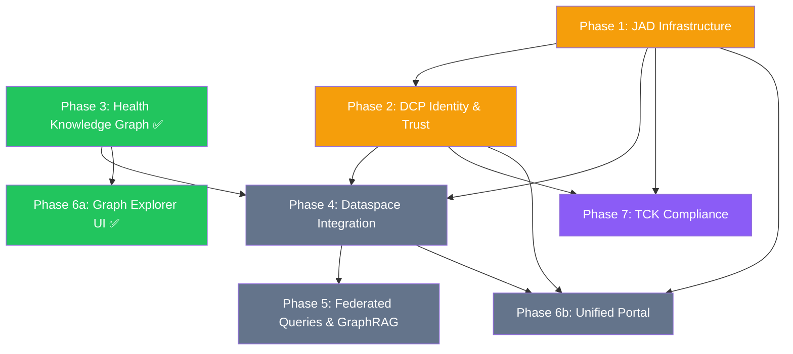

# Cross-Cutting Concerns & Architecture

> Archived detail from the [Planning index](../planning-health-dataspace-v2.md).
> Cross-cutting concerns, target architecture, what the demo proves, and
> implementation dependencies. (The ADR index table stays in the planning index.)

---

## Cross-Cutting Concerns

### SIMPL-Open EU Programme Alignment

The [SIMPL-Open](https://simpl-programme.eu/) programme provides EU open-source middleware for common European data spaces. This implementation aligns with SIMPL requirements:

| SIMPL Requirement       | Status       | Implementation                                    |
| ----------------------- | ------------ | ------------------------------------------------- |
| DSP 2025-1              | ✅ Compliant | EDC-V control plane + TCK validation (140+ tests) |
| DCP v1.0                | ✅ Compliant | IdentityHub + IssuerService (15 VCs issued)       |
| DID:web                 | ✅ Compliant | 5 participants with DID documents                 |
| DCAT-AP federation      | ✅ Compliant | HealthDCAT-AP JSON-LD serialization               |
| ODRL policies           | ✅ Compliant | 14 EHDS policies across 5 participants            |
| Gaia-X labels           | ⚠️ Gap       | Not yet required for EHDS pilot phase             |
| Connector certification | ⚠️ Gap       | SIMPL certification process TBD                   |

See [ADR-013: SIMPL-Open Alignment](ADRs/ADR-013-simpl-open-alignment.md) and [Gap Analysis](simpl-ehds-gap-analysis.md).

### WCAG 2.2 AA Accessibility

All UI pages comply with WCAG 2.2 Level AA (EN 301 549):

- **Automated enforcement**: axe-core scans all 22 routes in CI via `27-wcag-accessibility.spec.ts`
- **Zero-violation gate**: CI fails on any AA-level violation
- **Keyboard navigation**: full functionality without mouse, visible focus indicators
- **Color contrast**: 4.5:1 minimum (dark theme), all status colors tuned
- **Screen reader**: semantic HTML, ARIA landmarks, live regions for dynamic updates
- **Lighthouse score**: 95+ accessibility target

See [ADR-010: WCAG 2.2 AA Compliance](ADRs/ADR-010-wcag-accessibility.md).

### Security Testing

Automated security testing as part of CI/CD:

- **Playwright security spec** (`28-security-pentest.spec.ts`): 50 checks covering HTTP headers, auth boundaries, session management, input validation, information leakage, CORS
- **Trivy container scanning**: CVE detection at CRITICAL/HIGH severity blocks deployment
- **Gitleaks**: secret detection in source (pre-commit + CI)
- **Dependency audit**: `npm audit` in pipeline
- **BSI IT-Grundschutz**: health infrastructure baseline alignment

See [ADR-011: Security Testing Strategy](ADRs/ADR-011-security-testing.md).

### Azure Container Apps Deployment

Production deployment on Azure Container Apps:

- **13 Container Apps** + **3 ACA Jobs** (bootstrap, schema, seed)
- **CI/CD**: GitHub Actions with OIDC federation (`deploy-azure.yml`)
- **E2E validation**: Playwright runs against Azure after every deploy
- **Infrastructure**: ACR for images, managed certificates, Azure Files for persistence
- **Scripts**: 11 deployment scripts in `scripts/azure/`
- **Off-hours scale-down** (Mon–Fri 07:00–20:00 Europe/Berlin) keeps the full topology under the personal €50/month credit
- **Persistent Azure Files volumes** for Neo4j (`/data`, `/logs`) and Vault (`/vault/data`) — knowledge graph and Vault secrets survive revision restarts and morning scale-up
- **Weekly demo reset** — idempotent Sunday-night re-seed of Neo4j, Vault, and Postgres for a clean Monday-morning demo

See [ADR-012: Azure Container Apps](ADRs/ADR-012-azure-container-apps.md), [ADR-014: Weekly Demo Reset](ADRs/ADR-014-weekly-demo-reset.md), [ADR-016: ACA Off-Hours Scale-Down](ADRs/ADR-016-aca-off-hours-scaledown.md), [ADR-017: Persistent Storage on ACA](ADRs/ADR-017-persistent-storage-aca.md), and the [Azure Deployment Guide](azure-deployment-guide.md).

---

### Phase 25: GraphRAG Accuracy — GDS + APOC + Azure AI Foundry

**Goal:** Turn the NLP query view (`/query`) into a first-class semantic-search experience by enabling Neo4j GDS + APOC, materialising embeddings at seed time, deploying `gpt-4o-mini` + `text-embedding-3-small` via Azure AI Foundry, and wiring a GraphRAG pipeline in `services/neo4j-proxy/`. Local install remains zero-cost — the LLM backend is strictly optional and auto-detected from environment.

**Why now:**

- Phase 5 (Federated Queries & GraphRAG) shipped the UI and the `/api/nlq` proxy but stopped short of real semantic retrieval; every free-form question falls back to fulltext or "no results".
- The multi-provider LLM glue already exists in `services/neo4j-proxy/src/index.ts` (OpenAI, Anthropic, Ollama, Azure OpenAI) — only env vars and the GDS plugin are missing.
- GraphRAG is the single most visible gap on the public demo at `ehds.mabu.red`.

See [ADR-019: GDS + APOC + Azure AI Foundry GraphRAG](ADRs/ADR-019-gds-apoc-azure-ai-foundry-graphrag.md) for the full design, alternatives, and trade-offs. Tracked by GitHub issue [Phase 25: GraphRAG Accuracy](https://github.com/ma3u/MinimumViableHealthDataspacev2/issues).

#### 25a: Neo4j plugin upgrade — GDS + APOC everywhere ⏳

- `docker-compose.yml`: add `"graph-data-science"` + `"apoc-extended"` to `NEO4J_PLUGINS`; bump heap 512m→1G initial / 1G→2G max; pagecache 1G; add `NEO4J_dbms_security_procedures_allowlist=apoc.*,gds.*`.
- `scripts/azure/02-data-layer.sh`: same plugin list and allowlist; bump the `mvhd-neo4j` container app to 1.5 vCPU / 4 GiB (still Consumption profile).
- Smoke test via `CALL gds.version()` and `CALL apoc.version()` in the seed job verification block.
- **Gotcha:** the Neo4j GDS jar is ~80 MB and downloads on first container start. Baked-in image avoids flaky first-boot — the Azure path should use a custom `neo4j:5-community-gds` image pushed to ACR.

#### 25b: Structural embeddings (FastRP, always-on) ⏳

- New Cypher file `neo4j/register-embeddings-fastrp.cypher` with `gds.graph.project` over the 5-layer label set and `gds.fastRP.write` at `embeddingDimension: 256`.
- Create `CREATE VECTOR INDEX node_fastrp_index` (256-dim, cosine) for all labelled nodes.
- Wire into `neo4j/seed.sh` as the step after `insert-synthetic-schema-data.cypher`.
- Adds ~30 s to seed time; zero API cost; works offline; foundation for the cloud GraphRAG fallback.

#### 25c: Azure AI Foundry model deployment ⏳

- New script `scripts/azure/07-ai-foundry.sh`:
  - `az cognitiveservices account create --kind OpenAI --sku S0 --name aoai-mvhd-ehds`
  - Deploy `gpt-4o-mini` (chat) and `text-embedding-3-small` (1536-dim embedding)
  - Fetch endpoint + key, create an ACA secret `aoai-key` on the ACA environment
  - Inject `AZURE_OPENAI_GPT4O_URL`, `AZURE_OPENAI_EMBEDDING_URL`, `AZURE_OPENAI_API_KEY=secretref:aoai-key` into the `mvhd-neo4j-proxy` container app and the `mvhd-neo4j-seed` job
- **Subscription RBAC check** (ADR-018 precedent): verify that `Microsoft.CognitiveServices` provider is registerable on `INF-STG-EU_EHDS` before starting. If blocked, pivot to the Ollama-in-ACA fallback (deferred 25c'). Document result in ADR-018 update.
- Secret hygiene: `AZURE_OPENAI_API_KEY` is an ACA secret, never a plain env var, never committed, never logged.

#### 25d: Semantic embeddings (Azure OpenAI, optional) ⏳

- New Cypher file `neo4j/register-embeddings-aoai.cypher` using `apoc.ml.azure.openai.embedding()` via `apoc.periodic.iterate` (batch 50, serial).
- Scope to high-value nodes first: `HealthDataset`, `Condition`, `Observation`, `MedicationRequest` — about 400 nodes, <$0.02 per full seed.
- Create `CREATE VECTOR INDEX dataset_semantic_index` (1536-dim, cosine).
- `seed.sh` guards the call with `if [[ -n "${AZURE_OPENAI_API_KEY:-}" ]]` so zero-cost installs skip silently.
- Re-runnable: the `WHERE n.embedding IS NULL` filter makes re-seeds incremental.

#### 25e: GraphRAG pipeline in `neo4j-proxy` ⏳

- New file `services/neo4j-proxy/src/graphrag.ts` implementing:
  1. Embed user query (Azure OpenAI if configured, else hash-to-FastRP-query-embedding)
  2. Vector search on the top-3 indexed labels, top-k=10 each
  3. 2-hop neighbourhood expansion via `apoc.path.subgraphAll`
  4. LLM rerank with `gpt-4o-mini` to pick top-5 nodes + generate a targeted Cypher plan
  5. Execute, return rows + a `trace[]` payload for the debug drawer on `/query`
- Extend `POST /nlq` branch logic: `template` → `graphrag-vector` → `graphrag-hybrid` → `llm-text2cypher` → `none`.
- Unit tests in `services/neo4j-proxy/__tests__/graphrag.test.ts` using a mocked Neo4j driver + recorded embedding fixtures.
- No API-contract change: existing `method` field gains `graphrag-vector` / `graphrag-hybrid` values; consumers already handle unknown methods gracefully.

#### 25f: Optional-by-default local install ⏳

- `docker-compose.yml` uses `${AZURE_OPENAI_GPT4O_URL:-}` defaults so nothing is required.
- `services/neo4j-proxy/src/index.ts` startup prints exactly one of:
  - `NLP backend: Azure OpenAI (gpt-4o-mini)`
  - `NLP backend: Ollama (llama3.1)`
  - `NLP backend: template + fulltext + FastRP only (no LLM configured)`
- `ui/src/app/query/page.tsx` renders a single status badge reflecting the detected mode (fetched from a new `GET /nlq/backend` endpoint).
- `README.md` gains an "Optional AI backends" section with three copy-pasteable setups (zero-cost / Ollama / Azure OpenAI).

#### 25g: Tests — Playwright + Vitest ⏳

- New Playwright spec `ui/__tests__/e2e/journeys/31-graphrag-nlp.spec.ts` (J610–J629):
  - J610 query page reachable
  - J611 backend badge visible and one of the three expected values
  - J612 `/nlq` returns `method: "template"` for a known templated question
  - J613 `/nlq` returns a non-empty result for "datasets about cardiovascular disease" (GraphRAG branch, skipped if `NLP_BACKEND=none`)
  - J614 response includes `trace` with at least one `vector-search` stage
  - J615 query page renders the trace in the debug drawer
- Vitest: new `services/neo4j-proxy/__tests__/graphrag.test.ts` covering the rerank scoring and the `none`-backend fallback path.

#### 25h: Docs + ADR ⏳

- ADR-019 (this phase's decision record) — already in `docs/ADRs/` as `ADR-019-gds-apoc-azure-ai-foundry-graphrag.md`.
- Update `docs/gotchas.md` with the GDS memory footprint note.
- Update `docs/persona-journeys/` — add a "Data User asks a free-form research question" journey demonstrating the GraphRAG trace.
- Update `docs/azure-deployment-guide.md` with the new `07-ai-foundry.sh` step.

**Exit criteria:**

1. `docker compose up` + `./neo4j/seed.sh` completes with FastRP embeddings present on 5000+ nodes.
2. `curl localhost:9090/nlq -d '{"query":"datasets about diabetes"}'` returns at least 3 ranked HealthDataset nodes with a `trace` array.
3. `https://ehds.mabu.red/query` shows `NLP backend: Azure OpenAI (gpt-4o-mini)` and answers the same query against the Azure deployment.
4. All existing NLQ templates still work (regression suite green).
5. Cost of a full weekly reset remains under €0.10 for AI Foundry (verified from Azure cost panel).

---

### Phase 26: Cross-Participant Dataset Discovery

**Goal:** Answer dataspace-wide natural-language questions like _"Find all diabetes datasets across German hospitals with DataQualityLabelCredential"_ by crawling remote participants' DSP catalogs, mirroring their HealthDCAT-AP datasets into our Neo4j graph as `source: "federated"` nodes, and extending the existing 4-tier NLQ resolver with L1 × L2 × L5 templates. Baseline single-participant queries stay unchanged.

**Why now:**

- Issue [#8](https://github.com/ma3u/MinimumViableHealthDataspacev2/issues/8) surfaces the gap: `getSpeDrivers()` in `services/neo4j-proxy/src/index.ts` only knows about SPE-1 + SPE-2; there is no path from a question to an unknown participant's catalog.
- Phase 25 (ADR-019) delivers embeddings and vector indexes, but those only help if remote datasets are actually present in the graph. Phase 26 supplies the nodes.
- EHDS Art. 50–51 transparency obligations require that research discovery happens against a consented, crawled catalog — not via ad-hoc human-mediated contact.

See [ADR-020: Cross-Participant Dataset Discovery](ADRs/ADR-020-cross-participant-dataset-discovery.md) (Accepted) for the full design and the nine resolved decisions.

Built on Eclipse EDC v0.16.0 and `org.eclipse.edc:federated-catalog-core:0.16.0` (latest stable, 2026-02-19). We do **not** wait for or depend on XFSC FACIS DCM.

#### 26a: Dynamic participant directory ✅

- `:Participant` nodes carry `source` (`dcp` | `business-wallet` | `private-wallet` | `seed`) and `walletType` (`business` | `private`). The crawler reads the live Neo4j list, not a static YAML.
- New Cypher file `neo4j/participant-source-init.cypher` augments the existing 5 demo participants with `source: "seed"` + `walletType: "business"` so the first crawler run has targets.
- New admin page `ui/src/app/admin/participants/page.tsx` — CRUD over `:Participant`, admin-only. Add/remove wallets without a restart.
- New API routes `GET|POST|DELETE /api/admin/participants`, `EDC_ADMIN` role only.
- DCP discovery loop: if `DCP_DISCOVERY_URL` set, a background tick in neo4j-proxy pulls the trust-anchor and MERGEs `:Participant {source: "dcp"}` entries; idempotent, re-run safe.
- `jad/federated-targets.yaml` retained only as a bootstrap seed; it is loaded once and never polled. Future onboarding happens through the admin page or DCP.

#### 26b: Catalog crawler ACA job ✅

- New service `services/catalog-crawler/` (Java 21 + `org.eclipse.edc:federated-catalog-core:0.16.0`).
- Reads target list from Neo4j: `MATCH (p:Participant) WHERE p.source IN ['dcp','business-wallet','private-wallet','seed'] AND p.dspCatalogUrl IS NOT NULL RETURN p`.
- Signs DSP catalog requests with a **dedicated crawler DID** `did:web:ehds.mabu.red:crawler` (mint key pair in a new `scripts/azure/11-crawler-did.sh`). Crawler has discovery rights only; contract negotiation uses the caller's DID.
- Publishes raw JSON-LD to NATS subject `dataspace.catalog.raw` with payload `{ participantDid, fetchedAt, catalog }`.
- Deployed as ACA job `mvhd-catalog-crawler` with `--trigger-type Schedule --cron-expression "*/5 * * * *"` (5-min refresh, demo pace). Overridable via `CRAWL_INTERVAL`.
- Rate limiting: max 1 concurrent request per participant, 10 s timeout, exponential backoff 1→2→4 s with 3 retries, circuit-breaker trips after 5 consecutive failures (closed again after 5 min).
- `.github/workflows/catalog-crawler.yml` wraps the build + deploy (CI-SP pattern per project memory `project_aca_job_write_via_ci`).
- **Gotchas:** DSP responses can exceed 5 MB → stream to NATS, don't buffer. Participants returning 401/403 because we have no VC do not count as errors — audit, don't fail.

#### 26c: Catalog enricher service ✅

- New service `services/catalog-enricher/` (Python 3.12-slim, `neo4j==5.23.0`, `nats-py==2.7.0`, pydantic).
- NATS durable consumer (name `enricher`) on subject `dataspace.catalog.raw`. Replays unacknowledged messages on restart — no work lost.
- Maps each `dcat:Dataset` into HealthDCAT-AP per ADR-003; produces idempotent `MERGE`-only Cypher against `mvhd-neo4j:7687`.
- Writes `:HealthDataset {source: "federated", publisherDid, lastSeenAt}`, upserts the publishing `:Participant` if missing (`walletType` derived from DCP or defaulted to `business`), stores ODRL policies verbatim as `:OdrlPolicy` nodes.
- Emits audit `:CatalogEnrichmentEvent {ts, participantDid, datasetsUpserted, themesUnknown}` per catalog.
- Prometheus `/metrics` on `:9464`: `enricher_messages_total`, `enricher_merge_seconds`, `enricher_unknown_theme_total{publisher=…}`.
- Deployed as ACA container app `mvhd-catalog-enricher` — 0.25 vCPU / 0.5 GiB, min 1 max 1 replica. Script: `scripts/azure/12-catalog-enricher.sh`. Workflow: `.github/workflows/catalog-enricher.yml`.
- **Not a crawler, not a policy engine, not a query path** — those concerns live elsewhere (see ADR-020 enricher spec).

#### 26d: NLQ template extensions + glossary ✅

- Three new templates in `services/neo4j-proxy/src/index.ts` around `QUERY_TEMPLATES` (near `:1074`):
  1. `federated_dataset_search` — "find diabetes datasets across German hospitals"
  2. `participant_count_by_theme` — "how many hospitals offer oncology datasets?"
  3. `dataset_with_credential` — "find datasets with DataQualityLabelCredential"
- Hand-curated glossary `neo4j/nlq-glossary.cypher` — ≤100 entries v1. Maps common NL terms → SNOMED / ICD-10 / ISO-2 country codes. Reviewed in PR like any schema change.
- Extend `llmText2Cypher()` schema context (`:1301–1421`) to include `:HealthDataset {source: "federated", publisherDid, …}` and `:Participant {walletType, source}` so LLM-generated Cypher scopes correctly.

#### 26e: Audit + dual-side k-anonymity + dual-side ODRL ✅

- Extend `:QueryAuditEvent` with `federated: boolean`, `contributors: [participantDid]`, `aggregateSuppressed: boolean`, `suppressionReason: string | null`.
- **k-anonymity (both sides enforced):** suppress any per-participant `count < MIN_COHORT_SIZE` (default 5). If **any** contributor is suppressed, suppress the global aggregate too. Response carries `{ aggregateSuppressed: true, reason: "contributor_k_violation" }`.
- **ODRL (both sides enforced):** publisher's ODRL policy is evaluated against the caller's VCs; caller's own `odrlScope` is evaluated against the dataset. Both must pass for a row to surface.
- Extend `/admin/audit` UI — add columns for federated flag + expandable contributor DIDs; filter toggle for "federated only".
- Log the crawler DID on every federated query so transparency reports show "who we asked" alongside "what we answered".

#### 26f: Playwright coverage — J730–J749 ✅

New spec `ui/__tests__/e2e/journeys/32-federated-nlq.spec.ts`:

- **Discovery path:**
  - J730 `/admin/participants` lists ≥5 rows, each with `source` + `walletType` badges
  - J731 example NLQ "find diabetes datasets across German hospitals" → `method: "template"`, ≥1 row with `source=federated` + country=`DE`
  - J732 glossary rollup: `"german"` resolves to `iso2: "DE"`
  - J733 `/admin/audit?federated=true` shows ≥1 event with contributor DIDs
  - J734 crawler resilience: a target returning 500 logs a failure but does not break the next cycle
- **Discovery → negotiation:**
  - J735 click result row → `/catalog/[datasetId]?source=federated` renders publisher policy
  - J736 eligibility badge correct for caller's VCs
  - J737 "Request contract" button fires `POST /api/negotiate`
  - J738 negotiation appears in `/tasks` with state `REQUESTED`
- **Azure live stack (J745–J749):** run against `https://ehds.mabu.red` once the crawler + enricher are deployed.

#### 26g: User journey + docs + observability 🔶 (docs done; Grafana board + README screenshot deferred)

- New persona journey `docs/persona-journeys/data-user-federated-discovery.md` — the six-step loop in ADR-020 (discover → inspect offer → check eligibility → start negotiation → track/sign → fetch).
- New `docs/architecture/federation.md` — sequence diagram (crawler → NATS → enricher → Neo4j → NLQ → /catalog → /negotiate → /tasks → dataplane), plus the 5-min freshness SLA and the both-sides k-anon + ODRL rules.
- Prometheus wiring: Grafana board `federation-ops` with panels for `crawler_last_success_seconds`, `enricher_unknown_theme_total`, query audit suppression rate.
- `README.md` "What's new" — screenshot of `/query` answering the issue-#8 example.

**Exit criteria:**

1. Admin can add a new `:Participant` via `/admin/participants` and the next crawl cycle (≤5 min) picks it up automatically — no restart.
2. `curl https://ehds.mabu.red/api/nlq -d '{"question":"find diabetes datasets across German hospitals"}'` returns ≥2 `:HealthDataset` rows with `source = "federated"` and country = `DE`.
3. Audit log shows the query with `federated: true` and ≥1 contributor DID other than ours.
4. Regression: Phase 25 NLQ templates return identical results (no perturbation from federated branch).
5. k-anonymity: crafted test with a 3-patient cohort on SPE-1 gets `aggregateSuppressed: true, reason: "contributor_k_violation"`.
6. ODRL: a dataset requiring DQL credential does not surface for a caller without that VC, even if the caller's own `odrlScope` is unbounded.
7. The discovery → negotiation journey (Playwright J735–J738) completes green against the Azure stack.
8. Cost: full crawl cycle stays under €0.01 (Azure Files read + NATS intra-env, no egress).

**Deferred to later phases:**

- Approach 2 distributed broadcast — revisit once 30 days of audit log tell us which queries are cold.
- Semantic query DSP extension proposal to IDSA — only worth raising if operational data shows Approach 1 hits its stale-cache ceiling.

---

### Phase 27: EUDI Wallet Sandbox Integration (Issues #22 + #24)

**Goal:** Close the citizen-side identity, access-rights, and consent gap by integrating the **BMDS EUDI Wallet sandbox** as the patient-facing wallet alongside the existing DCP-1.0 **Business Wallet** stack. The MVHD already runs the four-step patient journey (Access → Explore → Consent → Insights — see Phase 20). Phase 27 promotes those server-side flags and platform logins to **wallet-issued, selectively disclosed, revocable Verifiable Credentials** so EHDS Art. 3 (primary access) and Art. 10 (consent-driven secondary use) are satisfied end-to-end.

**Source:** [`docs/EUDI_Wallet_UseCase_EHDS.pdf`](EUDI_Wallet_UseCase_EHDS.pdf) — _BMDS Deutschland Architektur (Identitäten)_, sandbox use-case proposal by Matthias Buchhorn-Roth (Sopra Steria SE).

**Why now:**

- BMDS launched the **EUDI Wallet Sandbox 2026-01-27**; productive rollout (digital ID card, driver's licence) is planned **early 2027**. Alternative wallet providers can certify ~12 months after the state wallet goes live.
- Sandbox access for MVHD has been **applied for in 2026-04** (issue #22 task list, awaiting access).
- Issue #22 frames this as the **standards-based, self-hosted** option alongside the **vendor-combined** path tracked in #12 (Spherity + Bundesanzeiger Verlag). Both options must satisfy EHDS Art. 3–12 (primary use) + Art. 50–51 (secondary use). A comparison ADR is part of the deliverables.

**Key insight from the proposal:** the existing Phase 20 patient journey **already maps 1:1 to the four EUDI-extended steps** in the use case (Access & Risk Assessment, Explore Clinical Timeline, Grant Consent · Donate EHR, Receive Aggregate Insights). Phase 27 swaps the trust anchor from "platform session + server flag" to "wallet-issued VC verified at the EDC connector". No new patient-facing pages are required for the MVP — only new credential plumbing.

#### 27a: SPRIND sandbox onboarding ⏳

- Confirm sandbox access (application submitted 2026-04). Track in issue #22 task list.
- Obtain test **PID issuer endpoint** (Person Identification Data) and **EAA issuer endpoints** (Electronic Attestations of Attributes) for at least one EHDS-relevant attestation (target: health-insurance EAA from a fictional insurer).
- Stand up the SPRIND **verifier endpoint** so the EDC connector and the Patient app can verify presented VCs.
- Document sandbox limitations in `docs/eudi-wallet/sandbox-status.md`: PID-only initially, EAA later, k≥5 contributors not yet enforced upstream.
- **Reference:** BMDS EUDI Ecosystem Knowledge Centre — [bmi.usercontent.opencode.de/eudi-wallet/eidas2/ecosystem_knowledge_centre](https://bmi.usercontent.opencode.de/eudi-wallet/eidas2/ecosystem_knowledge_centre/).

#### 27b: OID4VP / OID4VCI bridge into the EDC IdentityHub ⏳

- New service `services/eudi-bridge/` (Node.js or Java) implementing OID4VCI issuer-side (for receiving wallet-issued credentials) and OID4VP verifier-side (for presentation requests against the patient).
- Bridges into the existing **DCP IdentityHub** so wallet-issued VCs land in the same credential store as DCP-issued LPID / MembershipCredential / EHDSParticipantCredential / DataPermitCredential. Result: a single `/credentials` view per principal, regardless of issuance protocol.
- Selective disclosure via **SD-JWT VC** (the format the BMDS sandbox issues). Bridge unwraps disclosures only for fields the verifier policy actually requires — never the full PID.
- Trust-anchor handling: eIDAS 2.0 trust list ingested into Trust Center (Phase 18); SD-JWT issuer keys validated against the list before a VC is accepted.
- **Gotcha:** OID4VP returns a Verifiable Presentation, not the underlying VCs — store the VP audit record (presentation, audience, nonce, timestamp) but never the raw user attributes once verified.

#### 27c: Patient-side wallet onboarding flow ⏳

- New page `ui/src/app/patient/wallet/page.tsx` — opt-in screen: "Connect your EUDI Wallet". Launches OID4VCI flow with the SPRIND sandbox.
- On first connect: PID is stored as a `:Credential {format: "sd-jwt-vc", source: "eudi-sandbox", subjectDid}` node in Neo4j L1; the patient's existing demo persona is **linked to** the wallet-issued PID via `:HOLDS` relationship — never replaced.
- Static-export fallback: in `NEXT_PUBLIC_STATIC_EXPORT=true` mode the page shows a sandbox-mocked PID JSON (per `ui/public/mock/eudi-wallet.json`) so GitHub Pages still renders the journey.
- Revocation panel: surface the VC status-list state so a patient can see and revoke each issued credential. Pulls from the bridge's `/status` endpoint, not from the issuer directly.

#### 27d: Wallet-issued consent VC schema + dual-side enforcement ⏳

- New JSON-LD context + schema file `schemas/credentials/HealthConsentCredential.jsonld` — fields: `subjectId` (PID hash), `studyId`, `dataNeeded` (FHIR resource list), `purpose`, `retentionDays`, `aggregationThreshold` (k), `notBefore`, `notAfter`, `revocable: true`, `revocationStatus` (BitstringStatusList ref).
- Schema validated with HDABs (MedReg DE, IRS) and at least one statutory health insurer in the demo data.
- **Dual-side enforcement:**
  - At ingress: EDC connector requires a presentable, non-revoked `HealthConsentCredential` matching the requested dataset + study before the DSP transfer is approved.
  - At egress (in the SPE): the existing Phase 24 ODRL evaluator additionally checks the consent VC's `aggregationThreshold` against the result row count; if the threshold is unmet, the result is suppressed with `reason: "consent_k_violation"` (parallel to Phase 26e).
- Per-study consent VCs replace today's server-side `consent_history` flag in Phase 20c; existing flags become a fallback when `NEXT_PUBLIC_EUDI_ENABLED=false`.

#### 27e: Dual-signature DSP negotiation (B2B + signer EAA) ⏳

- DSP contract negotiation extends to a **two-VP exchange**: company side presents a DCP-issued `EHDSParticipantCredential` + `DataPermitCredential`; the human signer presents an EUDI Wallet **professional-role / signer EAA** (e.g., AlphaKlinik Berlin's contract signer).
- The contract object stores `companyVp` and `signerVp` references; both must verify at the verifier service before the contract transitions to `AGREED`.
- Demo journey: AlphaKlinik Berlin contract signer approves a data offer to PharmaCo Research AG via dual credential. Track as a new Playwright spec in `__tests__/e2e/journeys/33-eudi-dual-signature.spec.ts` (J750–J759).
- This unblocks the issue #22 acceptance criterion _"Dual-signature contract flow demonstrated in the JAD demo stack"_.

#### 27f: Trust Center extension — surface both wallets ⏳

- Phase 18 Trust Center adds two tabs: **Business Wallets** (DCP, existing) and **Patient Wallets** (EUDI Sandbox, new).
- Per principal, render: VC types held, issuer, last presentation timestamp, revocation status, trust-list verdict.
- DID resolution: business wallets stay on `did:web:*`; patient wallets present a SD-JWT VC bound to a pseudonymous holder key (no DID required for citizen). Trust Center renders the issuer DID + sandbox key thumbprint.

#### 27g: Patient consent → research donation E2E demo ⏳

- New Playwright spec `__tests__/e2e/journeys/34-eudi-patient-consent.spec.ts` (J760–J779). Maria Schmidt (existing demo persona):
  1. Opens `/patient/wallet`, connects EUDI sandbox, receives PID + health-insurance EAA.
  2. Authenticates against `/patient/profile` via PID presentation (replaces Keycloak login in the wallet-enabled flow).
  3. Browses `/patient/research`, donates EHR to PharmaCo Research AG study `product-syntha-thur-r4-2026`. A `HealthConsentCredential` is issued from her wallet, presented to the EDC connector via OID4VP.
  4. Behind the scenes: consumer-side EDC negotiates a DSP contract, verifies the consent VC via the bridge, retrieves the scoped FHIR subset, runs analysis in the SPE.
  5. Maria revisits `/patient/insights` and sees aggregate findings (k ≥ 5).
  6. She revokes the consent — VC status flips to `revoked`, the next study attempt is rejected with `reason: "consent_revoked"`.
- Live-stack project (`PLAYWRIGHT_BASE_URL=https://ehds.mabu.red`) once sandbox endpoints are reachable from ACA.

#### 27h: Comparison ADR — Option A vs Option B vs Option C vs hybrid ⏳

- New ADR `docs/ADRs/ADR-022-eudi-wallet-vs-vendor-stack.md` — compare three patient-side stacks against the same DCP B2B baseline:
  - **Option A** — Spherity BusinessWallet + Bundesanzeiger EUDI Wallet, vendor-managed, production-ready today, commercial licensing.
  - **Option B** — DCP IssuerService + BMDS / SPRIND EUDI Sandbox, self-hosted, sandbox now / productive ~2027, operational cost only, EU-wide.
  - **Option C** — gematik sektoraler IDP federation + GesundheitsID via insurer apps (TK-Safe, AOK Mein Leben, BARMER eCare, etc.), production since 2024-01-01, ~70M citizens reachable, **DE-only**, OIDC today and OpenID Federation / EUDI fold-in via the gematik Federation Master on the roadmap. Tracked in [#12](https://github.com/ma3u/MinimumViableHealthDataspacev2/issues/12).
- Decision matrix: maturity, control, standards alignment (OID4VP/VCI + ARF + DCP v1.0 + OIDC Federation), cost profile, geographic reach (DE vs EU), timeline-to-EHDS-rollout (Mar 2025 went into force, secondary-use mandate Mar 2029).
- Recommendation: **hybrid** — DCP B2B stack stays self-hosted (no vendor lock for organisations); patient stack uses **Option C** for DE-resident demos today (production-grade flow against the gematik OSS stack), tracks **Option B** for cross-border + EUDI-native flows from sandbox into 2027 productive rollout. **Option A** stays a vendor fallback if both gematik certification and BMDS sandbox slip.
- Link this ADR from issues #12 and #22, and from the planning doc ADR index.

#### 27i: GesundheitsID OIDC RP via gematik open-source stack ⏳

**Why:** Issue [#12](https://github.com/ma3u/MinimumViableHealthDataspacev2/issues/12) surfaced that gematik publishes the entire sektoraler IDP toolchain under Apache 2.0, but **operating a productive sIDP requires gematik Zulassung** (security assessment, operations manual, provider-type approval — held today only by T-Systems/Verimi, IBM, RISE). For the MVHD demo we deliberately split the work: build everything OSS for dev/sandbox, partner with an approved sIDP for productive cross-org demos, never pursue Zulassung ourselves.

- New service `services/gematik-ref-idp/` running [`gematik/ref-idp-server`](https://github.com/gematik/ref-idp-server) (Apache 2.0) as a **fake sIDP** in the dev compose stack. Seeded with the existing demo patient personas (Maria Schmidt et al.) so the GesundheitsID flow has identifiable test users without leaking PII.
- New service `services/gesundheitsid-rp/` based on [`oviva-ag/ehealthid-relying-party`](https://github.com/oviva-ag/ehealthid-relying-party) — OIDC RP that consumes tokens from any sIDP (fake `ref-idp-server` in dev, RISE / Verimi / IBM in productive pilots).
- Wire the RP into NextAuth in `ui/src/lib/auth.ts` as an **additional provider next to Keycloak** — Keycloak stays for staff / EDC roles, GesundheitsID handles patient login. Persona resolution in `ui/src/lib/use-demo-persona.ts` extended to recognise `sub` claims minted by the fake sIDP.
- **Conformance gate:** run [`gematik/app-gemSekIdp`](https://github.com/gematik/app-gemSekIdp) test suite against the RP in CI (new workflow `.github/workflows/sek-idp-conformance.yml`). Required green before merging changes to the RP. If it passes against `ref-idp-server`, it passes against any approved sIDP.
- **Bridge to EDC IdentityHub:** the RP, on successful login, emits a `:Credential {format: "oidc-id-token", source: "gematik-sidp", subjectDid}` node in Neo4j L1, parallel to how Phase 27c stores wallet-issued PIDs. The downstream consent VC issuance (Phase 27d) is identical regardless of whether the upstream identity came from EUDI Wallet or GesundheitsID — the RP normalises the token.
- **HBA / SMC-B path for staff / contract-signers:** add [`Bundesdruckerei-GmbH/Gematik-IDP`](https://github.com/Bundesdruckerei-GmbH/Gematik-IDP) Keycloak plugin (Apache 2.0) so AlphaKlinik Berlin demo staff can authenticate via Heilberufsausweis against the **central-IDP** (separate from the citizen sIDP). Wires into the Phase 27e dual-signature flow as the human-signer side.
- **Productive pilot path (out of scope for MVP, documented for transparency):** RISE GmbH offers an RP sandbox against AccessKeeper that does not require full Zulassung for the RP side — only RPs registered with the Federation Master. Documented as the recommended next step if a real-patient demo becomes a goal.
- **Explicit non-goal:** pursuing gematik **Zulassung** for our own sIDP. Surfaced in ADR-022 as the "production gate" between Option C dev/sandbox use and a fully self-hosted productive deployment. Cost and time profile (mid-six-figure EUR, multi-quarter) makes this an enterprise-vendor commitment, not a reference-implementation goal.

**Sub-phase exit criteria:**

1. `docker compose up -d` brings up `ref-idp-server` + `gesundheitsid-rp` alongside the existing stack.
2. Maria Schmidt persona logs into `/patient/profile` via "Sign in with GesundheitsID" → fake sIDP → RP → NextAuth session; existing Phase 20 patient pages render unchanged.
3. `gematik/app-gemSekIdp` conformance suite green in CI.
4. Cypher query `MATCH (p:Person {personaId: 'maria'})-[:HOLDS]->(c:Credential {source: 'gematik-sidp'}) RETURN c` returns the issued ID token credential after login.
5. HBA login path demonstrated for at least one AlphaKlinik staff persona via Bundesdruckerei Keycloak plugin.
6. Documentation in `docs/eudi-wallet/gematik-oss-stack.md` covers: which OSS components are in use, what would need to change for a productive RP registration, and the explicit non-goal of self-Zulassung.

**Exit criteria:**

1. SPRIND sandbox account active; PID + at least one health-relevant EAA issuable end-to-end against the local stack.
2. EUDI bridge service deployed; OID4VCI receives, OID4VP presents; SD-JWT verification succeeds against the eIDAS 2.0 trust list.
3. `/patient/wallet` connects to the sandbox and surfaces issued VCs; revocation works through to the status list.
4. `HealthConsentCredential` schema validated by at least one HDAB; per-study consent VCs replace `consent_history` flags in the wallet-enabled flow.
5. Dual-signature contract flow (J750–J759) green; both `companyVp` and `signerVp` are required for `AGREED`.
6. Patient consent → research donation E2E (J760–J779) green; revocation propagates within one minute.
7. ADR-022 written, accepted, and linked from #12 + #22.
8. Phase 20 regression: with `NEXT_PUBLIC_EUDI_ENABLED=false`, the existing four-step patient journey continues to work unchanged.

**Deferred to later phases:**

- BMDS productive wallet (early 2027) — switch trust anchor when the state wallet certification is final.
- Cross-border MyHealth@EU integration via NCP-eH — touched only as a design hook (EHDS Art. 14); production rollout out of scope until at least one foreign HDAB is reachable.
- Alternative wallet providers — certification window opens ~12 months after the state wallet goes live; revisit then.

**Issue #22 task-list mapping:**

| Issue #22 task                                                           | Phase 27 sub-task |
| ------------------------------------------------------------------------ | ----------------- |
| Confirm sandbox access                                                   | 27a               |
| Map DCP IssuerService credentials ↔ EUDI EAA schemas                    | 27b + 27d         |
| Patient onboarding flow: EUDI Wallet → IdentityHub → DSP transfer permit | 27c               |
| Dual-signature DSP negotiation: company (DCP) + signer (EUDI EAA)        | 27e               |
| Comparison ADR (Option A vs Option B vs hybrid)                          | 27h               |
| Demo journey: patient consents to PharmaCo Research AG study via EUDI    | 27g               |
| Demo journey: AlphaKlinik Berlin contract signer dual credential         | 27e               |
| Update Trust Center to surface both wallets                              | 27f               |
| Document sandbox limitations                                             | 27a               |

---

## Target Architecture

```
┌─────────────────────────────────────────────────────────────┐
│             TCK & Compliance Verification (Phase 7)         │
│  DSP 2025-1 TCK (140+ tests) · DCP v1.0 Suite · EHDS Tests│
└────────────┬──────────────────────────────┬─────────────────┘
             │                              │
┌────────────┴──────────────────────────────┴─────────────────┐
│          Unified Next.js 14 Portal (Phase 6a + 6b)         │
│  Graph Explorer · Catalog · Compliance · Patient · OMOP    │
│  Onboarding · Credentials · Data Sharing · Operator Admin  │
│  (Keycloak SSO via NextAuth.js · OpenAPI TypeScript clients)│
└────────────┬──────────────────────────────┬─────────────────┘
             │                              │
┌────────────┴──────────────────────────────┴─────────────────┐
│                    CFM (Management Plane)                   │
│  Tenant Manager · Provision Manager · Operator API          │
│  Credential Issuance · Lifecycle Management                 │
└────────────┬──────────────────────────────┬─────────────────┘
             │                              │
    ┌────────┴────────┐           ┌────────┴────────┐
    │   EDC-V Clinic  │           │   EDC-V CRO     │
    │  Control Plane  │           │  Control Plane  │
    │  (DSP + DCP)    │           │  (DSP + DCP)    │
    └───┬────────┬────┘           └────────┬────────┘
        │        │                         │
 ┌──────┴──┐ ┌──┴─────────┐    ┌──────────┴─────────┐
 │ DCore   │ │ DCore      │    │  DCore Rust        │
 │ fhir-   │ │ omop-      │    │  Data Plane (CRO)  │
 │ http    │ │ http       │    │  (Query HTTP)      │
 │ (PUSH)  │ │ (PULL)     │    └────────────────────┘
 └────┬────┘ └─────┬──────┘
      │            │
 ┌────┴────────────┴──────┐     ┌─────────────────────────┐
 │  Neo4j Query Proxy     │     │  PostgreSQL 17           │
 │  (Node.js/Express)     │     │  ─────────────────       │
 │  /fhir/* → Cypher      │     │  controlplane (EDC-V)    │
 │  /omop/* → Cypher      │     │  identityhub (DCP)       │
 │  /catalog/* → JSON-LD  │     │  issuerservice (VC)      │
 │  Port: 9090            │     │  dataplane (DCore state)  │
 └──────────┬─────────────┘     │  keycloak (OAuth2)       │
            │ Bolt              │  cfm (Tenant/Provision)  │
 ┌──────────┴─────────────┐     └─────────────────────────┘
 │     Neo4j 5 Community  │
 │  L1: Marketplace (DSP Contract Projections)       │
 │  L2: HealthDCAT-AP Catalog (W3C vocabulary)       │
 │  L3: FHIR Clinical Graph (Patient Data)           │
 │  L4: OMOP Research (Secondary Use Analytics)      │
 │  L5: Ontology Backbone (SNOMED/LOINC/ICD/RxNorm)  │
 └────────────────────────────────────────────────────┘
```

---

## What This Proves

When complete, the Health MVD v2 will demonstrate:

1. **End-to-end EHDS compliance** — From participant onboarding (DCP credentials) through contract negotiation (DSP policies) to data access (SPE-enforced queries)
2. **Cloud-native multi-tenancy** — CFM managing multiple EDC-V instances for clinics, CROs, and HDABs on shared infrastructure
3. **Disaggregated data planes** — Purpose-built DCore Rust HTTP planes: FHIR PUSH for clinical bundles, OMOP PULL for analytics queries, routed via DPS
4. **Dual-store architecture** — PostgreSQL for EDC-V/CFM transactional state, Neo4j for relationship-rich health knowledge graph, with NATS event projection bridging Layer 1
5. **HealthDCAT-AP compliance** — Formal W3C HealthDCAT-AP vocabulary for dataset metadata, enabling federated catalog interoperability across HDABs via JSON-LD serialization
6. **Federated knowledge graphs** — Cross-HDAB analytics without centralizing patient data
7. **Production-grade schema** — The 5-layer Neo4j health graph model working with real FHIR/OMOP data
8. **Protocol conformance** — DSP 2025-1 TCK passing (140+ test cases), DCP v1.0 compliance verified, EHDS-specific tests validating Article 53 enforcement
9. **Unified portal experience** — Single Next.js 14 app serving participant onboarding (Aruba pattern), data sharing (Fraunhofer pattern), operator admin (Redline pattern), and health knowledge graph exploration

The [JAD demo](https://github.com/Metaform/jad) provides the cloud-provider reference for EDC-V + CFM. The Health MVD v2 extends this with the **domain-specific health knowledge layer** — the piece that makes a generic dataspace into a health dataspace.

---

## Implementation Dependencies



**Critical path:** Phase 1 (JAD infrastructure) → Phase 2 (DCP identity) → Phase 4 (dataspace integration) → Phase 6b (unified portal)

**Parallel track:** Phase 7 (TCK compliance) can begin as soon as Phases 1–2 complete, running in parallel with Phase 4.
