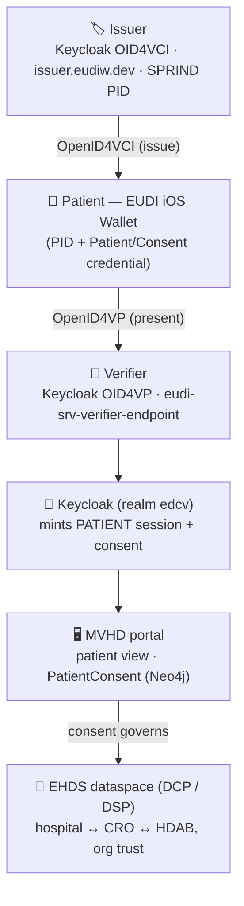

# EUDI Wallet Hackathon 2026 — Guiding Plan (Patient Identity for the EHDS Dataspace)

**Goal:** in a 48-hour hackathon, give the MVHD EHDS demo a real **patient identity**
held in an **iPhone EUDI Wallet**, issued and verified via OpenID4VCI/OpenID4VP, bridged
through **Keycloak**, and connected to the existing **DCP**-governed dataspace.

- **Event:** [EUDI Wallet Hackathon 2026](https://eudi-wallet.gov.de/news/eudi-wallet-hackathon-2026) — **4–5 June 2026**, fully online, 48 h. Teams ≤3. Winners present at **EUDI ON** (25 June 2026, Café Moskau, Berlin).
- **Apply:** https://2eut7s.share-eu1.hsforms.com/2w9z1xbh5SmaSLUc8caTPug
- **Dev docs / sandbox onboarding:** https://bmi.usercontent.opencode.de/eudi-wallet/developer-guide/hackathon/ (mentors via Mattermost during the event)
- **Tracks:** Public Sector · Private Sector · Builders' · **Creative Use Cases (incl. health)** · **Developer-Tools**
- **Relates to:** issue #22 (DCP BusinessWallet + EUDI Wallet Sandbox — hybrid credential stack, "Option B").

---

## 1. Which challenge to apply for

**Primary → Creative Use Cases (Health).** The track explicitly invites _"applications in
gaming, education, **health**, or travel beyond traditional identity verification."_ Our
angle is differentiated and not a generic KYC demo:

> **A patient carries a verifiable "patient identity + consent-to-secondary-use" credential
> in their EUDI Wallet and uses it to unlock and govern access to their health data in an
> EHDS dataspace.** Identity becomes _dynamic consent_ for research reuse — a health use
> case beyond simple verification.

**Strong secondary / fallback → Developer-Tools.** Everything we build is open-source and
reusable: an **EUDI Wallet ↔ Keycloak ↔ DCP dataspace bridge**. If the end-to-end health
demo proves too ambitious in 48 h, the bridge itself (with docs) is a clean Developer-Tools
submission. Build for Creative/Health; the artifacts also satisfy Developer-Tools.

_(Avoid Public/Private Sector — generic; Builders' needs hardware/IoT.)_

---

## 2. The demo scenario (what the judges see)

1. A patient installs the **EUDI reference iOS wallet** on their iPhone.
2. They **receive a credential** — a Person Identification Data (PID) from the test/sandbox
   issuer, plus a **"Verified Patient / Consent" attestation** issued by our Keycloak
   (OpenID4VCI).
3. At the MVHD portal they **present** that credential (OpenID4VP, QR scan).
4. The portal **verifies** it, opens the **patient view**, and records **dynamic consent**
   (a `PatientConsent` node in Neo4j) for a specific secondary-use purpose.
5. The existing **EHDS / DCP** machinery then runs the **HDAB-governed, org-to-org**
   secondary-use exchange under that consent — closing the loop from citizen wallet to
   dataspace.

---

## 3. Architecture — the hybrid (issue #22, Option B)

The key insight: **EUDI / OpenID4VC is the _end-user_ (patient) layer; DCP is the
_machine-to-machine_ (organisation) layer.** They share base standards (Verifiable
Credentials, SD-JWT VC, DIDs) but different design centres, so we **do not make the wallet
speak DCP**. Instead we **bridge at the verifier / Keycloak**: a verified patient
presentation becomes an authenticated, consented session in the dataspace, which continues
to use DCP between participants.

- **End-user trust (new):** OpenID4VCI to issue, OpenID4VP to present — to/from the iPhone wallet.
- **Org trust (existing):** DCP 1.0 between dataspace participants — unchanged.
- **Bridge (the hack):** Keycloak verifies the wallet presentation and maps the verified
  subject → a pseudonymised patient + a consent record that the dataspace authorisation reads.

---

## 4. Repositories — use vs. fork

Org: **https://github.com/eu-digital-identity-wallet** ([all repos](https://github.com/orgs/eu-digital-identity-wallet/repositories)).

| Role                           | Repository                                                                                                     | Use / Fork             | Notes                                                                                                                                                |
| ------------------------------ | -------------------------------------------------------------------------------------------------------------- | ---------------------- | ---------------------------------------------------------------------------------------------------------------------------------------------------- |
| **iOS wallet (app)**           | [`eudi-app-ios-wallet-ui`](https://github.com/eu-digital-identity-wallet/eudi-app-ios-wallet-ui)               | **Fork**               | iOS 17+, Swift 6, Xcode. Config in `wiki/CONFIGURATION.md`; build via `wiki/HOW_TO_BUILD.md`. Defaults to `issuer.eudiw.dev` / `verifier.eudiw.dev`. |
| **iOS wallet core**            | [`eudi-lib-ios-wallet-kit`](https://github.com/eu-digital-identity-wallet/eudi-lib-ios-wallet-kit)             | Use (dep)              | The "Wallet Kit" SDK the app consumes.                                                                                                               |
| **OpenID4VCI (Swift)**         | [`eudi-lib-ios-openid4vci-swift`](https://github.com/eu-digital-identity-wallet/eudi-lib-ios-openid4vci-swift) | Use (dep)              | Issuance, wallet role.                                                                                                                               |
| **OpenID4VP + SD-JWT (Swift)** | SIOP-OpenID4VP & SD-JWT libs in the same org                                                                   | Use (dep)              | Pulled in by Wallet Kit; presentation + SD-JWT VC.                                                                                                   |
| **PID issuer**                 | [`eudi-srv-pid-issuer`](https://github.com/eu-digital-identity-wallet/eudi-srv-pid-issuer)                     | Use hosted first       | Hosted test issuer: **https://issuer.eudiw.dev/**. Self-host/fork only for a custom credential.                                                      |
| **Verifier (backend)**         | [`eudi-srv-verifier-endpoint`](https://github.com/eu-digital-identity-wallet/eudi-srv-verifier-endpoint)       | Use hosted / self-host | Hosted: **https://verifier.eudiw.dev**. The RP trusted endpoint for OpenID4VP.                                                                       |
| **Keycloak EUDI bridge**       | [`kshitij1708/eudi-wallet-keycloak`](https://github.com/kshitij1708/eudi-wallet-keycloak)                      | Evaluate / fork        | Community Keycloak plugin for OID4VP + OID4VCI; speeds the bridge.                                                                                   |
| **DCP (reference)**            | [`eclipse-dataspace-dcp`](https://github.com/eclipse-dataspace-dcp/decentralized-claims-protocol)              | Reference only         | Already in MVHD via the JAD stack; no change needed.                                                                                                 |

**Fork list (do today):** `eudi-app-ios-wallet-ui` (must, to set signing/config). Optionally
`eudi-srv-pid-issuer` and `eudi-srv-verifier-endpoint` if self-hosting; otherwise use the
hosted `*.eudiw.dev` services to de-risk.

---

## 5. Keycloak integration (the bridge)

MVHD already runs Keycloak (realm `edcv`, confidential client `health-dataspace-ui`, PKCE).
Plan:

1. **Issue (OID4VCI):** on a Keycloak client, enable **OpenID4VCI** (Advanced → "Enable
   OID4VCI"); add an **ES256 / P-256** signing key; define an **SD-JWT VC** credential
   `PatientIdentityCredential` (claims: pseudonymous patient id, consent purpose, validity).
   Issue it to the iPhone wallet via the OpenID4VCI flow. Ref:
   [Keycloak OID4VCI guide](https://www.keycloak.org/2026/01/issue-credentials-over-openid4vci).
2. **Verify (OID4VP):** present the credential at login. Either Keycloak-as-OID4VP-verifier
   (community plugin) or the reference `eudi-srv-verifier-endpoint`; on a valid presentation,
   mint the MVHD session with the `PATIENT` role (wire into `ui/src/lib/auth.ts`).
3. **Watch the known gotchas:** keep PKCE + `state` in NextAuth `checks`; do **not** use
   `wellKnown` from inside Docker (set token/userinfo/jwks to the Docker-internal Keycloak
   host) — see `CLAUDE.md` gotchas #5/#6.

**Fallback if Keycloak OID4VCI is too green in 48 h:** issue via hosted `issuer.eudiw.dev`
and verify via `verifier.eudiw.dev`; Keycloak then only mints the app session from the
verified result. Keeps the demo alive even if native Keycloak issuance slips.

---

## 6. Connecting to DCP (no change to DCP itself)

DCP stays exactly as it is (org-to-org trust between hospital / CRO / HDAB in the JAD stack).
The wallet/consent layer plugs in at the **authorisation boundary**:

- The verified PID/Patient credential → a **pseudonymised patient** (Trust Center) + a
  **`PatientConsent`** node (purpose, scope, `revoked:false`, timestamp) in Neo4j.
- The existing EHDS **HDAB approval** + DCP contract/transfer then proceed **gated by that
  consent**. The patient credential becomes a precondition/obligation, not a new protocol.
- This is precisely issue #22's **Option B (hybrid)**: EUDI for the citizen, DCP for the
  organisations, meeting at Keycloak + the consent record.

---

## 7. iPhone build (you have an Apple Developer account)

1. **Today:** install **Xcode 16+**; clone your fork of `eudi-app-ios-wallet-ui`; in Xcode
   set **Signing → Team = your Apple Developer account**, register your iPhone's device, and
   confirm a signed build runs on the device (iOS 17+).
2. **Config:** point issuer/verifier in `wiki/CONFIGURATION.md` — start at `issuer.eudiw.dev`
   / `verifier.eudiw.dev` (known-good), then switch to your Keycloak / the SPRIND sandbox.
3. **Fallbacks:** if device provisioning stalls, use the **iOS Simulator** (no signing) or
   **TestFlight**; both are acceptable for the demo recording.

---

## 8. Two-day execution plan

### Pre-hackathon (today, 3 June)

- [ ] Register the team (apply link above) and join the Mattermost.
- [ ] Confirm **SPRIND sandbox** access (PID phase) via the onboarding guide.
- [ ] Fork `eudi-app-ios-wallet-ui`; install Xcode; provision iPhone signing with the Apple account.
- [ ] Skim the dev docs: sandbox onboarding, credential formats, OpenID4VCI/VP, libraries.

### Day 1 (4 June) — issuance into the iPhone wallet

- **AM — happy path:** build the EUDI iOS wallet on the iPhone; issue a credential from
  **`issuer.eudiw.dev`** → wallet. Prove issuance works before touching our stack.
- **Midday — our credential:** enable Keycloak **OID4VCI**; define `PatientIdentityCredential`
  (SD-JWT VC); issue it to the wallet.
- **PM — sandbox + verify:** issue a **PID** from the SPRIND sandbox (if access is live);
  de-risk presentation against **`verifier.eudiw.dev`**.

### Day 2 (5 June) — presentation → portal → dataspace

- **AM — bridge:** OpenID4VP presentation into the MVHD portal (Keycloak/verifier) → mint a
  `PATIENT` session; write a `PatientConsent` node; open the patient view.
- **Midday — end-to-end:** wallet → present → portal unlocks + consents → show the
  DCP-governed secondary-use proceeding under that consent. Polish UI/story.
- **PM — submit:** record a **2–3 min demo video**; write the submission; **submit before the
  deadline**; (stretch) push the bridge as an open-source Developer-Tools artifact.

### Scope discipline

- **MVP (must):** issue _a_ credential into the iPhone EUDI wallet **and** present it to the
  MVHD portal to unlock the patient view + record consent. That alone is a complete story.
- **Stretch:** SPRIND PID; native Keycloak OID4VCI issuance; consent revocation; the
  DCP secondary-use leg visibly gated by consent; packaged reusable bridge.

---

## 9. Risks & fallbacks

| Risk                                       | Fallback                                                                        |
| ------------------------------------------ | ------------------------------------------------------------------------------- |
| SPRIND sandbox is PID-only / access gated  | Use hosted `issuer.eudiw.dev` (test PID + attestations)                         |
| Keycloak OID4VCI still maturing            | Issue/verify via reference `*.eudiw.dev`; Keycloak only mints the app session   |
| iOS device signing/provisioning stalls     | iOS Simulator or TestFlight build                                               |
| 48 h too short for full DCP leg            | Demo consent → patient view; describe the DCP leg (already built in MVHD)       |
| OpenID4VP ↔ our session mapping is fiddly | Hard-code the demo mapping for one patient; note productionisation as next step |

---

## 10. References

- Hackathon: [page](https://eudi-wallet.gov.de/news/eudi-wallet-hackathon-2026) · [apply](https://2eut7s.share-eu1.hsforms.com/2w9z1xbh5SmaSLUc8caTPug) · [developer guide](https://bmi.usercontent.opencode.de/eudi-wallet/developer-guide/hackathon/) · [FAQ](https://eudi-wallet.gov.de/faq)
- SPRIND EUDI Wallet: https://www.sprind.org/en/actions/strategic-projects/eudi-wallet
- EUDI reference implementation org: https://github.com/eu-digital-identity-wallet · docs: https://eu-digital-identity-wallet.github.io/
- Keycloak OID4VCI: https://www.keycloak.org/2026/01/issue-credentials-over-openid4vci
- Eclipse DCP 1.0: https://eclipse-dataspace-dcp.github.io/decentralized-claims-protocol/
- MVHD: `CLAUDE.md` (Keycloak gotchas), issue #22, the planning index.
