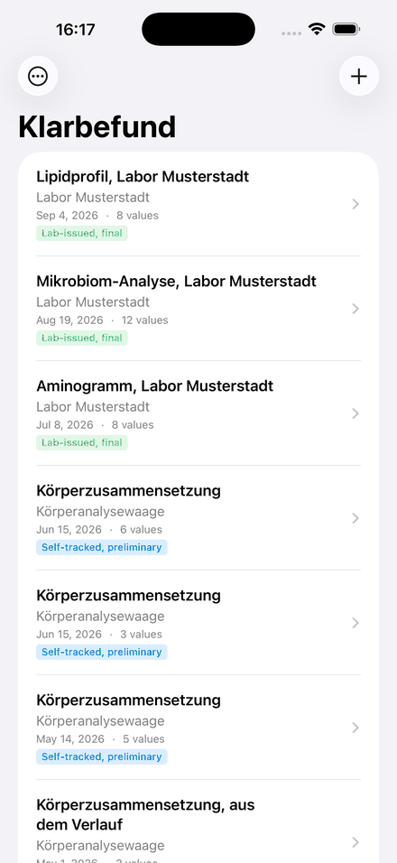
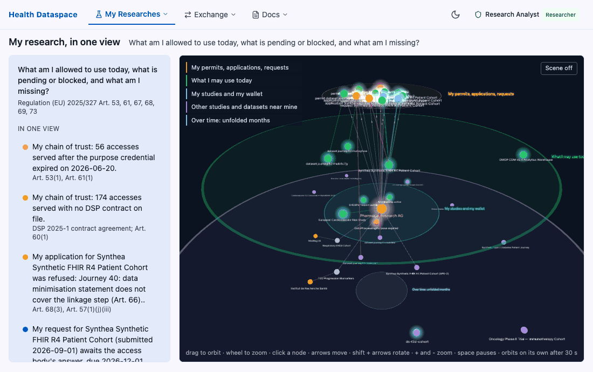

# From a paper lab report to a governed dataspace: what FHIR and LOINC gave us, and what we still need

_Guest article for the HL7 blog, by Matthias Buchhorn, Berlin. The EHDS Demo & Integration
Platform received the Open Solution Award in the 2026 HL7 AI Challenge. Draft for the
October 2026 Winners Showcase; images are listed at the end._

## Two people, one gap

I am a participant in a cardiovascular prevention study. My results reach me as most
people's do in Europe: as paper. Nothing pushes them into my national patient
record. Only the provider who ordered a test may write to it, and a cohort study is not treatment, so the person is the only integration point that exists.

A researcher in the same field has the opposite problem. Under Chapter IV of the European
Health Data Space, secondary use runs on a permit from a Health Data Access Body plus a
citizen opt-out. Finding datasets across institutions, obtaining the permit, agreeing terms
with each holder and analysing in a secure environment all need the data to mean the same thing at both ends.

The [EHDS Demo & Integration Platform](https://github.com/ma3u/MinimumViableHealthDataspacev2)
is an open-source reference implementation of both regimes on one standards stack. This is what happened when we took HL7 FHIR and LOINC down to a piece of paper and
up to a federated dataspace.

## Primary use: the person's own copy

[Klarbefund](https://github.com/ma3u/MinimumViableHealthDataspacev2/blob/main/docs/klarbefund/README.md)
is an iPhone app. Point the camera at a lab sheet, or import the laboratory's PDF. The table is read on the device, every value is matched to a LOINC code and a UCUM
unit, and the report is kept encrypted with its pages. Nothing leaves the phone unless the
person sends it.

The code alone does not make a value trustworthy. Under each measurement the app shows the
range the laboratory printed, verbatim, and the page and line it was read from, so anyone
can check the number against the paper. A PDF with the laboratory's own text layer yields
final observations; anything that went through a recogniser is preliminary until the
person confirms it. Lines that matched nothing, or could not be read, are listed rather
than dropped.

For someone in a study, the payoff is the timeline: results from the study centre, the
family doctor and a gym scale on one chart per measurement, with the guideline's band where
one exists and the laboratory's own range everywhere else. What the app never does is
interpret. It defines the test, with a source, and leaves the reading of a value to a
doctor. That is the medical-device line.

What leaves the phone is a FHIR R4 bundle: one Observation per value with its LOINC
coding, UCUM quantity, printed referenceRange and a status of final or preliminary,
extensions for the source kind, line and box on the page, plus a DiagnosticReport, a
DocumentReference for the paper and a Provenance. A doctor gets a PDF with the pages
appended, the patient record gets the bundle, research gets OMOP tables.

## Secondary use: the researcher's path

The dataspace half runs on the Eclipse Dataspace Components stack with the EHDS roles on
top. A data user [discovers datasets](https://ehds.mabu.red/data/discover) through
HealthDCAT-AP metadata, applies for a permit from the HDAB,
[negotiates](https://ehds.mabu.red/negotiate) and transfers over the Dataspace Protocol with
ODRL policies and verifiable credentials, and [analyses](https://ehds.mabu.red/analytics) on
OMOP CDM 5.4. Underneath is a five-layer knowledge
graph (dataspace, catalogue, FHIR R4, OMOP, terminology) with 127 synthetic patients. A
[natural-language layer](https://ehds.mabu.red/query) turns a question into a graph query
and answers only from what the graph holds. Grounding on a standard is what keeps it honest.

## Why FHIR with LOINC

Because it is the one place where the person's copy and the researcher's copy are the
same data. The analyte dictionary exists once, in TypeScript; the Swift table on the phone
is generated from it, and CI fails when it drifts. The two FHIR writers must reproduce a
single golden bundle byte for byte. A value coded on an iPhone and a value loaded from a
hospital's FHIR server carry the same code, unit and meaning, and the transform to OMOP is
written once.

## What we found

- **The unit selects the code.** Lipoprotein(a) in mg/dL and in nmol/L are two
  measurements with two codes. Trusting the label alone put wrong codes on real values until
  the rule became absolute.
- **Refusing is a feature.** Both LOINC codes for RDW-SD are deprecated, so the value is
  carried unmatched rather than mis-coded. A wrong code is worse than no code.
- **LOINC names tests, not organisms.** A stool report lists 57 taxa with no LOINC term.
  They carry their [NCBI Taxonomy](https://www.ncbi.nlm.nih.gov/taxonomy) id as an
  Observation component under LOINC 41852-5; the
  abundance stays a text-only code with a data-absent-reason.
- **A printed range is assay-specific.** It travels unchanged. Replacing it with a
  published band destroys what a clinician needs.
- **Provenance must be first-class.** Final versus preliminary is decided by the document,
  never by its file extension. Marking a transcription final is the failure that matters.

## Where OMOP comes in

OMOP is where analysis happens, and the phone writes it too: measurement, person and
observation_period tables, with the printed range in range_low and range_high. Every row
carries measurement_concept_id 0 with the LOINC code in the source value, deliberately:
mapping needs the Athena vocabulary, which is not on a phone, and an invented id would be a
wrong identifier on a real measurement. The mapping lives where the vocabulary lives.

## What we need from the FHIR community

1. An agreed extension for transcribed observations: source kind, source line, page and
   box, recogniser confidence, so any receiver can treat a scanned value with the right
   caution.
2. A pattern for microbiome relative abundance. Is a text-only code plus an NCBI Taxonomy
   component the shape the community wants?
3. LOINC terms for what consumer devices print: visceral fat as a mass, the
   extracellular-to-total water ratio, remnant cholesterol, the triglyceride-to-HDL ratio.
4. A citizen-upload profile in the [HL7 Europe](https://hl7europe.org/) laboratory result: what a person-submitted
   result must carry so a record system and a GP can read it with its provenance intact.
5. Written FHIR-to-OMOP conventions for the uncoded case, so two mappings never drift.

## Try it

The platform runs at [ehds.mabu.red](https://ehds.mabu.red) on synthetic data, a
[static simulation](https://ma3u.github.io/MinimumViableHealthDataspacev2/) needs no sign-in,
and the whole stack runs on a laptop. Source, decisions, runbooks and the app guide:
[github.com/ma3u/MinimumViableHealthDataspacev2](https://github.com/ma3u/MinimumViableHealthDataspacev2),
Apache 2.0. The slides from the Winners Showcase are at
[ehds.mabu.red/presentations/hl7-showcase-2026](https://ehds.mabu.red/presentations/hl7-showcase-2026). Pull requests are welcome!
